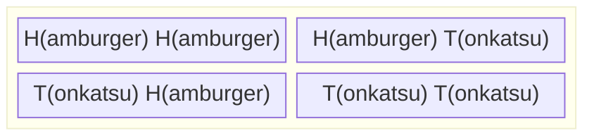
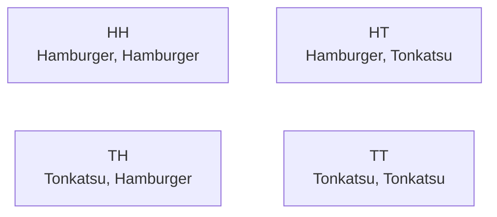
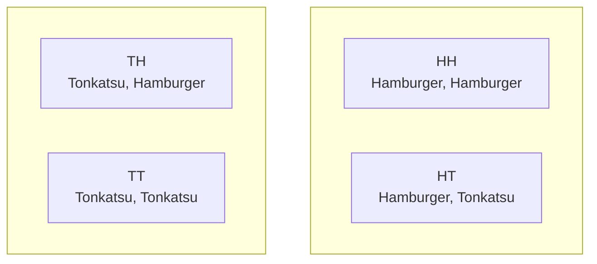

# Block-Beta Diagram Alternatives

If `block-beta` diagrams continue to have issues, here are alternative approaches:

## Current block-beta syntax (from 02_hungry.md):



## Alternative 1: Simple Flowchart (Most Compatible)



**Pros:**
- Works in all mermaid versions
- Very stable
- Easy to add styling

**Cons:**
- Not as visually "blocky"
- Requires manual layout hints

## Alternative 2: Flowchart with Subgraphs



**Pros:**
- Creates visual grouping
- Stable syntax
- Can be styled

**Cons:**
- Requires empty subgraph titles (spaces)
- More verbose

## Alternative 3: Simple Table in Markdown

For the outcome space diagrams, you could use markdown tables:

```markdown
| Lunch | Dinner |
|:---:|:---:|
| **HH**<br/>Hamburger, Hamburger | **HT**<br/>Hamburger, Tonkatsu |
| **TH**<br/>Tonkatsu, Hamburger | **TT**<br/>Tonkatsu, Tonkatsu |
```

**Pros:**
- Zero rendering issues
- Very fast
- Easy to maintain
- Can use HTML for styling

**Cons:**
- Not as dynamic/visual
- Harder to add interactive elements

## Alternative 4: HTML Grid (Maximum Control)

```html
<div style="display: grid; grid-template-columns: 1fr 1fr; gap: 10px; max-width: 600px;">
    <div style="border: 1px solid #000; padding: 20px; text-align: center;">
        <strong>HH</strong><br/>
        Hamburger, Hamburger
    </div>
    <div style="border: 1px solid #000; padding: 20px; text-align: center; border: 3px solid #f33;">
        <strong>HT</strong> ✓<br/>
        Hamburger, Tonkatsu
    </div>
    <div style="border: 1px solid #000; padding: 20px; text-align: center; border: 3px solid #f33;">
        <strong>TH</strong> ✓<br/>
        Tonkatsu, Hamburger
    </div>
    <div style="border: 1px solid #000; padding: 20px; text-align: center; border: 3px solid #f33;">
        <strong>TT</strong> ✓<br/>
        Tonkatsu, Tonkatsu
    </div>
</div>
```

**Pros:**
- Complete styling control
- Zero mermaid issues
- Works everywhere
- Can add red circles exactly as designed

**Cons:**
- More code to maintain
- Less semantic
- Requires inline CSS

## My Recommendation

Given the issues with block-beta, I'd suggest **Alternative 3 (Markdown Table)** with some custom CSS:

```markdown
<style>
.outcome-grid {
    display: grid;
    grid-template-columns: repeat(2, 1fr);
    gap: 10px;
    max-width: 400px;
    margin: 20px auto;
}
.outcome-cell {
    border: 2px solid #000;
    padding: 15px;
    text-align: center;
    background: #fff;
}
.outcome-cell.highlighted {
    border: 3px solid #f33;
    border-radius: 5px;
}
</style>

<div class="outcome-grid">
    <div class="outcome-cell">
        <strong>HH</strong><br/>
        ❌ Hamburger, Hamburger
    </div>
    <div class="outcome-cell highlighted">
        <strong>HT</strong><br/>
        ✓ Hamburger, Tonkatsu
    </div>
    <div class="outcome-cell highlighted">
        <strong>TH</strong><br/>
        ✓ Tonkatsu, Hamburger
    </div>
    <div class="outcome-cell highlighted">
        <strong>TT</strong><br/>
        ✓ Tonkatsu, Tonkatsu
    </div>
</div>
```

This gives you:
- ✅ Reliable rendering (no mermaid dependencies)
- ✅ Full styling control
- ✅ Responsive design
- ✅ Easy to maintain
- ✅ Faster page loads
- ✅ Works perfectly on mobile

Would you like me to convert the diagrams to this approach?
