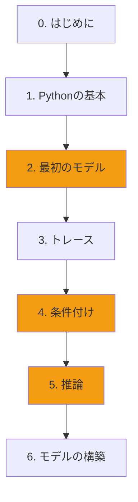

+++
date = "2026-06-14"
title = "GenJAXによる確率的プログラミング"
weight = 2
toc = true
+++

## 確率論から確率的コードへ

前のチュートリアルでは、**集合と数え上げ**を使って確率について考える方法を学びました。Chibanyは確率の問いが本質的には次のことであることを示してくれました：
1. 何が起こりうるか？（結果空間を定義する）
2. 何に興味があるか？（事象を定義する）
3. 数えよう！（割合を計算する）

次は、GenJAX — コンピュータが代わりに数え上げを行ってくれる確率的プログラミング言語 — を使って、同じアイデアを**コード**で表現する方法を学びます！

## GenJAXとは？

GenJAXは**確率的プログラミング言語**で、以下のことが可能です：

1. **生成過程を定義する** — 結果がどのように生成されるかを記述するコードを書く
2. **推論を実行する** — 観測結果から確率の高い説明を見つける
3. **強力な計算を活用する** — 複雑な問題についてGPUで高速に処理する

**最良の点は？** あなたはすでに概念を理解しています！GenJAXは集合について学んだことをコンピュータが実行できるコードに変換するだけです。

## コーディング経験がなくても大丈夫！

このチュートリアルはプログラミングの**完全な初心者**向けに設計されています。以下を行います：

✅ **Google Colab** を使用 — インストール不要でブラウザでコードを実行
✅ **インタラクティブなノートブック** を提供 — スライダーを調整して結果が即座に変わるのを確認
✅ **最低限のPython** を教える — コードを理解するために必要なことだけ
✅ **すべてを集合と結びつける** — コードのすべての行が知っている概念に関連

**このチュートリアルでプログラマーになれるわけではありません** — しかし、確率的プログラミングツールを使って確率を探り、モデルを構築できるようになります！

## 2つの学習方法

### オプション1：Google Colab（初心者におすすめ）

**メリット：**
- ✅ インストール不要
- ✅ ウェブブラウザで動作
- ✅ インタラクティブなウィジェットとビジュアライゼーション
- ✅ どのコンピュータでも動作（Windows、Mac、Linux、Chromebook）
- ✅ 無料のGPUアクセス

**デメリット：**
- ⚠️ インターネット接続が必要
- ⚠️ 非アクティブ後にセッションがタイムアウトする

**最適な用途：** 完全な初心者、試してみる、授業での使用

### オプション2：ローカルインストール（任意）

**メリット：**
- ✅ オフラインで動作
- ✅ 大規模な計算で高速
- ✅ 環境を完全にコントロール

**デメリット：**
- ⚠️ インストールとセットアップが必要
- ⚠️ より技術的なトラブルシューティングが必要

**最適な用途：** ソフトウェアインストールに慣れている方、本格的なプロジェクト

---

## 学習パス

理論からコードへの旅程：

**コアチャプター**（黄色）：GenJAXの必須概念 — 生成モデル、条件付け、推論。

**前提条件**：ここを始める前にチュートリアル1（確率の基礎）を完了してください。

## チュートリアルの構成

### 第0章：はじめに
環境のセットアップ（Google Colabまたはローカルインストール）

### 第1章：Pythonの基本
GenJAXのコードを読んで実行するための最低限のPython

### 第2章：最初の生成関数
コードによるChibanyの食事 — 集合からシミュレーションへ

### 第3章：トレースを理解する
プログラムが実行されるときにGenJAXが記録するもの

### 第4章：条件付けと観測
「これが起きたと分かっている場合はどうなる？」という問いの立て方

### 第5章：推論の実践
タクシーの問題、今度はコードで解く！

### 第6章：自分のモデルを構築する
Chibanyの食事を超えて

---

## 学習の哲学

確率チュートリアルから**概念はすでに知っています**。このチュートリアルでは以下の方法を示すだけです：
- 結果空間を生成関数として表現する
- 事象を結果のフィルターとして表現する
- コンピュータに数え上げをさせる（シミュレーション）
- 条件付き確率の問いを立てる（推論）

**各章には以下が含まれます：**
- 📖 集合に基づく確率との関連を説明
- 💻 インタラクティブなColabノートブック
- 🎮 パラメータで遊べるウィジェット
- 📊 自動的に更新されるビジュアライゼーション
- ✅ 解答付きの演習問題

---

## 構築するもの

このチュートリアルの終わりには、以下のことができるようになります：

1. GenJAXで**単純な生成モデルを書く**
2. 確率を近似するために**シミュレーションを実行する**
3. 観測結果から**推論を実行する**
4. インタラクティブなプロットで**結果を可視化する**
5. 理論とコードのつながりを**理解する**

タクシーの問題、Chibanyの食事、および確率チュートリアルのその他の例が計算的にどのように解けるかを見ることになります！

---

## 前提条件

**必須：**
- ✅ 「確率への物語的入門」を完了済み
- ✅ 集合、事象、条件付き確率を理解している
- ✅ Chibanyの好きな食べ物を知っている 😊

**不要：**
- ❌ プログラミング経験
- ❌ Pythonの知識
- ❌ ソフトウェアのインストール（Colabを使用する場合）

---

## 始める準備はできましたか？

環境をセットアップして、最初の確率的プログラムを書きましょう！

**パスを選択してください：**
- [第0章：Google Colabでのはじめ方 →](./00_getting_started.md)（おすすめ）
- [第0b章：ローカルインストール →](./00b_local_install.md)（任意）

**またはPythonの基本へ進む：**
- [第1章：Pythonの基本 →](./01_python_basics.md)

---

{}
**Pythonの構文を暗記しようとしないでください！** 以下を理解することに集中してください：
- コードが何をしようとしているか（目的）
- 確率の概念とどのように結びついているか（対応関係）
- 実行するとどうなるか（結果）

例をコピー＆ペーストして修正することは常に可能です。暗記よりも理解が大切です！
{}
