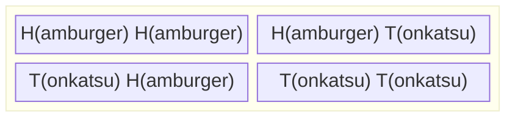

+++
title = "Chibanyはお腹が空いた"
weight = 2
+++

Chibanyは、今日のあとで食べるおいしい食事の夢から目覚めた。1日に2回、学生がChibanyへの供え物としてお弁当箱を持ってきてくれる。昼前に一人の学生が昼食用のお弁当箱を、夕方には別の学生が夕食用のお弁当箱を届けてくれる。食事はハンバーガー {}
 またはトンカツ（豚カツ）{} のどちらかだ。食事の可能性を整理するため、Chibanyは4つの可能性を書き出した：

## 集合

これは4つの要素からなる[集合](./06_glossary.md/#set)を形成する。集合とは、要素またはメンバーの集まりのことだ。この場合、要素はその日にChibanyに与えられた2つの食事によって定義される。集合はそれが含む要素または含まない要素によって定義される。要素はコンマで区切って列挙され、"$\{$" が集合の始まりを、"$\}$" が終わりを示す。

## 結果空間

確率論の文脈では、起こり得ることの基本的な要素を*結果*（outcome）と呼ぶ。結果は確率が構築される基本的な構成要素だ。基本的な概念であることから、この起こり得る*結果*の集合を指すためにギリシャ文字 $\Omega$ がよく使われる。毎日の供え物を丁寧に記録しながら、Chibanyは $\Omega = \{HH, HT, TH, TT \}$ と定義する。最初の文字が昼食の供え物を、2番目の文字が夕食の供え物を表す。$H$ は常にハンバーガーを、$T$ はトンカツを指すことをChibanyは確認した。

{}
集合は確率に最適だ。なぜなら、可能性を**視覚化して数える**ことができるからだ。確率に関するすべての問いはこうなる：
1. **何が可能か？**（結果空間を定義する）
2. **何に関心があるか？**（事象を定義する）
3. **両方を数えよ！**（比率を計算する）

結果空間と事象は集合として定義される。確率は2つの集合の相対的な大きさに帰着する！

これにより確率は抽象的なものではなく**具体的な**ものになる。
{}

### 一意な要素についての注意

技術的には、集合の要素は一意でなければならない。したがって、Chibanyがハンバーガーのペアを2回とハンバーガーとトンカツのペアを書いた場合（$\{HH, HH, HT\}$）、ハンバーガーのペアが1回だけでハンバーガーとトンカツのペアがある場合（$\{HH, HT\}$）と同じ可能性の集合になる。言い換えると、$\{HH, HH, HT\} = \{HH, HT\}$ だ。

重複が自動的に消える一覧表のようなもので、**異なること**だけが重要だと考えればよい。

{}
$\Omega = \{HH, HT, TH, TT\}$ の各要素が一意なのは、**順序が重要**（最初の食事と2番目の食事）だからだ。$HT$ ≠ $TH$ なのは、昼食にトンカツを食べることと夕食にトンカツを食べることは異なるからだ！
{}

Chibanyは半信半疑だが、覚えておこうとしている。確かに分かりにくい！

## 可能性と事象
ここまで、集合、起こり得る結果、そして全ての起こり得る結果の集合 $\Omega$ について議論してきた。Chibanyはトンカツを含む可能な食事の集合に関心がある。その集合は何か？

$\{HT, TH, TT\}$

これは[事象](./06_glossary.md/#event)の一例だ。技術的には、事象とは起こり得る結果のいずれも含まない、一部を含む、またはすべてを含む集合のことだ。

{}
任意の事象 $A$ は結果空間 $\Omega$ の**部分集合**だ。形式的には $A \subseteq \Omega$ と書く。

これは以下を意味する：
- $A$ のすべての要素は $\Omega$ にも含まれる
- $A$ は空（$\{\}$、何も起こらない）であり得る
- $A$ は $\Omega$ 全体であり得る（何かが必ず起こる）
- $A$ はその中間の何であってもよい

Chibanyの「トンカツを含む」事象について：$A = \{HT, TH, TT\} \subseteq \Omega$
{}

### クイックチェック

$\Omega$ は事象か？

{} そうだ。$\Omega$ はすべての起こり得る結果を含む事象だ。$\Omega$ から何かが必ず起こるため、これは**確実事象**と呼ばれることもある。 {}

$\Omega$ はすべての起こり得る事象の集合か？

{} いいえ、$\Omega$ は特定の1つの事象（すべてを含む事象）だ。すべての起こり得る事象の集合はずっと大きい！ {}

Chibanyの状況におけるすべての起こり得る事象の集合は何か？

{}
$\{ \{ \}, \{ HH \}, \{ HT\}, \{TH \}, \{TT\},
\{HH,HT\}, \{HH,TH\}, \{HH,TT\},
\{HT, TH\}, \{HT, TT \},
\{TH, TT\},
\{HH, HT, TH\}, \{HH, HT, TT \}, \{HH, TH, TT\},
\{HT, TH, TT\},
\{HH, HT, TH, TT\}  \}$

$\{ \}$ は空集合または零集合と呼ばれ、要素を含まない特殊な集合だ。これは何も起こらない**不可能事象**だ。Chibanyは食事をまったく受け取らないことは絶対に許さないだろう！

**数え方のヒント：** $n$ 個の結果からなる結果空間では、$2^n$ 個の起こり得る事象がある。ここでは：$2^4 = 16$ 個の事象。
{}

---

## 学んだこと

この章では、Chibanyが確率の基本的な構成要素を紹介してくれた：

- **集合**：異なる要素の集まり
- **結果空間（$\Omega$）**：すべての起こり得る結果
- **事象**：関心のある結果の部分集合

次では、これらを実際の確率に変換する方法を見ていく！

---

|[← 前：目標](./01_goals.md) | [次：確率と数え方 →](./03_prob_count.md)|
| :--- | ---: |
