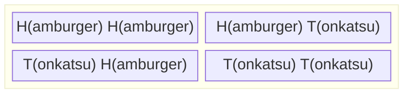

+++
title = "Chibany is hungry"
weight = 2
+++

Chibany wakes up from dreaming of the delicious meals he will get later today. Twice per day, a student brings him a bento box with a meal as an offering to Chibany. One student brings him a bento box in the early afternoon for lunch and a different student brings him a bento box in the evening for dinner. The meal is either a Hamburger {}
 or a Tonkatsu (pork cutlet) {}. To keep track of his meal possibilities, he lists out the four possibilities:

## Sets

This forms a [set](./06_glossary.md/#set) of four elements. A set is a collection of elements or members. In this case, an element is defined by the two meals given to Chibany that day. Sets are defined by the elements they do or do not contain. The elements are listed with commas between them and "$\\{$" denotes the start of a set and "$\\}$" the end of a set.

## Outcome Space

In the context of probability theory, the basic elements of what can occur are called *outcomes*. Outcomes are the fundamental building blocks that probabilities are built from. As they are fundamental, the Greek letter $\Omega$ is frequently used to refer to this set of possible *outcomes*. Diligently noting his daily offerings, Chibany defines $\Omega = \\{HH, HT, TH, TT \\}$. The first letter defines his lunch offering, and the second letter defines his dinner offering. He notes that $H$ now always refers to hamburgers and $T$ to tonkatsu.

{}
Sets are perfect for probability because they let us **visualize and count** possibilities. Every probability question becomes:
1. **What's possible?** (Define the outcome space)
2. **What am I interested in?** (Define the event)
3. **Count both!** (Calculate the ratio)

This makes probability **concrete** instead of abstract.
{}

### A Note on Unique Elements

Technically, the elements of a set are unique. So, if Chibany writes down getting a pair of hamburgers twice and a hamburger and a tonkatsu ($\\{HH, HH, HT\\}$), he's gotten the same set of possibilities as if he only got one pair of hamburgers and a hamburger and tonkatsu ($\\{HH, HT\\}$). In other words, $\\{HH, HH, HT\\} = \\{HH, HT\\}$.

Think of it like a list where duplicates automatically disappear — only what's **different** matters.

{}
Each element in $\Omega = \\{HH, HT, TH, TT\\}$ is already unique because the **position** matters (first meal vs. second meal). $HT$ ≠ $TH$ — getting tonkatsu for lunch is different from getting it for dinner!
{}

Chibany is skeptical, but will try to keep it in mind. It can be confusing!

## Possibilities vs. Events
So far, we have discussed sets, possible outcomes and the set of all possible outcomes $\Omega$. Chibany is interested in the set of possible meals that include Tonkatsu. What is this set?

$\{HT, TH, TT\}$

This is an example of an [event](./06_glossary.md/#event). Technically, an event is a set that contains none, some, or all of the possible outcomes.

{}
Any event $A$ is a **subset** of the outcome space $\Omega$. This means:
- Every element in $A$ is also in $\Omega$
- $A$ could be empty ($\\{\\}$ — nothing happens)
- $A$ could be all of $\Omega$ (something definitely happens)
- $A$ could be anything in between

For Chibany's "contains tonkatsu" event: $A = \\{HT, TH, TT\\} \subseteq \Omega$
{}

### Quick Check

Is $\Omega$ an event?

{} Yes — it is the event that contains all possible outcomes. This is sometimes called the **certain event** because something from $\Omega$ must happen. {}

Is $\Omega$ the set of all possible events?

{} No — $\Omega$ is one particular event (the event containing everything). The set of all possible events is much larger! {}

What is the set of all possible events for Chibany's situation?

{}
$\\{ \\{ \\}, \\{ HH \\}, \\{ HT\\}, \\{TH \\}, \\{TT\\},
\\{HH,HT\\}, \\{HH,TH\\}, \\{HH,TT\\},
\\{HT, TH\\}, \\{HT, TT \\},
\\{TH, TT\\},
\\{HH, HT, TH\\}, \\{HH, HT, TT \\}, \\{HH, TH, TT\\},
\\{HT, TH, TT\\},
\\{HH, HT, TH, TT\\}  \\}$

Note that $\\{ \\}$ is called the empty or null set and is a special set that contains no elements. It's the **impossible event** — nothing happens.

**Counting tip:** For an outcome space with $n$ outcomes, there are $2^n$ possible events. Here: $2^4 = 16$ events.
{}

---

## What We've Learned

In this chapter, Chibany introduced us to the fundamental building blocks of probability:

- **Sets** — Collections of distinct elements
- **Outcome spaces ($\Omega$)** — All possible outcomes
- **Events** — Subsets of outcomes we're interested in

Next, we'll see how to turn these into actual probabilities!

---

|[← Previous: Goals](./01_goals.md) | [Next: Probability and Counting →](./03_prob_count.md)|
| :--- | ---: |
