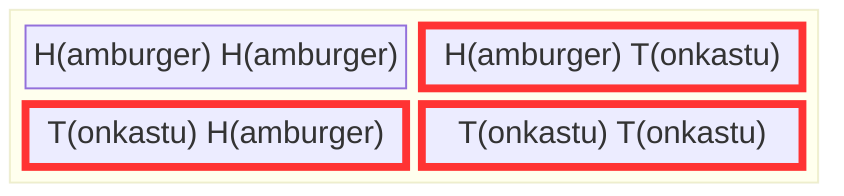
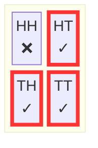
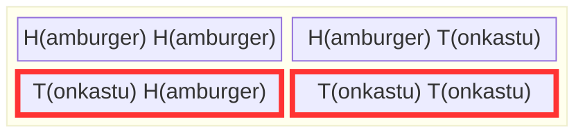
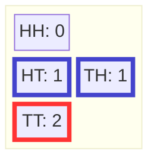

+++
title = "確率と数え上げ"
weight = 3
+++


このチュートリアルの目標の一つは、**確率とは数え上げである**ということを示すことです。すべての結果が等しく起こりやすい場合、確率は各集合に含まれる結果の相対的な数として定義されます。結果の起こりやすさが等しくない場合も、少し複雑になるだけです。各結果が属する集合のサイズに1として数えられる代わりに、結果をその相対的な重みに従って数えます。

## 数え上げ

確率を定義するために使う基本的な操作は、集合の要素の数を数えることです。$A$ が集合であれば、$|A|$ はその集合の[濃度（カーディナリティ）](./06_glossary.md/#cardinality)またはサイズです。

{}
集合の**サイズ**を縦棒を使って表します：
- $|A|$ は「集合 $A$ のサイズ」または「$A$ に含まれる要素の数」を意味します
- 例：$|\{H, T\}| = 2$

「この縦棒の間に要素がいくつあるか？」と考えてみてください。
{}

例えば、Chibany のランチの選択肢の集合は $\{H,T\}$ です。要素の数を数えることでそのサイズがわかり、$\left|\{H, T\} \right| = 2$ となります。ある日の Chibany の食事の提供結果の集合は $\Omega = \{HH, HT, TH, TT \}$ です。結果は4つあるので、そのサイズ $|\Omega|$ は $4$ です。

## Chibany はまだお腹が空いている…とんかつが食べたい

Chibany はまだお腹が空いており、今日の食事の可能性（つまり結果）が何であるか気になっています。彼らは「今日学生たちがとんかつを持ってきてくれる確率はどれくらいだろう？」と考えています。

この計算をするために、Chibany は結果空間 $\Omega$ を再び書き出します。そして「今日とんかつが提供される」という事象を形成します。とんかつが含まれる可能なる結果の集合を $A = \{HT, TH, TT\}$ と定義してその事象を表します。それらを赤で強調します。Chibany は「すごい…4つの可能な結果のうち3つが赤だ。今日は運が味方してくれているに違いない！」と思います。



そうです、Chibany、いつもそうあるべきように、運は味方しています。とんかつを少なくとも1回もらえる確率は4分の3、つまり0.75です。彼らは確率を正しい方法で計算しました！

## 数え上げとしての確率

事象 $A$ の[確率](./06_glossary.md/#probability)は $\frac{|A|}{|\Omega|}$ です。これは $P(A)$ と書かれます。先の例では、$|A| = | \{HT, TH, TT\} | = 3$ かつ $|\Omega| = | \{HH, HT, TH, TT\}| = 4$ であり、それぞれ3つと4つの要素を持ちます。

{}
**確率 ＝ 数え上げ**

$$P(A) = \frac{|A|}{|\Omega|} = \frac{\text{事象に含まれる結果の数}}{\text{可能な結果の総数}}$$

それだけです！他のすべてはこの基礎の上に構築されます。
{}

### 数え上げとしての確率の可視化

注目したい結果を赤いインクで丸で囲むと考えてみましょう。すると：



**丸で囲まれた結果** ＝ 事象 $A$（とんかつを含む）
**すべての結果** ＝ 結果空間 $\Omega$

$$P(A) = \frac{\text{丸で囲まれた結果}}{\text{結果の総数}} = \frac{3}{4} = 0.75$$

### 結果が等しく起こりやすくない場合

可能な結果が等しく起こりやすくない場合は、それぞれの相対的な尤度を合計して「サイズ」を計算します。すべては同じように機能します：事象の確率は、事象内の可能な結果の総「サイズ」または「重み」を、すべての可能な結果の総サイズまたは重みと比較したものです。この例は[後で](./04_conditional.md#weighted-possibilities)見ていきます！

{}
**GenJAX（チュートリアル2）では**、$P(A) = |A|/|\Omega|$ を手で計算しません。代わりに：

1. 生成プロセスを何度も**シミュレート**する
2. 事象が起こる頻度を**数える**
3. シミュレーションの総数で**割る**

<details>
<summary>コード例を表示するにはクリック</summary>

```python
# Generate 10,000 days
import jax.numpy as jnp

keys = jax.random.split(key, 10000)
days = jax.vmap(lambda k: chibany_day.simulate(k, ()).get_retval())(keys)

# Check if event occurs: at least one tonkatsu
has_tonkatsu = (days[:, 0] == 1) | (days[:, 1] == 1)

# Probability ≈ fraction of times event occurred
prob = jnp.mean(has_tonkatsu)  # Equivalent to |A| / |Ω|
```

</details>

**原理は同じです**：有利な結果を数えて総結果数で割る。ただし Ω を手で列挙する代わりに、サンプルを生成します！

[→ チュートリアル2、第2章で完全な実装を見る](../../genjax/02_first_model/#counting-outcomes)

**自分で試してみましょう：** [インタラクティブな Colab ノートブックを開く](https://colab.research.google.com/github/josephausterweil/probintro/blob/main/notebooks/first_model.ipynb)
{}

## 別の例

Chibany が最初の提供でとんかつを受け取る確率はどれくらいでしょうか？ランチにとんかつが含まれる可能な結果は $\{TH, TT\}$ です。提供の可能な結果は全部で $\Omega = \{HH,HT, TH, TT\}$ の4つあります。したがって、最初の提供でとんかつを受け取る確率は $|\{TH, TT\}|/|\{HH,HT, TH, TT\}| = 2/4=1/2$ です。Chibany は数え上げを説明するために次の表を描きます：



## 確率変数

### Chibany が知りたいこと…とんかつの量は？

Chibany は毎日どれだけとんかつをもらえるか知りたいと思っています。そのために、各結果を整数に変換します：その結果に含まれるとんかつの数です。彼らはこれを関数 $f : \Omega \rightarrow \{0, 1, 2, \ldots\}$ と呼びます。これは結果空間から結果を取り出し、それを数値に対応付ける（変換する）ことを意味します。

{}
**関数** $f : \Omega \rightarrow \{0, 1, 2, \ldots\}$ は機械のようなものです：
- **入力：** $\Omega$ からの結果
- **処理：** ルールを適用する（とんかつを数える！）
- **出力：** 数値

矢印「$\rightarrow$」は「対応付ける」または「生成する」を意味します。
{}

彼らは気づきます：すべての結果を整数に対応付けることは、各整数を事象にするようなものです！とんかつカウンター $f$ は $f(HH) = 0$、$f(HT) = 1$、$f(TH)=1$、$f(TT) = 2$ と定義されます。Chibany は最初の[確率変数](./06_glossary.md/#random-variable)を定義しました。



{}
これが**確率変数**と呼ばれる理由：
1. その値はどの結果が起こるかに依存する（ランダム）
2. 異なる結果に対して異なる値をとる変数である

でも実際には、**結果上の関数**にすぎません！
{}

### 確率変数を使った確率の計算

とんかつが2つある確率はどれくらいでしょうか？とんかつが2つある結果（赤で強調された $\{TT\}$）の数を数え、可能な結果の数（$|\Omega|=4$）で割ります。したがって、4分の1または1/4です。

*ちょうど*とんかつが1つある確率はどうでしょうか？*ちょうど*とんかつが1つある結果（青で強調された $\{HT, TH\}$）の数を数え、可能な結果の数（$|\Omega|=4$）で割ります。したがって2/4または1/2です。

{}
「$P(f = 1)$ は何か？」と問うとき、実際には次のことを問うています：
- どの結果が $f=1$ を与えるか？（事象を定義する）
- それらを数える！（確率を計算する）

**事象：** $\{\omega \in \Omega : f(\omega) = 1\} = \{HT, TH\}$
**確率：** $P(f=1) = 2/4 = 1/2$
{}

---

## この章で学んだこと

この章では以下を発見しました：

- **確率は数え上げ**：$P(A) = |A|/|\Omega|$
- **濃度（カーディナリティ）**：$|A|$ を使って集合のサイズを表す
- **確率変数**：結果を数値に対応付ける関数
- **確率変数が事象を作る方法**：各値は $\Omega$ の部分集合に対応する

次は**新しい情報を得たとき**に何が起こるかを探ります：条件付き確率です！

---

|[← 前：Chibany はお腹が空いている](./02_hungry.md) | [次：条件付き確率 →](./04_conditional.md)|
| :--- | ---: |
