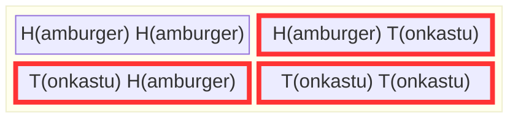
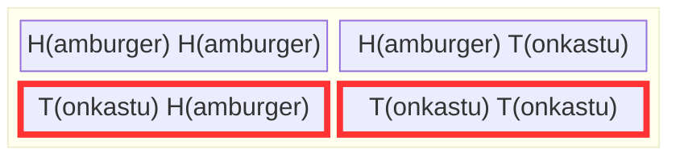
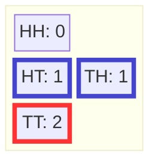

+++
title = "Probability and Counting"
weight = 3
+++

One goal of this tutorial is to show you that probability is counting. When every possibility is equally likely, probability is defined as the relative number of possibilities in each set. When possibilities are not equally likely, it is only slightly more complicated. Rather than each possibility counting one towards the size of a set it is in, you count the possibility according to its relative weight. 

## Counting

The basic operation that we use to define probabilities is counting the number of elements in a set. If $A$ is a set, then $|A|$ is the [cardinality](#cardinality) or size of the set. For example, the set of Chibany's lunch options is $\\{H,T\\}$. Counting the number of elements determines its size, which is $\left|\\{H, T\\} \right| = 2$. The set of Chibany's meal offerings for a day, $\Omega = \\{HH, HT, TH, TT \\}$. There are four possibilities, so its size $|\Omega|$ is $ 4$.

### Chibany is still hungry... and desires Tonkatsu

Chibany is still hungry and wondering what his meal possibilities are for the day. He wonders, what is the probability that students appease him today by giving him Tonkatsu?

To make this calculation, Chibany lists out the outcome space $\Omega$ again. He then forms the event "Tonkatsu offering today". He defines the set of possible outcomes with a Tonkatsu as $A = \\{HT, TH, TT\\}$ to encode the event. He highlights those in red. Chibany thinks "wow... three of the four possible outcomes are red. Fortune must favor me today, right?" 

Yes, Chibany, it does as it always should. Your chance of getting Tonkatsu is three out of four or 0.75. He calculated the probability exactly as he should!

## Probability as Counting
The [probability](#probability) of an event $A$ is $\frac{|A|}{|\Omega|}$. It is written as $P(A)$. In the prior example, $|A| = | \\{HT, TH, TT\\} |$ and $|\Omega| = | \\{HH, HT, TH, TT\\}|$ have three and four elements, respectively. Note that if the possible outcomes were not equally likely, we would sum their individual probabilities to calculate the cardinality. But everything works in the same way -- the probability of the event is the total "size" or "weight" of the possible outcomes in the event as compared to the total size or weight of all possible outcomes.  

What is the probability that Chibany gets Tonkatsu for his first offering? Well the possible outcomes with Tonkatsu are $\\{TH, TT\\}$. There are four possible outcomes for his offerings $\Omega = \\{HH,HT, TH, TT\\}$. So the probability he gets Tonkatsu for his first offering is $|\\{TH, TT\\}|/|\\{HH,HT, TH, TT\\}| = 2/4=1/2$. Chibany draws the following table to illustrate his counting:

## Random Variables

### Chibany wants to know... how much Tonkatsu?
Chibany wants to know how much Tonkatsu he gets each day. To do so, he converts each possibility to a whole number: the number of Tonkatsu in that possibility. He calls this a function $f : \Omega \rightarrow \\{0, 1, 2, \ldots\\}$, meaning it takes a possibility out of the outcome space and maps it (changes it into) a number. He notes: mapping every possibility to a whole number is like making each whole number an event! His Tonkatsu counter $f$ is defined as $f(HH) = 0$, $f(HT) = 1$, $f(TH)=1$, and $f(TT) = 2$. Chibany defined his first [random variable](#random-variable). 

What is the probability of having two tonkatsus? We count the number of outcomes with two tonkatsus ($\\{TT\\}$ highlighted in red) and divide by the number of possible outcomes ($|\Omega|=4$). So, it is 1 out of 4 or 1/4. 

What about the probability of having *exactly* one tonkatsu? We count the number of outcomes with *exactly* one tonkatsu ($\\{HT, TH\\}$) and divide by the number of possible outcomes ($|\Omega|=4$). So it is 2/4 or 1/2.