+++
title = "Probability and Counting"
weight = 3
+++


One goal of this tutorial is to show you that **probability is counting**. When every possibility is equally likely, probability is defined as the relative number of possibilities in each set. When possibilities are not equally likely, it is only slightly more complicated. Rather than each possibility counting one towards the size of a set it is in, you count the possibility according to its relative weight.

## Counting

The basic operation that we use to define probabilities is counting the number of elements in a set. If $A$ is a set, then $|A|$ is the [cardinality](./06_glossary.md/#cardinality) or size of the set.

{}
We write the **size** of a set using vertical bars:
- $|A|$ means "the size of set $A$" or "how many elements are in $A$"
- Example: $|\\{H, T\\}| = 2$

Think of it like: "How many elements are between these bars?"
{}

For example, the set of Chibany's lunch options is $\\{H,T\\}$. Counting the number of elements determines its size, which is $\left|\\{H, T\\} \right| = 2$. The set of Chibany's meal offerings for a day, $\Omega = \\{HH, HT, TH, TT \\}$. There are four possibilities, so its size $|\Omega|$ is $4$.

## Chibany is still hungry... and desires Tonkatsu

Chibany is still hungry and wondering what their meal possibilities are for the day. They wonder, what is the probability that students appease them today by giving them Tonkatsu?

To make this calculation, Chibany lists out the outcome space $\Omega$ again. They then form the event "Tonkatsu offering today". They define the set of possible outcomes with a Tonkatsu as $A = \\{HT, TH, TT\\}$ to encode the event. They highlight those in red. Chibany thinks "wow... three of the four possible outcomes are red. Fortune must favor me today, right?"


Yes, Chibany, it does as it always should. Your chance of getting Tonkatsu is three out of four or 0.75. They calculated the probability exactly as they should!

## Probability as Counting

The [probability](./06_glossary.md/#probability) of an event $A$ is $\frac{|A|}{|\Omega|}$. It is written as $P(A)$. In the prior example, $|A| = | \\{HT, TH, TT\\} | = 3$ and $|\Omega| = | \\{HH, HT, TH, TT\\}| = 4$ have three and four elements, respectively.

{}
**Probability = Counting**

$$P(A) = \frac{|A|}{|\Omega|} = \frac{\text{number of outcomes in event}}{\text{total number of possible outcomes}}$$

That's it! Everything else builds from this foundation.
{}

### Visualizing Probability as Counting

Think of us circling the outcomes we're interested in with red ink. That gives us:

```mermaid
block-beta
    block
        columns 2
        a["HH<br/>❌"] b["HT<br/>✓"]
        c["TH<br/>✓"] d["TT<br/>✓"]
    end
    style b stroke: #f33, stroke-width:4px
    style c stroke: #f33, stroke-width:4px
    style d stroke: #f33, stroke-width:4px
```



**Circled outcomes** = Event $A$ (contains Tonkatsu)
**All outcomes** = Outcome space $\Omega$

$$P(A) = \frac{\text{circled outcomes}}{\text{total outcomes}} = \frac{3}{4} = 0.75$$

### When Outcomes Aren't Equally Likely

Note that if the possible outcomes were not equally likely, we would sum their individual probabilities to calculate the cardinality. But everything works in the same way: the probability of the event is the total "size" or "weight" of the possible outcomes in the event as compared to the total size or weight of all possible outcomes. We'll see an example of this [later](./04_conditional.md#weighted-possibilities)!

{}
**In GenJAX (Tutorial 2)**, we don't calculate $P(A) = |A|/|\Omega|$ by hand. Instead, we:

1. **Simulate** the generative process many times
2. **Count** how often the event occurs
3. **Divide** by total simulations

<details>
<summary>Click to show code example</summary>

```python
# Generate 10,000 days
import jax.numpy as jnp

keys = jax.random.split(key, 10000)
days = jax.vmap(lambda k: chibany_day.simulate(k, ()).get_retval())(keys)

# Check if event occurs: at least one tonkatsu
has_tonkatsu = (days[:, 0] == 1) | (days[:, 1] == 1)

# Probability ≈ fraction of times event occurred
prob = jnp.mean(has_tonkatsu)  # Equivalent to |A| / |Ω|
```

</details>

**The principle is identical**: counting favorable outcomes and dividing by total outcomes. But instead of listing Ω by hand, we generate samples!

[→ See full implementation in Tutorial 2, Chapter 2](../../genjax/02_first_model/#counting-outcomes)

**Try it yourself:** [Open Interactive Colab Notebook](https://colab.research.google.com/github/josephausterweil/probintro/blob/amplify/notebooks/first_model.ipynb)
{}

## Another Example

What is the probability that Chibany gets Tonkatsu for their first offering? Well the possible outcomes with Tonkatsu for lunch are $\\{TH, TT\\}$. There are four possible outcomes for their offerings $\Omega = \\{HH,HT, TH, TT\\}$. So the probability they get Tonkatsu for their first offering is $|\\{TH, TT\\}|/|\\{HH,HT, TH, TT\\}| = 2/4=1/2$. Chibany draws the following table to illustrate their counting:


## Random Variables

### Chibany wants to know... how much Tonkatsu?

Chibany wants to know how much Tonkatsu they get each day. To do so, they convert each possibility to a whole number: the number of Tonkatsu in that possibility. They call this a function $f : \Omega \rightarrow \\{0, 1, 2, \ldots\\}$, meaning it takes a possibility out of the outcome space and maps it (changes it into) a number.

{}
A **function** $f : \Omega \rightarrow \\{0, 1, 2, \ldots\\}$ is like a machine:
- **Input:** An outcome from $\Omega$
- **Process:** Apply the rule (count the tonkatsu!)
- **Output:** A number

The arrow "$\rightarrow$" means "maps to" or "produces".
{}

They note: mapping every possibility to a whole number is like making each whole number an event! Their Tonkatsu counter $f$ is defined as $f(HH) = 0$, $f(HT) = 1$, $f(TH)=1$, and $f(TT) = 2$. Chibany defined their first [random variable](./06_glossary.md/#random-variable).


{}
It's called a **random variable** because:
1. The value depends on which outcome occurs (random)
2. It's a variable that takes different values for different outcomes

But really, it's just a **function on outcomes**!
{}

### Calculating Probabilities with Random Variables

What is the probability of having two tonkatsus? We count the number of outcomes with two tonkatsus ($\\{TT\\}$ highlighted in red) and divide by the number of possible outcomes ($|\Omega|=4$). So, it is 1 out of 4 or 1/4.

What about the probability of having *exactly* one tonkatsu? We count the number of outcomes with *exactly* one tonkatsu ($\\{HT, TH\\}$ highlighted in blue) and divide by the number of possible outcomes ($|\Omega|=4$). So it is 2/4 or 1/2.

{}
When we ask "What's $P(f = 1)$?", we're really asking:
- Which outcomes give $f=1$? (Define the event)
- Count them! (Calculate the probability)

**Event:** $\\{\omega \in \Omega : f(\omega) = 1\\} = \\{HT, TH\\}$
**Probability:** $P(f=1) = 2/4 = 1/2$
{}

---

## What We've Learned

In this chapter, we discovered:

- **Probability is counting**: $P(A) = |A|/|\Omega|$
- **Cardinality**: Using $|A|$ to denote the size of a set
- **Random variables**: Functions that map outcomes to numbers
- **How random variables create events**: Each value corresponds to a subset of $\Omega$

Next, we'll explore what happens when we **learn new information**: conditional probability!

---

|[← Previous: Chibany is Hungry](./02_hungry.md) | [Next: Conditional Probability →](./04_conditional.md)|
| :--- | ---: |
