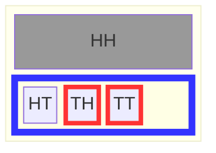
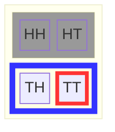
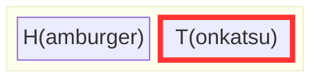
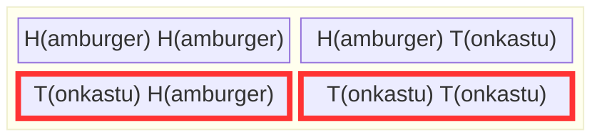
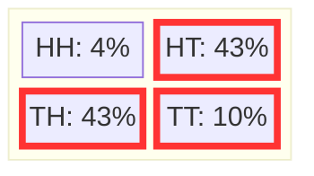

+++
title = "条件付き確率――可能な結果を絞り込む"
weight = 4
+++

## 本章の大きな問い

**新しい情報を得たとき、考えを変えたことはありますか？**

もちろんあるはずです！それこそが条件付き確率のすべてです：*新しい知識が「何が起こりうるか」についての信念をどう変えるか*。

**この章で学ぶこと：**
- 何かを知ることが結果空間をどのように制限するか
- 事象同士が互いに影響を及ぼすとき（従属性）
- 可能性に異なる重みがある場合の確率の計算方法
- 条件付き確率に対する最初の直感がなぜしばしば間違いなのか！

驚きの結果への準備はいいですか？Chibanyが夕食について何を学ぶか見てみましょう……

---

## Chibanyはとんかつディナーが食べたい

千葉工大の卒業生である田中さんがある日Chibanyを訪ね、明日の提供メニューには少なくとも一品のとんかつが入ることを知っていると告げます。Chibanyは喜びます。2品目のメニューがとんかつである可能性がどれくらいかを知りたくなった彼らは、田中さんに問いかけます。田中さんは「以前と同じくらいの確率なので1/2のはず」と答えます。Chibanyは同意しません。「少なくとも1品はとんかつだと知っているので、何かを学んだことになる」と言います。また、Chibanyは楽観主義者であり、すべてのとんかつを食べる資格があります。どちらが正しいのでしょうか！？表で確かめてみましょう……



少なくとも1品がとんかつの場合、可能な結果の空間は$\\{HT, TH, TT\\}$であり、青枠で示されています。Chibanyが注目している事象は赤枠で示されています。Chibanyが正しかったのです！とんかつディナーを得る確率は3分の2であり、2分の1より大きいことがわかります。

{}
**多くの学生（と田中さん！）が考えること**：「各食事がそれぞれ50/50なら、一方について知っても他方には影響しないはず。だから確率はやっぱり1/2では？」

**これが間違いである理由**：「少なくとも1つはT」と知ることは、特定の1つの食事についてだけ教えてくれるのではなく、**HHという結果を完全に消去する**のです。HHを結果空間から除外すると、{HT, TH, TT}が残り、そのうち2つがとんかつで終わります！

**重要な洞察**：条件付き確率は、単に一方の事象が他方に影響するというだけではなく、**何が可能かを制限すること**なのです。「少なくとも1つはT」と知ると、HHは不可能になり、残りのすべての確率が変わります。
{}

ChibanyはやさしくChibanyのことを思い出し、田中さんに「学ぶことに終わりはない、千葉工大のジョーのクラスを取ってみてはどうか」と伝えます。Chibanyはそのクラスの評判がとても良いと聞いています！

## 集合の制限として条件付き確率を定義する

Chibanyが計算したのは[条件付き確率](./06_glossary.md/#conditional-probability)です：ある事象（夕食がとんかつ）の確率を、別の事象（少なくとも1品はとんかつ）の知識を条件として求めるものです。ある事象を条件とすることは、その事象に含まれる可能な結果が可能性の集合、すなわち結果空間を形成することを意味します。そして、その*制限された*結果空間の中で通常通りに確率を計算します。この例では、$A= \\{TT\\}$という事象の確率を、少なくとも1品はとんかつという知識$B = \Omega_{\geq 1 T}= \\{HT, TH, TT\\}$を条件として求めています。形式的には$P(A \mid B) = \frac{|A|}{|B|}$と書かれ、$\mid$の左側が確率を知りたいもの、$\mid$の右側が真であると知っているものを表します。

{}
**条件付き確率＝結果空間の制限**

何か新しいことを知ったとき：
1. 不可能な結果（$B$に含まれないもの）を**消去する**
2. 残ったものだけを**数える**
3. この制限された空間で確率を**計算する**

数学的記法$P(A \mid B)$はこの直感を形式化したものです：
$$P(A \mid B) = \frac{|A \cap B|}{|B|}$$

ここで$A \cap B$は「$A$と$B$の両方に含まれる結果」（積集合）を意味します。
{}

これは条件付き確率の伝統的な教え方とは異なる視点ですが、同等のものです。

{}
**GenJAX（チュートリアル2）では**、`ChoiceMap`を使って観測値を条件とします：

<details>
<summary>コード例を表示する</summary>

```python
from genjax import ChoiceMap, Target

# Specify what we observed: "at least one tonkatsu" means we saw tonkatsu somewhere
# Let's say we observed lunch was tonkatsu
observations = ChoiceMap.d({"lunch": 1})  # 1 = tonkatsu

# Create a posterior target (restricts to outcomes matching observations)
target = Target(chibany_day, (), observations)

# Sample from the posterior (conditioned distribution)
trace, log_weight = target.importance(key, ChoiceMap.empty())

# Now trace contains samples where lunch IS tonkatsu
# This is exactly like crossing out HH and HT from Ω!
```

</details>

**原理はまったく同じです**：条件付けは結果空間を制限します。集合記法では不可能な結果を消去しました。GenJAXでは`ChoiceMap`で観測値を指定します。

[→ チュートリアル2・第4章で条件付けの完全なチュートリアルを見る](../../genjax/04_conditioning/)

**自分で試してみよう：** [インタラクティブColabノートブックを開く](https://colab.research.google.com/github/josephausterweil/probintro/blob/main/notebooks/conditioning.ipynb)
{}

## 従属性と独立性

田中さんはChibanyに自分の考え方を説明します：彼は、Chibanyが最初の提供でとんかつ（T）を受け取るかどうかが、2品目でとんかつ（T）を受け取るかどうかに影響するとは思っていなかったのです。

Chibanyは興味を持ちます。田中さんの論理はもっともらしく聞こえますが、少し違う問いのように思えます。Chibanyは田中さんに、違いを明確にするため、この問いに対する結果空間と事象を図示するよう頼みます。田中さんは自分の問いを形式的に述べます：最初の提供がとんかつ（$\\{TH, TT\\}$）であったとき、2品目もとんかつ（$\\{HT, TT\\}$）である確率、すなわち$P(\\{HT, TT\\} \mid \\{TH, TT\\})$はいくつか？



可能な結果（$\\{TH, TT\\}$）のうち1つ（$TT$）が該当します。したがって確率は$1/2$：$P(\\{HT, TT\\} \mid \\{TH, TT\\}) = 1/2$となります。

田中さんは今回の結果は自分の予想通りだと言います。「2品目の確率だけを考えてそれを結果空間にすれば、2品目がとんかつである確率はちょうど1/2になるはずだ」と言います。Chibanyは田中さんに、代わりにこの結果空間を図示して確率を計算してみるよう頼みます。Chibanyは、大変な部分を友達に手伝ってもらいながら確率を学ぶのがずっと楽しいと思っています！

```mermaid
block-beta
    block:group2
        columns 2
        c["H"] d["T"]
    end
    style group2 stroke: #33f, stroke-width: 6px
    style d stroke: #f33, stroke-width: 4px
```



見てください：ちょうど1/2です！Chibanyは「少なくとも1品はとんかつ」と教えてもらうほうが好みです。そのほうが2品目にとんかつを食べられる確率が高くなるからです。

あるケースでは、ある事象（とんかつが1品はある）を条件とすることが別の事象（2品目がとんかつ）の確率に影響を与えました。しかし別のケースでは、わずかに異なる事象（1品目がとんかつ）を条件とすることは、別の事象（再び、2品目がとんかつ）の確率に影響を与えませんでした。

ある事象$A$を条件とすることが別の事象$B$の確率に影響を与えるとき、その2つの事象は[従属](./06_glossary.md/#dependence)であると言います。これは$A \not\perp B$と表記されます。互いに影響を与えない場合は独立と言い、$A \perp B$と表記されます。

{}
事象$A$と$B$が**独立**であるとは、次の条件を満たすときです：
$$P(A \mid B) = P(A)$$

言葉で言えば：「$B$が起きたことを知っても、$A$の確率は変わらない」

同等の定義として：$P(A, B) = P(A) \times P(B)$（次の節でその理由がわかります！）
{}

{}
**条件付き確率は日常生活に溢れています：**

**医療**：「検査が陽性だったとき、病気である確率はどれくらいか？」（次の章でさらに詳しく――驚きの結果が待っています！）

**機械学習**：推薦システムは「これらの映画を気に入ったとき、あなたが好きそうな映画は何か？」と問います。

**天気**：「今日が曇りのとき、明日雨が降る確率は？」

**金融**：「金利が下がったとき、株価が上がる確率は？」

**法律**：「提示された証拠を前提として、有罪である確率はどれくらいか？」

新しい情報に基づいて信念を更新するたびに、あなたは条件付き確率を使っています――たとえ気づいていなくても！従属性と独立性の理解は、新しい情報が考えを変えるべきかどうかを正しく推論するのに役立ちます。
{}

## 周辺確率と結合確率

### Chibanyは悲しい（周辺化）

いつも2品目を分けてくれる学生が病欠になりました。Chibanyは1日に1品しかもらえなくなります。Chibanyは新しい可能性の集合$\Omega_1 = \\{H, T\\}$を書き出します。



これは随分と悲しい可能性の集合だと気づきます。少なくともとんかつを食べられる確率はそれほど低くはありません！2つの可能性のうちの1つです。

ありがたいことに翌日、その学生は回復し、Chibanyは再び毎日2品もらえるようになります。これで可能性の集合は元の$\Omega_2 = \\{HH,HT, TH, TT \\}$に戻ります。Chibanyは1品目がとんかつである確率を計算できることに気づきます。2品目を受け取るかどうかは、1品目がとんかつである確率に影響しないはずですよね？確認してみましょう！



この場合、関心があるのは$P(\\{TH, TT \\}) = 2/4 = 1/2$です。よかった！

ここで何が起きたのでしょうか？どちらの場合も、同じ*事象*に注目しています：1品目がとんかつである確率です。最初のケースでは2品目を含めませんでした。これを[周辺確率](./06_glossary.md/#marginal-probability)と言います。2番目のケースでは2品目を含めました。これを[結合確率](./06_glossary.md/#joint-probability)と言います。技術的には、共同で考慮している異なる事象の積集合に含まれる結果の数を数えます。つまり、考慮しているすべての事象に含まれる結果の数です。

### 加法定理：周辺化と周辺確率についてさらに詳しく

直感的に、次の2つの方法でその変数が特定の値をとる確率を計算しても同じ答えになるはずです：(1) その変数だけを含む可能な結果を列挙し、指定された値をとるものを数える（[周辺確率](./06_glossary.md/#marginal-probability)）、(2) その変数と別の変数を含む可能な結果を列挙し、最初の変数が関心のある値をとるものをすべて数える（[結合確率](./06_glossary.md/#joint-probability)）。

形式的には、2つの確率変数$A$と$B$がある場合、$A$の周辺確率$P(A)$は次のように表されます：

$$P(A) = \sum_{b} P(A, B=b)$$

{}
$\sum_{b}$という記法に馴染みがない場合：
- $\sum$は「以下を**足し合わせる**」という意味の記号です
- 添字$b$は**どの値について**足し合わせるかを示します
- この場合：確率変数$B$がとりうるすべての値$b$について和をとります

**例：** $B \in \\{H, T\\}$の場合：
$$\sum_{b} P(A, B=b) = P(A, B=H) + P(A, B=T)$$
{}


最後の例では、$A$はChibanyの1品目、$B$はChibanyの2品目でした。Chibanyの1品目がとんかつであるか、すなわち$P(A=T)$を求めていました。$B$のとりうる値はハンバーガーととんかつ、すなわち$\\{H,T \\}$です。示したのは：

$$P(A=T) = \sum_{b} P(A=T,B=b) = P(A=T, B=H) + P(A=T, B=T) = 1/4 + 1/4 = 2/4 = 1/2$$

### 条件付き確率のもう1つの定義

結合確率と周辺確率を使って、条件付き確率を別の方法で定義できます：結合確率と条件付ける情報の周辺確率の比として定義するものです。つまり：

$$P(A \mid B) = \frac{P(A,B)}{P(B)}$$

$B$の確率はゼロより大きくなければならない（$P(B) > 0$）ことに注意してください。Chibanyにはこれは当然のことに思えます。起こる可能性がゼロの情報を与えられることなどあるでしょうか？

Chibanyはこの別の計算方法が好きではありませんが、練習することにします。これまでで一番好きな例に戻ります：とんかつを食べられる確率が1/2より高かったあの例です。その例では、少なくとも1品はとんかつをもらえることを知り、2品ともとんかつになる確率を求めていました。したがって、$A$は夕食にとんかつを食べること（2品目がとんかつ）、$B$は少なくとも1品はとんかつであることです。$A = \\{HT, TT\\}$、$B=\\{HT, TH, TT\\}$です。$A$と$B$の積集合、つまり共通の可能性は$\\{HT,TT\\}$です。より大きな結果空間$\Omega = \\{HH,HT,TH,TT\\}$には4つの可能な結果があることを思い出してください。したがって$P(A,B) = |\\{HT,TT\\}|/ | \\{HH,HT,TH,TT\\}| = 2/4$です。$P(B) = |\\{HT,TH,TT\\}|/|\\{HH,HT,TH,TT\\}| = 3/4$です。これらをまとめると：

$$P(A \mid B) = \frac{P(A,B)}{P(B)} = \frac{2/4}{3/4} = \frac{2}{3}$$

Chibanyは「少なくとも1品はとんかつ」とわかれば、2品目もとんかつである可能性が1/2より高いという同じ結果を見て喜んでいますが、最初の方法よりもずっと大変に感じました。そう感じた方もいるかもしれません（私もそうです！）。だからこそChibanyは、集合に基づく確率の見方を皆に知ってほしいのです。

{}
**集合に基づく視点：** $P(A \mid B) = \frac{|A \cap B|}{|B|}$
- 考え方：「制限された空間の中で数える」

**数式に基づく視点：** $P(A \mid B) = \frac{P(A,B)}{P(B)}$
- 考え方：「結合確率と周辺確率の比」

どちらも同じ答えになります！より直感的に感じる方を使いましょう。
{}

## 重み付きの可能性

### Chibanyはとんかつの方が好きだと学生に伝える


Chibanyは嬉しいです！学生たちが学ぶことを大好きであることを思い出しました。学生たちに伝えたい重要な情報があります：Chibanyはハンバーガーよりもとんかつが好きなのです。

この嬉しいニュースを考慮して確率を計算する方法を考えていると、田中さんがやってきます。田中さんはChibanyに、学生たちは少なくとも1品はとんかつが提供されるよう調整しているが、とんかつに飽きないよう2品ともとんかつにはならないようにしていると教えます。田中さんは学生たちが日々の提供の指針として使っている次の図を共有します：



Chibanyは最初戸惑いますが、学んだルールに従います。以前と同じ手順で、各結果が自動的に1として数えられる代わりに、各結果の重み付きバージョンを足し合わせます。

そこで、とんかつを含む結果（赤枠で囲まれたもの）を足し合わせ、合計で割ります：

$$P(\textrm{とんかつ}) = \frac{0.43+0.43+0.10}{0.04+0.43+0.43+0.10} = \frac{0.96}{1}=0.96$$

とんかつがずっと多くなります：96%の確率でとんかつです。喜びの時です！

{}
結果が等確率でない場合：
1. 各結果には**重み**（その確率）があります
2. 事象内の重みを合計します（1、1、1……と数える代わりに）
3. すべての重みの合計で割ります

**論理はまったく同じです**：単純な計数の代わりに重み付き計数を行うだけです！
{}

### 練習問題

1品目と2品目が従属かどうかを判定できますか？どのように判断しますか？

{}
$A$と$B$をChibanyの1品目と2品目を表す確率変数とすれば、任意の$a$または$b$に対して$P(A=a)$と$P(A =a \mid B=b)$が異なるかどうかを調べることになります。1品目がとんかつである確率が、2品目がとんかつであることによって影響されるかどうかを考えましょう。

まず$P(A=T)$を計算します。加法定理を使います：
$$P(A=T) = \sum_b{P(A=T, B= b)} = P(A=T, B=H) + P(A=T, B=T) = 0.43+0.10 = 0.53$$

これは$P(A = T \mid B=T)$と異なるでしょうか？重み付きの場合、これをどう計算するのでしょうか？以前と同じですが、$|\Omega|$は条件付ける事象$B=T$の重みの量になります。したがって：
$$P(A=T \mid B=T) = \frac{0.10}{0.43+0.10} = \frac{0.10}{0.53} \approx 0.19$$

$0.53 \neq 0.19$なので、これらの事象は**従属**です！2品目についての情報を得ることで、1品目の確率が変わります。
{}

---

## 習得したこと

**おめでとうございます！** 確率論のなかで最も強力な概念の一つを学びました。今できることを振り返りましょう：

* ✅ 結果空間を制限することで**条件付き確率を計算する**
* ✅ 事象間の**従属性と独立性を認識する**
* ✅ **周辺確率と結合確率を扱い**、その関係を理解する
* ✅ **加法定理を適用して**変数を周辺化する
* ✅ 結果が等確率でない場合に**重み付き確率を扱う**
* ✅ 「独立とは事象が互いに影響しないことを意味する」という**よくある罠を回避する**

**今やあなたには次のことができます：**
- 新しい情報を得たときに信念を更新する
- 2つの事象が本当に互いに影響し合っているかを認識する
- 不均等な重みを持つ複雑なシナリオで確率を計算する

## 次の章：大きな驚き

次の章では、**ベイズの定理**を通して条件付き確率が実際に使われる場面を見ていきます。次のことを発見するでしょう：
- 医療検査の陽性結果が必ずしも思い通りの意味を持たない理由
- 有名なタクシー問題がなぜ専門家でさえ迷わせるのか
- 基準率がほとんどの人が思う以上に重要な理由

**ネタばれ注意**：あなたの直感は外れるでしょう――だからこそ面白いのです！🤯

---

|[← 前の章：確率と計数](./03_prob_count.md) | [次の章：ベイズの定理 →](./05_bayes.md)|
| :--- | ---: |
