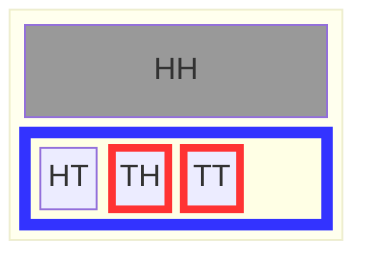
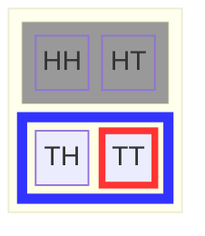
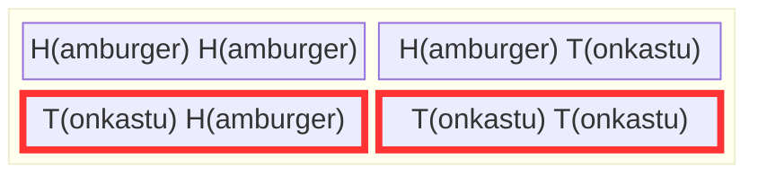
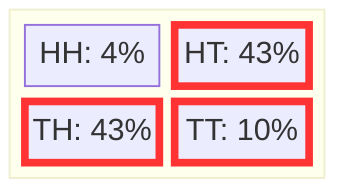

+++
title = "Conditional probability as changing the possible outcomes"
weight = 4
+++

## Chibany wants a tonkatsu dinner
A graduate of Chiba Tech, Tanaka-san, visits Chibany one day and tells Chinbany that he knows that there will be at least one tonkatsu in tomorrow's offering. Chibany is excited. They wants to know how likely it is that the second meal is a Tonkatsu. They quiz Tanaka-san. He say it's just as likely as before, so it should be 1/2. Chibany disagrees. Chibany says "I learned something because I knows I will get at least one tonkatsu". Also, Chibany is an optimist and deserves to have all the tonkatsu. Who's right!? Let's check the chart...

**TODO: Make top block look more disabled** 

In the case where there is at least one tonkatsu, the space of possible outcomes is $\\{HT, TH, TT\\}$, which is outlined in blue. The event of interest for Chibany is outlined in red. It turns out Chibany is correct! There is a two in three chance that he gets a tonkatsu dinner. That's larger than one in two.

Chibany kindly reminds Tanaka-san that you never stop learning and to consider taking one of Joe's classes at Chiba Tech. Chibany hears great things about them! 

## Defining conditional probability as set restriction

What Chibany calculated is a [conditional probability](./06_glossary.md/#conditional-probability) -- the probability of an event (two tonkatsus) conditioned on knowledge of another event (at least one tonkatsu). Conditioning on an event means that the possible outcomes in that event form the set of possibilities or outcome space. We then calculate probabilities as normal within that *restricted* outcome space. In our example, we're interested in the probability of the event $A= \\{TT\\}$ conditioned on the knowledge that there's at least one tonkatsu, $ B = \Omega_{\geq 1 T}= \\{HT, TH, TT\\}$. Formally, this is written as $P(A \mid B) = \frac{|A|}{|B|}$, where everything to the left of the $\mid$ is what we're interested in knowing the probability of and everything to the right of the $\mid$ is what we know to be true.

Note that this is a different, yet equivalent perspective to how conditional probability is traditionally taught. 

## Dependence and independence
Tanaka-san explains to Chibany his reasoning: He did not think whether Chibany received a tonkatsu (T) for their first offering influenced whether they receive a tonkatsu (T) for their second offering. 

Chibany is curious. Tanaka-san's logic seems sound, but it sounds like a slightly different question. Chibany asks Tanaka-san to draw out the outcome space and events for this question to help clarify what is different. Tanaka-san states his question formally: What is the probability of getting a second tonkatsu ($\\{TT\\}$) given the first offering was a tonkatsu ($\\{TH, TT\\}$)  or $P(\\{HT, TT\\} \mid \\{TH, TT\\})$

There's one outcome ($TT$) out of two possible outcomes ($\\{TH, TT\\}$). Thus the probability is $1/2$: $P(\\{HT, TT\\} \mid \\{TH, TT\\}) = 1/2$.

Tanaka-san says this time the result is what I expected. he says "If I just think about what the probability of the second meal is and make that my outcome space, then the probability of the second meal being tonkatsu should just be one-half. Chibany asks Tanaka-san the draw out this outcome space and calculate the probability this way instead. Chibany notes that probability is much more fun when you ask your friends to help you do the hard parts!

```mermaid
block-beta
    block:group2
        columns 2
        c["H"] d["T"]
    end
    style group2 stroke: #33f, stroke-width: 6px
    style d stroke: #f33, stroke-width: 4px
```

Look at that -- It's one half! Chibany prefers learning that there will be at least one tonkatsu because it makes it more likely that he will get a tonkatsu for his second offering.

We saw in one case that conditioning on an event (that there will be one tonkatsu) influenced the probability of another event (that the second offering will be tonkatsu). But in a different case, conditioning on a slighlty differnt event (that the first meal will be a tonkatsu) did not influence the probability of another event (again, that the second offering will be a tonkatsu). 

When conditioning on one event $A$ influences the probability of another event $B$, those two events are called [dependent](./06_glossary.md/#dependence). This is denoted as $A \not\perp B$. If they do not influence each other they are called independent, which is denoted as $A \perp B$. 

## Marginal and joint probabilities

### Chibany is sad (marginalization)

 

The student that normally gives Chibany his second offering is out sick. Now Chibany only gets one offering per day. Chibany lists out the new set of possibilities $\Omega_1 = \\{H, T\\}$.

He notes this is a much sadder set of possibilities. At least the probability of getting Tonkatsu isn't too low! It's one of two possibilities.

Thankfully, on the next day, the student is healthy again and Chibany is back to getting two offerings each day. This changes the set of possibilities back to the original one $\Omega_2 = \\{HH,HT, TH, TT \\}$. Chibany realizes he can calculate the probability of the first offering being Tonkatsu. Getting his second meal shouldn't influence the chance the first one is Tonkatsu, right? Let's check!

In this case, he is interested $P(\\{TH, TT \\}) = 2/4 = 1/2$. Phew! 

What happened here? In both cases, we are interested in the same *event* -- the probability the first meal is a Tonkatsu. In the first case, we did not include the second meal. This is called using [marginal probability](./06_glossary.md/#marginal-probability). In the second case, we did include the second meal. This is called using [joint probability](./06_glossary.md/#joint-probability). Technically it counts the number of outcomes in the intersection of the different events being considered jointly. This means the number of outcomes that are in all the events under consideration.

### The Sum Rule: More on Marginalization and Marginal Probabilities
 Intuitively, the following two ways of calculating the probability a variable takes a value should give the same answer: ([marginal probability](./06_glossary.md/#marginal-probability)) list the possible outcomes containing only that variable and count those where it has the specified value, and (2) enumerate the possible outcomes containing that variable and another variable and count all of those where the first variable has the value of interest ([joint probability](./06_glossary.md/#joint-probability)).
 
Formally, if we have two random variables $A$ and $B$, the marginal probability of $A$ $P(A)$ is 

$P(A) = \sum_{b} P(A, B=b)$.

If you're unfamiliar with the notation $\sum_{b}$, $\sum$ is a fancy way of saying "add the following up" and the $b$ tells you which values to add up over (in this case, the values $b$ that random variable $B$ could possibly be).  

In the last example, $A$ was Chibany's first meal and $B$ was Chibany's second meal. We were interested in whether Chibany's first meal was Tonkatsu or $P(A=T)$. The possible values for $B$ are Hamburger and Tonkatsu or $\{H,T \}$. What we showed was
$
P(A=T) = \sum_{b} P(A=T,B=b) = P(A=T, B=H) + P(A=T, B=T) = 1/4 + 1/4 = 2/4 = 1/2
$

### The other definition of conditional probability

Using joint and marginal probabilities, we can define conditional probability in a different manner -- as the ratio of the joint probability to the marginal probability of the conditioned information. Or

 $P(A \mid B) = \frac{P(A,B)}{P(B)}$

Note that the probability of $B$ must be greater than zero ($P(B) > 0$). This makes sense to Chibany. How could he be given information that had zero chance of happening?

Chibany is no fan of this other way of calculating conditional probabilities, but he decides to practice using it. He goes back to his favorite example so far -- the one where he had better than a one-half chance of getting two Tonkatsus. In that example, he learned he was going to get at least one Tonkatsu and was interested in finding the probability that there would be two Tonkatsus. So, $A$ is getting a tonkatsu dinner (second meal is tonkatsu) and $B$ is that there is at least one tonkatsu. So $A = \\{HT, TT\\}$ and $B=\\{HT, TH, TT\\}$. The intersection or common possibilities in $A$ and $B$ is $\\{HT,TT\\}$. Remember that there are four possible outcomes in the larger outcome space $\Omega = \\{HH,HT,TH,TT\\}$ This means $P(A,B) = |\\{HT,TT\\}/ | \\{HH,HT,TH,TT\\} = 2/4$. $P(B) = |\\{HT,TH,TT\\}|/\\{HH,HT,TH,TT\\} = 3/4$. Putting these together we get 
$P(A \mid B) = \frac{P(A,B)}{P(B)} = \frac{2/4}{3/4} = \frac{2}{3}$

Although Chibany is happy to see the same result of it being more likely than not he'll have a second meal of Tonkatsu if he learns he gets at least one Tonkatsu, this felt a lot harder to him than the first way of doing things. It may have felt that way for you too (it does for me!). That's why Chibany wants everyone to know the set-based perspective to probability.

## Weighted possibilities
### Chibany tells students that he likes Tonkatsu more

Chibany is happy! He remembered that students love learning. He has important information for them: Chibany likes Tonkatsu more than Hamburgers. 

While wondering how to calculate probabilities taking this glorious news into account, Tanaka-san stops by. Tanaka-san lets Chibany know that the students coordinate to ensure that he gets at least one tonkatsu, but try not to make both offerings tonkatsu (that way he doesn't get tired of Tonkatsu). Tanaka-san shares the following chart the students use to guide their daily offerings

Chibany is confused at first, but he sticks with the rules he learned. I follow the same procedure as before, but add the weighted versions of each outcome rather than each outcome counting 1 automatically. 

So he adds up the outcomes containing Tonkatsu (outlined in red) and divides it by the total amount:
$P(\textrm{Tonkatsu}) = \frac{0.43+0.43+0.10}{0.04+0.43+0.43+0.10} = \frac{0.96}{1}=0.96$

He gets a lot more Tonkatsu -- Tonkatsu 96\% of the time. Joyous times! 

Practice question:
Can you determine whether the first and second meals are dependent? How would you do that?
{} If $A$ and $B$ are random variables encoding Chibany's first meal and second meals, we would want to see whether $P(A=a)$ is different from $P(A =a \mid B=b)$ for any possible $a$ or $b$. Let's consider whether the probability the first meal is Tonkatsu is influenced by the second meal being Tonkatsu. First let's calculate $P(A=T)$. To do, we'll use the sum rule, so $P(A=T) = \sum_b{P(A=T, B= b)} = P(A=T, B=H) + P(A=T, B=T) = 0.43+0.10 = 0.53$. Is this different from the $P(A = T \mid B=T)$? How do we calculate this in the weighted case? The same as before except the $| \Omega|$ is the amount of weight for the conditioned event $B=T$. So,  $P(A=T \mid B=T) = \frac{0.10}{0.43+0.10} = \frac{0.1}{0.53} \approx 0.19$.{}