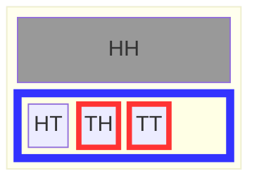
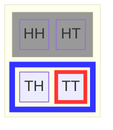
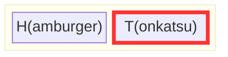
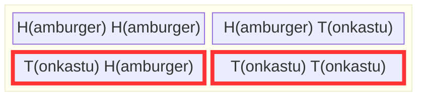
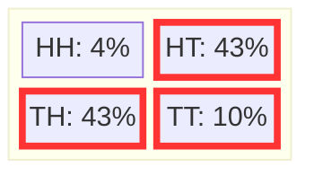

```mermaid
block-beta
    block:group2
        columns 2
        c["H"] d["T"]
    end
    style group2 stroke: #33f, stroke-width: 6px
    style d stroke: #f33, stroke-width: 4px
```

+++
title = "Conditional probability as changing the possible outcomes"
weight = 4
+++

## The Big Question

**Have you ever changed your mind about something after learning new information?**

Of course you have! That's what conditional probability is all about: *how new knowledge changes what we believe is possible.*

**In this chapter, you'll discover:**
- How learning something restricts the outcome space
- When events influence each other (dependence)
- How to calculate probabilities when possibilities have different weights
- Why your first intuition about conditional probability is often wrong!

Ready for some surprising results? Let's see what Chibany learns about dinner...

---

## Chibany wants a tonkatsu dinner

A graduate of Chiba Tech, Tanaka-san, visits Chibany one day and tells Chibany that they know that there will be at least one tonkatsu in tomorrow's offering. Chibany is excited. They want to know how likely it is that the second meal is a Tonkatsu. They quiz Tanaka-san. Tanaka-san says it's just as likely as before, so it should be 1/2. Chibany disagrees. Chibany says "I learned something because I know I will get at least one tonkatsu". Also, Chibany is an optimist and deserves to have all the tonkatsu. Who's right!? Let's check the chart...



In the case where there is at least one tonkatsu, the space of possible outcomes is $\\{HT, TH, TT\\}$, which is outlined in blue. The event of interest for Chibany is outlined in red. It turns out Chibany is right! There is a two in three chance that they get a tonkatsu dinner. That's larger than one in two.

{}
**Many students (and Tanaka-san!) think**: "If each meal is 50/50, learning about one meal shouldn't change the other. So it's still 1/2, right?"

**Why this is wrong**: Learning "at least one T" doesn't just tell you about one specific meal—it **eliminates the HH outcome entirely**. When you cross out HH from the outcome space, you're left with {HT, TH, TT}, and now 2 out of 3 have T for dinner!

**The key insight**: Conditional probability isn't *just* about one event influencing another—it's about **restricting what's possible**. Once you know "at least one T", HH is impossible, which changes all the remaining probabilities.
{}

Chibany kindly reminds Tanaka-san that you never stop learning and to consider taking one of Joe's classes at Chiba Tech. Chibany hears great things about them!

## Defining conditional probability as set restriction

What Chibany calculated is a [conditional probability](./06_glossary.md/#conditional-probability): the probability of an event (tonkatsu for dinner) conditioned on knowledge of another event (at least one tonkatsu). Conditioning on an event means that the possible outcomes in that event form the set of possibilities or outcome space. We then calculate probabilities as normal within that *restricted* outcome space. In our example, we're interested in the probability of the event $A= \\{TT\\}$ conditioned on the knowledge that there's at least one tonkatsu, $ B = \Omega_{\geq 1 T}= \\{HT, TH, TT\\}$. Formally, this is written as $P(A \mid B) = \frac{|A|}{|B|}$, where everything to the left of the $\mid$ is what we're interested in knowing the probability of and everything to the right of the $\mid$ is what we know to be true.

{}
**Conditional probability = restricting the outcome space**

When you learn something new:
1. **Cross out** impossible outcomes (those not in $B$)
2. **Count** only what's left
3. **Calculate** the probability in this restricted space

The math notation $P(A \mid B)$ just formalizes this intuition:
$$P(A \mid B) = \frac{|A \cap B|}{|B|}$$

Where $A \cap B$ means "outcomes in both $A$ and $B$" (the intersection).
{}

Note that this is a different, yet equivalent perspective to how conditional probability is traditionally taught.

{}
**In GenJAX (Tutorial 2)**, we condition on observations using `ChoiceMap`:

<details>
<summary>Click to show code example</summary>

```python
from genjax import ChoiceMap, Target

# Specify what we observed: "at least one tonkatsu" means we saw tonkatsu somewhere
# Let's say we observed lunch was tonkatsu
observations = ChoiceMap.d({"lunch": 1})  # 1 = tonkatsu

# Create a posterior target (restricts to outcomes matching observations)
target = Target(chibany_day, (), observations)

# Sample from the posterior (conditioned distribution)
trace, log_weight = target.importance(key, ChoiceMap.empty())

# Now trace contains samples where lunch IS tonkatsu
# This is exactly like crossing out HH and HT from Ω!
```

</details>

**The principle is identical**: conditioning restricts the outcome space. In set notation we crossed out impossible outcomes. In GenJAX we specify observations with `ChoiceMap`.

[→ See full conditioning tutorial in Tutorial 2, Chapter 4](../../genjax/04_conditioning/)

**Try it yourself:** [Open Interactive Colab Notebook](https://colab.research.google.com/github/josephausterweil/probintro/blob/amplify/notebooks/conditioning.ipynb)
{}

## Dependence and independence

Tanaka-san explains to Chibany his reasoning: He did not think whether Chibany received a tonkatsu (T) for their first offering influenced whether they receive a tonkatsu (T) for their second offering.

Chibany is curious. Tanaka-san's logic seems sound, but it sounds like a slightly different question. Chibany asks Tanaka-san to draw out the outcome space and events for this question to help clarify what is different. Tanaka-san states his question formally: What is the probability of getting a second tonkatsu ($\\{HT, TT\\}$) given the first offering was a tonkatsu ($\\{TH, TT\\}$) or $P(\\{HT, TT\\} \mid \\{TH, TT\\})$



There's one outcome ($TT$) out of two possible outcomes ($\\{TH, TT\\}$). Thus the probability is $1/2$: $P(\\{HT, TT\\} \mid \\{TH, TT\\}) = 1/2$.

Tanaka-san says this time the result is what he expected. He says "If I just think about what the probability of the second meal is and make that my outcome space, then the probability of the second meal being tonkatsu should just be one-half." Chibany asks Tanaka-san to draw out this outcome space and calculate the probability this way instead. Chibany notes that probability is much more fun when you ask your friends to help you do the hard parts!



Look at that: It's one half! Chibany prefers learning that there will be at least one tonkatsu because it makes it more likely that they will get a tonkatsu for their second offering.

We saw in one case that conditioning on an event (that there will be one tonkatsu) influenced the probability of another event (that the second offering will be tonkatsu). But in a different case, conditioning on a slightly different event (that the first meal will be a tonkatsu) did not influence the probability of another event (again, that the second offering will be a tonkatsu).

When conditioning on one event $A$ influences the probability of another event $B$, those two events are called [dependent](./06_glossary.md/#dependence). This is denoted as $A \not\perp B$. If they do not influence each other they are called independent, which is denoted as $A \perp B$.

{}
Events $A$ and $B$ are **independent** if:
$$P(A \mid B) = P(A)$$

In words: "Learning $B$ happened doesn't change the probability of $A$"

Equivalently: $P(A, B) = P(A) \times P(B)$ (we'll see why in the next section!)
{}

{}
**Conditional probability is everywhere in daily life:**

**Medicine**: "What's the probability I have the disease *given that* I tested positive?" (More on this in the next chapter—prepare for a surprise!)

**Machine Learning**: Recommendation systems ask "What movies will you like *given that* you liked these other movies?"

**Weather**: "What's the probability of rain tomorrow *given that* it's cloudy today?"

**Finance**: "What's the probability the stock goes up *given that* interest rates just fell?"

**Law**: "What's the probability of guilt *given* the evidence presented?"

Every time you update your beliefs based on new information, you're using conditional probability—even if you don't realize it! Understanding dependence vs. independence helps you reason correctly about whether new information should change your mind.
{}

## Marginal and joint probabilities

### Chibany is sad (marginalization)


The student that normally gives Chibany their second offering is out sick. Now Chibany only gets one offering per day. Chibany lists out the new set of possibilities $\Omega_1 = \\{H, T\\}$.



They note this is a much sadder set of possibilities. At least the probability of getting Tonkatsu isn't too low! It's one of two possibilities.

Thankfully, on the next day, the student is healthy again and Chibany is back to getting two offerings each day. This changes the set of possibilities back to the original one $\Omega_2 = \\{HH,HT, TH, TT \\}$. Chibany realizes they can calculate the probability of the first offering being Tonkatsu. Getting their second meal shouldn't influence the chance the first one is Tonkatsu, right? Let's check!



In this case, they are interested in $P(\\{TH, TT \\}) = 2/4 = 1/2$. Phew!

What happened here? In both cases, we are interested in the same *event*: the probability the first meal is a Tonkatsu. In the first case, we did not include the second meal. This is called using [marginal probability](./06_glossary.md/#marginal-probability). In the second case, we did include the second meal. This is called using [joint probability](./06_glossary.md/#joint-probability). Technically it counts the number of outcomes in the intersection of the different events being considered jointly. This means the number of outcomes that are in all the events under consideration.

### The Sum Rule: More on Marginalization and Marginal Probabilities

Intuitively, the following two ways of calculating the probability a variable takes a value should give the same answer: (1) list the possible outcomes containing only that variable and count those where it has the specified value ([marginal probability](./06_glossary.md/#marginal-probability)), and (2) enumerate the possible outcomes containing that variable and another variable and count all of those where the first variable has the value of interest ([joint probability](./06_glossary.md/#joint-probability)).

Formally, if we have two random variables $A$ and $B$, the marginal probability of $A$ is $P(A)$:

$$P(A) = \sum_{b} P(A, B=b)$$

{}
If you're unfamiliar with the notation $\sum_{b}$:
- $\sum$ is a fancy way of saying "**add** the following up"
- The subscript $b$ tells you **which values** to add up over
- In this case: sum over all possible values $b$ that random variable $B$ could take

**Example:** If $B \in \\{H, T\\}$, then:
$$\sum_{b} P(A, B=b) = P(A, B=H) + P(A, B=T)$$
{}


In the last example, $A$ was Chibany's first meal and $B$ was Chibany's second meal. We were interested in whether Chibany's first meal was Tonkatsu or $P(A=T)$. The possible values for $B$ are Hamburger and Tonkatsu or $\\{H,T \\}$. What we showed was:

$$P(A=T) = \sum_{b} P(A=T,B=b) = P(A=T, B=H) + P(A=T, B=T) = 1/4 + 1/4 = 2/4 = 1/2$$

### The other definition of conditional probability

Using joint and marginal probabilities, we can define conditional probability in a different manner: as the ratio of the joint probability to the marginal probability of the conditioned information. Or:

$$P(A \mid B) = \frac{P(A,B)}{P(B)}$$

Note that the probability of $B$ must be greater than zero ($P(B) > 0$). This makes sense to Chibany. How could they be given information that had zero chance of happening?

Chibany is no fan of this other way of calculating conditional probabilities, but they decide to practice using it. They go back to their favorite example so far: the one where they had better than a one-half chance of getting two Tonkatsus. In that example, they learned they were going to get at least one Tonkatsu and were interested in finding the probability that there would be two Tonkatsus. So, $A$ is getting a tonkatsu dinner (second meal is tonkatsu) and $B$ is that there is at least one tonkatsu. So $A = \\{HT, TT\\}$ and $B=\\{HT, TH, TT\\}$. The intersection or common possibilities in $A$ and $B$ is $\\{HT,TT\\}$. Remember that there are four possible outcomes in the larger outcome space $\Omega = \\{HH,HT,TH,TT\\}$. This means $P(A,B) = |\\{HT,TT\\}|/ | \\{HH,HT,TH,TT\\}| = 2/4$. $P(B) = |\\{HT,TH,TT\\}|/|\\{HH,HT,TH,TT\\}| = 3/4$. Putting these together we get:

$$P(A \mid B) = \frac{P(A,B)}{P(B)} = \frac{2/4}{3/4} = \frac{2}{3}$$

Although Chibany is happy to see the same result of it being more likely than not they'll have a second meal of Tonkatsu if they learn they get at least one Tonkatsu, this felt a lot harder to them than the first way of doing things. It may have felt that way for you too (it does for me!). That's why Chibany wants everyone to know the set-based perspective to probability.

{}
**Set-based perspective:** $P(A \mid B) = \frac{|A \cap B|}{|B|}$
- Think: "Count in the restricted space"

**Formula-based perspective:** $P(A \mid B) = \frac{P(A,B)}{P(B)}$
- Think: "Ratio of joint to marginal"

Both give the same answer! Use whichever feels more intuitive.
{}

## Weighted possibilities

### Chibany tells students that they like Tonkatsu more


Chibany is happy! They remembered that students love learning. They have important information for them: Chibany likes Tonkatsu more than Hamburgers.

While wondering how to calculate probabilities taking this glorious news into account, Tanaka-san stops by. Tanaka-san lets Chibany know that the students coordinate to ensure that they get at least one tonkatsu, but try not to make both offerings tonkatsu (that way they don't get tired of Tonkatsu). Tanaka-san shares the following chart the students use to guide their daily offerings:



Chibany is confused at first, but they stick with the rules they learned. They follow the same procedure as before, but add the weighted versions of each outcome rather than each outcome counting 1 automatically.

So they add up the outcomes containing Tonkatsu (outlined in red) and divide it by the total amount:

$$P(\textrm{Tonkatsu}) = \frac{0.43+0.43+0.10}{0.04+0.43+0.43+0.10} = \frac{0.96}{1}=0.96$$

They get a lot more Tonkatsu: Tonkatsu 96% of the time. Joyous times!

{}
When outcomes aren't equally likely:
1. Each outcome has a **weight** (its probability)
2. Sum the weights in the event (instead of counting 1, 1, 1, ...)
3. Divide by sum of all weights

**The logic is identical**: just weighted counting instead of simple counting!
{}

### Practice question

Can you determine whether the first and second meals are dependent? How would you do that?

{}
If $A$ and $B$ are random variables encoding Chibany's first meal and second meals, we would want to see whether $P(A=a)$ is different from $P(A =a \mid B=b)$ for any possible $a$ or $b$. Let's consider whether the probability the first meal is Tonkatsu is influenced by the second meal being Tonkatsu.

First let's calculate $P(A=T)$. To do this, we'll use the sum rule:
$$P(A=T) = \sum_b{P(A=T, B= b)} = P(A=T, B=H) + P(A=T, B=T) = 0.43+0.10 = 0.53$$

Is this different from $P(A = T \mid B=T)$? How do we calculate this in the weighted case? The same as before except the $|\Omega|$ is the amount of weight for the conditioned event $B=T$. So:
$$P(A=T \mid B=T) = \frac{0.10}{0.43+0.10} = \frac{0.10}{0.53} \approx 0.19$$

Since $0.53 \neq 0.19$, the events **are dependent**! Learning about the second meal changes the probability of the first meal.
{}

---

## What You've Mastered

**Congratulations!** You've just learned one of the most powerful concepts in all of probability. Let's recap what you can now do:

* ✅ **Calculate conditional probabilities** by restricting the outcome space
* ✅ **Recognize dependence vs. independence** between events
* ✅ **Work with marginal and joint probabilities** and understand their connection
* ✅ **Apply the sum rule** to marginalize out variables
* ✅ **Handle weighted probabilities** when outcomes aren't equally likely
* ✅ **Avoid the common trap** of thinking independence means "events don't affect each other"

**You now have the tools to:**
- Update beliefs when you learn new information
- Recognize when two events truly influence each other
- Calculate probabilities in complex scenarios with unequal weights

## Coming Up Next: The Big Surprise

In the next chapter, you'll see conditional probability in action through **Bayes' theorem**. You'll discover:
- Why a positive medical test doesn't always mean what you think
- How the famous Taxicab Problem stumps even experts
- Why base rates matter more than most people realize

**Spoiler alert**: Your intuition will be wrong, and that's exactly what makes it fascinating! 🤯

---

|[← Previous: Probability and Counting](./03_prob_count.md) | [Next: Bayes' Theorem →](./05_bayes.md)|
| :--- | ---: |
