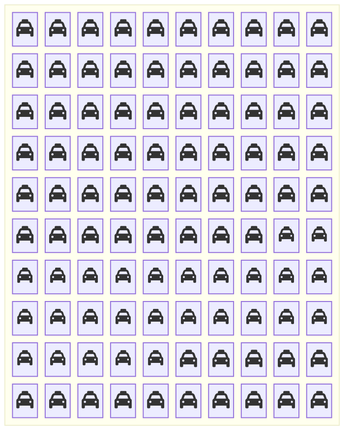
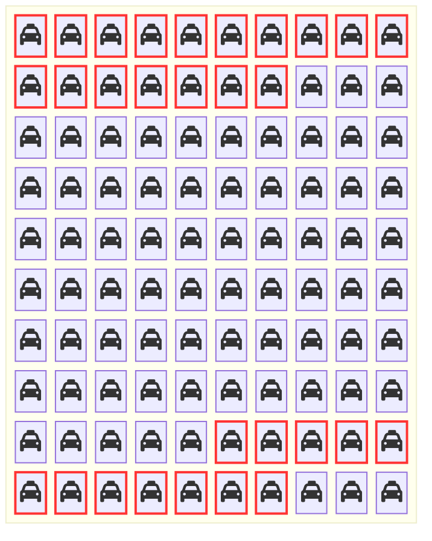

+++
title = "ベイズの定理：信念の更新"
weight = 5
+++

## 確率論における最も驚くべき結果

**あなたの直感は、今から完全に打ち砕かれます。** 🤯

陽性の医療検査が意味することは、あなたが思っているものとは違う。目撃証言は期待するほど信頼できない。そして確率論で最も有名な問題の一つは、なぜ専門家でさえ途方に暮れるのか、その理由をこれから明らかにします。

**この章で学ぶこと：**
- ベイズの定理が証拠をもとにどのように信念を更新するか
- 基準率（ベースレート）が正確さよりも重要な理由
- ほぼすべての人がはまる認知的罠を回避する方法
- タクシー問題への最初の答えがほぼ確実に間違っている理由！

**正直な警告**：この章を読み終えると、あなたは確率に対する直感を永遠に疑うようになるでしょう。準備はいいですか？ では、霧深い夜の Chibany に会いに行きましょう……

---

## ベイズの定理とは何か？

あなたが世界についてある**信念**（仮説）を持っているとします。そこへ何か新しいもの（データ）を**観測**します。ベイズの定理は、観測したことをもとに**信念をどのように更新すべきか**を教えてくれます。

**例：** ほとんどのタクシーが緑色だと思っていたとします。霧の中で青く見えるタクシーを目撃しました。実際の色についての信念をどのように更新すべきでしょうか？

### 公式

[ベイズの定理](./06_glossary.md/#bayes-theorem)（ベイズの規則）は、ある確率変数に関する情報が与えられたとき、別の確率変数についての信念をどのように更新するかを示します。世界の仕組みについて、確率変数 $H$ で表されるいくつかの仮説があるとしましょう。また、私たちには情報をもたらしてくれる五感があります。五感から得られるかもしれない情報を $D$（例えば目から入る画像）、現在観測している値を $d$（例えばとんかつの写真）とします。

仮説 $h$ が世界の仕組みであるという信念を、$D=d$ を観測した後にどのように更新すべきかを、ベイズの定理は次のように示します：

$$P(H=h \mid D = d) = \frac{P(D=d\mid H=h) P(H=h)}{P(D=d)}$$

ここで：
- $P(H=h \mid D=d)$ は**事後分布**と呼ばれます：データを見た後の更新された信念
- $P(D=d \mid H=h)$ は**尤度**と呼ばれます：$h$ が世界の仕組みである真の仮説であるとき $d$ を観測する確率
- $P(H=h)$ は**事前分布**と呼ばれます：データを見る前に $h$ が世界の仕組みである可能性
- $P(D=d)$ は**証拠**または**周辺尤度**と呼ばれます：すべての仮説にわたって $d$ を観測する全体的な確率

{}
- **事前分布** = データを見る前に信じていたこと
- **尤度** = それぞれの仮説に対してデータがどれほど一致するか
- **証拠** = このデータは全体的にどれほど驚くべきものか？
- **事後分布** = データを見た後に信じるべきこと

**重要な洞察：** 強い証拠（高い尤度）は弱い事前分布を覆すことができますが、特別な主張にはやはり特別な証拠が必要です！
{}

これを証明するための情報はすべて揃っています！証明に興味がなければ、次の節に飛んでも構いません。

## ベイズの規則の証明

[条件付き確率のもう一つの定義](./06_glossary.md/#the-other-definition-of-conditional-probability)から、$P(H \mid D) = \frac{P(H,D)}{P(D)}$ が成り立ちます。両辺に $P(D)$ を掛けると、$P(H,D) = P(H \mid D) P(D)$ が得られます。条件付けの順序を逆にしても同じことができます（同時確率はどちらの順序で書いても同じです——これは二つの集合の共通部分であり、どちらの順序で考えても変わりません）。よって $P(D \mid H) = \frac{P(H,D)}{P(H)}$ となり、同様に両辺に $P(H)$ を掛けて $P(H,D) = P(D \mid H) P(H)$ が得られます。これらを合わせると、ベイズの規則を証明できます：

$$P(H \mid D) P(D) = P(H,D) = P(D \mid H) P(H)$$
$$\Rightarrow P(H \mid D) = \frac{P(H,D)}{P(D)} = \frac{P(D \mid H) P(H)}{P(D)}$$

{}
これが抽象的に感じられても心配しないでください。以下のタクシー問題が具体的にしてくれます！
{}

## タクシー問題


Chibany の故郷には、二つのタクシー会社があります：グリーン {} とブルー {} です。グリーン社のタクシーはすべて緑に塗られており {}、ブルー社のタクシーはすべて青に塗られています {}。

街のタクシーの85%がグリーン {} 社に属しています。つまり、15%がブルー {} 社です。

ある霧深い夜遅く、Chibany はタクシーがひき逃げ（別の車に衝突して情報を提供せずに立ち去る）するのを目撃しました。Chibany が見たのは青色 {} のタクシーでした！

Chibany は模範的な市民なので、この情報を持って警察に向かいました。警察は霧が深く暗かったことを知っているので、Chibany がタクシーの色を正しく見ていない可能性があります。何度かテストを行ったところ、Chibany はタクシーの色を80%の確率で正しく答えることがわかりました！

これらすべての情報を考慮すると、ひき逃げに関わったタクシーが青色 {} である可能性はどのくらいだと思いますか？

{} 正解は **41%** ですが、ほとんどの人は60〜80%に近いと考えます！{}

これはタクシー問題（Kahneman and Tversky, 1972; Bar-Hillel, 1980）として知られています。

{}
ほとんどの人は Chibany の80%の正確さに注目し、基準率（タクシーの85%は緑）を無視します。これは**基準率の無視**と呼ばれる古典的な認知バイアスです。

重要な洞察：かなり高い正確さ（80%）があっても、何か稀なもの（青色のタクシーは15%）に関する証拠は、見た目ほど強くはありません！
{}

補足：Kahneman と Tversky（および他の研究者たち）はこの例（および他の例）を使い、人間は全くベイジアンではないと主張しています！これに対する反論は長年にわたって数多く提示されており、現在も議論が続いています。Joe はこの議論を大好きです。興味があれば、ぜひ連絡してください——喜んでさらに詳しく話し合います。

### タクシー問題の解法1：集合に基づく視点

一つの解法として、標本空間の視点を使う方法があります！Chibany の故郷に100台のタクシーがあると仮定しましょう。すると、可能性の集合 $\Omega$ には85台の個別の緑のタクシー {} と15台の個別の青いタクシー {} が含まれます。



次に、標本空間をタクシーの色と、霧深い夜にChibanyがそのタクシーを青と識別するかどうかを含むように拡張できます。Chibanyは青いタクシーを青と正しく識別するのが80%（$15 \times 0.80=12$）なので、12台の青いタクシーが青と識別され、（$15 \times 0.2 = 3$）3台が誤って緑と識別されます。また、Chibanyは緑のタクシーのうち誤って20%を青と識別するので、（$85 \times 0.2 = 17$）17台の緑のタクシーが青と識別され、（$85 \times 0.8=68$）68台が*正しく*緑と識別されます。



赤い枠で囲まれた鮮やかな色のタクシーが、Chibany が視認困難な状況下で青と報告するタクシーです。すでに緑 {} のタクシーの方が青 {} よりも多いことがわかるので、ひき逃げに関わったタクシーは依然として緑である可能性の方が高いです。青いタクシー {} である正確な確率は、以前と同じ計数の法則で求められます。青と識別された青いタクシー {} は12台、青と識別された緑のタクシー {} は17台です。よって、Chibany が青と報告した場合にそれが実際に青であった確率は $12/(12+17)=12/29 \approx 0.41$ です。

{}
図を見れば答えは明白です！Chibany の正確さが80%であっても：
- **12台の本当に青いタクシー**が青と報告される
- **17台の実際には緑のタクシー**が青と報告される

緑のタクシーがとても多いため、偽陽性が真陽性を上回っています！
{}

### タクシー問題の解法2：ベイズの公式を使う

標本空間で計数をしなくても、前述の確率論の規則に従うことで解くことができます。これは計数が現実的でない場合（100万台のタクシーを想像してみてください！）に強力です。

$X$ をひき逃げに関わったタクシーの実際の色、$W$ を Chibany が報告した色（「目撃した色」）とします。市内の青 {} と緑 {} のタクシーの割合から、$P(X=G) = 0.85$ および $P(X=B)=0.15$ とわかります。また、Chibany の正確さは80%です。よって $P(W = B \mid X = B) = 0.8$、$P(W=G \mid X=G)=0.8$ となります。これはまた、Chibany が20%の確率で誤ることを意味します：$P(W = B \mid X=G)=0.2$、$P(W=G \mid X=B)=0.2$。

Chibany はタクシーが青と言っており、それを踏まえてタクシーが実際に青である可能性はどのくらいでしょうか？つまり、$P(X=B \mid W=B)$ を求めます。ベイズの規則と和の法則を使って解きます。

$$P(X=B \mid W=B) = \frac{P(W =B \mid X=B) P(X=B)}{P(W=B)}$$

$$P(X=B \mid W=B) = \frac{P(W =B \mid X=B) P(X=B)}{\sum_c{P(W=B,X=c)}}$$

$$P(X=B \mid W=B) = \frac{P(W =B \mid X=B) P(X=B)}{\sum_c{P(W=B \mid X=c)P(X=c)}}$$

$$P(X=B \mid W=B) = \frac{P(W =B \mid X=B) P(X=B)}{P(W=B \mid X=B)P(X=B) + P(W=B \mid X=G)P(X=G)}$$

$$P(X=B \mid W=B) = \frac{0.8 \times 0.15 }{0.8 \times 0.15 + 0.2 \times 0.85} = \frac{0.12}{0.12+0.17} = \frac{0.12}{0.29} \approx 0.41$$

{}
各要素を確認しましょう：

**分子（尤度 × 事前分布）：**
- 尤度：$P(W=B \mid X=B) = 0.8$：「青なら、おそらく青と言う」
- 事前分布：$P(X=B) = 0.15$：「青のタクシーは稀だ」
- 積：$0.8 \times 0.15 = 0.12$

**分母（全証拠）：**
- 青かつ青と報告：$0.8 \times 0.15 = 0.12$
- 緑だが青と報告：$0.2 \times 0.85 = 0.17$
- 合計：$0.12 + 0.17 = 0.29$

**事後分布：** $\frac{0.12}{0.29} \approx 0.41$：実際に青である確率はたった41%！
{}

### なぜ確率論に集合に基づく視点を学ぶのか？

記号の操作によって確率の問題を解けるなら、なぜ集合に基づく確率論の視点を学ぶ必要があるのでしょうか？

その理由はいくつかあります：

1. **計算へのスケーラビリティ**：変数が複雑になるにつれ、明示的に問題を解くことは現実的でなくなります。計数する方法を考えることは、[生成過程](./06_glossary.md/#generative-process)の視点への強力な出発点となります。生成過程は、ランダムな選択を伴うコンピュータプログラムに従って結果がどのように生成されるかを説明するものです。これが確率的モデルを定義します！[確率的計算](./06_glossary.md/#probabilistic-computing)フレームワークは確率的モデルを指定するためのプログラミング言語であり、このモデルに従って様々な確率を効率的に計算できるよう設計されています。次のいくつかのチュートリアルでかけてこれを探求していきます。

2. **同時確率と条件付き確率の明確化**：確率の初学者の多くは、同時確率と条件付き確率の区別を混乱しがちで直感的に理解しにくいと感じます。集合に基づく視点からは、その違いは明確です。同時確率は複数の事象が同時に起きる結果を数えます。条件付き確率は、条件付けた情報と整合する標本空間に絞り込み、その新しい空間で数えます。

3. **表現についての思考を促す**：事象と結果がどのように表現されるかについて考えることを求めます。これは規則に基づく視点から確率を考える際には時に見えにくくなることがあります。

4. **形式的な等価性**：集合に基づくアプローチと公式に基づくアプローチは形式的に等価です：常に同じ答えを与えます。

5. **より直感的**：多くの人（このチュートリアルの著者を含めて！）にとって、可視化と計数は記号の操作よりも自然に感じられます。

6. **組み合わせ論と確率論の連結**：計数と確率論の間の深い結びつきを明示的にします。

7. **Chibany が喜ぶ**：そして、それこそが本当に重要なことです！

{}
**GenJAX** では、ベイズの定理が**自動化**されます！事後分布を手で計算する必要はありません：

1. **生成モデルを定義する**（事前分布 + 尤度）
2. **観測を指定する**（データ）
3. **GenJAX に事後分布を計算させる**

<details>
<summary>コード例を表示するにはクリック</summary>

```python
@gen
def taxicab_model():
    # Prior: 85% green taxis
    is_blue = bernoulli(0.15) @ "true_color"  # 1=blue, 0=green

    # Likelihood: Chibany's accuracy (80%)
    if is_blue:
        reported_blue = bernoulli(0.80) @ "reported"  # P(report blue | is blue)
    else:
        reported_blue = bernoulli(0.20) @ "reported"  # P(report blue | is green)

    return is_blue

# Observe: Chibany reported blue
observations = ChoiceMap.d({"reported": 1})  # 1 = reported blue

# Posterior inference (automatic Bayes' Theorem!)
target = Target(taxicab_model, (), observations)
trace, log_weight = target.importance(key, ChoiceMap.empty())

# trace now samples from P(true_color | reported=blue)
# This is the posterior! GenJAX did all the Bayes' rule math.
```

</details>

**原理は同じです**：証拠に基づいて信念を更新します。ただし GenJAX がすべての公式操作を処理します！

[→ チュートリアル2・第5章でベイズ学習を見る](../../genjax/05_bayesian_learning/)

[→ チュートリアル3・第4章で高度なベイズ推論を見る](../../intro2/04_bayesian_gaussian/)

**自分で試してみよう：** [インタラクティブ Colab ノートブックを開く](https://colab.research.google.com/github/josephausterweil/probintro/blob/main/notebooks/bayesian_learning.ipynb)
{}

{}
**ベイズの定理は単なる数式ではありません——それが世界の仕組みです！**

**医学**：稀な病気の検査で陽性が出ても、パニックにならないでください！タクシー問題を思い出してください：病気が1000人に1人に影響し、検査の正確さが99%でも、陽性結果はまだあなたが健康である可能性の方が高いことを意味します。（医師はこのことを知っているべきですが、多くの医師は知りません！）

**機械学習**：すべてのスパムフィルター、推薦システム、AIアシスタントがベイズの定理を使用しています。Netflix が映画を推薦するとき、視聴した作品に基づいてあなたの好みについての信念を更新しています。

**刑事司法**：目撃証言は説得力があるように見えますが、タクシー問題は単独で依拠することが危険な理由を示しています。稀な犯人を識別する80%正確な目撃者は、直感が示すほど信頼できません。

**科学**：すべての科学実験はベイズ的な考え方を使います：「このデータが与えられると、仮説に対する信念をどのように更新すべきか？」強い事前分布を覆すには強い証拠が必要です。

**日常生活**：「それは自分の知識からすると驚くべきことだな」と言うたびに、ベイズ的に考えています！暗黙のうちに尤度を事前分布と比較しているのです。

**重要な教訓**：証拠を孤立して評価せず、常に基準率（事前分布）を考慮してください。稀なものは良い証拠があっても稀なままです。
{}

---

## 今回のまとめ

**おめでとうございます——あなたは数学全体の中で最も強力で反直感的な概念の一つをマスターしました！** 🎉

今あなたが理解していることを確認しましょう：

✅ **ベイズの定理**：新しい証拠を使って合理的に信念を更新できる

✅ **タクシー問題**：80%の正確さが80%の確実性を意味しない理由を理解している

✅ **基準率の重要性**：事前分布を無視することは二度とない

✅ **二つの解法**：ベイズ的な問題を計数によっても公式によっても解ける

✅ **基準率の無視**：この認知的罠を認識して回避できる

✅ **集合に基づく力**：可視化が記号の操作より優れている理由を理解している

**最も重要なこと**：あなたは今、証拠についての考え方が変わりました。誰かが「この検査は99%正確だ！」と言ったら、「でもその症状はどのくらい一般的なのか？」と問うでしょう。「目撃者が容疑者を識別した！」と読んだら、「でも基準率はどのくらいか？」と考えるでしょう。

**これは超能力です。** あなたは今、多くの専門家を含むほとんどの人よりも正確に推論しています！

## あなたの確率の旅

Chibany が食事を数えることから始まり、標本空間と事象について学び、条件付き確率を発見し、そして今ではベイズの定理で信念を更新することができます。

**これが確率論の完全な基礎です！** それ以降のすべてはこれらの概念の上に構築されます。

**次は何か？**
- **用語集**：これまで学んだすべての定義を整理する
- **チュートリアル2**：GenJAX を使ってこれらの概念を計算的に適用する
- **チュートリアル3**：ガウス過程などの高度なトピックを探求する

**でもまず**：インタラクティブノートブックを試して、スライダーで遊んでみてください！ベイズの定理を内面化する最良の方法は、基準率と正確さを変えると事後分布がどのように変わるかを見ることです。案外楽しいですよ。🎮

---

|[← 前：条件付き確率](./04_conditional.md) | [次：用語集 →](./06_glossary.md)|
| :--- | ---: |

---

## 参考文献

- Bar-Hillel, M. (1980). The base-rate fallacy in probability judgments. *Acta Psychologica, 44*(3), 211–233. <https://doi.org/10.1016/0001-6918(80)90046-3>
- Kahneman, D., & Tversky, A. (1972). Subjective probability: A judgment of representativeness. *Cognitive Psychology, 3*(3), 430–454. <https://doi.org/10.1016/0010-0285(72)90016-3>
