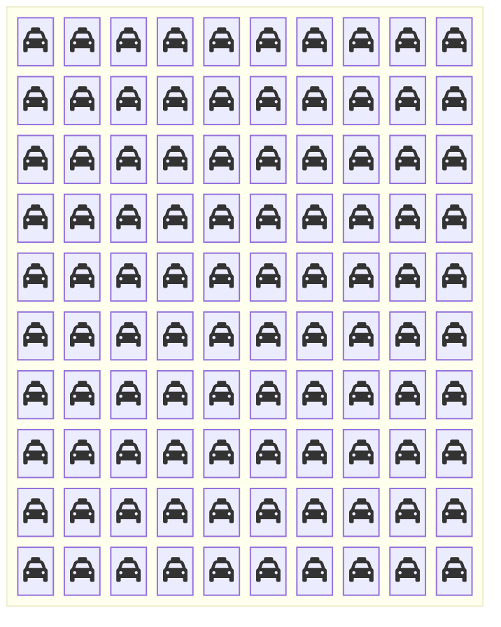
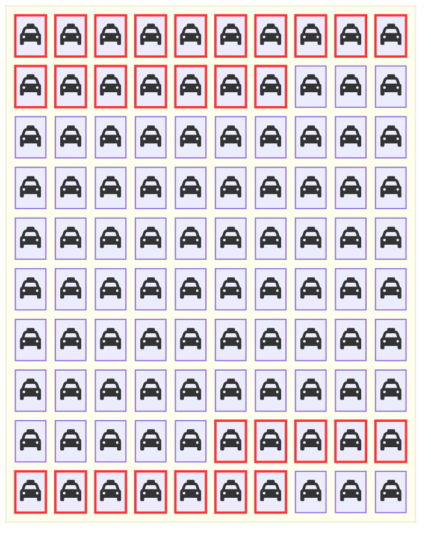

+++
title = "Bayes' Theorem: Updating Beliefs"
weight = 5
+++

## What is Bayes' Theorem?

Imagine you have a **belief** about the world (a hypothesis), and then you **observe** something new (data). Bayes' Theorem tells you how to **update your belief** based on what you observed.

**Example:** You believe most taxis are green. Then you see a taxi that looks blue in the fog. How should you update your belief about which color it really was?

### The Formula

[Bayes' Theorem](./06_glossary.md/#bayes-theorem) (Bayes' rule) provides a way to update our beliefs in one random variable given information about a different random variable. Let's say we have certain hypotheses about how the world works, which we denote as random variable $H$. Further, we have senses that provide us information. Let's encode the information that we might get from our senses as $D$ (maybe an image from our eyes) and we currently observe $d$ (maybe a picture of tonkatsu).

Bayes Theorem tells us to update our beliefs in hypothesis $h$ being the way the world works after learning $D=d$ in the following manner:

$$P(H=h \mid D = d) = \frac{P(D=d\mid H=h) P(H=h)}{P(D=d)}$$

where:
- $P(H=h \mid D=d)$ is called the **posterior** — our updated belief after seeing the data
- $P(D=d \mid H=h)$ is called the **likelihood** — the probability of observing $d$ given $h$ is the true hypothesis for how the world works
- $P(H=h)$ is called the **prior** — how likely it is that $h$ is the way the world works before seeing any data
- $P(D=d)$ is called the **evidence** or **marginal likelihood** — the total probability of observing $d$ across all hypotheses

{}
- **Prior** = What you believed before seeing data
- **Likelihood** = How well the data fits each hypothesis
- **Evidence** = How surprising is this data overall?
- **Posterior** = What you should believe after seeing data

**The key insight:** Strong evidence (high likelihood) can overcome weak priors, but extraordinary claims still require extraordinary evidence!
{}

We have all the information to prove this! Feel free to skip to the next subsection if you don't care about proofs.

## Proving Bayes' rule

Using the [other definition of conditional probability](./06_glossary.md/#the-other-definition-of-conditional-probability), we know that $P(H \mid D) = \frac{P(H,D)}{P(D)}$. If we multiply both sides of the equation by $P(D)$, we get $P(H,D) = P(H \mid D) P(D)$. We can do the same thing but for the opposite way of conditioning (the joint probability can be written in either order and it is the same as it is the common elements of two sets which is the same no matter which order you consider the two sets), so $P(D \mid H) = \frac{P(H,D)}{P(H)}$. We can solve for $P(H,D)$ in a similar manner: multiply both sides of the equation by $P(H)$ and we get $P(H,D) = P(D \mid H) P(H)$. Putting these together, we can prove Bayes' rule:

$$P(H \mid D) P(D) = P(H,D) = P(D \mid H) P(H)$$
$$\Rightarrow P(H \mid D) = \frac{P(H,D)}{P(D)} = \frac{P(D \mid H) P(H)}{P(D)}$$

{}
Don't worry if this felt abstract. The taxicab problem below will make it concrete!
{}

## The Taxicab Problem

In Chibany's hometown, there are two taxi companies: the Green {} and the Blue {}. All Green company's taxis are painted green {} and all the Blue company's taxis are painted blue {}.

85% of the town's taxis work for the Green {} company. So 15% of the town's taxis work for the Blue {} company.

Late one foggy evening, Chibany saw a cab perform a hit-and-run (hit another car and leave without providing any information). Chibany saw a Blue {} taxi!

Chibany is an outstanding citizen and so he goes to the police with this information. The police know it was foggy and dark, so it's possible Chibany might not have seen the taxi's color correctly. They test Chibany several times and find that Chibany reports the correct taxi color 80% of the time!

Taking all of this information into account, how likely do you think it is that the cab involved in the hit-and-run was a Blue taxi {}?

{} The correct answer is **41%**, but most people think it is closer to 60-80%!{}

This is known as the Taxicab Problem (Kahneman and Tversky, 1972; Bar-Hillel, 1980).

{}
Most people focus on Chibany's 80% accuracy and ignore the base rate (85% green taxis). This is a classic cognitive bias called **base-rate neglect**.

The key insight: Even with pretty good accuracy (80%), if something is rare (15% blue taxis), evidence for it isn't as strong as it seems!
{}

A note: Kahneman and Tversky (and others) use this example (and others) to argue that people are not Bayesian at all! There are a number of replies through the years and it is an ongoing debate. Joe loves discussing it. If interested, please reach out and he would be more than happy to discuss it more.

### Taxicab Solution 1: The Set-Based Perspective

One way to solve this is to use the outcome space perspective! Let us assume there are 100 taxis in Chibany's hometown. That means the set of possibilities $\Omega$ has 85 individual Green taxis {} and 15 individual Blue taxis {}.

Now we can make the outcome space include the taxi color and whether Chibany identifies the taxi as Blue in foggy nighttime conditions. As Chibany correctly identifies 80% of the Blue taxis as Blue, ($15 \times 0.80=12$), this means 12 of the Blue taxis are identified as Blue and ($15 \times 0.2 = 3$) 3 are incorrectly identified as Green. As Chibany *incorrectly* identifies 20% of the Green taxis as Blue, this means ($85 \times 0.2 = 17$) 17 of the Green taxis are identified as Blue and ($85 \times 0.8=68$) 68 are *correctly* identified as Green.

The brightly colored taxis that are outlined in red are those that Chibany reports as Blue in the difficult viewing conditions. We can already see there are more Green {} taxis than Blue {}, so it is still more probable that the taxi involved in the hit-and-run was Green. We can get the exact probability that it was a Blue taxi {} by the same counting rule as before. There are 12 Blue {} taxis and 17 Green {} taxis identified as blue. So, the probability that it was a blue taxi given Chibany reports it as Blue is $12/(12+17)=12/29 \approx 0.41$.

{}
The diagram makes the answer obvious! Even though Chibany is 80% accurate:
- **12 truly blue taxis** are reported as blue
- **17 actually green taxis** are reported as blue

There are more false positives than true positives because green taxis are so common!
{}

### Taxicab Solution 2: Using Bayes' Formula

We can also solve this **without counting** in a sample space by following the rules of probability theory as described before. This is powerful when counting becomes impractical (imagine 1 million taxis!).

Let $X$ be the actual color of the taxi involved in the hit-and-run and $W$ be the color reported by Chibany ("what they witness"). Based on the percentage of Blue {} and Green {} taxis in the city, we know that $P(X=G) = 0.85$ and $P(X=B)=0.15$. We also know that Chibany is accurate 80% of the time. So, $P(W = B \mid X = B) = 0.8$ and $P(W=G \mid X=G)=0.8$. This also means Chibany is inaccurate 20% of the time: $P(W = B \mid X=G)=0.2$ and $P(W=G \mid X=B)=0.2$.

Chibany said the taxi is Blue and given this, how likely is it that the taxi is Blue? So, we're interested in $P(X=B \mid W=B)$. We can solve this using Bayes' rule and the sum rule.

$$P(X=B \mid W=B) = \frac{P(W =B \mid X=B) P(X=B)}{P(W=B)}$$

$$P(X=B \mid W=B) = \frac{P(W =B \mid X=B) P(X=B)}{\sum_c{P(W=B,X=c)}}$$

$$P(X=B \mid W=B) = \frac{P(W =B \mid X=B) P(X=B)}{\sum_c{P(W=B \mid X=c)P(X=c)}}$$

$$P(X=B \mid W=B) = \frac{P(W =B \mid X=B) P(X=B)}{P(W=B \mid X=B)P(X=B) + P(W=B \mid X=G)P(X=G)}$$

$$P(X=B \mid W=B) = \frac{0.8 \times 0.15 }{0.8 \times 0.15 + 0.2 \times 0.85} = \frac{0.12}{0.12+0.17} = \frac{0.12}{0.29} \approx 0.41$$

{}
Let's identify each component:

**Numerator (likelihood × prior):**
- Likelihood: $P(W=B \mid X=B) = 0.8$ — "If it's blue, I'll probably say blue"
- Prior: $P(X=B) = 0.15$ — "Blue taxis are rare"
- Product: $0.8 \times 0.15 = 0.12$

**Denominator (total evidence):**
- Blue AND reported blue: $0.8 \times 0.15 = 0.12$
- Green BUT reported blue: $0.2 \times 0.85 = 0.17$
- Total: $0.12 + 0.17 = 0.29$

**Posterior:** $\frac{0.12}{0.29} \approx 0.41$ — Only 41% chance it's actually blue!
{}

### Why Learn the Set-Based Perspective to Probability Theory?

If we can solve probability problems via symbol manipulation, why learn the set-based perspective to probability theory?

Here are some reasons:

1. **Scales to computation**: As variables become more complex, explicitly solving problems becomes infeasible. Thinking through how to count is a strong starting point for a [generative process](./06_glossary.md/#generative-process) perspective, which discusses how outcomes are produced according to computer programs with random choices. These define probabilistic models! [Probabilistic computing](./06_glossary.md/#probabilistic-computing) frameworks are programming languages for specifying probabilistic models and built to calculate different probabilities according to this model in an efficient manner. We will build to exploring how to do this over the next few tutorials.

2. **Clarity on joint vs. conditional**: Many probability novices find the distinction between joint and conditional probabilities confusing and unintuitive. From the set-based perspective, their difference is clear. Joint probabilities count outcomes where multiple events occur simultaneously. Conditional probabilities change the outcome space to be whatever is consistent with the conditioned information and then count in that new space.

3. **Forces representation thinking**: It requires you to think about how events and outcomes are represented. This can be obscured at times when thinking about probabilities from the rule-based perspective.

4. **Formal equivalence**: The set-based and formula-based approaches are formally equivalent — they always give the same answer.

5. **It's more intuitive**: For many people (including this tutorial's author!), visualizing and counting feels more natural than manipulating symbols.

6. **Connects combinatorics and probability**: It makes the deep connection between counting and probability explicit.

7. **It makes Chibany happy**: And that's what really matters!

### Transfer additional practice questions

* One of your friends recently became sick. Concerned about them, you go with them to the doctor. The doctor notes that your friend may have contracted *Kyoto Syndrome*, which is a rare illness. Left untreated, someone with Kyoto Syndrome experiences distress when they leave Kyoto.

5 in 100 people are afflicted with *Kyoto Syndrome*. 

To determine whether your friend has Kyoto Syndrome, the doctor has your friend drink some Matcha from Kyoto. 

*9 in 10 people afflicted with Kyoto Syndrome* drool for 20 minutes after drinking Matcha from Kyoto. 

Only *5 in 10 people not afflicted by Kyoto Syndrome* drool for 20 minutes after drinking Matcha from Kyoto.

While visiting Kyoto, you go with your friend to the doctor's office. Your friend drinks Matcha from Kyoto and drools from the mouth for 20 minutes. 

Given this, what is the probability that they have *Kyoto Syndrome*?

{}

**Step 1: Identify what we know**

Let $K$ represent having Kyoto Syndrome, and $D$ represent drooling after drinking Matcha.

- **Prior:** $P(K) = 0.05$ (5% of people have Kyoto Syndrome)
- **Likelihood:** $P(D \mid K) = 0.9$ (90% of people with KS drool)
- **False positive rate:** $P(D \mid \neg K) = 0.5$ (50% of people without KS also drool)

We want to find: $P(K \mid D)$ — the probability your friend has KS given that they drooled.

**Step 2: Apply Bayes' Rule**

$$P(K \mid D) = \frac{P(D \mid K) P(K)}{P(D)}$$

**Step 3: Calculate the denominator (total evidence)**

The denominator needs to account for ALL ways drooling can happen:

$$P(D) = P(D \mid K)P(K) + P(D \mid \neg K)P(\neg K)$$

$$P(D) = (0.9)(0.05) + (0.5)(0.95)$$

$$P(D) = 0.045 + 0.475 = 0.52$$

**Step 4: Calculate the posterior**

$$P(K \mid D) = \frac{(0.9)(0.05)}{0.52} = \frac{0.045}{0.52} \approx 0.087 \approx 8.7\%$$

{}
Even though the test is 90% accurate for detecting Kyoto Syndrome, there's only an **8.7% chance** your friend actually has it!

**Why?** Because Kyoto Syndrome is rare (5%) and the test has a high false positive rate (50% of healthy people drool). This means:

- **True positives:** About 4.5 people out of 100 (people with KS who drool)
- **False positives:** About 47.5 people out of 100 (people without KS who drool)

The false positives massively outnumber the true positives! This is base-rate neglect in action.
{}

**The Set-Based Perspective:**

Imagine 100 people are tested:
- 5 have Kyoto Syndrome → 4.5 of them drool (90%)
- 95 don't have Kyoto Syndrome → 47.5 of them drool (50%)
- **Total drooling:** 4.5 + 47.5 = 52 people

Of the 52 people who drool, only 4.5 actually have KS: $\frac{4.5}{52} \approx 8.7\%$

{}

* Example with organic fruit and made at a local place?

---

## What We've Learned

In this chapter, we tackled one of the most important tools in probability:

- **Bayes' Theorem** How to update beliefs with new evidence
- **The taxicab problem** Why base rates matter
- **Two solution methods** Visualization vs. formula
- **Base-rate neglect** A common reasoning error
- **Why set-based thinking helps** Making abstract concepts concrete

You now have all the core tools of probability theory! The next chapter summarizes key definitions, and then you'll be ready for advanced topics.

---

|[← Previous: Conditional Probability](./04_conditional.md) | [Next: Glossary →](./06_glossary.md)|
| :--- | ---: |
