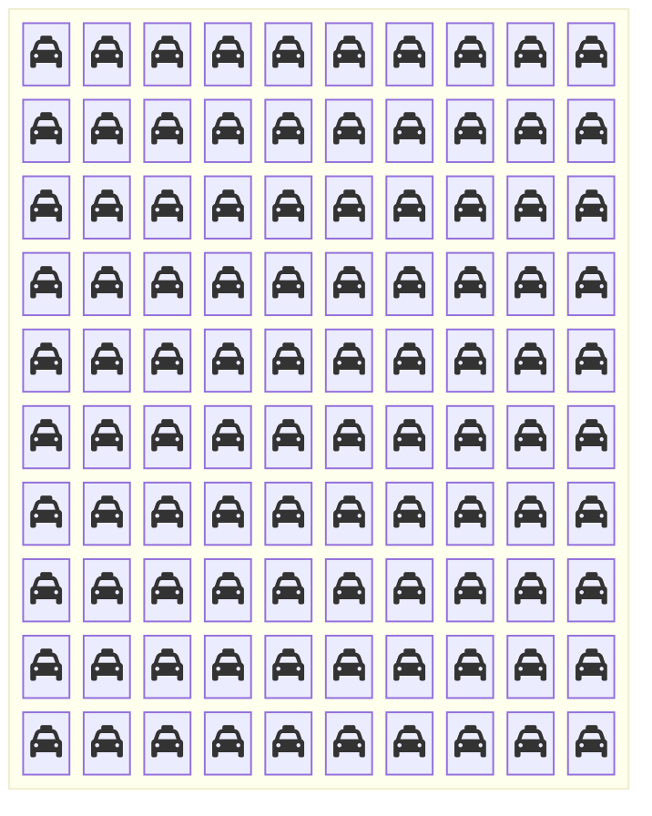
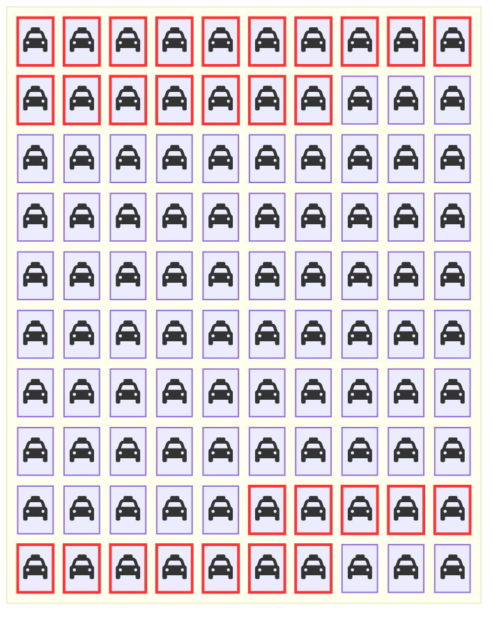

+++
title = "Bayes' Theorem or Bayes' Rule"
weight = 5
+++

[Bayes' Theorem](./06_glossary.md/#bayes-theorem) (Bayes' rule) provides a way to update our beliefs in one random variable given information about a different random variable. Let's say we have certain hypotheses about how the world works, which we denote as random variable $H$. Further, we have senses that provide us information. Let's encode the information that we might get from our senses as $D$ (maybe an image from our eyes) and we currently observe $d$ (maybe a picture of tonkatsu).

Bayes Theorem tells us to update our beliefs in hypothesis $h$ being the way the world works after learning $D=d$ in the following manner:

$P(H=h \mid D = d) = \frac{P(D=d\mid H=h) P(H=h)}{P(D=d)}$

where $P(D=d \mid H=h)$ is called the *likelihood*, whic h is the probability of observing $d$ given $h$ is the true hypothesis for how the world works, $P(H=h)$ is called the *prior*, which tells us how likely it is that $h$ is the way the world works 

We have all the information to prove this! Feel free to skip to the next subsection if you don't care about proofs.

## Proving Bayes' rule

Using the [other definition of conditional probability](./06_glossary.md/#the-other-definition-of-conditional-probability), we know that $P(H \mid D) = \frac{P(H,D)}{P(D)}$. If we multiply both sides of the equation by $P(D)$, we get $P(H,D) = P(H \mid D) P(D)$. We can do the same thing but for the opposite way of conditioning (the joint probability can be written in either order and it is the same as it is the common elements of two sets which is the same no matter which order you consider the two sets), so $P(D \mid H) = \frac{P(H,D)}{P(H)}$. We can can solve for $P(H,D)$ in a similar manner: multiply both sides of the equation by $P(H)$ and we get $P(H,D) = P(D \mid H) P(H)$. Putting these together, we can prove Bayes' rule:

$P(H \mid D) P(D) = P(H,D) = P(D \mid H) P(H)$
$\Rightarrow P(H \mid D) = \frac{P(H,D)}{P(D)} = \frac{P(D \mid H) P(H)}{P(D)}$

## The Taxicab Problem 
**TODO: Add picture with chibany seeing a hit and run with a taxi with fog/smoke**

In Chibany's hometown, there are two taxi companies: the Green {} and the Blue {}. All Green company's taxis are painted green {} and all the Blue company's taxis are painted blue {}. 

85\% of the town's taxis work for the Green {} company. So 15\% fo the town's taxis work for the {} company. 

Late one foggy evening, Chibany saw a cab perform a hit-and-run (hit another car and leave without providing any information). Chibany saw a {} taxi! 

Chibany is an outstanding citizen and so they go to the police with this information. The police know it was foggy and dark, so it's possible Chibany might not have seen the taxi's color correctly. They test Chibany several times and find that Chibany reports the correct taxi color 80\% of the time!

Taking all of this information into account, how likely do you think it is that the cab involved in the hit-and-run was a Blue taxi {}?

{} The correct answer is 41\%, but most people think it is closer to 60-80\%!{}

This is known as the Taxicab Problem (Kahneman and Tversky, 1972; Bar-Hillel, 1980). 

A note: Kahneman and Tversky (and others) use this example (and others) to argue that people are not Bayesian at all! There are a number of replies through the years and it is an ongoing debate. Joe loves discussing it. If interested, please reach out and he would be more than happy to discuss it more.

### Taxicab Solution 1
One way to solve this is to use the outcome space perspective! Let us assume there are 100 taxis in Chibany's hometown. That means the set of possibilities $\Omega$ has 85 individual Green taxis {} and 15 individual Blue taxis {}

Now I can make the outcome space include the taxi color and whether Chibany identifies the taxi as Blue in foggy nighttime conditions. As Chibany correctly identifies 80\% of the Blue taxis as Blue, ($15 \times 0.80=12$). This means 12 of the Blue taxis are identified as Blue and ($15 \times 0.2 = 3$) 3 are incorrectly as Green. As Chibany *incorrectly* identifies 20\% of the Green taxis as Blue. This means ($85 \times 0.2 = 17$) 17 of the Green taxis are identified as Blue and ($85 \times 0.8=68$) 68 are *correctly* identified as Green.  

The brightly colored taxis that are outlined in red are those that Chibany reports as Blue in the difficult viewing conditions. We can already see there are more Green {} taxis tha Blue {}, so it is still more probable that the taxi involved in the hit-and-run was Green. We can get the exact probability that it was a Blue taxi {} by the same counting rule as before. There are 12 {} Blue taxis and 17 {} Green taxis. So, the probability that it was a blue taxi given Chibany reports it as Blue is $12/(12+17)=12/29 \approx 0.41$.

### Taxicab Solution 2
We can also solve this without counting in a sample space following the rules of probability theory as described before. Let $X$ be the actual color of the taxi involved in the hit-and-run and $W$ be the color reported by Chibany. Based on the percentage of Blue {} and Green {} taxis in the city, we know that $P(X=G) = 0.85$ and $P(X=B)=0.15$. We also know that Chibany is accurate 80\% of the time. So, $P(W = B \mid X = B) = 0.8$ and $P(W=G \mid X=G)=0.8$. This also means Chibany is inaccurate 20\% fo the tim$e: $P(W = B \mid X=G)=0.2$ and $P(W=G \mid X=B)=0.2$. 

Chibany said the taxi is Blue and given this, how likely it is that the taxi is Blue. So, we're interested in $P(X=B \mid W=B)$ We can solve this using Bayes' rule and the sum rule.

$P(X=B \mid W=B) = \frac{P(W =B \mid X=B) P(X=B)}{P(W=B)}$

$P(X=B \mid W=B) = \frac{P(W =B \mid X=B) P(X=B)}{\sum_c{P(W=B,X=c)}}$

$P(X=B \mid W=B) = \frac{P(W =B \mid X=B) P(X=B)}{\sum_c{P(W=B \mid X=c)P(X=c)}}$

$P(X=B \mid W=B) = \frac{P(W =B \mid X=B) P(X=B)}{P(W=B \mid X=B)P(X=B) + P(W=B \mid X=G)P(X=G)}$

$P(X=B \mid W=B) = \frac{0.8 \times 0.15 }{0.8 \times 0.15 + 0.2 \times 0.85} = \frac{0.12}{0.12+0.17} = \frac{0.12}{0.29} \approx 0.41$

### Why Learn the Set-Based Perspective to Probability Theory?
If we can solve probability problems via symbol manipulation, why is learning the set-based perspective to probability theory?

Here are some reasons:
1. As variables become more complex, explicitly solving problems becomes infeasible. Thinking through how to count is strong starting point for a [generative process](./06_glossary.md/#generative-process) perspective, which discusses how outcomes are produced according to computer programs with random choices. These define proabilistic models! [Probabilistic computing](./06_glossary.md/#probabilistic-computing) are programming languages for specifying probabilistic models and built to calculate different probabilities according to this model in an efficient manner. We will build to exploring how to do this over the next few tutorials.
2. Many probability novices find the distinction between joint and conditional probabilities confusing and unintuitive. From the set-based perspective, their difference is clear. Joint probabilities count in the outcome space where multiple possible outcomes are being simultaneously. Conditional probabilities change the outcome space to be whatever is consistent with the conditioned information and then count in that new space.
3. It forces you to think about how events and outcomes are represented. This can be obsfucated at times when thinking about probabilities from the rule-based perspective. 
4. They are formally equivalent. 
5. It is fun.
6. It connects combinatorics and probability theory.
7. It makes Chibany happy.

### Transfer additional practice questions
* Example with rare disease and not too diagnostic test.

* Example with organic fruit and made at a local place 