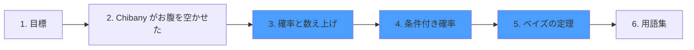

+++
date = "2026-06-14"
title = "確率への物語的入門"
weight = 1
toc = true
+++

## ようこそ！

このチュートリアルは、[Chibany](https://admission.chibatech.ac.jp/about/chibany/)（下の写真）の物語を通じて確率論を学びます。Chibany はとんかつが大好きで、毎日の食事でとんかつが出る確率を理解したいと思っています。彼は大学の学食に入り浸っており、学生たちは試験でいい結果が出るようにと願いを込めて、お弁当箱に入れた食事を差し入れてくれます。

その過程で、**集合**を使って確率を考える方法を学びます。この視点は複雑な概念を直感的にし、確率的プログラミングや高度な応用への準備を整えてくれます。

### 対象読者

このチュートリアルは**デザイナーや社会科学者**を念頭に置いて作られました。しかし、確率・機械学習・ベイズ的思考を親しみやすい形で学びたい**すべての人**に向けています。

**数学の予備知識は不要**です。必要なのは好奇心と丁寧に考えようとする意欲だけです！

### 学べること

Chibany の旅をたどることで、次のことを発見できます：

- **確率を「可能性を数える」こと として考える方法**：抽象的な概念を具体的にする
- **集合と確率のつながり**：確率的プログラミングへと一般化できる基礎
- **条件付き確率・独立性・ベイズの定理**：確率的推論の核となるツール
- **よくある誤解を避ける方法**：専門家でもつまずく古典的なパズルを通じて
- **確率的コンピューティングの基礎**：コードベースのアプローチを理解するための思考モデル

### 学習の道筋

確率の基礎を学ぶ旅はこのようになっています：

**中核概念**（青色）：確率的直感を養う３つの基礎的な章。

### なぜ集合ベースの視点なのか？

多くの確率の授業では、公式やルールに一気に飛び込みます。このチュートリアルは別のアプローチをとります：**確率は高度な数え上げ**です。

Chibany が「とんかつが出る確率は？」と尋ねるとき、彼は実際にはこう問いかけています：
1. すべての**可能性**は何か？（結果空間）
2. どの可能性が**とんかつを含む**か？（事象）
3. その**比率**は何か？（数えてみよう！）

この視点により、条件付き確率・ベイズの定理・複雑なモデルさえも、謎めいたものではなく自然に感じられます。

### 進捗に関する注記

このチュートリアルは現在、計画されたシリーズの一部として**草稿の段階**にあります。フィードバックを歓迎し、感謝いたします！概念がわかりにくい部分や改善のご提案があれば、ぜひご連絡ください。

---

## 始める準備はできていますか？

Chibany に会い、確率について考え始めましょう！

---

[JPPCA](https://jpcca.org/) のご支援に特別の感謝を申し上げます。

| [次へ：学べること →](./01_goals.md)
