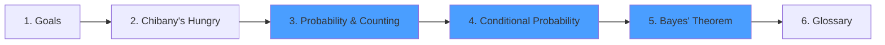

+++
date = "2025-11-26"
title = "A Narrative Introduction to Probability"
weight = 1
toc = true
+++

## Welcome!

This tutorial teaches probability theory through the story of [Chibany](https://admission.chibatech.ac.jp/about/chibany/) (pictured below) who loves tonkatsu and wants to understand how likely they will get it in his daily meals. They hang out at the University cafeteria. Students offer him meals in bento boxes in the hopes that it will help them on their upcoming tests.

Along the way, you'll learn to think about probability using **sets**: a perspective that makes complex concepts intuitive and prepares you for probabilistic programming and advanced applications.

### Who is this for?

This tutorial was created with **designers and social scientists** in mind. But it is for **anyone** wanting to learn about probability, machine learning, and Bayesian thinking in an approachable manner.

**No prior math background required**: just curiosity and willingness to think carefully!

### What you'll learn

By following Chibany's journey, you'll discover:

- **How to think about probability as "counting possibilities"**: making abstract concepts concrete
- **The connection between sets and probabilities**: a foundation that generalizes to probabilistic programming
- **Conditional probability, independence, and Bayes' rule**: the core tools of probabilistic reasoning
- **How to avoid common misconceptions**: through classic puzzles that trip up even experts
- **The foundation for probabilistic computing**: the mental models that make code-based approaches make sense

### Learning Path

Here's your journey through probability fundamentals:

**Core Concepts** (blue): The three foundational chapters that build your probability intuition.

### Why the set-based perspective?

Most probability courses jump straight into formulas and rules. This tutorial takes a different approach: **probability is fancy counting**.

When Chibany asks "What's the probability of getting tonkatsu?", he's really asking:
1. What are all the **possibilities**? (the outcome space)
2. Which possibilities **include tonkatsu**? (the event)
3. What's the **ratio**? (count them!)

This perspective makes conditional probability, Bayes' rule, and even complex models feel natural instead of mysterious.

### A Note on Progress

This tutorial is currently in **draft form** as part of a planned series. Your feedback is welcome and appreciated! If you find concepts unclear or have suggestions for improvement, please reach out.

---

## Ready to begin?

Let's meet Chibany and start thinking about probability!

---

Special thanks to [JPPCA](https://jpcca.org/) for their generous support of this tutorial. 

[acknowledgements](./07_ack.md) | [Next: What You'll Learn →](./01_goals.md)
