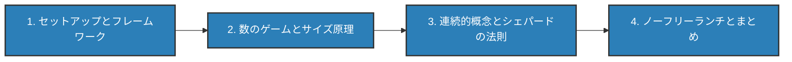

+++
date = "2026-06-14"
title = "ベイズ的汎化"
weight = 7
toc = true
+++

## ベイズ的汎化

少数の例から*概念*をどのように学ぶのでしょうか？ある隠れたルールに当てはまる3つの数を見たとき、あるいは金色のシールが貼られたいくつかのお弁当を見たとき、人はどういうわけか*他のどのもの*がそのルールに当てはまるかを知っています。本章では、あなたがすでに知っているベイズの定理が、一つの転換を行うだけで人間の汎化モデルになることを示します：**仮説は集合である**、という転換です。

{}
付属のノートブックでは、数のゲームとサイズ原理をインタラクティブに構築できます：
**📓 [Colab で開く: `07_generalization.ipynb`](https://colab.research.google.com/github/josephausterweil/probintro/blob/main/notebooks/07_generalization.ipynb)**
{}

唯一の新しいアイデアは、推論の対象となる未知量がもはや数値（平均 $\mu$）や二値的事実（タクシーは青いか？）ではなく、**集合**——ある性質を共有するものを定めるルール——だということです。それ以外のすべて（ベイズの定理、事後分布、予測分布）はすでに手元にある道具です。

本章は長いため、4つのパートに分かれています。順番に進んでください：

{}
1. **[セットアップとフレームワーク](setup-and-framework/)** — 金色のシールの話、「どの事象か？」から「どの集合か？」へのキーとなる転換、目標となるシェパードの法則、そしてフレームワークの命名（仮説空間、事前分布、尤度、事後分布；メンバーシップ行列）。
2. **[数のゲームとサイズ原理](number-game-size-principle/)** — 事後分布による加重投票としての汎化；弱いサンプリングと強いサンプリング；サイズ原理；そしてテネンバウムの数のゲーム（1つの例で段階的な汎化が生まれ、3つの例でルールに収束する）。
3. **[連続的概念とシェパードの法則](continuous-and-shepards-law/)** — 矩形ゲーム：*無限に多く*の区間仮説に対して同じフレームワークを適用すると、シェパードの汎化の指数法則がモデルから自然に導かれる。
4. **[ノーフリーランチとまとめ](no-free-lunch-and-summary/)** — 何も仮定しない学習者は何も学べない理由、すなわち事前分布が不可避であること；章のまとめ；練習問題；そして参考文献。
{}

{}
本章における**仮説**とは**ルール**であり、ルールとは**集合**です——そのルールが「その性質を持つ」と言うものの集合です。「仮説は集合である」を心に留めておけば、残りはすべてそこから導かれます。
{}

[パート1「セットアップとフレームワーク」から始める →](setup-and-framework/)
