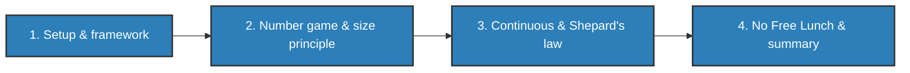

+++
date = "2026-05-31"
title = "Bayesian Generalization"
weight = 7
toc = true
+++

## Bayesian Generalization

How do you learn a *concept* from a handful of examples? You see three numbers that fit a hidden rule — or
a few bentos with a golden sticker — and somehow you know which *other* things fit too. This chapter shows
that the same Bayes' rule you already know becomes a model of human generalization once you make a single
shift: **a hypothesis is a set**.

The one new idea is that the unknown you reason about is no longer a number (a mean $\mu$) or a yes/no fact
(is the taxi blue?), but a **set** — a rule about which things share a property. Everything else — Bayes' rule,
the posterior, the predictive distribution — is machinery you already have.

This chapter is long, so it's split into four parts. Work through them in order:

{}
1. **[Setup & the Framework](setup-and-framework/)** — the golden-sticker story, the keystone shift from
   "which event?" to "which set?", Shepard's law as the target to aim for, and the framework named (hypothesis
   space, prior, likelihood, posterior; the membership matrix).
2. **[The Number Game & the Size Principle](number-game-size-principle/)** — generalization as a
   posterior-weighted vote; weak vs. strong sampling; the size principle; and Tenenbaum's number game, where
   one example gives graded generalization and three snap to a rule.
3. **[Continuous Concepts & Shepard's Law](continuous-and-shepards-law/)** — the rectangle game: the same
   framework over *infinitely many* interval hypotheses, where Shepard's exponential law of generalization
   emerges from the model rather than being assumed.
4. **[No Free Lunch & Summary](no-free-lunch-and-summary/)** — why a learner that assumes nothing learns
   nothing, so the prior is unavoidable; the chapter summary; practice exercises; and references.
{}

{}
A **hypothesis** in this chapter is a **rule**, and a rule is a **set** — the set of things the rule says have
the property. Hold onto "a hypothesis is a set"; everything else follows from it.
{}

[Start with Part 1: Setup & the Framework →](setup-and-framework/)
