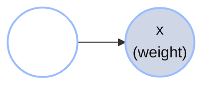
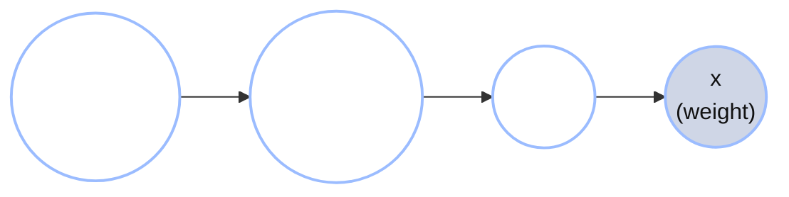
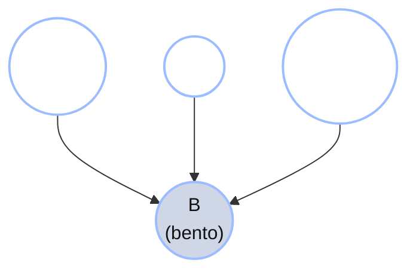

+++
date = "2026-06-14"
title = "ベイジアンネットワーク"
weight = 8
+++

## すでに知っていることを描く

Chibanyは机に座って、[第5章](../05_mixture_models/)のヒストグラム――謎の始まりとなったあのヒストグラム――を見つめている。


この謎が提起したことを思い出そう。重さは**2つの別々の塊**に分かれている――350 g付近の軽い弁当と500 g付近の重い弁当――間には大きな空白のギャップがある。全体の*平均*は444.6 g（赤い破線）で、ちょうどそのギャップに位置しており、実際には存在しない弁当を説明している。[第5章](../05_mixture_models/)はこれを**ガウス混合モデル**で解決した。弁当は2つの隠れたクラスター――軽いものと重いもの――から来ており、新しい弁当に対してChibanyは$P(\text{cluster} \mid \text{weight})$（重さが与えられたときに各クラスターから来た確率）を計算することで、箱を開ける前に中身を推測できる。

しかし今、別のことが気になっている。*自分は実際に何をしたのだろう？* モデルを書き下したとき、重さを「見たもの」として扱い、クラスターを「知りたいもの」として扱った。その描像はどこから来たのか？それには名前があるのか？

ラボメイトのJamalがコーヒーを持ってふらっとやってきて、画面をちらっと見た。

> **Jamal:** 「ああ、ベイジアンネットワーク推論をやってるんだね。」
>
> **Chibany:** 「ベイジアン*ネットワーク*って何？」
>
> **Jamal:** 「ここを見て。説明するよ。ずっと描いてたのに、そう呼んでなかっただけだよ。」

この章はその会話だ。第5章の混合モデルが実はずっと小さな**グラフ**だったことを発見し、そのグラフに正確な意味を与え、同じ図的言語が多くの相互作用する原因を持つモデルにまでスケールアップするさまを見ていく。

---

## 謎の弁当をグラフとして描く

混合モデルの生成ストーリーを思い出そう。各弁当について、2つのことが順番に起こる。

1. 自然が**クラスター** $z$を選ぶ――軽い（ハンバーグ）か重い（トンカツ）か。
2. クラスターが与えられると、自然はそのクラスターのガウス分布から**重さ** $x$を引き出す。

これを確率量ごとに1つのノードを持ち、「直接影響する」という矢印を持つ図として描くことができる。



矢印$z \to x$が言うのは：*重さはクラスターに依存する*ということだ。これがモデル全体を描いたものだ。これらのグラフの一般的な慣例に従って、**シェーディングされた**ノード（$x$、重さ）はChibanyが**観測する**ものであり、**シェーディングされていない**ノード（$z$、クラスター）は**隠れた**ものだ。（次の2章を通じて、このシェーディング＝観測済みという慣例を使い続ける。）

この小さな図が**ベイジアンネットワーク**（略して**ベイズネット**、**有向グラフィカルモデル**とも呼ばれる）だ。図そのもの――ノードと矢印だけ――が**DAG**（*有向非巡回グラフ*；この略語は章の終わりで解説する）だ。ベイズネットはDAGと各ノードに付随する確率規則を合わせたものだ。各ノードは確率変数であり、各矢印は直接影響する変数へ向かって指している。それだけだ。Chibanyは名前を知らずにずっとこれを描いていたのだ。

{}
同じものを3つの等価な記述で表すことができる。

- **ストーリー：**「クラスターを選び、そこから重さを引き出す。」
- **数学：** $P(z, x) = P(z) P(x \mid z)$。
- **グラフ：** $z \to x$。

ベイズネットの要点は、*グラフ*と*数学*が同じオブジェクトの2つの見方であり、グラフの方が考えやすいことが多いということだ。
{}

---

## 「親」とは何か？

グラフについて正確に話すために、1つの語彙が必要だ。

ノード$X$の**親**、$\text{Pa}(X)$と書く、は$X$に向かって矢印が指している変数――その値が$X$の分布を直接決定する変数――だ。

謎の弁当グラフでは：

- $\text{Pa}(z) = \varnothing$（$z$に向かって指すものは何もない――親がない；クラスターは最初に、何の根拠もなく選ばれる）。
- $\text{Pa}(x) = \{z\}$（重さの分布はクラスターによって設定される）。

$z$のような親を持たないノードは**ルート**だ。その分布は単なる事前分布――$P(z)$――であり、上流には何もない。親を持つノードは**条件付き**分布を得る：$x$は裸の$P(x)$ではなく$P(x \mid z)$によって記述され、$z$の各値に対して1つのガウス分布がある。

「親」という言葉がこの主題全体の要となっている。各ノードは結合分布の中にちょうど1つの因子を持ち――*自身、親が与えられた条件での*――グラフはただ誰が誰に依存するかの地図だ。

---

## 因数分解規則

グラフを数学に変換する規則を示す。変数$X_1, \ldots, X_n$上の任意のベイズネットについて：

$$P(X_1, \ldots, X_n) = \prod_{i=1}^{n} P\bigl(X_i \mid \text{Pa}(X_i)\bigr).$$

言葉で言えば：**結合分布はノードごとに1つの因子の積であり、各ノードはその親が与えられた条件での分布だ**。グラフから機械的に読み取ることができる。ノードをたどり、それぞれについて$P(\text{ノード} \mid \text{その親})$を書き下し、全部掛け合わせる。

謎の弁当グラフ$z \to x$では、2つの因子は$P(z)$（ルート、親なし）と$P(x \mid z)$なので、

$$P(z, x) = P(z) P(x \mid z).$$

これは第5章で使った数式そのものだ――しかし今はそれがどこから来るかを*見る*ことができる。矢印$z \to x$が、2番目の因子が「$x$ **given** $z$」であり単なる「$x$」ではない理由だ。（これを*マルコフ因数分解*とはまだ呼ばない――その名前はこの章の終わりに、私たちが十分な基礎を築いた後で待っている。）

---

## ハイパープライアーを追加する

これまで、クラスターの事前分布$P(z)$は固定された数値だった――例えば$P(z = \text{heavy}) = 0.5$。しかしChibanyが分割を知らず、それを*学習*したいとしたらどうなるか？その場合、混合重み$\pi$（重いクラスターの確率）も確率変数となり、それ自身の事前分布$P(\pi \mid \alpha)$を持つ。



因数分解に1つの因子が加わる。

$$P(\alpha, \pi, z, x) = P(\pi \mid \alpha) P(z \mid \pi) P(x \mid z).$$

何が変わったかに注目しよう：$z$に親（$\pi$）ができたので、その因子は条件付きになった、$P(z \mid \pi)$。そして$\pi$自身も親（$\alpha$）を得た。グラフは上方向に成長し、以前持っていたものの上に不確実性の*レベル*を追加した。

この事前分布の積み重ねは、[第12章](../12_hierarchical_bayes/)が**階層ベイズ**と呼ぶもの――*事前分布そのものを学習する*――に他ならない。この章のレンズを通して見れば、階層ベイズはただの余分なレイヤーを上に持つベイズネットだ。同じ機構で、より高いグラフとして描かれる。

---

## 複数親ネットワーク：Chibanyの弁当、再考

これまで各ノードは最大1つの親を持っていたので、グラフはチェーンだった。しかし現実の世界はより複雑であり、図的言語はその複雑さをうまく扱う。

もう1人のラボメイトAlyssaが聞いていた。身を乗り出してこう言う：

> **Alyssa:** 「正直、あなたの弁当の重さはおそらく1つの隠れたクラスター以上のものに依存しているよ。食堂のメニューは**曜日**によってローテーションする――木曜日はトンカツの日。どの**食堂**かにも依存する。**暑い日**は誰もが軽い箱を取る。」

Alyssaは1つの効果に向かって全て流れ込む3つの原因を説明している。後で数式に驚かないよう、単語を名付けながら変数を命名しよう：

- **天気** ($W$)：寒いか暑いか。
- **曜日** ($D$)：週初めか週末か。
- **食堂** ($R$)：食堂Aか食堂Bか。
- **弁当** ($B$)：料理――ハンバーグかトンカツか。

ストーリー：天気、曜日、食堂はそれぞれ独立して決まり、*合わせて*弁当がトンカツである可能性を決定する。グラフとして、3本の矢印が$B$に向かって収束する：



今や$\text{Pa}(B) = \{W, D, R\}$であり、$W$、$D$、$R$はすべてルートだ。因数分解は図から直接読み取れる：

$$P(W, D, R, B) = P(W) P(D) P(R) P(B \mid W, D, R).$$

3つの独立した事前分布と、それらを弁当に繋ぐ1つの大きな条件付き分布。条件付き$P(B \mid W, D, R)$は**条件付き確率表**（CPT）だ：親の$2 \times 2 \times 2 = 8$通りの組み合わせそれぞれに対するトンカツ確率がある。

{}
以下の数式で$W$、$D$、$R$、$B$が使われる場合、それは上で紹介した天気、曜日、食堂、弁当を意味する。
{}

---

## なぜわざわざ？パラメータ数の議論

この描画全体の見返りがここにある。Chibanyが構造を無視して、完全な結合分布$P(W, D, R, B)$を1つの巨大なテーブルとして書き下そうとしたとする。4つの2値変数では$2^4 = 16$通りの可能な組み合わせがあり、それらに対する確率分布には$16 - 1 = 15$個の自由な数値が必要だ（「$-1$」は確率の和が1になる必要があり、最後の1つは決まるから）。

では*因数分解された*ベイズネットが必要とするものを数えてみよう：

| 因子 | 必要な数値 |
|---|---:|
| $P(W)$ | 1 |
| $P(D)$ | 1 |
| $P(R)$ | 1 |
| $P(B \mid W, D, R)$ | 8 |
| **合計** | **11** |

15ではなく11。4つのノードでは控えめな節約だが――しかしこの節約は**指数的な節約が潜んでいる**。10個の2値変数では、完全な結合分布は$2^{10} - 1 = 1023$個の数値を必要とする；各ノードが最大2つの親を持つベイズネットはわずか数十個しか必要としない。グラフは実際に書き下し、推定し、推論できるモデルをもたらす。*構造は圧縮だ。*

{}
私たちはストーリーから矢印を*与えられた*（「天気は弁当に影響する」）。自然な次の問いは：データだけから*グラフを学習*できるか？それが**構造学習**の問題であり、本質的に難しい――観測だけでは矢印がどちら向きであるべきかを決めることができないことが多い（[第10章](../10_causal_bayes_nets/)でその理由を正確に見る）。今のところ、第3章でガウス尤度を選んだのと同じように、構造はモデリングの仮定の一部として受け取る。
{}

---

## やったことに名前をつける：マルコフ因数分解

今こそその名前を使う資格がある。定義を正確にしよう。

**有向非巡回グラフ（DAG）**は、ノード$V$が変数であり、エッジ$E$が矢印であるグラフ$G = (V, E)$で、1つの規則がある：**有向サイクルがない**――矢印を辿って出発点に戻ることは決してできない。（非巡回性があることで、循環推論なしに「親」と「祖先」を語ることができ、生成ストーリー――各ノードを親の後にサンプリングする――が well-defined となる。）

私たちがずっと使ってきた規則に今その正式な名前がつく、**マルコフ因数分解**：

$$P(X_1, \ldots, X_n) = \prod_{i=1}^{n} P\bigl(X_i \mid \text{Pa}(X_i)\bigr).$$

グラフ$G$と分布$P$は、$P$が$G$の親に従ってこのように因数分解されるときに合致する；私たちは$G$が$P$の**I-マップ**（独立性マップ）であると言う。直感的には、I-マップは依存関係について*嘘をつかない*グラフだ――グラフが主張するすべての独立性は$P$において実際に成立する。ここではその1文より深くは掘り下げない；[第9章](../09_conditional_independence/)がグラフからそれらの独立性の主張を読み取ることに完全に充てられている。

---

## GenJAX 実装

これらのネットワークを実行可能なモデルとして構築する時が来た。ベイズネットは生成関数だ：各`@gen`で修飾された関数はノードを配置し、各確率的選択に`@ "..."`で名前をつけ、矢印が示すとおり親が子に流れ込むようにする。上の3つのグラフに対応する3つを構築する。

### 1. ベイズネットとして明示的に描かれた混合モデル

まず、グラフがコードで見えるように書かれた第5章のモデル：1つのクラスターノード`z`、1つの重みノード`x`、`z`が`x`に流れ込む。

```python
import jax
import jax.numpy as jnp
import jax.random as jr
from genjax import gen, flip, normal

# Two cluster means, treated as known here so we can focus on the graph structure.
MU_LIGHT = 350.0   # hamburger cluster
MU_HEAVY = 500.0   # tonkatsu cluster
SIGMA = 40.0       # wide enough that the clusters overlap — so inference is interesting

@gen
def one_bento():
    # z -> x.  Root node first: pick a cluster (True = heavy/tonkatsu).
    z = flip(0.5) @ "z"
    # Child node: weight depends on the cluster (the arrow z -> x in code).
    mu = jnp.where(z, MU_HEAVY, MU_LIGHT)
    x = normal(mu, SIGMA) @ "x"
    return z, x

# Ancestral sampling: run the story forward once.
key = jr.key(0)
z, x = one_bento.simulate(key, ()).get_retval()
label = "tonkatsu (heavy)" if bool(z) else "hamburger (light)"
print(f"Sampled cluster: {label}")
print(f"Sampled weight:  {float(x):.1f} g")
```

**出力：**
```
Sampled cluster: tonkatsu (heavy)
Sampled weight:  551.8 g
```

このようにモデルを順方向に実行する――親から子へ、矢印が指す方向へ――ことを**祖先サンプリング**と呼ぶ。これはベイズネットでできる最も基本的なことだ：そこから偽のデータを生成する。DAGの非巡回性は、常に必要とされる前に親の準備ができていることを保証するものだ。

### 2. ハイパープライアーを追加する

今度は混合重み$\pi$をベータ事前分布を持つ確率変数にして、グラフに余分なレベル$\alpha \to \pi \to z \to x$を成長させる。

```python
from genjax import beta

# A Beta(2, 2) prior on pi — mild, centered at 0.5. In the graph above we drew a
# single parent "alpha"; concretely that prior is set by Beta's two shape numbers
# (here both 2.0), which together play the role of that one "prior strength" node.
@gen
def one_bento_hierarchical():
    pi = beta(2.0, 2.0) @ "pi"        # mixing weight, now learned
    z = flip(pi) @ "z"               # cluster, given pi
    mu = jnp.where(z, MU_HEAVY, MU_LIGHT)
    x = normal(mu, SIGMA) @ "x"
    return pi, z, x

pi, z, x = one_bento_hierarchical.simulate(jr.key(1), ()).get_retval()
print(f"Sampled mixing weight pi: {float(pi):.2f}")
print(f"Sampled weight:           {float(x):.1f} g")
```

**出力：**
```
Sampled mixing weight pi: 0.37
Sampled weight:           309.5 g
```

各実行では最初に*異なる*$\pi$を引き出し、それを使う。上部でのその余分なランダム性が階層的レイヤーだ――[第12章](../12_hierarchical_bayes/)が完全に展開する同じ構造だ。

### 3. Chibanyの複数親弁当ネットワーク

最後に、4ノードネットワーク$W, D, R \to B$、弁当の条件付き確率表付き。

<!-- validate: tol=0.02 -->
```python
@gen
def chibany_bento_network():
    # Three independent root causes (each True/False).
    weather = flip(0.5) @ "weather"        # True = hot
    day = flip(0.6) @ "day"                # True = late-week (tonkatsu days)
    restaurant = flip(0.7) @ "restaurant"  # True = cafeteria B

    # P(bento = tonkatsu | weather, day, restaurant): the 8-entry CPT,
    # indexed by [weather, day, restaurant]. Hot weather lowers tonkatsu;
    # late-week and cafeteria B raise it.
    cpt = jnp.array([
        # weather = cold
        [[0.5, 0.7],    # day = early: [restA, restB]
         [0.7, 0.9]],   # day = late
        # weather = hot
        [[0.3, 0.5],    # day = early
         [0.5, 0.7]],   # day = late
    ])
    p_tonkatsu = cpt[weather.astype(int), day.astype(int), restaurant.astype(int)]
    bento = flip(p_tonkatsu) @ "bento"     # True = tonkatsu
    return bento

# Estimate the marginal P(bento = tonkatsu) by Monte Carlo: sample many full
# traces and average the bento outcome. (No conditioning yet — just the prior.)
keys = jr.split(jr.key(2), 20000)
bentos = jax.vmap(lambda k: chibany_bento_network.simulate(k, ()).get_retval())(keys)
print(f"P(bento = tonkatsu) ≈ {float(jnp.mean(bentos.astype(float))):.3f}")
```

**出力：**
```
P(bento = tonkatsu) ≈ 0.666
```

その周辺確率――約3分の2のトンカツ――は直接書き下したことは一度もなかった。3つの原因の$2^3 = 8$通りの設定全体を、各設定の確率で重み付けして平均することで*現れた*のだ。このようにサンプリングしてベイズネットを周辺化することは、脊椎の残りの部分で頼りにするワークホースだ：問いを手で計算することが難しい場合、多くの祖先トレースをサンプリングして数える。

### 4. 推論：効果から原因へ

これまで私たちはネットワークを*順方向*にしか実行していなかった――親から子へ、矢印が指す方向へ。しかしChibanyがグラフを描いた全理由は*逆方向*の問いだった：**「重さを観測した；どのクラスターから来たのか？」** これは$P(z \mid x)$――矢印に逆らって進む。

**条件付け**によってこれに答える。観測されたノードをその値に固定し、各順方向サンプルがその観測をどれほどよく説明するかの重みをGenJAXに付けさせる。コードでは、`ChoiceMap.d({...})`が観測したものを記録し、`model.generate(key, constraints, args)`はそれらの選択を固定してモデルを実行し、トレースと重要度の重みを返す――第5章で見た機構そのものだ。

<!-- validate: tol=0.05 -->
```python
from genjax import ChoiceMap

# Chibany weighs a bento: 430 g. Which cluster — light or heavy?
observation = ChoiceMap.d({"x": 430.0})

keys = jr.split(jr.key(3), 8000)
def infer_cluster(k):
    trace, log_weight = one_bento.generate(k, observation, ())
    return trace.get_choices()["z"].astype(float), log_weight

z_samples, log_weights = jax.vmap(infer_cluster)(keys)
weights = jnp.exp(log_weights - jnp.max(log_weights))
weights = weights / jnp.sum(weights)

p_heavy = jnp.sum(z_samples * weights)
print(f"P(cluster = heavy | weight = 430 g) ≈ {float(p_heavy):.3f}")
```

**出力：**
```
P(cluster = heavy | weight = 430 g) ≈ 0.620
```

430 gの弁当は軽いクラスター（350 g）と重いクラスター（500 g）の間に位置し、重いクラスターに少し近い――したがって事後分布は重い側に傾き、約62%だが、真に不確実なままだ。これは第5章が行った推論と同じで、今や*ベイズネットを矢印に逆らって実行する*として見えている。見たものを条件付けして見ていないものへと推論することが次の章の核心だ――そこで**どの**変数にこの逆方向の推論が到達できるかは、グラフの形に完全に依存することを学ぶ。

{}
任意の生成ストーリーを取り、DAGとして描き、その因数分解を読み取り、パラメータを数え、GenJAXで順方向に実行して任意の周辺確率を推定し、観測したものを条件付けして隠れた原因を推論できる。次に、[第9章](../09_conditional_independence/)では、グラフから直接より微妙なことを読み取る方法を学ぶ：*どの変数がどの変数と独立か*――そして自明な答えが逆になる1つの構造（コライダー）と出会う。
{}

---

## 演習

{}
1. **因数分解を読み取る。** DAG $A \to B \to C$に余分な矢印$A \to C$を加えたものを描く。そのマルコフ因数分解を書く。3つの変数すべてが2値の場合、完全な結合分布と比べていくつの数値が必要か？
2. **新しい親。** Chibanyの弁当がまた祝日（$H$）かどうかにも依存し、それが弁当に直接影響するとする。`chibany_bento_network`に4番目のルート原因として$H$を追加する。CPT $P(B \mid W, D, R, H)$には今いくつのエントリがあるか？$P(B = \text{tonkatsu})$を再推定する。
3. **周辺確率と条件付き確率。** `chibany_bento_network`を使って、モンテカルロで$P(B = \text{tonkatsu} \mid \text{weather} = \text{hot})$を推定する（多くのトレースをサンプリングし、暑い天気のものだけを保持し、弁当を平均する）。無条件の$0.666$より高いか低いか？それはCPT（暑い天気はトンカツ確率を下げる）と一致するか？
{}

コンパニオンノートブックでこれらをインタラクティブに解くことができる：

**📓 [Colabで開く: `08_bayes_nets.ipynb`](https://colab.research.google.com/github/josephausterweil/probintro/blob/main/notebooks/08_bayes_nets.ipynb)**

---

このチュートリアルシリーズへの寛大なご支援に対して[JPPCA](https://jpcca.org/)に特別な感謝を申し上げる。
