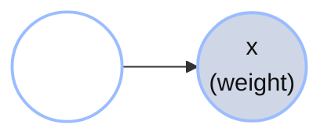
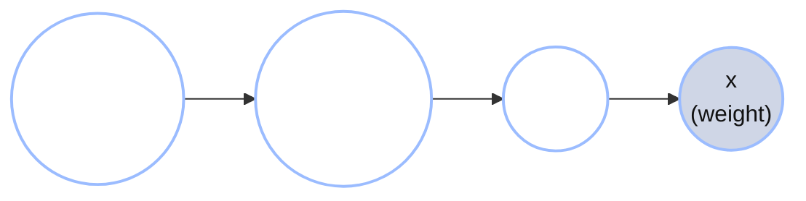
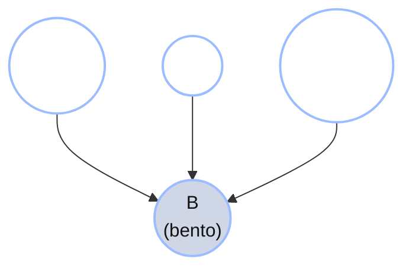

+++
date = "2026-06-03"
title = "Bayesian Networks"
weight = 8
+++

## Drawing What You Already Know

Chibany is sitting at their desk, staring at the histogram from [Chapter 5](../05_mixture_models/) — the one that started the whole mystery:


Recall the puzzle it posed: the weights fall into **two separate clumps** — light bentos near 350 g and heavy ones near 500 g — with a big empty gap in the middle. The overall *average*, 444.6 g (the red dashed line), lands right in that gap, describing no bento that ever existed. [Chapter 5](../05_mixture_models/) resolved this with a **Gaussian mixture model**: the bentos come from two hidden clusters — a light one and a heavy one — and for any new bento Chibany can compute $P(\text{cluster} \mid \text{weight})$, the probability it came from each cluster given its weight, and so guess what's inside before opening the box.

But now they're curious about something else. *What did I actually do?* When they wrote down the model, they treated the weight as the thing-they-saw and the cluster as the thing-they-wanted-to-know. Where did that picture come from? Is there a name for it?

Their labmate Jamal wanders over with a coffee and glances at the screen.

> **Jamal:** "Oh nice, you're doing Bayesian-network inference."
>
> **Chibany:** "Bayesian *what*?"
>
> **Jamal:** "Here, let me show you. You've been drawing one this whole time — you just didn't call it that."

This chapter is that conversation. We'll discover that the mixture model from Chapter 5 was secretly a little **graph** all along, give the graph a precise meaning, and then watch the same picture-language scale up to models with many interacting causes.

---

## The Mystery Bentos, Drawn as a Graph

Recall the generative story for the mixture model. For each bento, two things happen in order:

1. Nature picks a **cluster** $z$ — light (hamburger) or heavy (tonkatsu).
2. Given the cluster, nature draws a **weight** $x$ from that cluster's Gaussian.

We can draw this as a picture with one node per random quantity and an arrow for "directly influences":



The arrow $z \to x$ says: *the weight depends on the cluster.* That's the whole model, drawn. Following the usual convention for these graphs, the **shaded** node ($x$, the weight) is the one Chibany **observes**; the **unshaded** node ($z$, the cluster) is **hidden**. (We'll lean on that shaded-means-observed convention throughout the next two chapters.)

This little diagram is a **Bayesian network** (or **Bayes net** for short; also called a **directed graphical model**). The diagram itself — just the nodes and arrows — is a **DAG** (a *directed acyclic graph*; we'll unpack that acronym at the end of the chapter). The Bayes net is the DAG *together with* the probability rule attached to each node. Each node is a random variable; each arrow points from a variable to one it directly influences. That's it. Chibany has been drawing one all semester without knowing the name.

{}
You now have three equivalent descriptions of the same thing:

- **A story:** "pick a cluster, then draw a weight from it."
- **Math:** $P(z, x) = P(z) P(x \mid z)$.
- **A graph:** $z \to x$.

The point of Bayes nets is that the *graph* and the *math* are two views of the same object — and the graph is often the easier one to think with.
{}

---

## What's a "Parent"?

To talk about graphs precisely, we need one piece of vocabulary.

The **parents** of a node $X$, written $\text{Pa}(X)$, are the variables with arrows pointing *into* $X$ — the variables whose values directly determine $X$'s distribution.

In the mystery-bento graph:

- $\text{Pa}(z) = \varnothing$ (nothing points into $z$ — it has no parents; the cluster is chosen first, out of the blue).
- $\text{Pa}(x) = \{z\}$ (the weight's distribution is set by the cluster).

A node with no parents, like $z$, is a **root**. Its distribution is just a prior — $P(z)$ — because nothing upstream shapes it. A node *with* parents gets a **conditional** distribution: $x$ isn't described by a bare $P(x)$ but by $P(x \mid z)$, one Gaussian for each value of $z$.

That word "parent" is the hinge of the whole subject. Every node carries exactly one factor in the joint distribution — *itself, given its parents* — and the graph is just a map of who depends on whom.

---

## The Factorization Rule

Here is the rule that turns a graph into math. For any Bayes net over variables $X_1, \ldots, X_n$:

$$P(X_1, \ldots, X_n) = \prod_{i=1}^{n} P\bigl(X_i \mid \text{Pa}(X_i)\bigr).$$

In words: **the joint distribution is the product of one factor per node — each node given its parents.** Reading it off a graph is mechanical. Walk the nodes; for each, write down $P(\text{node} \mid \text{its parents})$; multiply them all together.

For the mystery-bento graph $z \to x$, the two factors are $P(z)$ (root, no parents) and $P(x \mid z)$, so

$$P(z, x) = P(z) P(x \mid z).$$

That's exactly the formula we used in Chapter 5 — but now we can *see* where it comes from. The arrow $z \to x$ is the reason the second factor is "$x$ **given** $z$" and not just "$x$". (We won't call this the *Markov factorization* yet — that name is waiting for us at the end of the chapter, once we've earned it.)

---

## Adding a Hyperprior

So far the cluster prior $P(z)$ was a fixed number — say, $P(z = \text{heavy}) = 0.5$. But what if Chibany doesn't know the split, and wants to *learn* it? Then the mixing weight $\pi$ (the probability of the heavy cluster) becomes a random variable too, with its own prior $P(\pi \mid \alpha)$:



The factorization grows one factor:

$$P(\alpha, \pi, z, x) = P(\pi \mid \alpha) P(z \mid \pi) P(x \mid z).$$

Notice what changed: $z$ now has a parent ($\pi$), so its factor became conditional, $P(z \mid \pi)$. And $\pi$ got a parent of its own ($\alpha$). The graph grew upward, adding a *level* of uncertainty above the one we had.

This stacking-of-priors is exactly what [Chapter 12](../12_hierarchical_bayes/) calls **hierarchical Bayes** — *learning the prior itself*. Seen through this chapter's lens, hierarchical Bayes is just a Bayes net with an extra layer on top. Same machinery, drawn as a taller graph.

---

## Multi-Parent Networks: Chibany's Bento, Revisited

Up to now every node has had at most one parent, so the graphs were just chains. But the real world is messier, and the picture-language handles mess gracefully.

Alyssa, another labmate, has been listening. They lean in:

> **Alyssa:** "Honestly your bento weight probably depends on more than just one hidden cluster. The cafeteria menu rotates by **day** — Thursdays are the tonkatsu days. It also depends on **which cafeteria** the student came from. And on a **hot day** everyone grabs the lighter boxes."

Alyssa is describing three causes that all feed into one effect. Let's name the variables as we name the words, so the formula doesn't surprise us later:

- **Weather** ($W$): cold or hot.
- **Day** ($D$): early-week or late-week.
- **Restaurant** ($R$): cafeteria A or cafeteria B.
- **Bento** ($B$): the meal — hamburger or tonkatsu.

The story: weather, day, and restaurant are each settled on their own, and *together* they determine how likely the bento is tonkatsu. As a graph, three arrows converge on $B$:



Now $\text{Pa}(B) = \{W, D, R\}$, while $W$, $D$, and $R$ are all roots. The factorization reads straight off the picture:

$$P(W, D, R, B) = P(W) P(D) P(R) P(B \mid W, D, R).$$

Three independent priors, and one big conditional that wires them into the bento. The conditional $P(B \mid W, D, R)$ is a **conditional probability table** (CPT): one tonkatsu-probability for each of the $2 \times 2 \times 2 = 8$ combinations of its parents.

{}
Whenever a formula below uses $W$, $D$, $R$, or $B$, it means weather, day, restaurant, and bento, exactly as introduced above.
{}

---

## Why Bother? The Parameter-Counting Argument

Here's the payoff for all this drawing. Suppose Chibany ignored the structure and just tried to write down the full joint distribution $P(W, D, R, B)$ as one giant table. With four binary variables there are $2^4 = 16$ possible combinations, and a probability distribution over them needs $16 - 1 = 15$ free numbers (the "$-1$" because the probabilities must sum to one, so the last is determined).

Now count what the *factored* Bayes net needs instead:

| Factor | Numbers needed |
|---|---:|
| $P(W)$ | 1 |
| $P(D)$ | 1 |
| $P(R)$ | 1 |
| $P(B \mid W, D, R)$ | 8 |
| **Total** | **11** |

Eleven instead of fifteen. At four nodes that's a modest saving — but the saving is **exponential in disguise**. With 10 binary variables, the full joint needs $2^{10} - 1 = 1023$ numbers; a Bayes net where each node has at most 2 parents needs only a few dozen. The graph buys you a model you can actually write down, estimate, and reason about. *Structure is compression.*

{}
We've been *given* the arrows by the story ("weather affects the bento"). A natural next question is: could you *learn* the graph from data alone? That's the problem of **structure learning**, and it's genuinely hard — observation alone often can't decide which way an arrow should point (we'll see exactly why in [Chapter 10](../10_causal_bayes_nets/)). For now, we take the structure as part of the modeling assumptions, the same way we chose a Gaussian likelihood back in Chapter 3.
{}

---

## Naming What We Did: the Markov Factorization

We've earned the name now. Let's make the definitions precise.

A **directed acyclic graph (DAG)** is a graph $G = (V, E)$ whose nodes $V$ are the variables and whose edges $E$ are the arrows, with one rule: **no directed cycles** — you can never follow arrows and return to where you started. (Acyclicity is what lets us speak of "parents" and "ancestors" without circular reasoning, and what makes the generative story — sample each node after its parents — well-defined.)

The rule we used all along now gets its proper title, the **Markov factorization**:

$$P(X_1, \ldots, X_n) = \prod_{i=1}^{n} P\bigl(X_i \mid \text{Pa}(X_i)\bigr).$$

A graph $G$ and a distribution $P$ fit together when $P$ factorizes this way according to $G$'s parents; we say $G$ is an **I-map** (independence map) for $P$. Intuitively, an I-map is a graph that *doesn't lie* about the dependencies — every independence the graph claims really does hold in $P$. We won't go deeper than that one sentence here; [Chapter 9](../09_conditional_independence/) is entirely about reading those independence claims off the graph.

---

## GenJAX Implementation

Time to build these networks as runnable models. A Bayes net is a generative function: each `@gen`-decorated function lays out the nodes, names each random choice with `@ "..."`, and lets the parents flow into the children exactly as the arrows say. We'll build three, matching the three graphs above.

### 1. The mixture model, drawn explicitly as a Bayes net

First, the Chapter 5 model written so the graph is visible in the code: one cluster node `z`, one weight node `x`, with `z` flowing into `x`.

```python
import jax
import jax.numpy as jnp
import jax.random as jr
from genjax import gen, flip, normal

# Two cluster means, treated as known here so we can focus on the graph structure.
MU_LIGHT = 350.0   # hamburger cluster
MU_HEAVY = 500.0   # tonkatsu cluster
SIGMA = 40.0       # wide enough that the clusters overlap — so inference is interesting

@gen
def one_bento():
    # z -> x.  Root node first: pick a cluster (True = heavy/tonkatsu).
    z = flip(0.5) @ "z"
    # Child node: weight depends on the cluster (the arrow z -> x in code).
    mu = jnp.where(z, MU_HEAVY, MU_LIGHT)
    x = normal(mu, SIGMA) @ "x"
    return z, x

# Ancestral sampling: run the story forward once.
key = jr.key(0)
z, x = one_bento.simulate(key, ()).get_retval()
label = "tonkatsu (heavy)" if bool(z) else "hamburger (light)"
print(f"Sampled cluster: {label}")
print(f"Sampled weight:  {float(x):.1f} g")
```

**Output:**
```
Sampled cluster: tonkatsu (heavy)
Sampled weight:  551.8 g
```

Running the model forward like this — sampling each node *after* its parents — is called **ancestral sampling**, and it's the most basic thing you can do with a Bayes net: generate fake data from it. The acyclicity of the DAG is exactly what guarantees the parents are always ready before you need them.

### 2. Adding the hyperprior

Now make the mixing weight $\pi$ a random variable with a `beta` prior, so the graph grows the extra level $\alpha \to \pi \to z \to x$.

```python
from genjax import beta

# A Beta(2, 2) prior on pi — mild, centered at 0.5. In the graph above we drew a
# single parent "alpha"; concretely that prior is set by Beta's two shape numbers
# (here both 2.0), which together play the role of that one "prior strength" node.
@gen
def one_bento_hierarchical():
    pi = beta(2.0, 2.0) @ "pi"        # mixing weight, now learned
    z = flip(pi) @ "z"               # cluster, given pi
    mu = jnp.where(z, MU_HEAVY, MU_LIGHT)
    x = normal(mu, SIGMA) @ "x"
    return pi, z, x

pi, z, x = one_bento_hierarchical.simulate(jr.key(1), ()).get_retval()
print(f"Sampled mixing weight pi: {float(pi):.2f}")
print(f"Sampled weight:           {float(x):.1f} g")
```

**Output:**
```
Sampled mixing weight pi: 0.37
Sampled weight:           309.5 g
```

Each run now draws a *different* $\pi$ first, then uses it. That extra randomness at the top is the hierarchical layer — the same structure [Chapter 12](../12_hierarchical_bayes/) develops in full.

### 3. Chibany's multi-parent bento network

Finally, the four-node network $W, D, R \to B$, with a conditional probability table for the bento.

<!-- validate: tol=0.02 -->
```python
@gen
def chibany_bento_network():
    # Three independent root causes (each True/False).
    weather = flip(0.5) @ "weather"        # True = hot
    day = flip(0.6) @ "day"                # True = late-week (tonkatsu days)
    restaurant = flip(0.7) @ "restaurant"  # True = cafeteria B

    # P(bento = tonkatsu | weather, day, restaurant): the 8-entry CPT,
    # indexed by [weather, day, restaurant]. Hot weather lowers tonkatsu;
    # late-week and cafeteria B raise it.
    cpt = jnp.array([
        # weather = cold
        [[0.5, 0.7],    # day = early: [restA, restB]
         [0.7, 0.9]],   # day = late
        # weather = hot
        [[0.3, 0.5],    # day = early
         [0.5, 0.7]],   # day = late
    ])
    p_tonkatsu = cpt[weather.astype(int), day.astype(int), restaurant.astype(int)]
    bento = flip(p_tonkatsu) @ "bento"     # True = tonkatsu
    return bento

# Estimate the marginal P(bento = tonkatsu) by Monte Carlo: sample many full
# traces and average the bento outcome. (No conditioning yet — just the prior.)
keys = jr.split(jr.key(2), 20000)
bentos = jax.vmap(lambda k: chibany_bento_network.simulate(k, ()).get_retval())(keys)
print(f"P(bento = tonkatsu) ≈ {float(jnp.mean(bentos.astype(float))):.3f}")
```

**Output:**
```
P(bento = tonkatsu) ≈ 0.666
```

That marginal — about two-thirds tonkatsu — is something we never wrote down directly. It *emerged* by averaging over all $2^3 = 8$ settings of the three causes, weighted by how likely each setting is. Marginalizing a Bayes net by sampling like this is the workhorse we'll lean on for the rest of the spine: when a question is hard to compute by hand, sample many ancestral traces and count.

### 4. Inference: from effect back to cause

So far we've only run the networks *forward* — parents to children, the direction the arrows point. But the whole reason Chibany drew the graph was the *backward* question: **"I observed a weight; which cluster did it come from?"** That's $P(z \mid x)$ — going against the arrow.

We answer it by **conditioning**. We fix the observed node to its value and ask GenJAX to weight each forward sample by how well it explains that observation. In code, `ChoiceMap.d({...})` records what we observed, and `model.generate(key, constraints, args)` runs the model with those choices pinned, returning a trace and an importance weight — exactly the machinery you saw in Chapter 5.

<!-- validate: tol=0.05 -->
```python
from genjax import ChoiceMap

# Chibany weighs a bento: 430 g. Which cluster — light or heavy?
observation = ChoiceMap.d({"x": 430.0})

keys = jr.split(jr.key(3), 8000)
def infer_cluster(k):
    trace, log_weight = one_bento.generate(k, observation, ())
    return trace.get_choices()["z"].astype(float), log_weight

z_samples, log_weights = jax.vmap(infer_cluster)(keys)
weights = jnp.exp(log_weights - jnp.max(log_weights))
weights = weights / jnp.sum(weights)

p_heavy = jnp.sum(z_samples * weights)
print(f"P(cluster = heavy | weight = 430 g) ≈ {float(p_heavy):.3f}")
```

**Output:**
```
P(cluster = heavy | weight = 430 g) ≈ 0.620
```

A 430 g bento sits between the light cluster (350 g) and the heavy one (500 g), a bit closer to heavy — so the posterior leans heavy, about 62%, but stays genuinely uncertain. This is the same inference Chapter 5 did, now seen as *running a Bayes net against its arrows*. Conditioning on what you see and reasoning back to what you don't is the heart of the next chapter — where we'll find that **which** variables this back-reasoning can even reach depends entirely on the shape of the graph.

{}
You can take any generative story, draw it as a DAG, read off its factorization, count its parameters, run it forward in GenJAX to estimate any marginal, and condition on what you observe to infer a hidden cause. Next, in [Chapter 9](../09_conditional_independence/), we'll learn to read something subtler straight off the graph: *which variables are independent of which* — and meet the one structure (the collider) where the obvious answer is backwards.
{}

---

## Exercises

{}
1. **Read off a factorization.** Draw the DAG $A \to B \to C$ with an extra arrow $A \to C$. Write its Markov factorization. How many numbers does it need if all three variables are binary, versus the full joint?
2. **A new parent.** Suppose Chibany's bento also depends on whether it's a holiday ($H$), which influences the bento directly. Add $H$ to `chibany_bento_network` as a fourth root cause. How many entries does the CPT $P(B \mid W, D, R, H)$ now have? Re-estimate $P(B = \text{tonkatsu})$.
3. **Marginal vs. conditional.** Using `chibany_bento_network`, estimate $P(B = \text{tonkatsu} \mid \text{weather} = \text{hot})$ by Monte Carlo (sample many traces, keep only the hot-weather ones, average the bento). Is it higher or lower than the unconditional $0.666$? Does that match the CPT (hot weather lowers the tonkatsu probabilities)?
{}

A companion notebook works through these interactively:

**📓 [Open in Colab: `08_bayes_nets.ipynb`](https://colab.research.google.com/github/josephausterweil/probintro/blob/main/notebooks/08_bayes_nets.ipynb)**

---

Special thanks to [JPPCA](https://jpcca.org/) for their generous support of this tutorial series.
