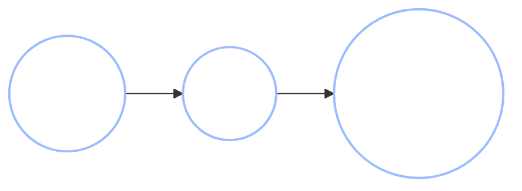
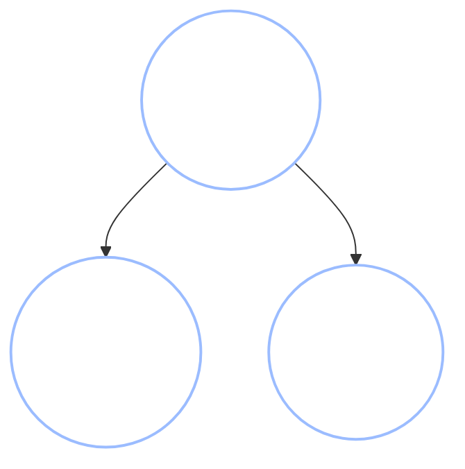
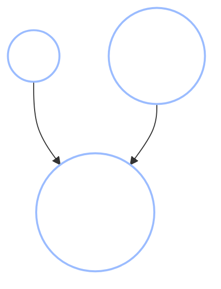
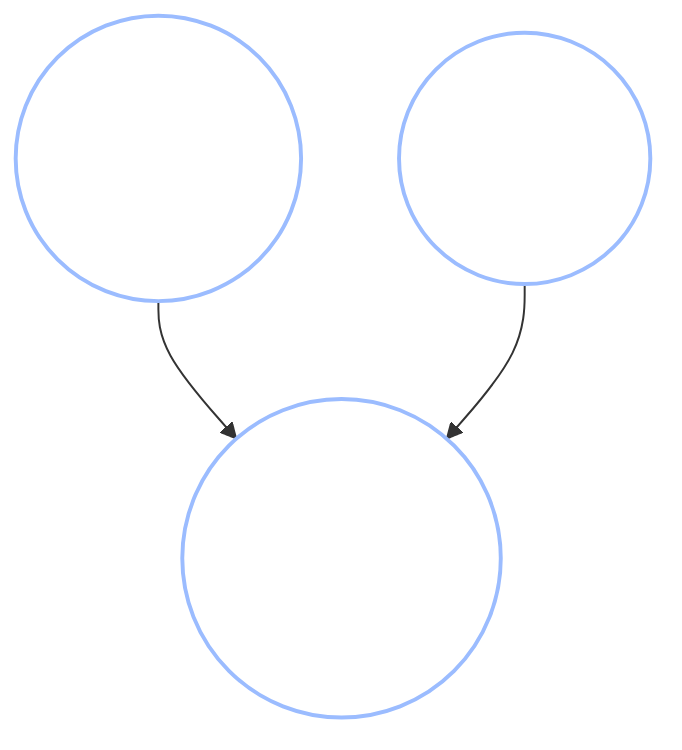
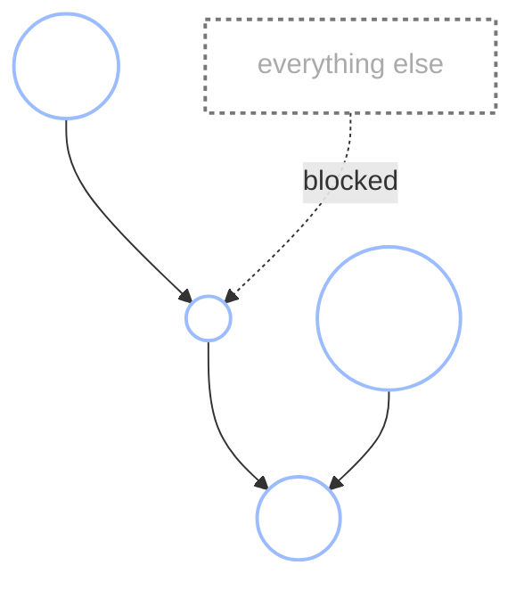
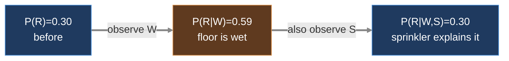

+++
date = "2026-06-14"
title = "条件付き独立性とd分離"
weight = 9
+++

## グラフから独立性を読み取る

[第8章](../08_bayes_nets/)では、Chibanyはモデルをグラフとして*描き*、前向き（サンプリング）と後ろ向き（隠れた原因の推論）の両方向に動かすことを学んだ。しかしベイズネットは分布をコンパクトに格納するだけでなく、もっと微妙なことをしている。その形状が、**どの変数がどの変数について情報を持つか**を一目で教えてくれるのだ。

この章はそれについて扱う。グラフには**チェーン**・**フォーク**・**コライダー**という3つの基本的な配線パターンしかなく、それぞれの振る舞いを知れば「$A$を観測したことは$B$について何か教えてくれるか？」という問いに、確率を一つも計算せずに答えられることがわかる。3つのパターンのうち一つは直感とは逆の振る舞いをする。その驚き——**コライダー**——こそが、確率論における最も反直感的な推論のいくつかを生み出す原動力となっている。

アリッサがChibanyの隣の椅子に座り、一つの謎を持ち込んだ。

> **アリッサ：**「ねえ、奇妙なことに気づいたんだけど。食堂のとんかつが売り切れた日、あなたは午後眠そうにしてるんだよね。じゃあ……とんかつを食べると頭が冴えるの？」
>
> **Chibany：**「うーん。そうかも？ それとも*別の何か*が両方を引き起こしてるのかも。」

Chibanyが疑念を持つのは正しい。*なぜ*そうなのかを正確に言えるツールを構築しよう。

---

## 3つの構成要素

ベイズネット内の2つの変数を結ぶ経路は、どれも3つの基本的な3ノードパターンで構成されている。それぞれがどのように情報を通過・遮断するかを学べば、どんなグラフでも分析できる。

ここでの問いは常に同じだ。**中間ノードを知ることで、両端の関係性が変わるか？** $A \perp B$ は「$A$は$B$と独立である」（一方を知っても他方について何もわからない）、$A \perp B \mid C$ は「$C$を既に知っている*ならば*、$A$は$B$と独立である」と記す。

### チェーン：$A \to B \to C$



弁当の種類（$A$）がChibanyの摂取カロリー（$B$）を決め、カロリーが午後のエネルギー（$C$）を決める。影響はチェーンを下って伝わる。弁当の種類はエネルギーについて確かに情報を持っている——カロリーを通じて。

しかしここで**カロリーを既に知っている**としよう。弁当の種類はエネルギーについて*さらに何か*を教えてくれるか？ いや——$B$を知れば、エネルギーは$B$にのみ依存し、弁当の種類は無関係になる。中間ノードを観測すると、チェーンを**遮断**する。

$$A \not\perp C \quad\text{but}\quad A \perp C \mid B.$$

チェーンの中間を条件付けると、つながりが断ち切られる。

### フォーク：$A \leftarrow B \to C$



ここでは**共通原因** $B$——今日の食堂のメニュー——がChibanyの弁当（$A$）とアリッサの弁当（$C$）の両方に影響している。Chibanyがとんかつを選んだとわかれば、アリッサも選んだだろうと推測できる——一方が他方を引き起こしたからではなく、*メニュー*が両方を誘導したからだ。つまり$A$と$C$は従属している。

再び、**メニューを既に知っている**としよう。ChibanyのChoiceはアリッサの弁当について何かを教えてくれるか？ いや——メニューが固定されれば、2つの弁当は独立に選ばれる。共通原因を観測すると、フォークを**遮断**する。

$$A \not\perp C \quad\text{but}\quad A \perp C \mid B.$$

チェーンとフォークは同じように振る舞う。**中間ノードを条件付けることで経路が遮断される。** これは直感に合う——中間にあるものを学ぶことでつながりが「説明」され、両端が切り離される。

### コライダー：$A \to B \leftarrow C$



ここでは2つの**独立した原因**——外の雨（$A$）と室内でこぼれたお茶（$C$）——が、食堂の「床が濡れています」サイン（$B$）の掲示という同じ結果をもたらす。2つの原因は無関係だ。雨が降ったかどうかは、誰かがお茶をこぼしたかどうかについて何も教えてくれない。だから$A \perp C$である。

ここに驚きがある。**「床が濡れています」サインが出ている**（$B$を観測）こと、さらに**誰もお茶をこぼしていない**ことを知ったとしよう。雨について今何を信じるか？ 雨だったに違いない——他に説明が残っていない。お茶のこぼし事故について知ることで、*最初は独立だったのに*、突然雨について情報が得られる。コライダーを条件付けることで経路が**開かれる**。

$$A \perp C \quad\text{but}\quad A \not\perp C \mid B.$$

これはチェーンとフォークとは**正反対**だ。そちらでは中間ノードを条件付けると経路が*遮断*され、こちらでは*開かれる*。コライダーは、観測することによって無から依存関係を作り出す唯一のパターンだ。

{}
チェーンとフォーク：中間ノードを条件付けると**遮断**される（直感的なケース）。コライダー：中間ノードを条件付けると**開かれる**（反直感的なケース）。確率的推論における「パラドックス」のほぼすべて——モンティ・ホール問題、バークソンバイアス、説明消去——はコライダーを条件付けることで生じる。これは頻繁に登場するので、暗記する価値がある。
{}

---

## 既に出会ったコライダー：弁当版モンティ・ホール問題

コライダーが抽象的に感じるなら、以前に出会ったかもしれない問題——モンティ・ホール問題——を弁当の形で見てみよう。

カウンターの上に3つの同一の不透明な弁当箱が並んでいる。1つだけにとんかつが入っており、残りの2つにはハンバーグが入っている。Chibanyが箱1を選ぶ。食堂の店員——とんかつの場所を**知っている**——は*他の*2つの箱のうち、ハンバーグが入っている箱3を開ける。Chibanyは箱2に変えるべきか？

3つの変数はコライダーを形成する。



とんかつの場所$T$とChibanyの選択$P$は最初は独立だ——Chibanyは目隠しして選ぶ。しかし*開示*$R$は両方に依存する。店員はChibanyの箱を開けられず、とんかつの箱も開けない。$R$はコライダーだ。Chibanyが開示を見た瞬間——$R$を条件付けた瞬間——場所$T$と選択$P$が絡み合い、とんかつが*もう一方の未開封の*箱にある確率が$2/3$に跳ね上がる。**変えると得をする。** この$2/3$はコライダーが開かれた結果だ。開示が、見る前は独立だった2つのものを結びつけるのだ。（*なぜ*そうなるかを、数字で使って、以下の説明消去の節で詳しく見る。）

---

## d分離アルゴリズム

3つの構成要素が組み合わさって、*あらゆる*グラフに適用できる1つのルールになる。これを**d分離**（"d"は「有向directed」の意）と呼ぶ。グラフと観測変数の集合$C$が与えられたとき、$A \perp B \mid C$かどうかを答えるアルゴリズムだ。

$A$と$B$の間の**すべての経路**をたどる（矢印の向きを無視してエッジに従う）。経路が**遮断**されるのは、次のいずれかを含む場合だ。

1. 中間ノード$m$が$C$に**含まれている**（観測されている）**チェーン** $\cdot \to m \to \cdot$ または**フォーク** $\cdot \leftarrow m \to \cdot$、**あるいは**
2. 中間ノード$m$が$C$に含まれて**おらず**、$m$の子孫も$C$に一つも含まれていない**コライダー** $\cdot \to m \leftarrow \cdot$。

$A$と$B$の間の**すべての**経路が遮断されていれば、$A$と$B$は$C$が与えられたもとで**d分離**されており、$A \perp B \mid C$と結論できる。1つでも経路が開いていれば、従属している可能性がある。

言い換えると、経路が開いているとは情報がその経路を流れることができるということだ。チェーンとフォークはデフォルトで開いており、中間を観測することで*閉じる*。コライダーはデフォルトで閉じており、中間（またはその下流）を観測することで*開く*。

{}
メニュー・弁当のフォーク $A \leftarrow B \to C$ で、何も観測しない（$C = \varnothing$）場合：唯一の経路 $A - B - C$ はフォークの中間（$B$）が*観測されていない*ので、経路は**開いている**——$A$と$C$は従属。メニューを観測する（$C = \{B\}$）：フォークの中間が観測され、経路は**遮断**され、$A \perp C \mid B$ となる。アルゴリズムは手で推論したことをそのまま再現する。
{}

### インタラクティブ：ベイズボールアルゴリズム

d分離を手で*実行*する視覚的な方法がある。**ベイズボールアルゴリズム**と呼ばれるものだ。グラフのエッジに沿ってボールが弾んで、あるノードから別のノードに到達しようとする様子を想像する。上記のルールは、ボールが各ノードを**通過**できるかまたは**遮断**されるかのルールになる——そして重要なことに、ノードを観測するとルールが逆転する（ボールは観測されていないチェーン・フォークの中間を自由に通過するが、観測されたものは跳ね返す。コライダーではその逆が成り立つ）。ボールが$A$から$B$に到達できれば従属、すべての経路で遮断されればd分離だ。

以下の3つの主要なシナリオを順に確認しよう——条件付きチェーンの中間でボールが**遮断**され、観測されていないコライダーで**遮断**され、そして同じコライダーを条件付けると（説明消去の驚き、アニメーション付き）突然**通過**する様子を見てほしい。

<iframe src="../../widgets/bayes_ball.html"
        width="100%" height="460"
        frameborder="0"
        style="background:#1a1a1a; border-radius:6px; margin:1rem 0;"
        title="Interactive Bayes-Ball d-separation demo">
</iframe>

最も注目すべきはコライダーのケースだ。シナリオ2ではボールは通過**できない**（コライダーは閉じている）が、シナリオ3では——コライダーを条件付けると——突然通過**できる**ようになる。これがまさに「コライダーを条件付けると開く」というルールであり、実際に起きる様子を見ることができる。

---

## マルコフブランケット

もう一つの語彙が即座に役立つ。ノード$X$の**マルコフブランケット**とは、一度観測されると$X$をネットワークの*他のすべて*から独立にする最小のノード集合だ。3つのグループからなる。

- $X$の**親ノード**、
- $X$の**子ノード**、
- そして**$X$の子ノードの他の親ノード**（子ノードの共同親）。



共同親が存在するのはコライダーのルール*のため*だ。$X$と共同親はどちらも同じ子ノードを指すため、その子ノードを観測するとコライダーが開かれて2つが結びつく——共同親も条件付けなければブロックを再度閉じられない。マルコフブランケットは$X$をグラフの残りの部分から遮断する境界であり、推論アルゴリズムが1つずつノードを更新するために活用するものだ。

---

## 数値で見る説明消去

コライダーは完全な数値的ウォークスルーに値する。確率が動く様子を見ることが、驚きを本当に実感させる唯一の方法だからだ。これが**説明消去**パターンであり、この章全体の中心だ。

古典的な設定：床の濡れた部分は、外から引きずり込まれた**雨**（$R$）か、室内での**スプリンクラー**（$S$）のテストかによって引き起こされる——1つの結果（**濡れた床** $W$）に対する2つの独立した原因だ。コライダー $R \to W \leftarrow S$ だ。計算を簡単にするために、**決定論的OR**を使う：少なくとも一方の原因が活性なとき、床は確実に濡れる。

| 量 | 値 |
|---|---|
| $P(R = 1)$ | $0.3$ |
| $P(S = 1)$ | $0.3$ |
| $P(W = 1 \mid R, S)$ | $R = 1$ **または** $S = 1$ なら $1$、そうでなければ $0$ |

雨とスプリンクラーは独立で、それぞれ事前確率$0.3$を持つ。条件付けが何をするかを、一度に1つの観測ずつ見ていこう。

**ステップ1——何も観測する前。** 雨とスプリンクラーは独立だ。$P(R = 1) = 0.3$ であり、スプリンクラーについて知っても雨については何もわからない。

**ステップ2——床が濡れていることを観測する（$W = 1$）。** 今、雨はより*ありそうに*なる。床が濡れているので、少なくとも1つの原因が作動した。雨は2つの候補のうちの1つなので、その確率が上がる。

$$P(R = 1 \mid W = 1) = \frac{P(W = 1 \mid R = 1) P(R=1)}{P(W=1)} = \frac{1 \cdot 0.3}{1 - 0.7 \cdot 0.7} = \frac{0.3}{0.51} \approx 0.588.$$

（分母 $P(W=1) = 1 - P(R=0)P(S=0) = 1 - 0.7 \times 0.7 = 0.51$。）雨への信念が $0.30$ から約 $0.59$ に上昇した。

**ステップ3——*さらに* スプリンクラーが作動していたことを観測する（$S = 1$）。** 今、雨への信念は**事前確率に戻る**。

$$P(R = 1 \mid W = 1, S = 1) = P(R = 1) = 0.3.$$

なぜちょうど事前確率なのか？ $S = 1$ となれば、雨が何をしたかに関わらず床は確実に濡れるため——$W$ は $R$ について**ゼロの**追加情報を持つ。スプリンクラーが床の濡れを完全に**説明消去**した。2つ目の原因が存在したとわかることで、最初の原因は「必要でなく」なり、その信念が落ちた。



*（これらのボックスは信念の**状態**であり、ネットワークノードではない——太い矢印は証拠が到着するにつれての信念の更新であり、ベイズネットの因果エッジではない。）*

この上昇・下降の軌跡が説明消去だ。そしてこれがまさにモンティ・ホール問題で変えると得をする理由だ。開示はコライダーであり、条件付けることで箱が結びつき、選ばなかった箱へ証拠が流れる。1つの観測を説明しようと競い合う2つの原因——それがすべての話だ。

{}
アリッサの「とんかつは頭を冴えさせるか？」を覚えているだろうか。午後の眠気ととんかつ不足には共通原因がある——*忙しくストレスの多い日*が食堂を早く売り切れにさせ**かつ**Chibanyを午後までに疲弊させる。それはとんかつから注意力への因果チェーンではなく、**フォーク**だ。忙しい日という変数を条件付けると、眠気ととんかつ不足が独立になる——相関は因果効果ではなく共通原因による産物だと明らかになる。これらの構造を区別することが[第10章](../10_causal_bayes_nets/)のテーマだ。
{}

---

## GenJAX実装

雨・スプリンクラーのコライダーを構築し、コードで説明消去が起きる様子を見よう。モデルは上記の決定論的ORネットワークだ。`ChoiceMap` で条件付けし、重要度サンプリングで雨の事後分布を回復する——[第8章](../08_bayes_nets/)の推論機構とまったく同じだ。

<!-- validate: tol=0.03 -->
```python
import jax
import jax.numpy as jnp
import jax.random as jr
from genjax import gen, flip, ChoiceMap

@gen
def wet_floor():
    # Two independent causes, each with prior 0.3.
    rain = flip(0.3) @ "rain"
    sprinkler = flip(0.3) @ "sprinkler"

    # Deterministic OR: the floor is wet iff at least one cause is active.
    # (Cast bools to int for the arithmetic, then back to a 0/1 probability.)
    either = jnp.maximum(rain.astype(int), sprinkler.astype(int))
    p_wet = either.astype(float)          # 1.0 if either cause fired, else 0.0
    # flip(p_wet) with p_wet in {0.0, 1.0} is deterministic — a "coin" forced to
    # one side. We keep it as a named random choice so we can condition on "wet".
    wet = flip(p_wet) @ "wet"
    return rain, sprinkler, wet

def posterior_rain(constraints, n=40000, seed=0):
    """P(rain = 1 | constraints) by importance sampling."""
    keys = jr.split(jr.key(seed), n)
    def one(k):
        trace, log_weight = wet_floor.generate(k, constraints, ())
        return trace.get_choices()["rain"].astype(float), log_weight
    rain_samples, log_weights = jax.vmap(one)(keys)
    weights = jnp.exp(log_weights - jnp.max(log_weights))
    weights = weights / jnp.sum(weights)
    return float(jnp.sum(rain_samples * weights))

# The three steps of explaining away.
print(f"P(rain)                       = 0.300   (prior)")
print(f"P(rain | wet)                 = {posterior_rain(ChoiceMap.d({'wet': 1})):.3f}")
print(f"P(rain | wet, sprinkler on)   = {posterior_rain(ChoiceMap.d({'wet': 1, 'sprinkler': 1})):.3f}")
print(f"P(rain | wet, sprinkler off)  = {posterior_rain(ChoiceMap.d({'wet': 1, 'sprinkler': 0})):.3f}")
```

**Output:**
```
P(rain)                       = 0.300   (prior)
P(rain | wet)                 = 0.587
P(rain | wet, sprinkler on)   = 0.299
P(rain | wet, sprinkler off)  = 1.000
```

4行を物語として読もう。雨は事前確率 $0.30$ から始まる。濡れた床を見ると $0.59$ に上がる。スプリンクラーが*作動していた*とわかると $0.30$ に戻る——スプリンクラーが濡れを説明したため、雨はもはや必要ではない。スプリンクラーが*作動していなかった*とわかると雨は $1.00$ まで上がる——唯一の他の原因が除外されれば、雨が説明に違いないからだ。コライダーは、その子孫を条件付けることで開かれ、そのすべての推論を流し込む。

{}
3ノードのサブパターンをチェーン・フォーク・コライダーに分類し、中間ノードを観測することで遮断されるか開かれるかを予測し、グラフ全体でd分離アルゴリズムを実行し、ノードのマルコフブランケットを読み取ることができる。最も重要なのは、モンティ・ホール問題や他の無数のパズルを生み出すコライダー効果である**説明消去**を理解したことだ。次の[第10章](../10_causal_bayes_nets/)では、より深い問いを問う。これまで矢印は「情報を持つ」を意味していた——それが**因果関係を意味する**とどう変わるのか？
{}

---

## 演習

{}
1. **パターンを分類せよ。** それぞれについて、チェーン・フォーク・コライダーを答え、中間ノードを観測すると経路が遮断されるか開かれるかを述べよ：(a) 学習時間 → テストの点数 → 気分；(b) 遺伝 → 身長、遺伝 → 体重；(c) 才能 → 受賞 ← 運。
2. **d分離を手で。** 雨・スプリンクラー・濡れ床のネットワークで、$R \perp S$（何も観測しない）か？$R \perp S \mid W$ か？ それぞれをコライダーのルールで正当化し、次にGenJAXモデルで $W$ を条件付けないときと条件付けたときで $P(\text{rain} \mid \text{sprinkler} = 1)$ を推定して確認せよ。
3. **ノイジーOR。** `p_wet` を変更して、各活性原因が確率 $0.9$ で床を濡らすようにせよ（*ノイジー*OR：`p_wet = 1 - 0.1**rain_int * 0.1**spr_int`）。3つのステップを再実行せよ。スプリンクラーを観測した後、雨は事前確率に*正確に*戻るか、それとも少し高いままか？ 違いを説明せよ。
{}

付属のノートブックがこれらをインタラクティブに扱う。

**📓 [Colabで開く：`09_conditional_independence.ipynb`](https://colab.research.google.com/github/josephausterweil/probintro/blob/main/notebooks/09_conditional_independence.ipynb)**

---

このチュートリアルシリーズへの寛大なご支援に、[JPPCA](https://jpcca.org/)に特別の感謝を申し上げる。
