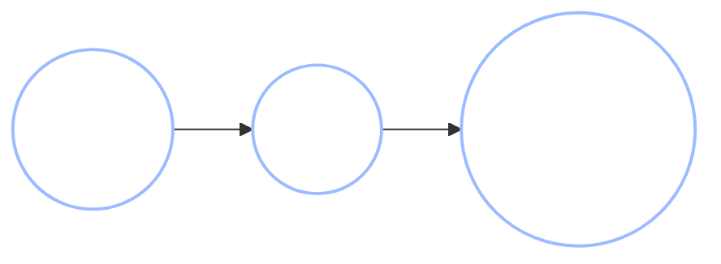
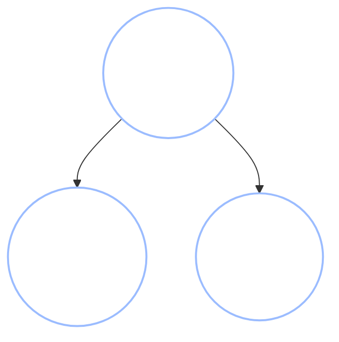
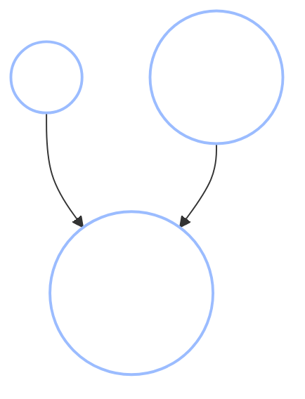
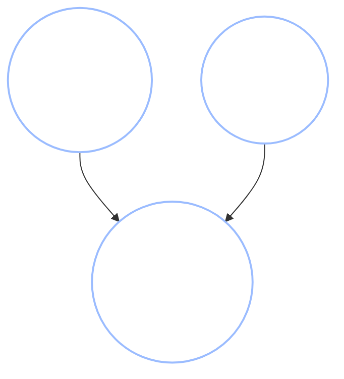
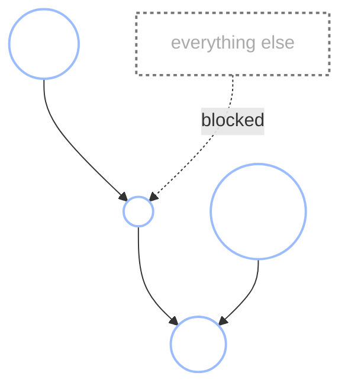
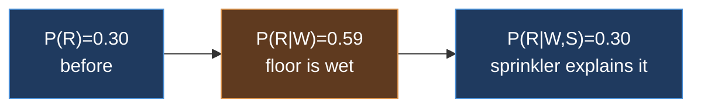

+++
date = "2026-06-01"
title = "Conditional Independence and d-Separation"
weight = 9
+++

## Reading Independence Off a Graph

In [Chapter 8](../08_bayes_nets/), Chibany learned to *draw* a model as a graph and run it both forward (sampling) and backward (inferring a hidden cause). But a Bayes net does something subtler than store a distribution compactly: its shape tells you, at a glance, **which variables carry information about which**.

This chapter is about that. We'll find that a graph has only three basic wiring patterns — **chain**, **fork**, and **collider** — and that knowing how each one behaves lets you answer "does observing $A$ tell me anything about $B$?" without computing a single probability. One of the three patterns behaves backwards from what intuition expects, and that surprise — the **collider** — turns out to be the engine behind some of the most counterintuitive reasoning in all of probability.

Alyssa drops into the chair next to Chibany with a puzzle.

> **Alyssa:** "Okay, here's something weird I noticed. On days when the cafeteria runs out of tonkatsu, you seem sleepier in the afternoon. So... does tonkatsu make you sharp?"
>
> **Chibany:** "Hmm. Maybe? Or maybe something *else* is making both things happen."

Chibany is right to be suspicious. Let's build the tools to say *exactly* why.

---

## The Three Building Blocks

Any path between two variables in a Bayes net is built out of three elementary three-node patterns. Learn how each one passes or blocks information, and you can analyze any graph at all.

Throughout, the question is always the same: **does knowing the middle node change whether the two ends are related?** We'll write $A \perp B$ for "$A$ is independent of $B$" (knowing one tells you nothing about the other) and $A \perp B \mid C$ for "$A$ is independent of $B$ *once you already know* $C$."

### Chain: $A \to B \to C$



The bento type ($A$) determines how many calories ($B$) Chibany eats, and the calories determine the afternoon energy ($C$). Influence flows down the chain: bento type *does* tell you something about energy — through the calories.

But now suppose you **already know the calories**. Does the bento type tell you anything *more* about energy? No — once you know $B$, the energy depends only on $B$, and the bento type is irrelevant. The middle node, when observed, **blocks** the chain:

$$A \not\perp C \quad\text{but}\quad A \perp C \mid B.$$

Conditioning on the middle of a chain cuts the connection.

### Fork: $A \leftarrow B \to C$



Here a **common cause** $B$ — today's cafeteria menu — influences both Chibany's bento ($A$) and Alyssa's bento ($C$). If you notice Chibany got tonkatsu, you'd bet Alyssa did too — not because one caused the other, but because the *menu* nudged both. So $A$ and $C$ are dependent.

Again, suppose you **already know the menu**. Does Chibany's bento now tell you anything about Alyssa's? No — once the menu is fixed, the two bentos are drawn independently. The common cause, when observed, **blocks** the fork:

$$A \not\perp C \quad\text{but}\quad A \perp C \mid B.$$

Chains and forks behave the same way: **conditioning on the middle node blocks the path.** This matches intuition — learning the thing in the middle "explains" the connection, so the ends decouple.

### Collider: $A \to B \leftarrow C$



Now two **independent causes** — rain ($A$) outside and a spilled tea ($C$) inside — both lead to the same effect, the cafeteria's wet-floor sign ($B$) going out. The two causes are unrelated: whether it rained tells you nothing about whether someone spilled tea. So $A \perp C$.

Here's the twist. Suppose you **see the wet-floor sign is out** ($B$ observed), and you also learn **no one spilled tea**. What do you now believe about rain? It must have been the rain — there's no other explanation left. Learning about the tea-spill suddenly tells you about the rain, *even though they started out independent*. Conditioning on a collider **opens** the path:

$$A \perp C \quad\text{but}\quad A \not\perp C \mid B.$$

This is **exactly backwards** from the chain and fork. There, conditioning on the middle node *blocked*; here, conditioning on the middle node *unblocks*. The collider is the one pattern where observing more creates a dependence out of thin air.

{}
Chain and fork: conditioning on the middle node **blocks** the connection (the intuitive case). Collider: conditioning on the middle node **opens** it (the counterintuitive case). Almost every "paradox" in probabilistic reasoning — Monty Hall, Berkson's bias, explaining away — is a collider being conditioned on. We'll meet this so often it's worth memorizing.
{}

---

## A Collider You've Already Met: Monty Hall, Chibany-Style

If the collider feels abstract, here it is in a puzzle you may have met before — the Monty Hall problem — in bento form.

Three identical opaque bento boxes sit on the counter. Exactly one holds tonkatsu; the other two hold hamburger. Chibany picks box 1. The cafeteria worker — who **knows** where the tonkatsu is — opens one of the *other* two boxes, box 3, revealing hamburger. Should Chibany switch to box 2?

The three variables form a collider:



The tonkatsu location $T$ and Chibany's pick $P$ are independent to begin with — Chibany picks blind. But the *reveal* $R$ depends on both: the worker can't open Chibany's box, and won't open the tonkatsu box. $R$ is a collider. The moment Chibany sees the reveal — conditions on $R$ — the location $T$ and the pick $P$ become entangled, and the probability that the tonkatsu is in the *other* unopened box jumps to $2/3$. **Switching wins.** That two-thirds is the collider opening: the reveal couples two things that were independent before you saw it. (We'll see the *why* in full, with numbers, in the explaining-away section below.)

---

## The d-Separation Algorithm

The three building blocks combine into one rule for *any* graph, called **d-separation** (the "d" is for "directed"). It answers: given a graph and a set of observed variables $C$, is $A \perp B \mid C$?

Trace **every path** between $A$ and $B$ (following edges in either direction, ignoring arrow direction for the tracing). A path is **blocked** if it contains either:

1. a **chain** $\cdot \to m \to \cdot$ or a **fork** $\cdot \leftarrow m \to \cdot$ whose middle node $m$ **is** in $C$ (observed), **or**
2. a **collider** $\cdot \to m \leftarrow \cdot$ whose middle node $m$ is **not** in $C$ *and none of whose descendants* are in $C$.

If **every** path between $A$ and $B$ is blocked, then $A$ and $B$ are **d-separated** given $C$, and we can conclude $A \perp B \mid C$. If even one path is open, they may be dependent.

In words: a path is open when information can flow along it. Chains and forks are open by default and you *close* them by observing the middle; colliders are closed by default and you *open* them by observing the middle (or anything downstream of it).

{}
In the menu/bentos fork $A \leftarrow B \to C$, with nothing observed ($C = \varnothing$): the single path $A - B - C$ runs through a fork whose middle ($B$) is *not* observed, so the path is **open** — $A$ and $C$ are dependent. Observe the menu ($C = \{B\}$): the fork's middle is now observed, the path is **blocked**, and $A \perp C \mid B$. The algorithm just reproduces what we reasoned out by hand.
{}

---

## The Markov Blanket

One more piece of vocabulary pays off immediately. The **Markov blanket** of a node $X$ is the smallest set of nodes that, once observed, makes $X$ independent of *everything else* in the network. It consists of three groups:

- $X$'s **parents**,
- $X$'s **children**,
- and the **other parents of $X$'s children** (its children's co-parents).



The co-parents are there *because* of the collider rule: $X$ and a co-parent both point into the same child, so observing that child opens the collider and links them — unless you also condition on the co-parent to block it again. The Markov blanket is exactly the boundary that seals $X$ off from the rest of the graph, and it's what inference algorithms exploit to update one node at a time.

---

## Explaining Away, in Numbers

The collider deserves a full numerical walk-through, because seeing the probabilities move is the only way the surprise really lands. This is the **explaining-away** pattern, and it's the centerpiece of the whole chapter.

The classic setup: a wet patch of floor can be caused by **rain** ($R$) tracked in from outside, or by a **sprinkler** ($S$) test indoors — two independent causes of one effect, the **wet floor** ($W$). It's a collider $R \to W \leftarrow S$. To keep the arithmetic clean, we use a **deterministic-OR**: the floor is wet exactly when *at least one* cause is active.

| Quantity | Value |
|---|---|
| $P(R = 1)$ | $0.3$ |
| $P(S = 1)$ | $0.3$ |
| $P(W = 1 \mid R, S)$ | $1$ if $R = 1$ **or** $S = 1$, else $0$ |

Rain and sprinkler are independent, each with prior probability $0.3$. Now watch what conditioning does, one observation at a time.

**Step 1 — before observing anything.** Rain and sprinkler are independent: $P(R = 1) = 0.3$, and knowing about the sprinkler tells you nothing about rain.

**Step 2 — observe the floor is wet ($W = 1$).** Now rain becomes *more* likely. The floor is wet, so at least one cause fired; since rain is one of only two candidates, its probability rises:

$$P(R = 1 \mid W = 1) = \frac{P(W = 1 \mid R = 1)\,P(R=1)}{P(W=1)} = \frac{1 \cdot 0.3}{1 - 0.7 \cdot 0.7} = \frac{0.3}{0.51} \approx 0.588.$$

(The denominator $P(W=1) = 1 - P(R=0)P(S=0) = 1 - 0.7 \times 0.7 = 0.51$.) Belief in rain climbed from $0.30$ to about $0.59$.

**Step 3 — *also* observe the sprinkler was on ($S = 1$).** Now belief in rain **drops back to its prior**:

$$P(R = 1 \mid W = 1, S = 1) = P(R = 1) = 0.3.$$

Why exactly the prior? Because once $S = 1$, the floor is *certain* to be wet no matter what the rain did — so $W$ carries **zero** additional information about $R$. The sprinkler has fully **explained away** the wetness. Learning a second cause was present made the first cause *less* needed, and our belief in it fell.



That up-then-down trajectory is explaining away. And it is exactly why switching wins in Monty Hall: the reveal is a collider, conditioning on it couples the boxes, and the evidence flows to the one box you didn't pick. Two causes competing to explain one observation — that's the whole story.

{}
Remember Alyssa's "does tonkatsu make you sharp?" The afternoon-sleepiness and the tonkatsu-shortage share a common cause — a *busy, stressful day* makes the cafeteria sell out early **and** wears Chibany down by the afternoon. That's a **fork**, not a causal chain from tonkatsu to alertness. Conditioning on the busy-day variable would make the sleepiness and the tonkatsu-shortage independent — revealing the correlation as a common-cause artifact, not a causal effect. Telling these structures apart is what [Chapter 10](../10_causal_bayes_nets/) is about.
{}

---

## GenJAX Implementation

Let's build the rain/sprinkler collider and watch explaining-away happen in code. The model is the deterministic-OR network above; we condition with `ChoiceMap` and recover the posterior over rain by importance sampling — exactly the inference machinery from [Chapter 8](../08_bayes_nets/).

<!-- validate: tol=0.03 -->
```python
import jax
import jax.numpy as jnp
import jax.random as jr
from genjax import gen, flip, ChoiceMap

@gen
def wet_floor():
    # Two independent causes, each with prior 0.3.
    rain = flip(0.3) @ "rain"
    sprinkler = flip(0.3) @ "sprinkler"

    # Deterministic OR: the floor is wet iff at least one cause is active.
    # (Cast bools to int for the arithmetic, then back to a 0/1 probability.)
    either = jnp.maximum(rain.astype(int), sprinkler.astype(int))
    p_wet = either.astype(float)          # 1.0 if either cause fired, else 0.0
    # flip(p_wet) with p_wet in {0.0, 1.0} is deterministic — a "coin" forced to
    # one side. We keep it as a named random choice so we can condition on "wet".
    wet = flip(p_wet) @ "wet"
    return rain, sprinkler, wet

def posterior_rain(constraints, n=40000, seed=0):
    """P(rain = 1 | constraints) by importance sampling."""
    keys = jr.split(jr.key(seed), n)
    def one(k):
        trace, log_weight = wet_floor.generate(k, constraints, ())
        return trace.get_choices()["rain"].astype(float), log_weight
    rain_samples, log_weights = jax.vmap(one)(keys)
    weights = jnp.exp(log_weights - jnp.max(log_weights))
    weights = weights / jnp.sum(weights)
    return float(jnp.sum(rain_samples * weights))

# The three steps of explaining away.
print(f"P(rain)                       = 0.300   (prior)")
print(f"P(rain | wet)                 = {posterior_rain(ChoiceMap.d({'wet': 1})):.3f}")
print(f"P(rain | wet, sprinkler on)   = {posterior_rain(ChoiceMap.d({'wet': 1, 'sprinkler': 1})):.3f}")
print(f"P(rain | wet, sprinkler off)  = {posterior_rain(ChoiceMap.d({'wet': 1, 'sprinkler': 0})):.3f}")
```

**Output:**
```
P(rain)                       = 0.300   (prior)
P(rain | wet)                 = 0.587
P(rain | wet, sprinkler on)   = 0.299
P(rain | wet, sprinkler off)  = 1.000
```

Read the four lines as a story. Rain starts at its prior $0.30$. Seeing the wet floor raises it to $0.59$. Learning the sprinkler was *on* drops it right back to $0.30$ — the sprinkler explained the wetness, so rain is no longer needed. And learning the sprinkler was *off* pushes rain all the way to $1.00$ — if the only other cause is ruled out, rain *must* be the explanation. The collider, opened by conditioning on its descendant, channels every bit of that reasoning.

{}
You can classify any three-node sub-pattern as a chain, fork, or collider; predict whether observing the middle node blocks or opens it; run the d-separation algorithm on a whole graph; and read off a node's Markov blanket. Most importantly, you understand **explaining away** — the collider effect that powers Monty Hall and a hundred other puzzles. Next, [Chapter 10](../10_causal_bayes_nets/) asks a deeper question: the arrows have meant "carries information" so far — what changes when we insist they mean **causes**?
{}

---

## Exercises

{}
1. **Classify the pattern.** For each, name chain / fork / collider and say whether observing the middle node blocks or opens the path: (a) Study hours → Test score → Mood; (b) Genetics → Height, Genetics → Weight; (c) Talent → Award ← Luck.
2. **d-separation by hand.** In the rain/sprinkler/wet network, is $R \perp S$ (nothing observed)? Is $R \perp S \mid W$? Justify each with the collider rule, then confirm with the GenJAX model by estimating $P(\text{rain} \mid \text{sprinkler} = 1)$ unconditionally on $W$ versus conditionally.
3. **Noisy-OR.** Change `p_wet` so each active cause makes the floor wet with probability $0.9$ instead of certainty (a *noisy*-OR: `p_wet = 1 - 0.1**rain_int * 0.1**spr_int`). Re-run the three steps. Does rain return *exactly* to its prior after observing the sprinkler, or stay slightly above? Explain the difference.
{}

A companion notebook works through these interactively:

**📓 [Open in Colab: `09_conditional_independence.ipynb`](https://colab.research.google.com/github/josephausterweil/probintro/blob/main/notebooks/09_conditional_independence.ipynb)**

---

Special thanks to [JPPCA](https://jpcca.org/) for their generous support of this tutorial series.
