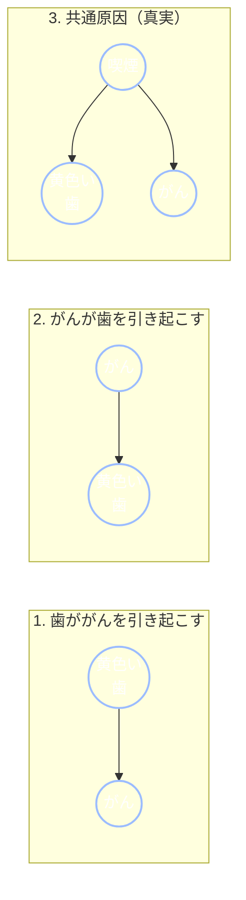
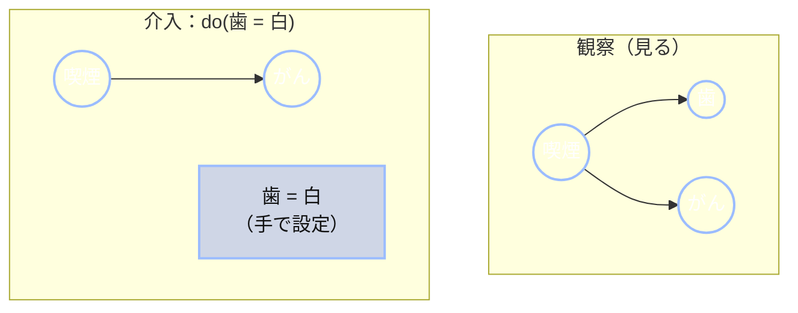

+++
date = "2026-06-16"
title = "因果ベイズネットとdo演算子"
weight = 10
+++

## 矢印が「原因」を意味するとき

これまで、ベイズネットの矢印はひとつの意味しか持っていませんでした。「情報を伝える」という意味です。矢印 $A \to B$ は、両者が確率的に結びついていることを示し、[第9章](../09_conditional_independence/)ではグラフの形から、どの確率変数がどの確率変数を説明するかを読み取る方法を学びました。しかし、矢印は*因果関係*については何も主張していませんでした。フォーク構造 $A \leftarrow B \to C$ では、$A$ と $C$ はどちらかがもう一方の原因でなくても依存関係を持ちます。

この章では、矢印が**原因**を意味すると主張した場合に何が変わるかを問います。その答えは、統計学全体の中で最も重要なアイデアのひとつです。それは、*見ること*と*することの*違いです。

Chibanyは健康診断のためにキャンパスの医療センターを訪れています。

> **医師：**「ところで、歯が黄色い人は肺がんの発症率が高いんですよ。」
>
> **Chibany：**「へえ。じゃあ、歯を白くペイントすれば、リスクを下げられますか？」
>
> **医師：** *(笑いながら)* 「そういうことじゃないんですよ。」

でも、*なぜ*そうじゃないのでしょうか？Chibanyはベイズネットを描くことができます。黄色い歯と肺がんは本当に統計的に関連しています。$P(\text{がん} \mid \text{黄色い歯})$ は実際に $P(\text{がん})$ より高いのです。では、なぜ一方に働きかけてももう一方を変えられないのでしょうか？その答えがこの章の全てです。

---

## 同じ統計、三つの異なるストーリー

これが、因果関係を難しくする落とし穴です。「黄色い歯と肺がんが偶然より高い頻度で同時に起こる」というひとつの観察は、**三つの全く異なる因果構造**と矛盾しません。



ストーリー1は、歯を白くすれば助けになると言います。真実であるストーリー3は、それが役に立たないと言います。**喫煙**が歯を黄ばませ*かつ*がんを引き起こすため、歯は単なる指標であり、真の原因とともに現れる症状に過ぎません。歯を白くすることは、原因に触れずに指標をペイントして隠すことになります。

ここに重要な事実があります。**これら三つのグラフは観察だけでは区別できません。** それらはまったく同じ相関関係を予測します。人々の歯と肺をいくら*観察*しても、どのストーリーが真実かを判別できません（これは[第8章](../08_bayes_nets/)で指摘した構造学習の難しさであり、因果の主張がデータ以上のものを必要とする理由です）。決着をつけるには、*見る*だけでなく、何か*する*必要があります。

### なぜ観察では区別できないか：因数分解が一致する

これは根拠のない話ではなく、第8章の[マルコフ因数分解](../08_bayes_nets/)から直接導かれます。$T$ を黄色い歯、$C$ をがんとします。各グラフは、各ノードの積（各ノードをその親で条件付けたもの）になります。

- **ストーリー1、$T \to C$：** $ P(T, C) = P(T) P(C \mid T).$
- **ストーリー2、$C \to T$：** $ P(T, C) = P(C) P(T \mid C).$

では、これら二つは*異なる*分布でしょうか？違います。どちらも**同じ**同時分布を書く二通りの方法に過ぎません。条件付き確率の定義から、$P(T) P(C \mid T)$ と $P(C) P(T \mid C)$ は両方とも $P(T, C)$ と等しいからです（これはチェーン則を二通りの順序で適用したものです）。矢印の向きを逆にしても、分布は少しも変わりません。因数分解の順序を入れ替えただけです。そして、二変数上でどちらかのグラフが主張できる唯一の独立性の主張は「$T \perp C$」ですが、**どちらもそれを主張しません**（両者の間の矢印は依存関係を意味します）。つまり、ストーリー1と2は全ての観測可能な確率について**同じ**主張をします。同じ同時分布、同じ周辺分布、同じ相関、同じ（空の）独立性の集合です。

**全く同じ条件付き独立性の集合**をエンコードする二つのグラフは**マルコフ同値**と呼ばれ、それらの独立性を共有する全グラフの集合は**マルコフ同値類**と呼ばれます（この用語を[用語集](../../glossary/#markov-equivalence-class-)に追加します）。ストーリー1と2は同じ類に属しており、常に同時分布しか見られない観察は、どちらの矢印の向きが真実かに対して*盲目*です。データには文字通り答えが含まれていません。

**ストーリー3、共通原因については？** これは*三つ*の確率変数（$S$ = 喫煙、$T$、$C$）を扱い、次のように因数分解されます。

$$P(S, T, C) = P(S) P(T \mid S) P(C \mid S).$$

このフォーク構造は独立性の主張を*します*。$T \perp C \mid S$（喫煙しているかどうかがわかれば、歯とがんは独立です。両者の相関は全て喫煙を通じていました）。つまり、書かれた通りではストーリー1と2とはマルコフ同値では**ありません**。しかし落とし穴があります。$S$ は決して*観察されない*のです。喫煙を周辺化する（歯と肺しか見られない観察者がしなければならないように、足し合わせて消す）と、残るのは $T$ と $C$ の単純な依存関係です。

$$P(T, C) = \sum_{s} P(s) P(T \mid s) P(C \mid s),$$

これは $T$ と $C$ が相関している分布であり、*ストーリー1と2が生み出すものと全く同じ観測パターンです。* つまり、三つ全てが同じ歯とがんの相関を再現します。ストーリー1と2はマルコフ同値だから、ストーリー3は隠れた共通原因が同じ周辺的依存関係を生み出すからです。観察はその相関しか見えず、三つの異なるメカニズムがそれを描き出せます。

---

## グラフ手術としての介入

「することの」とは、正式にはどういう意味でしょうか？Chibanyが実際に歯を白くするとします。彼らは手を伸ばして、上流の何かに関係なく、意志の行為として歯の色の変数を「白」に**設定**します。喫煙がそれを決めたのではなく、Chibanyの財布が決めたのです。

その行為は、歯の変数をその通常の原因から切り離します。グラフの観点では、**確率変数 $X$ に介入することは、$X$ に向かう全ての矢印を削除します**。あなたがそれを上書きしたので、親はもはや何の発言権もありません。グラフの他の部分は全く変わりません。



左側は自然なネットワークです。喫煙が歯とがんの両方を引き起こします。右側は $do(\text{歯} = \text{白})$ の後です。喫煙から歯への矢印が**切られています**。介入された変数は、手で設定されており、もはや自由な確率変数ではないことを示すために、丸ではなく**四角**として描かれています。喫煙についての情報を持ちません。重要なのは、喫煙→がんの矢印が*そのまま*であることです。この操作には名前と記法があります。**Pearlのdo演算子**、$do(X = x)$ と記述します。

{}
- $P(Y \mid X = x)$ — $X$ がたまたま $x$ であることを**観察**します。$X = x$ となるケースに*絞り込み*、$X$ がその値を取った原因を継承します。
- $P(Y \mid do(X = x))$ — 介入によって $X$ を $x$ に**設定**します。$X$ をその原因から*切り離し*、その後に何が続くかを問います。

$X$ に $Y$ にも影響する親がある場合（**交絡因子**）、これら二つは異なる数値になります。その差が「相関は因果ではない」という理由の全てです。
{}

---

## $P(Y \mid X)$ vs. $P(Y \mid do(X))$：数値

喫煙/歯/がんのネットワークを具体的にして、両方の量を計算してみましょう。構造は上記のフォーク（共通原因）です。

| 量 | 値 |
|---|---|
| $P(\text{喫煙})$ | $0.30$ |
| $P(\text{黄色い歯} \mid \text{喫煙})$ | $0.80$ |
| $P(\text{黄色い歯} \mid \text{非喫煙})$ | $0.20$ |
| $P(\text{がん} \mid \text{喫煙})$ | $0.15$ |
| $P(\text{がん} \mid \text{非喫煙})$ | $0.01$ |

**歯とがんは喫煙を条件とすると条件付き独立**であることに注意してください。両者の間に矢印はなく、共通の親があるだけです。両者の間のあらゆる関連は、*完全に*交絡因子の仕業です。

**観察：$P(\text{がん} \mid \text{黄色い歯})$。** 黄色い歯を見ると喫煙の可能性が高まり（ベイズの定理：$P(\text{喫煙} \mid \text{黄色}) = \frac{0.8 \times 0.3}{0.8 \times 0.3 + 0.2 \times 0.7} \approx 0.63$）、喫煙者はがんになりやすいです。したがって、

$$P(\text{がん} \mid \text{黄色い歯}) \approx 0.63 \times 0.15 + 0.37 \times 0.01 \approx 0.098.$$

黄色い歯は本当の*警告サイン*です。がんリスクは約$9.8\%$で、$5.2\%$ のベースレートより高いです。

**介入：$P(\text{がん} \mid do(\text{黄色い歯}))$。** 今度は歯を黄色に*ペイント*します（または白くします。同じ論理です）。do演算子が喫煙→歯の矢印を切るので、歯の色は喫煙について何も教えてくれません。がんは依然として喫煙にのみ依存し、それはベースレートのまま変化しません。したがって答えは単純な周辺分布に崩れます。

$$P(\text{がん} \mid do(\text{黄色い歯})) = P(\text{がん}) = 0.30 \times 0.15 + 0.70 \times 0.01 = 0.052.$$

**「同じ」質問から二つの異なる答え。** 黄色い歯を観察する：$9.8\%$。歯を黄色に*設定する*：$5.2\%$ — ちょうどベースレートであり、変化なし。Chibanyの歯を白くしても彼らのがんリスクには何も影響しません。歯は決して原因ではなかったからです。医師は正しかったのです。

{}
$P(Y \mid X)$ と $P(Y \mid do(X))$ はページ上ではほとんど同じように見えます。小さな $do(\cdot)$ の違いだけです。しかし、これらは異なる質問に答え、交絡因子がある場合は異なる数値を与えます。この二つを混同することが、データを読む際の最も一般的な誤りです。「$X$ は $Y$ と関連しているので、$X$ を変えると $Y$ が変わる。」多くの場合、そうはなりません。
{}

---

## Pearlの因果のはしご

Judea Pearlはこれらの区別を、**因果のはしご**の三段に整理しています。それぞれが前の段よりも厳密に多くのものを必要とします。

1. **関連** — $P(Y \mid X)$。*見ること。* 「$X$ を観察することは $Y$ について何を教えてくれるか？」第8章から第9章の全ては、ここに属していました。
2. **介入** — $P(Y \mid do(X))$。*すること。* 「$X$ をある値にした場合、$Y$ はどうなるか？」この章。
3. **反事実** — $P(Y_{x} \mid X = x', Y = y')$。*想像すること。* 「実際に起きたことを踏まえて、$X$ が異なっていたら何が*起きていたか*？」

私たちは1段目と2段目に留まります。3段目 — 反事実、後悔と責任の論理（「もし治療されていたら患者は生存していたか？」）— はさらに多くの構造を必要とし、後の課程のトピックです。

---

## 認知科学の余談：ブリケット検出器

*人間*はこのはしごのどこに位置するのでしょうか？驚くほど高く、しかも早い段階から。古典的な実験で、GopnikとSobelは幼い子どもたちに「ブリケット検出器」を与えました。これは、特定のブロック（「ブリケット」）を置くと光るボックスです。どのブロックがそれを起動させるかを観察し、そして重要なことに*介入する*こと（自分でブロックを置いたり取り除いたりする）によって、3歳という幼い子どもたちがどのブロックがブリケットかを推論し、それを観察だけでなく介入を伴うベイズネット学習に一致する方法で行うことを示しました。つまり、幼児はすでに2段目に登っているのです。（Gopnik & Sobel, 2000；より広いプログラムはGopnik et al., 2004にレビューされています。）因果推論は後期に現れる脆弱な能力ではなく、心の構造の中核的な部分のように見えます。

---

## GenJAX実装

do演算子は美しくシンプルな実装を持ちます。**二つ**の生成関数を書くのです。観察用のものは全てのノードを通常通り親からサンプリングします。介入用のものは**介入されたノードの親を削除**し、それを固定として扱います。二つからのモンテカルロ推定値を比較することで、見ることとすることのギャップが具体的になります。

<!-- validate: tol=0.02 -->
```python
import jax
import jax.numpy as jnp
import jax.random as jr
from genjax import gen, flip, ChoiceMap

# Shared CPT numbers for the smoking / teeth / cancer network.
P_SMOKE = 0.3
P_YELLOW_SMOKE, P_YELLOW_NOSMOKE = 0.8, 0.2
P_CANCER_SMOKE, P_CANCER_NOSMOKE = 0.15, 0.01

@gen
def observational():
    """The natural network: smoking causes both teeth and cancer."""
    smoking = flip(P_SMOKE) @ "smoking"
    teeth = flip(jnp.where(smoking, P_YELLOW_SMOKE, P_YELLOW_NOSMOKE)) @ "teeth"
    cancer = flip(jnp.where(smoking, P_CANCER_SMOKE, P_CANCER_NOSMOKE)) @ "cancer"
    return cancer

@gen
def intervened_yellow():
    """do(teeth = yellow): teeth is set by hand, so its arrow from smoking is
    CUT — we simply don't sample it from smoking anymore. Because nothing
    downstream of teeth depends on it (cancer's only parent is smoking), the
    value we'd set teeth to is irrelevant to cancer — so we just leave it out
    and sample the rest of the graph forward. No conditioning needed."""
    smoking = flip(P_SMOKE) @ "smoking"
    # teeth would go here, but the intervention removes it from the graph.
    cancer = flip(jnp.where(smoking, P_CANCER_SMOKE, P_CANCER_NOSMOKE)) @ "cancer"
    return cancer

N = 60000

# OBSERVE yellow teeth: condition the observational model on teeth = yellow.
obs = ChoiceMap.d({"teeth": 1})
keys = jr.split(jr.key(0), N)
def observe_one(k):
    trace, log_weight = observational.generate(k, obs, ())
    return trace.get_choices()["cancer"].astype(float), log_weight
cancer_obs, log_w = jax.vmap(observe_one)(keys)
w = jnp.exp(log_w - jnp.max(log_w)); w = w / jnp.sum(w)
p_see = jnp.sum(cancer_obs * w)

# DO yellow teeth: just sample the intervened model forward (no conditioning).
cancer_do = jax.vmap(lambda k: intervened_yellow.simulate(k, ()).get_retval())(keys)
p_do = jnp.mean(cancer_do.astype(float))

print(f"P(cancer | teeth = yellow)      = {float(p_see):.3f}   (observe — confounded)")
print(f"P(cancer | do(teeth = yellow))  = {float(p_do):.3f}   (intervene — base rate)")
```

**出力：**
```
P(cancer | teeth = yellow)      = 0.098   (observe — confounded)
P(cancer | do(teeth = yellow))  = 0.052   (intervene — base rate)
```

このコードは抽象的なアイデアを具体的にします。二つのモデルの*唯一の*違いは、`intervened_yellow` が `teeth` の行を削除していることです。その一つの削除 — 歯を喫煙から切り離すこと — がグラフ手術であり、答えを $9.8\%$ から $5.2\%$ のベースレートに変えます。白くすることは何もしません。医師は正しかったのです。そして、二つのモデルの5行の違いの中に、その*理由*が正確に見えます。

{}
一つの相関の背後にある三つの因果ストーリーを区別し、グラフ手術によってdo演算子を実行し、$P(Y \mid X)$ と $P(Y \mid do(X))$ を計算してそれらが異なるときを見極め、推論タスクをPearlのはしごに配置できます。これは*因果推論* — 何を*期待する*かではなく、何を*変える*かを学ぶ科学 — の概念的核心です。次の[第11章](../11_information_theory/)では、これら全てを — 驚き、不確実性、コライダー — **情報**という共通の通貨で測ることで本筋を締めくくります。
{}

---

## 演習

{}
1. **どのストーリー？** 蛍光ペンを使う学生の方が成績が良いことを観察しました。これと矛盾しない三つの因果グラフ（蛍光ペン→成績；成績→蛍光ペン；共通原因→両方）を描いてください。それらを区別するためにどのような介入が必要ですか？
2. **手で計算。** 喫煙ネットワークのCPTを使って、$P(\text{がん} \mid do(\text{非喫煙}))$ — つまり、禁煙 — を計算してください。$P(\text{がん} \mid \text{非喫煙})$（非喫煙者を観察すること）とどう比べますか？ここで両者は等しいですか？なぜですか？（ヒント：喫煙に親はありますか？）
3. **コードで介入する。** `intervened_yellow` を修正して $do(\text{喫煙} = \text{false})$ — 禁煙 — をモデル化し、モンテカルロによって $P(\text{がん} \mid do(\text{非喫煙}))$ を推定してください。`observational` モデルからの観測的な $P(\text{がん} \mid \text{非喫煙})$ と比較してください。
{}

付属のノートブックでこれらをインタラクティブに解説しています：

**📓 [Colabで開く：`10_causal_bayes_nets.ipynb`](https://colab.research.google.com/github/josephausterweil/probintro/blob/main/notebooks/10_causal_bayes_nets.ipynb)**

---

このチュートリアルシリーズへの多大なるご支援に、[JPPCA](https://jpcca.org/)に特別な感謝を申し上げます。

---

## 参考文献

- Gopnik, A., & Sobel, D. M. (2000). Detecting blickets: How young children use information about novel causal powers in categorization and induction. *Child Development, 71*(5), 1205–1222. <https://doi.org/10.1111/1467-8624.00224>
- Gopnik, A., Glymour, C., Sobel, D. M., Schulz, L. E., Kushnir, T., & Danks, D. (2004). A theory of causal learning in children: Causal maps and Bayes nets. *Psychological Review, 111*(1), 3–32. <https://doi.org/10.1037/0033-295X.111.1.3>
- Pearl, J. (2009). *Causality: Models, reasoning, and inference* (2nd ed.). Cambridge University Press.
- Pearl, J., & Mackenzie, D. (2018). *The book of why: The new science of cause and effect*. Basic Books.
