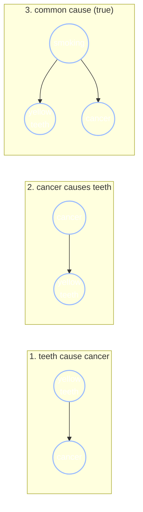
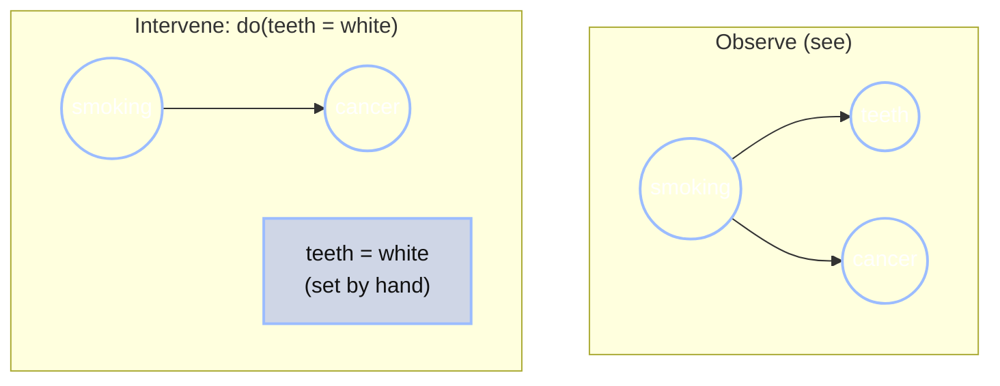

+++
date = "2026-06-16"
title = "Causal Bayes Nets and the Do-Operator"
weight = 10
+++

## When the Arrows Mean *Causes*

So far, the arrows in our Bayes nets have meant one specific thing: "carries information about." An arrow $A \to B$ said the two were probabilistically linked, and [Chapter 9](../09_conditional_independence/) taught us to read exactly *which* variables inform which off the graph's shape. But the arrows never claimed anything about *causation*. A fork $A \leftarrow B \to C$ makes $A$ and $C$ dependent without either one causing the other.

This chapter asks what changes when we insist the arrows mean **causes** — and the answer is one of the most important ideas in all of statistics. It's the difference between *seeing* and *doing*.

Chibany is at the campus health center for a checkup.

> **Doctor:** "Just so you know, people with yellow teeth have a higher rate of lung cancer."
>
> **Chibany:** "Huh. So, I should paint my teeth white, then? To lower my risk?"
>
> **Doctor:** *(laughing)* "That's not how it works."

But *why* isn't that how it works? Chibany can draw the Bayes net: yellow teeth and lung cancer really are statistically associated — $P(\text{cancer} \mid \text{yellow teeth})$ really is higher than $P(\text{cancer})$. So why shouldn't acting on one change the other? Answering that is the whole chapter.

---

## The Same Statistics, Three Different Stories

Here's the catch that makes causation subtle. The single observation "yellow teeth and lung cancer occur together more often than chance" is compatible with **three completely different causal structures**:



Story 1 says whitening would help. Story 3 — the true one — says it wouldn't: **smoking** stains the teeth *and* causes the cancer, so the teeth are just a marker, a symptom riding alongside the real culprit. Whitening the teeth paints over the marker without touching the cause.

Here is the crucial fact: **these three graphs are indistinguishable from observation alone.** They predict the exact same correlations. No amount of *watching* people's teeth and lungs can tell you which story is true. (This is the structure-learning difficulty we flagged back in [Chapter 8](../08_bayes_nets/) — and the reason causal claims need more than data.) To break the tie, you need to *do* something, not just *see*.

### Why observation can't tell them apart: the factorizations agree

This isn't hand-waving — it falls right out of the [Markov factorization](../08_bayes_nets/) from Chapter 8. Write $T$ for yellow teeth and $C$ for cancer. Each graph turns into a product of one factor per node (each node given its parents):

- **Story 1, $T \to C$:** $ P(T, C) = P(T) P(C \mid T).$
- **Story 2, $C \to T$:** $ P(T, C) = P(C) P(T \mid C).$

Now — are these two *different* distributions? No. Both are just two ways of writing the **same** joint, because the definition of conditional probability says $P(T) P(C \mid T)$ and $P(C) P(T \mid C)$ both equal $P(T, C)$ exactly (it's the chain rule, applied in the two possible orders). Reverse the arrow and you haven't changed the distribution one bit — you've only re-ordered the factorization. And the *only* independence statement either graph could make over two variables is "$T \perp C$" — which **neither one asserts** (an arrow between them means dependent). So stories 1 and 2 make **identical** claims about every observable probability: same joint, same marginals, same correlation, same (empty) set of independencies.

Two graphs that encode the **exact same set of conditional independencies** are called **Markov equivalent**, and the collection of all graphs sharing those independencies is a **Markov equivalence class** (we add this term to the [glossary](../../glossary/#markov-equivalence-class-)). Stories 1 and 2 sit in the same class — so observation, which only ever sees the joint distribution, is *blind* to which arrow direction is the true one. The data literally does not contain the answer.

**What about Story 3, the common cause?** It lives over *three* variables ($S$ = smoking, plus $T$ and $C$), and factorizes as

$$P(S, T, C) = P(S) P(T \mid S) P(C \mid S).$$

This fork *does* make an independence claim — $T \perp C \mid S$ (teeth and cancer are independent **once you know** whether the person smokes; all their correlation ran through smoking). So it is **not** Markov equivalent to stories 1 and 2 as written. But here's the catch: we never *observe* $S$. Marginalize smoking out — sum it away, the way an observer who only sees teeth and lungs must — and what's left is a plain dependence between $T$ and $C$:

$$P(T, C) = \sum_{s} P(s) P(T \mid s) P(C \mid s),$$

a distribution in which $T$ and $C$ are correlated — *exactly the observable pattern stories 1 and 2 produce.* So all three reproduce the same teeth–cancer correlation: stories 1 and 2 because they are Markov equivalent, and story 3 because its hidden common cause manufactures the same marginal dependence. Observation sees only that correlation, and three different mechanisms can paint it.

---

## Intervention as Graph Surgery

What does "doing" mean, formally? Suppose Chibany actually whitens their teeth. They reach in and **set** the teeth-color variable to "white," by an act of will — not because of anything upstream. Smoking didn't decide it; Chibany's wallet did.

That act severs the teeth variable from its usual cause. In graph terms, **intervening on a variable $X$ deletes all the arrows pointing into $X$** — its parents no longer have any say, because you've overridden them. Everything else in the graph stays exactly as it was.



On the left, the natural network: smoking causes both teeth and cancer. On the right, after $do(\text{teeth} = \text{white})$: the arrow from smoking into teeth is **cut**. The intervened variable is drawn as a **square** rather than a circle, to signal it is *set by hand* and is no longer a free random variable — it carries no information about smoking. Crucially, the smoking→cancer arrow is *untouched*. This operation has a name and a notation, **Pearl's do-operator**, written $do(X = x)$.

{}
- $P(Y \mid X = x)$ — **observe** $X$ happens to be $x$. You *filter* to the cases where $X = x$, inheriting whatever made $X$ take that value.
- $P(Y \mid do(X = x))$ — **set** $X$ to $x$ by intervention. You *cut* $X$ off from its causes, then ask what follows.

When $X$ has parents that also affect $Y$ — a **confounder** — these two are different numbers. That difference is the entire reason "correlation is not causation."
{}

---

## $P(Y \mid X)$ vs. $P(Y \mid do(X))$: the Numbers

Let's make the smoking/teeth/cancer network concrete and compute both quantities. The structure is the fork (common cause) from above:

| Quantity | Value |
|---|---|
| $P(\text{smoking})$ | $0.30$ |
| $P(\text{yellow teeth} \mid \text{smoking})$ | $0.80$ |
| $P(\text{yellow teeth} \mid \text{no smoking})$ | $0.20$ |
| $P(\text{cancer} \mid \text{smoking})$ | $0.15$ |
| $P(\text{cancer} \mid \text{no smoking})$ | $0.01$ |

Note that **teeth and cancer are conditionally independent given smoking** — there's no arrow between them, only a shared parent. Any association between them is *entirely* the confounder's doing.

**Observation: $P(\text{cancer} \mid \text{yellow teeth})$.** Seeing yellow teeth makes smoking more likely (Bayes' rule: $P(\text{smoking} \mid \text{yellow}) = \frac{0.8 \times 0.3}{0.8 \times 0.3 + 0.2 \times 0.7} \approx 0.63$), and smokers get cancer more often. So:

$$P(\text{cancer} \mid \text{yellow teeth}) \approx 0.63 \times 0.15 + 0.37 \times 0.01 \approx 0.098.$$

Yellow teeth are a real *warning sign* — about $9.8\%$ cancer risk, versus the $5.2\%$ base rate.

**Intervention: $P(\text{cancer} \mid do(\text{yellow teeth}))$.** Now we *paint* the teeth yellow (or whiten them — same logic). The do-operator cuts the smoking→teeth arrow, so the teeth color no longer tells us anything about smoking. Cancer still depends only on smoking, which is untouched at its base rate. So the answer collapses to the plain marginal:

$$P(\text{cancer} \mid do(\text{yellow teeth})) = P(\text{cancer}) = 0.30 \times 0.15 + 0.70 \times 0.01 = 0.052.$$

**Two different answers from the "same" question.** Observing yellow teeth: $9.8\%$. *Setting* them yellow: $5.2\%$ — exactly the base rate, no change. Whitening Chibany's teeth would do nothing to their cancer risk, because the teeth were never a cause. The doctor was right.

{}
$P(Y \mid X)$ and $P(Y \mid do(X))$ look almost identical on the page — one little $do(\cdot)$ apart. But they answer different questions and, whenever there's a confounder, give different numbers. Confusing them is the single most common error in reading data: *"X is associated with Y, so changing X will change Y."* Often it won't.
{}

---

## Pearl's Ladder of Causation

Judea Pearl organizes these distinctions into three rungs of a **ladder of causation**, each requiring strictly more than the last:

1. **Association** — $P(Y \mid X)$. *Seeing.* "What does observing $X$ tell me about $Y$?" Everything in Chapters 8–9 lived here.
2. **Intervention** — $P(Y \mid do(X))$. *Doing.* "What happens to $Y$ if I *make* $X$ take a value?" This chapter.
3. **Counterfactuals** — $P(Y_{x} \mid X = x', Y = y')$. *Imagining.* "Given what actually happened, what *would have* happened if $X$ had been different?"

We stay on rungs 1 and 2. Rung 3 — counterfactuals, the logic of regret and responsibility ("would the patient have survived *if* they'd been treated?") — needs still more structure and is a topic for a later course.

---

## A Cognitive-Science Aside: the Blicket Detector

Where do *humans* sit on this ladder? Strikingly high, and early. In a classic experiment, Gopnik and Sobel gave young children a "blicket detector" — a box that lights up when certain blocks ("blickets") are placed on it. By watching which blocks made it activate, and crucially by *intervening* — placing and removing blocks themselves — children as young as three inferred which blocks were blickets, and did so in a way that matches Bayes-net learning *with interventions*, not mere association. Toddlers, it turns out, are already climbing to rung 2. (Gopnik & Sobel, 2000; the broader program is reviewed in Gopnik et al., 2004.) Causal reasoning isn't a late, fragile achievement — it looks like a core part of how minds are built.

---

## GenJAX Implementation

The do-operator has a beautifully simple implementation: write **two** generative functions. The observational one samples every node from its parents as usual; the interventional one **drops the intervened node's parents** and treats it as fixed. Comparing Monte Carlo estimates from the two makes the see/do gap concrete.

<!-- validate: tol=0.02 -->
```python
import jax
import jax.numpy as jnp
import jax.random as jr
from genjax import gen, flip, ChoiceMap

# Shared CPT numbers for the smoking / teeth / cancer network.
P_SMOKE = 0.3
P_YELLOW_SMOKE, P_YELLOW_NOSMOKE = 0.8, 0.2
P_CANCER_SMOKE, P_CANCER_NOSMOKE = 0.15, 0.01

@gen
def observational():
    """The natural network: smoking causes both teeth and cancer."""
    smoking = flip(P_SMOKE) @ "smoking"
    teeth = flip(jnp.where(smoking, P_YELLOW_SMOKE, P_YELLOW_NOSMOKE)) @ "teeth"
    cancer = flip(jnp.where(smoking, P_CANCER_SMOKE, P_CANCER_NOSMOKE)) @ "cancer"
    return cancer

@gen
def intervened_yellow():
    """do(teeth = yellow): teeth is set by hand, so its arrow from smoking is
    CUT — we simply don't sample it from smoking anymore. Because nothing
    downstream of teeth depends on it (cancer's only parent is smoking), the
    value we'd set teeth to is irrelevant to cancer — so we just leave it out
    and sample the rest of the graph forward. No conditioning needed."""
    smoking = flip(P_SMOKE) @ "smoking"
    # teeth would go here, but the intervention removes it from the graph.
    cancer = flip(jnp.where(smoking, P_CANCER_SMOKE, P_CANCER_NOSMOKE)) @ "cancer"
    return cancer

N = 60000

# OBSERVE yellow teeth: condition the observational model on teeth = yellow.
obs = ChoiceMap.d({"teeth": 1})
keys = jr.split(jr.key(0), N)
def observe_one(k):
    trace, log_weight = observational.generate(k, obs, ())
    return trace.get_choices()["cancer"].astype(float), log_weight
cancer_obs, log_w = jax.vmap(observe_one)(keys)
w = jnp.exp(log_w - jnp.max(log_w)); w = w / jnp.sum(w)
p_see = jnp.sum(cancer_obs * w)

# DO yellow teeth: just sample the intervened model forward (no conditioning).
cancer_do = jax.vmap(lambda k: intervened_yellow.simulate(k, ()).get_retval())(keys)
p_do = jnp.mean(cancer_do.astype(float))

print(f"P(cancer | teeth = yellow)      = {float(p_see):.3f}   (observe — confounded)")
print(f"P(cancer | do(teeth = yellow))  = {float(p_do):.3f}   (intervene — base rate)")
```

**Output:**
```
P(cancer | teeth = yellow)      = 0.098   (observe — confounded)
P(cancer | do(teeth = yellow))  = 0.052   (intervene — base rate)
```

The code makes the abstract idea tangible: the *only* difference between the two models is that `intervened_yellow` deletes the `teeth` line. That one deletion — cutting teeth off from smoking — is graph surgery, and it changes the answer from $9.8\%$ to the $5.2\%$ base rate. Whitening does nothing; the doctor was right; and you can see exactly *why* in five lines of difference between two models.

{}
You can tell apart the three causal stories behind a single correlation, perform the do-operator by graph surgery, compute $P(Y \mid X)$ and $P(Y \mid do(X))$ and see when they differ, and place a reasoning task on Pearl's ladder. This is the conceptual core of *causal inference* — the science of learning what to *change*, not just what to *expect*. Next, [Chapter 11](../11_information_theory/) closes the spine by measuring all of this — surprise, uncertainty, and the collider — in the common currency of **information**.
{}

---

## Exercises

{}
1. **Which story?** You observe that students who use highlighters get better grades. Draw three causal graphs (highlighters → grades; grades → highlighters; common cause → both) consistent with this. What intervention would distinguish them?
2. **Do by hand.** Using the smoking-network CPT, compute $P(\text{cancer} \mid do(\text{no smoking}))$ — i.e., a smoking ban. How does it compare to $P(\text{cancer} \mid \text{no smoking})$ (observing a non-smoker)? Are they equal here? Why? (Hint: does smoking have any parents?)
3. **Intervene in code.** Modify `intervened_yellow` to instead model $do(\text{smoking} = \text{false})$ — a smoking ban — and estimate $P(\text{cancer} \mid do(\text{no smoking}))$ by Monte Carlo. Compare to the observational $P(\text{cancer} \mid \text{no smoking})$ from the `observational` model.
{}

A companion notebook works through these interactively:

**📓 [Open in Colab: `10_causal_bayes_nets.ipynb`](https://colab.research.google.com/github/josephausterweil/probintro/blob/main/notebooks/10_causal_bayes_nets.ipynb)**

---

## References

- Gopnik, A., & Sobel, D. M. (2000). Detecting blickets: How young children use information about novel causal powers in categorization and induction. *Child Development, 71*(5), 1205–1222. <https://doi.org/10.1111/1467-8624.00224>
- Gopnik, A., Glymour, C., Sobel, D. M., Schulz, L. E., Kushnir, T., & Danks, D. (2004). A theory of causal learning in children: Causal maps and Bayes nets. *Psychological Review, 111*(1), 3–32. <https://doi.org/10.1037/0033-295X.111.1.3>
- Pearl, J. (2009). *Causality: Models, reasoning, and inference* (2nd ed.). Cambridge University Press.
- Pearl, J., & Mackenzie, D. (2018). *The book of why: The new science of cause and effect*. Basic Books.

---

Special thanks to [JPPCA](https://jpcca.org/) for their generous support of this tutorial series.
