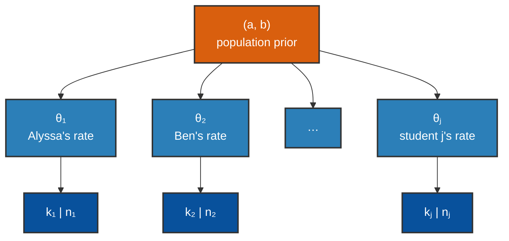

+++
date = "2026-06-01"
title = "Hierarchical Bayes"
weight = 12
toc = true
+++

## Hierarchical Bayes: learning the prior itself

In [Chapter 7](../07_generalization/no-free-lunch-and-summary/) we ended on an uncomfortable truth. The **No
Free Lunch** result said a learner that assumes nothing learns nothing: generalization *requires* a prior — a
commitment, before seeing data, about which patterns are even worth considering. We kept choosing that prior by
hand.

This chapter answers the obvious next question: **does the prior have to be hand-picked forever?** Could a
learner *watch many related problems* and **infer the prior** from them — acquiring its inductive bias from
experience instead of being born with it? That is the idea of **hierarchical Bayes**, and it is one of the most
useful moves in all of Bayesian modeling.

{}
This chapter recombines two moves you already know — it introduces almost no new machinery:

- **Learning one parameter from data.** In [Chapter 4](../04_bayesian_learning/) you watched a posterior over a
  Gaussian's mean $\mu$ form as a **compromise between the prior and the data** (precision-weighted averaging).
  Hierarchy is that same move, done for *many* parameters at once, with the parameters **sharing a prior**.
- **Importance sampling.** From [Chapter 5](../05_mixture_models/) and the GenJAX tutorial you know how to
  weight samples by how well they explain the data. We reuse it unchanged to infer the shared prior.

The **one genuinely new symbol** is the **Beta distribution**, which we define from scratch in §2 — it is the
natural prior for a *probability* (a number between 0 and 1), and we lean on it for the rest of the chapter.
{}

---

## Two extremes that both feel wrong

Chibany has been keeping a journal: for each student who brings them a bento, they record whether it was
**tonkatsu** or **hamburger**. After a while the journal looks like this — each student with a tonkatsu count
$k_i$ out of their total bento count $n_i$:

| Student | Tonkatsu $k_i$ | Total $n_i$ | Raw fraction $k_i / n_i$ |
|---|---:|---:|---:|
| Alyssa | 70 | 100 | 0.70 |
| Ben | 28 | 40 | 0.70 |
| Carmen | 6 | 10 | 0.60 |
| Diego | 3 | 5 | 0.60 |
| Emi | 2 | 2 | **1.00** |
| Farid | 0 | 1 | **0.00** |

Chibany wants, for each student, a believable estimate of $\theta_i$ — that student's underlying probability of
bringing tonkatsu. Two obvious strategies both fail:

<div style="display:flex; flex-wrap:wrap; gap:1.5rem; margin:1rem 0;">
<div style="flex:1; min-width:260px;">

**No pooling — estimate each student alone.** Just use the raw fraction $k_i / n_i$. For Alyssa (70/100) that's
fine. But **Emi brought 2 bentos, both tonkatsu**, so this says $\theta_{\text{Emi}} = 1.00$ — Emi *always*
brings tonkatsu, with certainty, on the strength of two data points. **Farid (0/1)** is even worse the other
way: one bento, a hamburger, and we declare him a 0%-tonkatsu person who will *never* bring tonkatsu. Nobody
believes either of these.

</div>
<div style="flex:1; min-width:260px;">

**Complete pooling — one shared rate for everyone.** Lump all the bentos together: $109$ tonkatsu out of $158$,
so $\theta = 109/158 \approx 0.69$ for *everyone* (really $0.690$, dominated by the heavy bringers Alyssa and
Ben). This fixes the Emi/Farid absurdity, but now it **throws away the real differences** between students —
and we have good reason to think students differ.

</div>
</div>

Neither extreme is right. The fix is the principled middle, **partial pooling**: estimate each $\theta_i$
*using that student's own data, pulled toward what the other students do.* A student with lots of data stays
near their own fraction; a student with almost no data leans heavily on the group. This is exactly the
**"prior vs. data compromise"** you met as precision-weighting in [Chapter 4](../04_bayesian_learning/) — only
now the *prior* is the population of other students, and it is **learned**, not assumed.

{}
The danger of no-pooling is loudest for **light-data** students: one or two bentos give raw fractions of 0.00
or 1.00 — maximally confident estimates from minimal evidence. Watch what partial pooling does to Emi and
Farid specifically; they are the whole point.
{}

Here is the no-pooling pathology in code — raw fractions with wildly different amounts of data behind them:

```python
import jax.numpy as jnp

# (student, tonkatsu count k_i, total bentos n_i)
names = ["Alyssa", "Ben", "Carmen", "Diego", "Emi", "Farid"]
k = jnp.array([70, 28, 6, 3, 2, 0])     # tonkatsu counts
n = jnp.array([100, 40, 10, 5, 2, 1])   # total bentos

raw_fraction = k / n
for name, kf, nf, r in zip(names, k, n, raw_fraction):
    print(f"  {name:7s} {int(kf):>2d}/{int(nf):<3d} -> raw estimate {float(r):.2f}")
```

**Output:**
```
  Alyssa  70/100 -> raw estimate 0.70
  Ben     28/40  -> raw estimate 0.70
  Carmen   6/10  -> raw estimate 0.60
  Diego    3/5   -> raw estimate 0.60
  Emi      2/2   -> raw estimate 1.00
  Farid    0/1   -> raw estimate 0.00
```

Emi at 1.00 and Farid at 0.00 are the tell: no-pooling lets one or two bentos masquerade as certainty — in
*either* direction.

---

## The Beta distribution (a prior for a probability)

To pool partially we need a **prior over a rate** $\theta \in [0, 1]$ — a probability distribution whose
outcomes are themselves probabilities. The natural choice is the **Beta distribution**, written
$\text{Beta}(a, b)$, and it is the one new piece of notation in this chapter.

{}
$\text{Beta}(a, b)$ is a probability distribution over a single number $\theta$ between 0 and 1. It has two
**shape parameters** $a > 0$ and $b > 0$, and the most useful way to read them is as a **soft count**:

> $a$ is "how many prior tonkatsu you've imagined seeing," and $b$ is "how many prior hamburgers."

Its mean is

$$\mathbb{E}[\theta] = \frac{a}{a + b},$$

and the total $a + b$ acts like a **prior sample size** — the bigger it is, the more sharply the distribution
concentrates around its mean. A few shapes worth knowing:

- $\text{Beta}(1, 1)$ is **flat** — every rate equally likely (the uniform distribution on $[0,1]$).
- $\text{Beta}(8, 2)$ is **peaked near 0.8** — "I strongly expect a high tonkatsu rate."
- $\text{Beta}(2, 5)$ is **skewed low**, mean $\approx 0.29$ — "probably a low rate."
{}

![Three Beta density curves over θ in [0,1]: a flat light-blue line for Beta(1,1) (uniform), a dark-blue curve for Beta(8,2) peaked near 0.8, and an orange curve for Beta(2,5) skewed toward low values with its peak (mode) near 0.2 and mean near 0.29. The figure illustrates that (a,b) behave like a soft count of prior tonkatsu vs. hamburger, with the mean at a/(a+b).](../../images/intro2/hb_beta_shapes.png)

The reason the Beta is *the* prior for a rate is a happy algebraic accident called **conjugacy** — the prior
and the posterior come out in the *same family*, so updating just shifts the parameters. You already met this
in a different costume in [Chapter 4](../04_bayesian_learning/): there, a Gaussian prior on a Gaussian mean
gave a Gaussian posterior. Here, a **Beta prior on a Bernoulli rate gives a Beta
posterior** — and the update is just *counting*:

$$\text{prior } \text{Beta}(a, b) \;+\; \text{data } (k \text{ tonkatsu out of } n) \;\longrightarrow\;
\text{posterior } \text{Beta}(a + k,\; b + n - k).$$

You add the observed tonkatsu to $a$ and the observed hamburgers to $b$. That's the whole update. The posterior
mean is therefore

$$\mathbb{E}[\theta \mid k, n] = \frac{a + k}{a + b + n},$$

which is exactly a **blend of the prior soft-count and the real data** — and, crucially, the blend tips toward
the data as $n$ grows. Hold onto that formula; it *is* shrinkage, and the next section reads it off directly.

---

## Partial pooling and shrinkage

Now suppose the six students share a common population prior $\text{Beta}(a, b)$ — say
$\text{Beta}(6, 4)$, encoding "the typical student is about 60% tonkatsu ($\tfrac{6}{6+4} = 0.6$), with a prior
strength of $a + b = 10$ bentos." Each student's estimate becomes their own Beta-Binomial posterior mean,
$(a + k_i) / (a + b + n_i)$:

```python
import jax.numpy as jnp

names = ["Alyssa", "Ben", "Carmen", "Diego", "Emi", "Farid"]
k = jnp.array([70, 28, 6, 3, 2, 0])
n = jnp.array([100, 40, 10, 5, 2, 1])

a, b = 6.0, 4.0                       # shared population prior: mean 0.6, strength 10
population_mean = a / (a + b)

raw = k / n
posterior_mean = (a + k) / (a + b + n)   # Beta-Binomial posterior mean per student

print(f"population mean = {population_mean:.2f}\n")
for name, r, pm in zip(names, raw, posterior_mean):
    print(f"  {name:7s} raw {float(r):.2f} -> pooled {float(pm):.3f}  (shift {float(pm - r):+.3f})")
```

**Output:**
```
population mean = 0.60

  Alyssa  raw 0.70 -> pooled 0.691  (shift -0.009)
  Ben     raw 0.70 -> pooled 0.680  (shift -0.020)
  Carmen  raw 0.60 -> pooled 0.600  (shift +0.000)
  Diego   raw 0.60 -> pooled 0.600  (shift +0.000)
  Emi     raw 1.00 -> pooled 0.667  (shift -0.333)
  Farid   raw 0.00 -> pooled 0.545  (shift +0.545)
```

Read the shifts and the whole idea is there:

- **Alyssa (70/100)** barely moves — 0.70 → 0.691. With 100 bentos, their own data dominates the shared prior.
- **Emi (2/2) and Farid (0/1)** move the most — and in *opposite* directions: Emi crashes down from the absurd
  1.00 (to 0.667) while Farid is pulled up from the absurd 0.00 (to 0.545), both toward the population. With
  almost no data, they lean almost entirely on the group, wherever they started.
- **Carmen and Diego** sit *exactly* at the population mean already (0.60), so they don't move at all —
  pooling pulls you toward the group only to the extent you disagree with it.

This pull-toward-the-group is called **shrinkage**, and it is the signature behavior of a hierarchical model:
**estimates with little data are shrunk hardest toward the shared prior; estimates with lots of data are left
almost alone.** The model **borrows strength** across students automatically — no rule had to say "trust Emi
less," it falls out of $(a + k)/(a + b + n)$.

![A two-column plot of shrinkage. The left column shows each student's raw fraction k_i/n_i; the right column shows their partial-pooling posterior mean; a line connects each student's two points. An orange dashed horizontal line marks the population mean at 0.60. The two light-data students, drawn with small markers, start at opposite extremes and are both pulled toward the population mean: Emi (2/2) sits at 1.00 on the left and is pulled down to 0.667, while Farid (0/1) sits at 0.00 on the left and is pulled up to 0.545. Alyssa (70/100), drawn with a large marker, sits at 0.70 on both sides — barely moving. Marker size encodes how many bentos each student has.](../../images/intro2/hb_shrinkage.png)

The figure makes the dependence on data size visual: marker size grows with $n_i$, and the **small markers
(little data) travel the farthest** toward the population line, while the big markers stay put.

---

## The hierarchical generative process

What we just computed by formula has a **generative story** — a recipe for how the data could have been
produced — and writing it down is what makes it a *hierarchical* model. There are three levels:

1. A population prior $\text{Beta}(a, b)$ sits at the top.
2. Each student draws their own rate from it: $\theta_i \sim \text{Beta}(a, b)$.
3. Each student's bentos are tonkatsu-or-not at that rate: $k_i \sim \text{Binomial}(n_i, \theta_i)$.

In symbols, the **three-level hierarchy** is:

$$(a, b) \sim \text{prior}, \qquad \theta_i \mid a, b \sim \text{Beta}(a, b), \qquad
k_i \mid \theta_i \sim \text{Binomial}(n_i, \theta_i).$$

{}
$\text{Binomial}(n, \theta)$ is the distribution of the **count of successes in $n$ independent yes/no trials,
each with success probability $\theta$** — here, the number of tonkatsu bentos out of $n$. It's just $n$
Bernoulli (`flip`) trials added up. We met `flip` (one trial) throughout the GenJAX tutorial; the Binomial is
the count of many such flips.
{}

The dependence structure — who is drawn from whom — is a picture of arrows. The shared $(a, b)$ feeds *every*
student's $\theta_i$, and each $\theta_i$ feeds that student's count $k_i$:



The shared parent $(a, b)$ is *why* the students aren't independent: learning about one student's rate tells you
a little about the population, which tells you a little about every *other* student. That coupling is exactly
the channel through which strength is borrowed.

Here is the generative process as a GenJAX model — one `@gen` function for a single student, run across a whole
population with `jax.vmap`:

```python
import jax
import jax.numpy as jnp
import jax.random as jr
from genjax import gen, beta, binomial

@gen
def student_tonkatsu(a, b, n):
    """One student: draw a personal rate from the population Beta(a,b),
    then draw that student's tonkatsu count from Binomial(n, theta)."""
    theta = beta(a, b) @ "theta"          # this student's underlying rate
    k = binomial(n, theta) @ "k"          # their tonkatsu count out of n bentos
    return k

# Forward-simulate a population of 6 students with different bento counts n_i.
# (n is passed as a float — GenJAX's binomial wants theta and n to share a dtype.)
a, b = 6.0, 4.0
n_per_student = jnp.array([100.0, 40.0, 10.0, 5.0, 2.0, 1.0])
keys = jr.split(jr.PRNGKey(2), 6)

def simulate_one(key, n):
    return student_tonkatsu.simulate(key, (a, b, n)).get_retval()

sim_k = jax.vmap(simulate_one)(keys, n_per_student)
print("simulated tonkatsu counts:", [int(x) for x in sim_k])
print("out of bento counts:     ", [int(x) for x in n_per_student])
```

**Output:**
```
simulated tonkatsu counts: [69, 30, 4, 2, 2, 1]
out of bento counts:      [100, 40, 10, 5, 2, 1]
```

The heavy bringers (100, 40 bentos) land near the 0.6 population rate (69/100, 30/40); the light bringers are
scattered (4/10, 2/2, 1/1) — which is *precisely* why their raw fractions can't be trusted, and why the
shared prior matters.

---

## Where does the population prior come from?

So far we *fixed* $(a, b) = (6, 4)$ by hand. But the whole promise of this chapter was to **learn** the prior.
The hierarchical model already contains the answer: $(a, b)$ is itself a latent variable with its own
distribution, so we can **infer it from the students' data** — the same way we've inferred every other unknown
in this tutorial.

We put a broad, weakly-informative **hyperprior** on $(a, b)$ — a *prior on the population prior*, just "some
plausible range of population shapes, nothing committed" (below, a uniform box over $0.5 \le a, b \le 20$;
widen it and the estimate barely moves until the bounds get extreme) — observe all the students' counts, and
weight candidate $(a, b)$ values by how well they explain the data. This is plain **importance sampling** — the exact tool from
[Chapter 5](../05_mixture_models/) and the GenJAX tutorial, now aimed one level up at the hyperparameters.

To score a candidate $(a, b)$ we need the probability it assigns to a student's count $k_i$ — but $(a, b)$
only tells us the *distribution* of that student's rate $\theta_i$, not its value. So we **average over all
possible $\theta_i$**: this is the same Beta-Binomial conjugacy that let us update
$\text{Beta}(a,b) \to \text{Beta}(a+k, b+n-k)$ in §2, used the other direction. The average has a clean closed
form (the **Beta-Binomial** marginal):

$$p(k_i \mid n_i, a, b) = \binom{n_i}{k_i}\, \frac{B(a + k_i,\; b + n_i - k_i)}{B(a, b)},$$

where $\binom{n_i}{k_i}$ is the binomial coefficient ("$n_i$ choose $k_i$") and $B(\cdot,\cdot)$ is the Beta
function — the normalizer of the Beta distribution, whose log is `betaln` in JAX. We don't need to memorize it;
we just sum its log across students to score a population:

<!-- validate: tol=1.5 -->
```python
import jax
import jax.numpy as jnp
import jax.random as jr
from jax.scipy.special import betaln, gammaln

k = jnp.array([70, 28, 6, 3, 2, 0])
n = jnp.array([100, 40, 10, 5, 2, 1])

def log_binom_coeff(n, k):
    # gammaln = log of the Gamma function (a continuous factorial); this is log of "n choose k".
    return gammaln(n + 1) - gammaln(k + 1) - gammaln(n - k + 1)

def population_loglik(a, b):
    """log p(all students' counts | a, b), theta integrated out (Beta-Binomial)."""
    per_student = (log_binom_coeff(n, k)
                   + betaln(a + k, b + n - k)
                   - betaln(a, b))
    return per_student.sum()

# Importance sampling over (a, b): draw many candidate populations from a broad
# hyperprior, weight each by how well it explains the data, report the weighted mean.
key = jr.PRNGKey(0)
ka, kb = jr.split(key)
N = 20000
a_samples = jr.uniform(ka, (N,), minval=0.5, maxval=20.0)   # broad hyperprior on a
b_samples = jr.uniform(kb, (N,), minval=0.5, maxval=20.0)   # broad hyperprior on b

log_w = jax.vmap(population_loglik)(a_samples, b_samples)
w = jnp.exp(log_w - log_w.max())
w = w / w.sum()

a_post = jnp.sum(w * a_samples)
b_post = jnp.sum(w * b_samples)
print(f"inferred a ~= {float(a_post):.2f}")
print(f"inferred b ~= {float(b_post):.2f}")
print(f"implied population tonkatsu rate ~= {float(a_post / (a_post + b_post)):.3f}")
```

**Output:**
```
inferred a ~= 14.57
inferred b ~= 8.12
implied population tonkatsu rate ~= 0.642
```

The data alone pinned the population rate at about **0.64** — in the same ballpark as the 0.60 we had
hand-picked, but now *learned* from the six students rather than assumed (it lands a bit higher because the
heavy bringers, Alyssa and Ben at 0.70, carry most of the evidence). We never told the model the population
mean; it inferred it, and that inferred prior is what then shrinks each student's estimate.

{}
As in the [Chapter 5](../05_mixture_models/) mixture inference, importance sampling over a broad hyperprior is
a *blunt* tool — most sampled $(a, b)$ explain the data poorly, so only a few carry real weight, and the
estimate wobbles from run to run. That's expected, and it's the honest face of the method. Sharper inference
(MCMC, variational methods) is a topic for later; the point here is conceptual: **"learn the prior" is just
inference, one level up.**
{}

"The prior has its own prior" is not an infinite regress — it bottoms out at a weakly-informative hyperprior
you're willing to commit to, and the data does the rest. That is the whole trick of hierarchical Bayes.

---

## The connection to No Free Lunch

Step back to where [Chapter 7](../07_generalization/no-free-lunch-and-summary/) left us. No Free Lunch proved
that a learner **must** bring a prior — inductive bias is not optional, because a learner that entertains every
hypothesis equally can't generalize at all. That sounds like a life sentence: someone has to *hand* the learner
its bias.

Hierarchical Bayes is the escape hatch. The prior is still required — NFL is not repealed — but the learner can
**acquire** it from data *about related problems* instead of being born with it. Each student is a small
learning problem; the population level is where the learner discovers "students tend to be around 60%
tonkatsu," and that discovered bias is exactly what lets it make a sane guess for a brand-new student it has
barely any data on. **The hierarchy is where inductive bias comes from when you don't want to hand-pick it.**

{}
This idea has a name in cognitive science: **overhypotheses** (Kemp, Perfors & Tenenbaum, 2007) — second-level
hypotheses *about what the first-level hypotheses tend to look like*. A child learning that "objects of the
same kind tend to share a shape" (the *shape bias*) has learned an overhypothesis: it doesn't tell you any
particular object's shape, but it tells you *what kind of rule* to expect, so the next object can be learned
from a single example. That's the same move as inferring $(a, b)$: learning the *shape of the prior* from many
problems so each new problem needs almost no data. (Name-drop only — we won't derive it.)
{}

---

## Connections to the rest of the tutorial

Three quick threads back into material you've seen (or will), not re-derived:

- **The DPMM is a hierarchical model.** The Dirichlet Process Mixture from [Chapter 6](../06_dpmm/) has a
  hyperparameter — the DP *concentration* $\alpha$ — sitting above the cluster structure, governing how many
  clusters tend to appear. That's the same top-level "prior over the prior" shape you just built, applied to
  *how many groups exist* rather than *each group's rate*.
- **This diagram is a Bayes net.** The $(a, b) \to \theta_i \to k_i$ picture in §4 is a directed graphical
  model — a **Bayes net** with a repeated *plate* of students (a plate is just shorthand for "repeat this
  sub-graph once per student"). The forthcoming Bayes-net chapters of this tutorial will make that language
  precise; everything here is consistent with it.
- **Shrinkage is the Chapter 4 compromise, scaled up.** The posterior mean $(a + k)/(a + b + n)$ is the exact
  analogue of Chapter 4's precision-weighted blend of prior and data — one parameter then, a whole population
  of them now, tied together by a shared, learned prior.

---

## Summary

{}
- **Two extremes both fail.** *No pooling* (estimate each unit alone) gives absurd, overconfident estimates
  from little data; *complete pooling* (one shared estimate) erases real differences. **Partial pooling** is
  the principled middle.
- **Shrinkage.** A hierarchical model pulls each estimate toward the shared population — **hardest for units
  with little data, barely at all for units with lots.** Estimates "borrow strength" from one another
  automatically.
- **The Beta-Binomial.** $\text{Beta}(a, b)$ is a prior over a rate ($a, b$ = soft counts of prior
  successes/failures, mean $a/(a+b)$); observing $k$ of $n$ updates it to $\text{Beta}(a + k, b + n - k)$, with
  posterior mean $(a + k)/(a + b + n)$ — shrinkage, in one formula.
- **Learning the prior is just inference, one level up.** Put a hyperprior on $(a, b)$, observe the units,
  weight candidate populations by likelihood (importance sampling, unchanged from Chapter 5). The prior has its
  own prior — coherent, not infinite regress.
- **This is the answer to No Free Lunch.** NFL says a learner needs inductive bias; the hierarchy is where a
  learner **acquires** that bias from related problems instead of being handed it.
{}

### Practice

{}
1. **Predict the shift.** Before running anything: a new student, **Greta**, brings 4 bentos, all tonkatsu
   (4/4). Under the population prior $\text{Beta}(6, 4)$, what is her partial-pooling estimate $(a+k)/(a+b+n)$?
   Is her shrinkage more or less than Emi's (2/2)? Check in code.
2. **Stronger or weaker prior.** Re-run the shrinkage cell with $\text{Beta}(60, 40)$ instead of
   $\text{Beta}(6, 4)$ — same mean (0.6) but ten times the strength. Before running: will the light-data
   students be pulled *more* or *less* toward 0.6? Explain using $a + b$ as a prior sample size.
3. **Complete pooling as a limit.** Show (by trying a few values) that as $a + b \to \infty$ with the mean
   fixed, every student's estimate collapses to the population mean — i.e. an infinitely strong prior *is*
   complete pooling. What does $a + b \to 0$ give you instead?
4. **Inferred vs. assumed.** Re-run the §5 importance-sampling cell a few times with different `PRNGKey`
   seeds. How much does the inferred population rate wobble? Increase `N` from 20000 to 200000 — does it
   steady? Relate this to the "importance sampling is noisy" note.
{}

---

## References

- Gelman, A., Carlin, J. B., Stern, H. S., Dunson, D. B., Vehtari, A., & Rubin, D. B. (2013).
  *Bayesian Data Analysis* (3rd ed.). CRC Press — the standard treatment of hierarchical models, partial
  pooling, and shrinkage (Chapter 5).
- Kemp, C., Perfors, A., & Tenenbaum, J. B. (2007). Learning overhypotheses with hierarchical Bayesian models.
  *Developmental Science*, 10(3), 307–321.
  [https://doi.org/10.1111/j.1467-7687.2007.00585.x](https://doi.org/10.1111/j.1467-7687.2007.00585.x) —
  hierarchies as where inductive bias (the shape bias, object-vs-substance) is *acquired*.

---

Special thanks to [JPCCA](https://jpcca.org/) for their generous support of this tutorial series.
