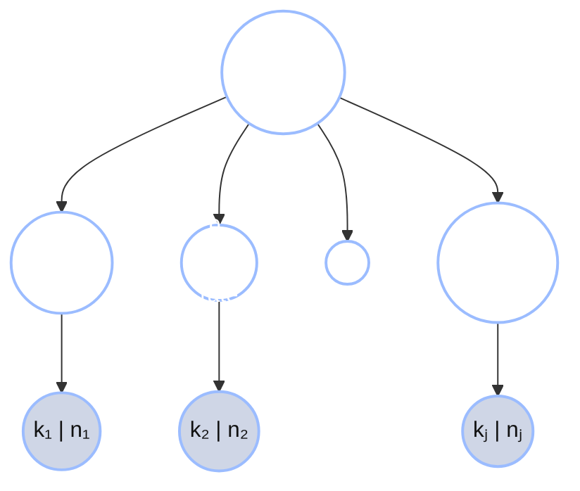

+++
date = "2026-06-14"
title = "部分プーリングと縮小推定"
weight = 2
+++

## 部分プーリングと縮小推定

6人の学生が共通の母集団事前分布 $\text{Beta}(a, b)$ — たとえば $\text{Beta}(6, 4)$ — を共有すると仮定しよう。これは「典型的な学生はおよそ60%のとんかつ弁当 ($\tfrac{6}{6+4} = 0.6$) を持ってくる、事前強度 $a + b = 10$ 弁当」という意味である。各学生の推定値はそれぞれのベータ二項事後分布の平均 $(a + k_i) / (a + b + n_i)$ となる。

```python
import jax.numpy as jnp

names = ["Alyssa", "Ben", "Carmen", "Diego", "Emi", "Farid"]
k = jnp.array([70, 28, 6, 3, 2, 0])
n = jnp.array([100, 40, 10, 5, 2, 1])

a, b = 6.0, 4.0                       # shared population prior: mean 0.6, strength 10
population_mean = a / (a + b)

raw = k / n
posterior_mean = (a + k) / (a + b + n)   # Beta-Binomial posterior mean per student

print(f"population mean = {population_mean:.2f}\n")
for name, r, pm in zip(names, raw, posterior_mean):
    print(f"  {name:7s} raw {float(r):.2f} -> pooled {float(pm):.3f}  (shift {float(pm - r):+.3f})")
```

**出力：**
```
population mean = 0.60

  Alyssa  raw 0.70 -> pooled 0.691  (shift -0.009)
  Ben     raw 0.70 -> pooled 0.680  (shift -0.020)
  Carmen  raw 0.60 -> pooled 0.600  (shift +0.000)
  Diego   raw 0.60 -> pooled 0.600  (shift +0.000)
  Emi     raw 1.00 -> pooled 0.667  (shift -0.333)
  Farid   raw 0.00 -> pooled 0.545  (shift +0.545)
```

変化量を読めばアイデアの全体像がわかる：

- **Alyssa（70/100）** はほとんど動かない — 0.70 → 0.691。100食分の弁当があれば、自身のデータが共有事前分布を圧倒する。
- **Emi（2/2）とFarid（0/1）** が最も大きく動く — それも*逆方向*に：Emiは不合理な1.00から0.667へと急降下し、Faridは不合理な0.00から0.545へと引き上げられ、どちらも母集団の方向へ向かう。データがほとんどなければ、どこから出発しても、ほぼ全面的にグループに頼ることになる。
- **CarmenとDiego** はすでに母集団平均（0.60）に*ちょうど*位置しているため、まったく動かない — プーリングはグループと一致しない程度にのみあなたをグループの方向へ引き寄せる。

グループへのこの引き寄せを**縮小推定（shrinkage）**と呼ぶ。これは階層モデルの特徴的な挙動である：**データが少ない推定値ほど共有事前分布に向かって強く縮小され、データが多い推定値はほぼそのまま残る。** このモデルは学生間で自動的に**強度を借用**する — 「Emiを信頼しすぎるな」というルールを明示する必要はなく、$(a + k)/(a + b + n)$ から自然に導かれる。


この図はデータ量への依存を視覚的に表している：マーカーの大きさは $n_i$ とともに大きくなり、**小さなマーカー（データが少ない）が母集団の線に向かって最も遠くまで移動し**、大きなマーカーはその場にとどまる。

---

## 階層的な生成過程

数式で計算したものには**生成ストーリー** — データがどのように生成されたかのレシピ — がある。それを書き下すことで*階層*モデルが成立する。階層は3つある：

1. 母集団事前分布 $\text{Beta}(a, b)$ が最上位に位置する。
2. 各学生はそこから自身の確率を引く：$\theta_i \sim \text{Beta}(a, b)$。
3. 各学生の弁当がその確率でとんかつかどうかが決まる：$k_i \sim \text{Binomial}(n_i, \theta_i)$。

記号で表すと、**3層階層**は次のようになる：

$$(a, b) \sim \text{prior}, \qquad \theta_i \mid a, b \sim \text{Beta}(a, b), \qquad
k_i \mid \theta_i \sim \text{Binomial}(n_i, \theta_i).$$

{}
$\text{Binomial}(n, \theta)$ は、**$n$ 回の独立したyes/noの試行（各試行の成功確率は $\theta$）における成功回数の分布** — ここでは $n$ 食の弁当のうちとんかつ弁当の数。これは $n$ 個のベルヌーイ（`flip`）試行を足し合わせたものである。GenJAXチュートリアルでは `flip`（1回の試行）が何度も登場したが、二項分布はそのような多数のflipの合計数である。
{}

依存構造 — どれが誰から引かれるか — は矢印の図で表せる。共有された $(a, b)$ が*すべての*学生の $\theta_i$ に流れ込み、各 $\theta_i$ がその学生の個数 $k_i$ に流れ込む：



網掛けされた **k | n** ノードが*観測*された弁当個数、網掛けなしの $(a, b)$ と各学生の確率 $\theta_i$ が*潜在*量として推論の対象となる。共有された親ノード $(a, b)$ こそが学生たちが独立でない理由である：ある学生の確率について学ぶと、母集団についてわずかにわかり、それが他のすべての学生についてもわずかにわかることにつながる。その結合こそが強度が借用される経路に他ならない。

以下は生成過程をGenJAXモデルとして書いたものである — 1人の学生に対する `@gen` 関数を、`jax.vmap` を使って母集団全体に適用する：

```python
import jax
import jax.numpy as jnp
import jax.random as jr
from genjax import gen, beta, binomial

@gen
def student_tonkatsu(a, b, n):
    """One student: draw a personal rate from the population Beta(a,b),
    then draw that student's tonkatsu count from Binomial(n, theta)."""
    theta = beta(a, b) @ "theta"          # this student's underlying rate
    k = binomial(n, theta) @ "k"          # their tonkatsu count out of n bentos
    return k

# Forward-simulate a population of 6 students with different bento counts n_i.
# (n is passed as a float — GenJAX's binomial wants theta and n to share a dtype.)
a, b = 6.0, 4.0
n_per_student = jnp.array([100.0, 40.0, 10.0, 5.0, 2.0, 1.0])
keys = jr.split(jr.PRNGKey(2), 6)

def simulate_one(key, n):
    return student_tonkatsu.simulate(key, (a, b, n)).get_retval()

sim_k = jax.vmap(simulate_one)(keys, n_per_student)
print("simulated tonkatsu counts:", [int(x) for x in sim_k])
print("out of bento counts:     ", [int(x) for x in n_per_student])
```

**出力：**
```
simulated tonkatsu counts: [69, 30, 4, 2, 2, 1]
out of bento counts:      [100, 40, 10, 5, 2, 1]
```

多く持ってくる学生（100食、40食）は母集団の確率0.6付近に落ち着き（69/100、30/40）、少ない学生はばらついている（4/10、2/2、1/1） — これがまさに彼らの生の割合が信頼できない理由であり、共有事前分布が重要な理由である。

---
