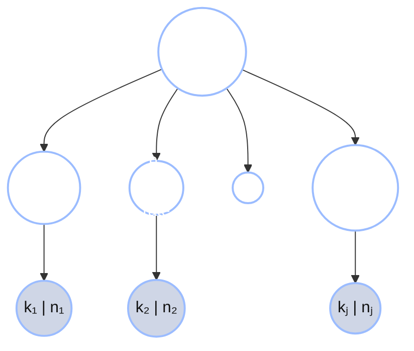

+++
date = "2026-06-01"
title = "Partial Pooling & Shrinkage"
weight = 2
+++

## Partial pooling and shrinkage

Now suppose the six students share a common population prior $\text{Beta}(a, b)$ — say
$\text{Beta}(6, 4)$, encoding "the typical student is about 60% tonkatsu ($\tfrac{6}{6+4} = 0.6$), with a prior
strength of $a + b = 10$ bentos." Each student's estimate becomes their own Beta-Binomial posterior mean,
$(a + k_i) / (a + b + n_i)$:

```python
import jax.numpy as jnp

names = ["Alyssa", "Ben", "Carmen", "Diego", "Emi", "Farid"]
k = jnp.array([70, 28, 6, 3, 2, 0])
n = jnp.array([100, 40, 10, 5, 2, 1])

a, b = 6.0, 4.0                       # shared population prior: mean 0.6, strength 10
population_mean = a / (a + b)

raw = k / n
posterior_mean = (a + k) / (a + b + n)   # Beta-Binomial posterior mean per student

print(f"population mean = {population_mean:.2f}\n")
for name, r, pm in zip(names, raw, posterior_mean):
    print(f"  {name:7s} raw {float(r):.2f} -> pooled {float(pm):.3f}  (shift {float(pm - r):+.3f})")
```

**Output:**
```
population mean = 0.60

  Alyssa  raw 0.70 -> pooled 0.691  (shift -0.009)
  Ben     raw 0.70 -> pooled 0.680  (shift -0.020)
  Carmen  raw 0.60 -> pooled 0.600  (shift +0.000)
  Diego   raw 0.60 -> pooled 0.600  (shift +0.000)
  Emi     raw 1.00 -> pooled 0.667  (shift -0.333)
  Farid   raw 0.00 -> pooled 0.545  (shift +0.545)
```

Read the shifts and the whole idea is there:

- **Alyssa (70/100)** barely moves — 0.70 → 0.691. With 100 bentos, their own data dominates the shared prior.
- **Emi (2/2) and Farid (0/1)** move the most — and in *opposite* directions: Emi crashes down from the absurd
  1.00 (to 0.667) while Farid is pulled up from the absurd 0.00 (to 0.545), both toward the population. With
  almost no data, they lean almost entirely on the group, wherever they started.
- **Carmen and Diego** sit *exactly* at the population mean already (0.60), so they don't move at all —
  pooling pulls you toward the group only to the extent you disagree with it.

This pull-toward-the-group is called **shrinkage**, and it is the signature behavior of a hierarchical model:
**estimates with little data are shrunk hardest toward the shared prior; estimates with lots of data are left
almost alone.** The model **borrows strength** across students automatically — no rule had to say "trust Emi
less," it falls out of $(a + k)/(a + b + n)$.

![A two-column plot of shrinkage. The left column shows each student's raw fraction k_i/n_i; the right column shows their partial-pooling posterior mean; a line connects each student's two points. An orange dashed horizontal line marks the population mean at 0.60. The two data-light students, drawn with small markers, start at opposite extremes and are both pulled toward the population mean: Emi (2/2) sits at 1.00 on the left and is pulled down to 0.667, while Farid (0/1) sits at 0.00 on the left and is pulled up to 0.545. Alyssa (70/100), drawn with a large marker, sits at 0.70 on both sides — barely moving. Marker size encodes how many bentos each student has.](../../../images/intro2/hb_shrinkage.png)

The figure makes the dependence on data size visual: marker size grows with $n_i$, and the **small markers
(little data) travel the farthest** toward the population line, while the big markers stay put.

---

## The hierarchical generative process

What we just computed by formula has a **generative story** — a recipe for how the data could have been
produced — and writing it down is what makes it a *hierarchical* model. There are three levels:

1. A population prior $\text{Beta}(a, b)$ sits at the top.
2. Each student draws their own rate from it: $\theta_i \sim \text{Beta}(a, b)$.
3. Each student's bentos are tonkatsu-or-not at that rate: $k_i \sim \text{Binomial}(n_i, \theta_i)$.

In symbols, the **three-level hierarchy** is:

$$(a, b) \sim \text{prior}, \qquad \theta_i \mid a, b \sim \text{Beta}(a, b), \qquad
k_i \mid \theta_i \sim \text{Binomial}(n_i, \theta_i).$$

{}
$\text{Binomial}(n, \theta)$ is the distribution of the **count of successes in $n$ independent yes/no trials,
each with success probability $\theta$** — here, the number of tonkatsu bentos out of $n$. It's just $n$
Bernoulli (`flip`) trials added up. We met `flip` (one trial) throughout the GenJAX tutorial; the Binomial is
the count of many such flips.
{}

The dependence structure — who is drawn from whom — is a picture of arrows. The shared $(a, b)$ feeds *every*
student's $\theta_i$, and each $\theta_i$ feeds that student's count $k_i$:



The shaded **k | n** nodes are the *observed* bento counts; the unshaded $(a, b)$ and per-student rates $\theta_i$ are the *latent* quantities we infer. The shared parent $(a, b)$ is *why* the students aren't independent: learning about one student's rate tells you
a little about the population, which tells you a little about every *other* student. That coupling is exactly
the channel through which strength is borrowed.

Here is the generative process as a GenJAX model — one `@gen` function for a single student, run across a whole
population with `jax.vmap`:

```python
import jax
import jax.numpy as jnp
import jax.random as jr
from genjax import gen, beta, binomial

@gen
def student_tonkatsu(a, b, n):
    """One student: draw a personal rate from the population Beta(a,b),
    then draw that student's tonkatsu count from Binomial(n, theta)."""
    theta = beta(a, b) @ "theta"          # this student's underlying rate
    k = binomial(n, theta) @ "k"          # their tonkatsu count out of n bentos
    return k

# Forward-simulate a population of 6 students with different bento counts n_i.
# (n is passed as a float — GenJAX's binomial wants theta and n to share a dtype.)
a, b = 6.0, 4.0
n_per_student = jnp.array([100.0, 40.0, 10.0, 5.0, 2.0, 1.0])
keys = jr.split(jr.PRNGKey(2), 6)

def simulate_one(key, n):
    return student_tonkatsu.simulate(key, (a, b, n)).get_retval()

sim_k = jax.vmap(simulate_one)(keys, n_per_student)
print("simulated tonkatsu counts:", [int(x) for x in sim_k])
print("out of bento counts:     ", [int(x) for x in n_per_student])
```

**Output:**
```
simulated tonkatsu counts: [69, 30, 4, 2, 2, 1]
out of bento counts:      [100, 40, 10, 5, 2, 1]
```

The heavy bringers (100, 40 bentos) land near the 0.6 population rate (69/100, 30/40); the light bringers are
scattered (4/10, 2/2, 1/1) — which is *precisely* why their raw fractions can't be trusted, and why the
shared prior matters.

---
