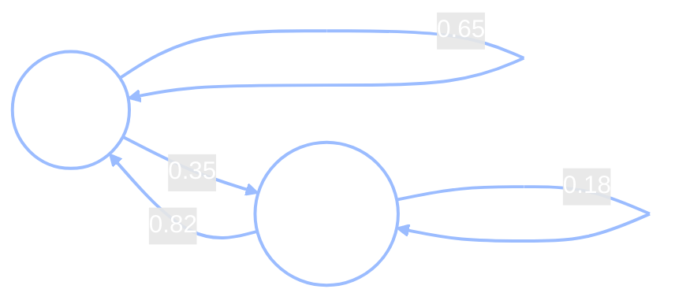
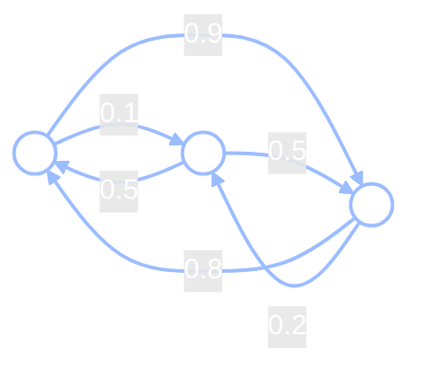

+++
date = "2026-06-14"
title = "マルコフ連鎖：未来は過去を忘れる"
weight = 13
+++

## 昨日だけを覚える習慣

[第8章](../08_bayes_nets/)では、すでに知っていることを**グラフ**として描く方法を学びました。変数をノード、「依存する」という関係を矢印で表し、*マルコフ因数分解*によって結合分布を図から直接読み取ることができました。その*マルコフ*という言葉が、今度は新しい形で登場します。これまでのグラフはスナップショットでした。固定された変数の集合を一度に扱うものでした。この章では、あらゆる物語がいつか必要とする一つの要素を加えます。**時間**です。

Chibanyのランチに新しいひねりを加えましょう。最初の章では、学生がChibanyに弁当を持参し、中身を推測しようとしました。今回は学生が毎日**二つ**の弁当を持ってきます。一つは**とんかつ**、もう一つは**ハンバーガー**で、Chibanyは*どちらを食べるかを選びます*。隠れた中身を推測するのではなく、実際の日々の選択の連続を*観察*できるようになります。

> T, T, H, T, T, T, H, T, …

そして、この選択には習慣があります。Chibanyは**とんかつが大好き**なので、とんかつの日の後は大抵また食べたくなります。ただし、時々気分が変わることもあります。そして**ハンバーガー**の日の後は、ほぼ必ずとんかつに戻ります。

Chibanyのラボメートのジャマルがコーヒー片手に近づいてきます。

> **ジャマル：**「Chibanyが昨日とんかつを食べたと教えたら、今日を予測できる？」
>
> **Chibany：**「たぶんまたとんかつかな——だいたい繰り返すから。」
>
> **ジャマル：**「なるほど。では——先週の火曜日に何を食べたかも知っていると、役に立つ？」
>
> **Chibany：***(少し間を置いて)*「……いや。昨日のことがわかれば、先週の火曜日は何も追加しない。」

別のラボメートのアリッサが顔を上げます。

> **アリッサ：**「今、とても有名な仮定を説明したわよ。」

Chibanyの直感——*今日を予測するには昨日だけわかれば十分*——がこの章のすべてです。それに名前をつけましょう。

時刻$t$における**状態**を$X_t$と書きます。これは$t$日目に真であることを表します。Chibanyの場合、$X_t$は二つの値のどちらかで、$X_t \in \{\text{T}, \text{H}\}$（とんかつまたはハンバーガー）です。

---

## 命名：マルコフ性

Chibanyの直感には名前があります。未来が現在を*与えられた*条件のもとで過去から独立しているとき、そのプロセスは**マルコフ性**を持つと言います。

$$P(X_{t+1} \mid X_t, X_{t-1}, \dots, X_0) = P(X_{t+1} \mid X_t).$$

左から右に読んでください。ゼロ日目まで遡る*全履歴*を与えられたときの明日の状態の確率は、*今日だけ*を与えられたときの明日の状態の確率と**等しい**。今日（$X_t$）がわかれば、それ以外の歴史——先週の火曜日、先月——は明日について何も加えません。この性質を持つ状態の系列を**マルコフ連鎖**と呼びます。

これは第8章と同じ独立性の考え方を、単に*時刻でインデックス付け*したものです。あそこでは矢印$A \to B$が「$B$は$A$に依存する」を意味していました。ここでは依存性が時間の矢に沿って走ります。$X_{t} \to X_{t+1}$、そして*一歩だけ*です。明日の親はちょうど一つ——今日だけです。

{}
歴史が*起きなかった*ということではありません。歴史はその痕跡のすべてを**現在**に残しているのです。先週の火曜日がChibanyの気分や習慣や残り物に何をしたにせよ——それはすでに昨日食べたものの中に吸収されています。現在は過去の完全な要約であり、*未来を予測する目的においては*。それが一文でのマルコフ性です。
{}

---

## 同じ連鎖の二つの顔

マルコフ連鎖には二つの顔があり、どちらも*同じ対象*を異なる方法で描いたものです。

**図。** 各移動の確率をラベル付きの矢印で示す、二つの状態：



Tのループ（0.65）は「とんかつの後は65%の確率でとんかつに留まる」を意味します。矢印T → H（0.35）は時々の気分転換です。HからTへの矢印は強い0.82——ハンバーガーはほとんど繰り返されません。

**行列。** 同じ四つの数を格子に並べます。**推移行列**$P$はすべての一歩の確率をまとめており、行$i$、列$j$の要素は次のように定義されます。

$$P_{ij} = P(X_{t+1} = j \mid X_t = i),$$

状態$i$に*いるとき*に状態$j$へ移動する確率です。Chibanyの場合：

|  | **Tへ** | **Hへ** |
|---|:---:|:---:|
| **Tから** | $0.65$ | $0.35$ |
| **Hから** | $0.82$ | $0.18$ |

列を下に読むと明日の選択がどこから来るかがわかり、行を横に読むと今日がどこへ向かうかがわかります。行1は「今日がTなら、明日は(T, H)が確率$(0.65, 0.35)$」を意味します。行2は「今日がHなら」を意味します。この表を行列$P$として書きます。行は*から*、列は*へ*を表し、どちらも(T, H)の順に並べます。

$$P = \begin{pmatrix} 0.65 & 0.35 \\ 0.82 & 0.18 \end{pmatrix}.$$

**各行の和が1になる**ことに注目してください。$0.65 + 0.35 = 1$、$0.82 + 0.18 = 1$です。これは必然です——どの状態から始めても*何かが*明日起こるので、可能な次の状態すべての確率の和は1でなければなりません。すべての行が確率分布（非負で和が1）になっている行列を**行確率的**と言います。この小さな事実は後で多くの静かな仕事をします。$P$の累乗が有効な確率表のままである理由であり、（後で見るように）$P$が常に1に等しい特別な固有値を持つ理由でもあります。

図と行列は同一の情報を持ちます。図は人間にとって見やすく、行列はコンピュータにとって扱いやすく——そして今から見るように、*サンプリング*にも扱いやすいです。

---

## 行列はサンプラーである

連鎖は実際に*一歩*をどのように踏むのでしょうか？連続的なダイスを転がします。

今日が**とんかつ（T）**だとすると、行1を読みます。$(0.65, 0.35)$です。明日を選ぶには：

1. 0から1の間に一様に分布する乱数$u$を引きます——`Uniform(0, 1)`のサンプルです。例えば$u = 0.42$としましょう。
2. $u < 0.65$？ はい（$0.42 < 0.65$） → **Tに留まる**。（$u$が0.65より上に落ちていたらHに切り替え。）

それだけです。一様乱数を一つ引き、一度比較し、一歩進む。明日も着地した行から同じことを繰り返し、その翌日も——**行列と乱数の流れが系列全体を生成します**。このアイデアを覚えておいてください。次の二章のすべての種であり、第7週の*モンテカルロ*の種でもあります。推移行列は単なる確率の表ではなく、*サンプルを引く*レシピです。

---

## 連鎖を走らせる

Chibanyの連鎖を実際に走らせましょう。以下は、とんかつ（T）から始めて20日間前進させた5回の独立した実行です（これらは本章末のコードから直接出力されます）。

```
T H H T T H T H H T T T T T T H H T H T T
T H T T T T T H T T T T T H H T T T T H T
T T T H T T T T H T H T H T T H T H T T T
T T T T T H H T T H T T T T T H H T T T H
T T T T T T H T T T H T T T H T H T T H H
```

二つのことが目に飛び込んできます。まず、連鎖には**ちょうど一歩の記憶**があります。とんかつは小さな連続の中で持続する傾向があり、ハンバーガーが現れると次の日にはほぼ必ずTに戻ります——0.82の矢印が約束した通りです。次に、そのような局所的な揺れにもかかわらず、*安定した全体的な混合*が浮かび上がります。文字を数えると、どの実行でも大まかに**70%がT、30%がH**です。

この長期的な70/30は偶然ではなく、手で設定したものでもありません。連鎖が*落ち着く*性質です。それを正確に表現することがこの章の核心です。

---

## 定常分布

Chibanyより前に、トランプのデッキをシャッフルすることを考えてみましょう——これもマルコフ連鎖です。**状態**はデッキの現在の並び順で、**推移**は「ランダムなカードを取って一番上に移す」などの操作を繰り返すことです。

> **ジャマル：**「ゲームの前にシャッフルするとき、実際に何を*達成しようとしている*の？」

*特定の*並び順ではありません——特定のゴール配置に向けてシャッフルしているわけではありません。望むのは**すべての並び順が等しく可能になること**で、誰もデッキを予測できなくなることです。そして微妙な点があります。「すべての並び順が等しく可能」に達した後は、もう*一度*シャッフルしてもそこに留まります。よくシャッフルされたデッキを「さらにシャッフル」することはできません。全並び順上の一様分布は**自己持続的**です。プロセスはそれを変えなくなります。

この自己持続的で、もはや変化しなくなった分布には名前があります。まずは記号から。*任意の*マルコフ連鎖を非常に長い時間走らせ、問いかけます。**各状態に滞在する時間の割合は？** その割合のリストを$\pi$（ギリシャ文字の「パイ」）と呼びます——状態ごとに一つの要素を持ち、和が1になる行ベクトルです。Chibanyの場合、$\pi = (\pi_T, \pi_H)$で、$\pi_T$はとんかつの日の長期的な割合、$\pi_H$はハンバーガーの日の割合です。

この長期的な分布$\pi$は、一歩進めても*変化しない*唯一の分布である**定常分布**と一致します。「分布を一歩前進させること」を$P$による乗算として書くと（次のセクションで正確にします）、その性質は

$$\pi P = \pi.$$

言葉にすると、今日の状態についての信念がすでに$\pi$であれば、もう一歩後の明日の状態についての信念は*依然として*$\pi$である——永遠に。Chibanyの場合、$\pi$は非常に具体的な問いに答えます。*一学期全体で、Chibanyのランチのうちとんかつはどのくらいの割合？* サンプル実行はすでに答えを囁いていました——約70%です。

{}
二状態の連鎖では$\pi P = \pi$を手で解くことができます。$\pi = (\pi_T, \pi_H)$、$\pi_T + \pi_H = 1$と書きます。第一座標の方程式は
$$\pi_T = \pi_T (0.65) + \pi_H (0.82).$$
$\pi_H = 1 - \pi_T$を代入して解くと
$$\pi_T = \frac{0.82}{0.35 + 0.82} = \frac{0.82}{1.17} \approx 0.70.$$
よって$\pi \approx (0.70,\ 0.30)$——Chibanyの連鎖は、最初の章で出会った「とんかつ好き」の70/30という長期的な居場所を持つよう調整されていました。習慣と長期的な頻度が一致します。
{}

二状態なら線形方程式を手で解けます。52!通りのカードの並び順ではお手上げです。*スケールする*方法が必要です——そしてすでに持っています。ただ*連鎖を走らせれば*よいのです。

{}
シャッフルの連鎖は単なるおもちゃではありません。確率論で最も有名な結果の一つの舞台です。**その一様な定常分布に（近く）到達するには何回シャッフルすれば十分か？**

現実的な*リフル*シャッフル（デッキをほぼ二等分し、二つの山を交互に差し込む）について、BayerとDiaconis（1992年）が正確な答えを与えました。彼らは**全変動距離**で一様分布からの距離を測定しました——現在のデッキでの確率と完全にシャッフルされたデッキでの確率の間の、すべての可能な事象にわたる最大のギャップです。主な発見は、その距離が最初の四回のシャッフルでは最大値$1$をほぼ維持し、その後急落するということです。

| シャッフル回数 | $1$–$4$ | $5$ | $6$ | $7$ | $8$ | $9$ |
|---|:---:|:---:|:---:|:---:|:---:|:---:|
| 一様分布からの距離 | $1.00$ | $0.92$ | $0.61$ | $0.33$ | $0.17$ | $0.09$ |

距離が初めて二分の一を下回るのは**7回目のシャッフル**です——「**七回シャッフル**でデッキが混ざる」という有名な法則の起源です。（この急落は、べき乗反復が示す「ほぼ変化なく、突然混ざる」現象——*カットオフ*——と同じです。$n$枚のカードでは$\frac{3}{2}\log_2 n$回のシャッフル付近に位置し、$n=52$では約$8.5$、7回目で二分の一以下になります。）

**これは現実を変えたか？** はい——ただし有名なバージョンはしばしば歪められています。よく記録されているケースは**コントラクトブリッジ**です。通常の四、五回のシャッフルでは完全にランダムとはほど遠いことが明らかになると、トーナメント主催者は手作業のシャッフルから*コンピュータ生成の*シャッフルに切り替えました（Berger 1973; Diaconis 2003）。カードカウンターはずっと不十分にシャッフルされたカジノゲームを悪用していました（Thorp 1973）——したがって教訓は双方向に切れ味があり、「カジノはDiaconisのせいでシャッフルを増やした」というきれいな話には懐疑的であるべきです。数学的文献はそれを実際には裏付けていません。

**しかし、少なくシャッフルする人は全く間違っていたのか？** 「七回」が示唆するほどには間違っていません——そしてこれは*実際に到達しようとしている分布*に直接つながる部分です。七回のシャッフルは52枚の異なるカードの**完全な並び順**を一様にする費用です。ほとんどのカードゲームはそれを必要としません。ブラックジャックとバカラでは*スートは無関係*であり、10やフェースカードはすべて同じカウントです——したがって無関係な詳細でのみ異なる二つのデッキの並び順は、ゲームにとって*同じ状態*です。目標がこの**より粗い同値類**の場合、より少ないシャッフルで十分です。AssafとDiaconisとSoundararajan（2011年）は、粗い特徴のみが重要な場合に必要な回数が$\frac{3}{2}\log_2 n$から$\log_2 n$まで下がることを証明し、CongerとViswanath（2006年）はブラックジャックは約**五回**のシャッフルで十分に混ざることを発見しました（ブリッジは約四回）——完全なデッキの七回より少ないです。したがって、少ない回数しかシャッフルしないディーラーは*正しい*分布を追いかけていました——ゲームが実際に気にする分布であり、「七回」が指す完全な並び順の分布ではありません。*（正直な注意点：節約できる量はどの特徴を測定し、どの距離を使うかによって異なります。「ブラックジャックは七回より少なくていい」は確かですが、正確な単一の数値は距離の指標によって変わります。）*

これがこの段落全体の教訓を小さく要約しています。マルコフ連鎖には定常分布があり、「混ざった」とは*それに近い*ことを意味し、**どれだけ近ければよいか——実際に目指している分布——が、どのくらい長く走らせなければならないかを決める**のです。
{}

---

## πを求める：ただ走らせればよい（べき乗反復）

ここに仕掛けがあります。**任意の**現在の状態についての信念から始めます——確率の行ベクトル$\mathbf{v} = (v_T, v_H)$として書きます——そして$P$を乗算して一歩前進させます。

なぜ$P$を乗算することで「一日前進する」のでしょうか？積を書き出せばわかります。明日のとんかつの確率は、今日Tにいて留まる確率と、今日Hにいて戻ってくる確率の和です。

$$(\mathbf{v}P)_T = v_T P_{TT} + v_H P_{HT} = v_T(0.65) + v_H(0.82).$$

これは*昨日の*状態にわたる全確率の法則そのものです——手で行う一歩の予測と同じです。したがって$\mathbf{v}P$は一日後の信念、$\mathbf{v}P^2 = (\mathbf{v}P)P$は二日後、$\mathbf{v}P^3$は三日後、などとなります（指数は日数を数えるだけです）。

$$\mathbf{v},\quad \mathbf{v}P,\quad \mathbf{v}P^2,\quad \mathbf{v}P^3,\quad \dots \longrightarrow \pi.$$

乗算を続けると、系列はどこから始めても**定常分布**$\pi$に**収束します**。（収束は証明しませんが、今まさに*目撃*しようとしています。）この手続き——行列を繰り返し乗算すること——を**べき乗反復**と呼びます。

Chibanyの連鎖でこれを見てみましょう。二つの方法で実行します。とんかつの絶対確信から$\mathbf{v} = (1, 0)$、そしてハンバーガーの絶対確信から$\mathbf{v} = (0, 1)$。

| ステップ$k$ | Tから：$(\pi_T, \pi_H)$ | Hから：$(\pi_T, \pi_H)$ |
|---:|---|---|
| 0 | $(1.000,\ 0.000)$ | $(0.000,\ 1.000)$ |
| 1 | $(0.650,\ 0.350)$ | $(0.820,\ 0.180)$ |
| 2 | $(0.709,\ 0.290)$ | $(0.681,\ 0.319)$ |
| 5 | $(0.701,\ 0.299)$ | $(0.701,\ 0.299)$ |
| 20 | $(0.701,\ 0.299)$ | $(0.701,\ 0.299)$ |

ステップ0では二つのスタートがこれ以上ないほど異なっています。一歩後にはすでに差が縮まっています。ステップ5では*同一*です——どちらも$(0.701, 0.299)$——そこに留まります。**連鎖はどこから始まったかを忘れました。**

### スタートが関係ない理由：エルゴード性

この「忘却」は魔法ではありません。条件があります。連鎖が**混ざる**——すべての出発点から同じ$\pi$に収束する——のは、**エルゴード的**なときです。つまり、どの状態からどの状態へも（複数ステップを経ても）到達でき、連鎖が固定サイクルの中でトラップされていないときです。Chibanyの連鎖はエルゴード的です——TからHへ、またその逆へ到達でき、厳密な周期がありません——したがって混ざり、定常分布は始まりとは無関係に*連鎖*の性質です。（エルゴード的で*ない*連鎖——例えば二状態間に移動手段がない——は、スタート地点によって異なる長期分布に留まることがあります。その条件が排除するのはそのような例外的なケースです。）

{}
連鎖がエルゴード的で*ない*場合——到達不可能な状態があったり、サイクルに閉じ込められたり——簡単な標準的な修正があります。*任意の*状態から*任意の*状態へジャンプする確率$\varepsilon$を小さく加え、元の確率を再スケールして余地を作ります。具体的には$P$を次で置き換えます。
$$P' = (1 - \varepsilon) P + \varepsilon U,$$
ここで$U$は状態を一様にランダムに選ぶ行列です（$n$状態の場合、すべての要素が$1/n$）。これですべての状態は一歩で他のすべての状態に到達できるので、$P'$はエルゴード的であることが保証されます——また小さな$\varepsilon$の場合、元のダイナミクスをほとんど乱しません。この「どこへでも小さな確率でテレポートする」仕掛けは、Googleの**PageRank**が一意の答えを保証するためにまさに使っているものです。[第14章](../14_random_walks_networks/)で再び登場します。
{}

---

## πとは何か：固有値1の固有ベクトル

べき乗反復は$\pi$に*収束します*。しかし$\pi$は数学的対象として正確に*何*なのでしょうか？

定義方程式$\pi P = \pi$をもう一度見てください。これは、行ベクトル$\pi$を行列$P$で乗算すると**同じベクトルが変わらずに戻ってくる**と言っています。行列が同じ方向を向いたままにするベクトルには名前があります。**固有ベクトル**です。行列の固有ベクトルとは、その行列を乗算したとき*方向*が変わらないベクトルです——長さだけが**固有値**と呼ばれる数でスケールされます。$\pi P = \pi$は$\pi$を完全に変えないので（正確に1でスケールされる）、$\pi$は**固有値1の$P$の固有ベクトル**です。（*左*側で乗算するので、$\pi P = \pi$は技術的には*左*固有ベクトルです——細部ですが、考え方は同じです。）

すべての行確率的行列はそのような固有ベクトルを持ちます——常に1に等しい固有値が*存在します*。したがって$\pi$を求める等価な二つの方法があります。**連鎖を走らせる**（べき乗反復、上で行ったこと）か、線形代数ルーチンを使って**固有値方程式を直接解く**かです。先ほど見た収束の表はべき乗反復がその固有ベクトルに忍び寄っていたものです。$\times P$のもとで数値が変化しなくなったとき、それを見つけたことになります。

{}
これは行確率的の注意からの「静かな事実」であり、一行の理由がここにあります。$P$のすべての行の和が1なので、$P$を全1の*列*ベクトル$\mathbf{1} = (1,1)^{\mathsf T}$で乗算すると各行の和が戻ってきます——つまり$P\mathbf{1} = \mathbf{1}$。したがって$\mathbf{1}$は固有値1の（右）固有ベクトルであり、1は$P$の固有値です——行列とその転置行列は常に同じ固有値を持つので、1は$P^{\mathsf T}$の固有値でもあり、対応する*左*固有ベクトルを与えます。その左固有ベクトルを和が1になるよう正規化したものが$\pi$です。（これは所与の事実として受け取ってよいです。行和が1という事実が線形代数に結実する唯一の箇所です。）
{}

線形代数についてはここまでで十分です。固有値1の固有ベクトル*が*定常分布であり、この章で行う他のすべてのことは、単に連鎖を走らせることで実行できます。

---

## 少し難しいもの：三状態ウォーク

これらのどれかが状態が二つしかないことに依存しているのでしょうか？まったくそうではありません——方法は状態数に関係なく同じです。以下はより複雑な推移行列を持つ三状態連鎖です（状態1、2、3）。

| から↓ / へ→ | **1** | **2** | **3** |
|---|:---:|:---:|:---:|
| **1** | $0$ | $0.1$ | $0.9$ |
| **2** | $0.5$ | $0$ | $0.5$ |
| **3** | $0.8$ | $0.2$ | $0$ |

$$A = \begin{pmatrix} 0 & 0.1 & 0.9 \\ 0.5 & 0 & 0.5 \\ 0.8 & 0.2 & 0 \end{pmatrix}$$



行を前と同じように読みます。行1は「状態1から、確率0.1で状態2へ、確率0.9で状態3へ行く」を意味します。（対角はすべてゼロ——この連鎖には自己ループがなく、常に移動します。）

計算する前に、*推測してみましょう*。このウォークを長時間走らせると——どの状態が**最も多く**訪問されるでしょうか？矢印をたどります。状態1はトラフィックの0.9を状態3に送り、状態2は1と3に分割し、状態3は0.8を1に戻します。したがって状態1と3は人気の目的地ですが、状態2は矢印のターゲットになることが少ない（状態1から0.1、状態3から0.2のみ）。**状態2が最も孤独**なことが予想されます。

べき乗反復を実行すると——同じ手順を二つの異なるスタートから——収束先は

$$\pi \approx (0.42, 0.13, 0.45).$$

まさに推測通りです。状態1と3がほとんどの訪問を吸収し（$0.42$と$0.45$）、状態2はめったに訪問されません（$0.13$）。そしてChibanyの場合と同様、答えはどこから始めるかに**依存しません**——状態1か状態2から始めて十分に走らせると、同じ$\pi$に着地します。この連鎖もエルゴード的だからです。

二状態、三状態、または52!通りのカードの並び順——**同じ方法、同じ種類の答え**。連鎖を走らせ（または固有値1の固有ベクトルを解き）、長期的な居場所を読み取ります。

---

## GenJAXとJAXの実装

この章は二種類の計算に明確に分かれており、どのツールがどちらに合っているかについて正直であることが重要です。

- *機構*の大部分——$P$の構築、べき乗反復、固有ベクトル——は**単純な線形代数**です。ベクトルを行列で繰り返し乗算します。`jax.numpy`がまさに適切なツールであり、生成モデルを持ち出すと却って分かりにくくなります。
- 真に**生成的**な部分——*選択の系列をサンプリングすること*、「行列はサンプラーである」——は、第8章〜10章のベイズネットと同様に、GenJAXの`@gen`モデルが真価を発揮するところです。

それぞれに合った場所で使います。

### べき乗反復（純粋なJAX）

まず機構から。$P$を構築し、小さな`power_iterate`を作って$P$を繰り返し乗算し、二つの異なるスタートが同じ70/30に収束する様子を観察します。

```python
import jax.numpy as jnp

# Chibany's transition matrix. Rows = today (T, H); columns = tomorrow (T, H).
P = jnp.array([[0.65, 0.35],
               [0.82, 0.18]])

def power_iterate(v, P, steps):
    """Multiply the distribution v by P, `steps` times, recording every iterate."""
    rows = [v]
    for _ in range(steps):          # steps is a plain Python int — an ordinary loop
        v = v @ P                   # @ is matrix multiply: step the distribution forward one day
        rows.append(v)
    return jnp.stack(rows)

traj_T = power_iterate(jnp.array([1.0, 0.0]), P, 20)   # always start on tonkatsu
traj_H = power_iterate(jnp.array([0.0, 1.0]), P, 20)   # always start on hamburger

for k in [0, 1, 2, 5, 20]:
    print(f"step {k:2d}: from T ({traj_T[k,0]:.3f}, {traj_T[k,1]:.3f})   "
          f"from H ({traj_H[k,0]:.3f}, {traj_H[k,1]:.3f})")
```

**出力：**
```
step  0: from T (1.000, 0.000)   from H (0.000, 1.000)
step  1: from T (0.650, 0.350)   from H (0.820, 0.180)
step  2: from T (0.709, 0.290)   from H (0.681, 0.319)
step  5: from T (0.701, 0.299)   from H (0.701, 0.299)
step 20: from T (0.701, 0.299)   from H (0.701, 0.299)
```

ステップ5で二つのスタートは区別できなくなります——連鎖は始まりを忘れ、$\pi \approx (0.70, 0.30)$に落ち着きました。

### πは固有値1の固有ベクトル（純粋なNumPy）

べき乗反復は固有ベクトルに*忍び寄ります*。線形代数ルーチンに直接求めて、二つが一致することを確認することもできます。$P$の左固有ベクトルは転置行列$P^{\mathsf T}$の固有ベクトルです。

```python
import numpy as np

vals, vecs = np.linalg.eig(np.array(P).T)   # left eigenvectors of P = eigvecs of P^T
idx = int(np.argmin(np.abs(vals - 1.0)))    # the eigenvalue closest to 1 (eig returns floats)
pi = np.real(vecs[:, idx])
pi = pi / pi.sum()                          # normalize so it sums to 1

print(f"eigenvalue   = {np.real(vals[idx]):.3f}")
print(f"pi (eigen)   = ({pi[0]:.3f}, {pi[1]:.3f})")
print(f"pi (run it)  = ({traj_T[20,0]:.3f}, {traj_T[20,1]:.3f})")
```

**出力：**
```
eigenvalue   = 1.000
pi (eigen)   = (0.701, 0.299)
pi (run it)  = (0.701, 0.299)
```

固有値は正確に1（行確率的の保証通り）であり、固有ベクトルはべき乗反復が見つけたものと一致します。二つの経路、一つの答え。

### 行列はサンプラーである（GenJAX）

次は生成的な部分です。推移行列は単なる表ではありません——*サンプルを引きます*。GenJAXの`@gen`モデルを書いて、$P$の現在の行から次の状態をサンプリングして一歩踏みます。GenJAXの`categorical`分布は**対数確率**からカテゴリを選ぶので、`jnp.log(P)[state]`——現在の行の対数——を渡します。

系列全体をサンプリングするために、固定ステップ数のモデルを構築します。日数を受け取り、ちょうどその日数の生成モデルを返す小さなファクトリ関数（`make_chain`）を使います。

{}
マルコフ連鎖を理解するためにこれは必要ありません。`make_chain`が`n_steps`を通常のPython整数として——モデル引数として渡すのではなく——キャプチャする理由は、GenJAX/JAXの詳細です。ループ長はモデルが構築されるときに知られている必要があるので、通常のPythonで固定します。モデル引数として渡すと、JAXは文句を言います。最初の読み飛ばしで安全です。
{}

```python
import jax
import jax.random as jr
from genjax import gen, categorical

LOGP = jnp.log(P)   # categorical wants log-probabilities; row `state` = current state

def make_chain(n_steps):
    """Build a generative model that samples `n_steps` transitions of Chibany's chain."""
    @gen
    def chain(start):
        state = start
        states = [state]
        for t in range(n_steps):                  # n_steps is a captured Python int
            state = categorical(LOGP[state]) @ f"x_{t}"
            states.append(state)
        return jnp.array(states)
    return chain

chain20 = make_chain(20)

# Five independent runs, each starting on tonkatsu (state 0). vmap runs them in parallel.
labels = ["T", "H"]   # plain Python list — JAX arrays can't hold strings
keys = jr.split(jr.key(0), 5)
runs = jax.vmap(lambda k: chain20.simulate(k, (0,)).get_retval())(keys)
for r in runs:
    print(" ".join(labels[int(s)] for s in r))
```

**出力：**
```
T H H T T H T H H T T T T T T H H T H T T
T H T T T T T H T T T T T H H T T T T H T
T T T H T T T T H T H T H T T H T H T T T
T T T T T H H T T H T T T T T H H T T T H
T T T T T T H T T T H T T T H T H T T H H
```

これらは「連鎖を走らせる」のセクションの系列そのものです——作り上げたのではなく、*生成した*ものです。それぞれがChibanyの連鎖からの本物のサンプルです。

線形代数ではなく*サンプリング*によって長期的な70/30を確認するために、一つの長い連鎖を走らせてカウントします。数千ステップの長い実行には`jax.lax.scan`を使います。JAXが値を多くのステップを通じて効率的に引き継ぐ方法です。その`step`関数を「現在の`state`と新鮮な乱数キーを与えられ、次の状態を**二回**返す」と読んでください。最初のコピーは次のステップに渡されるキャリー、二番目はすべての訪問した状態の出力配列に収集される値です。

<!-- validate: tol=0.05 -->
```python
def run_long(key, start, n):
    """Sample n steps by carrying the current state through a scan."""
    def step(state, k):
        nxt = jr.categorical(k, LOGP[state])   # one transition from the current row
        return nxt, nxt
    _, visited = jax.lax.scan(step, start, jr.split(key, n))
    return visited

visited = run_long(jr.key(1), 0, 5000)
frac_tonkatsu = float(jnp.mean((visited == 0).astype(float)))
print(f"long-run fraction tonkatsu (5000 steps) ~ {frac_tonkatsu:.2f}")
```

**出力：**
```
long-run fraction tonkatsu (5000 steps) ~ 0.71
```

サンプリングと線形代数が一致します。連鎖の長い実行はその日々の約70%をとんかつに費やします——*連鎖を走らせることで*見つけた定常分布です。

### 三状態連鎖

最後に、三状態行列$A$に同じ`power_iterate`を適用し、二つの異なるスタートから$\pi \approx (0.42, 0.13, 0.45)$を再現します。

```python
A = jnp.array([[0.0, 0.1, 0.9],
               [0.5, 0.0, 0.5],
               [0.8, 0.2, 0.0]])

from_1 = power_iterate(jnp.array([1.0, 0.0, 0.0]), A, 40)
from_2 = power_iterate(jnp.array([0.0, 1.0, 0.0]), A, 40)
print("from state 1:", tuple(round(float(x), 2) for x in from_1[40]))
print("from state 2:", tuple(round(float(x), 2) for x in from_2[40]))
```

**出力：**
```
from state 1: (0.42, 0.13, 0.45)
from state 2: (0.42, 0.13, 0.45)
```

二つのスタート、一つの答え——状態2が最も孤独で、矢印が予測した通りです。機構は方法の一行も変えることなく二状態から三状態へとスケールしました。

{}
**マルコフ性**（未来は現在を通じてのみ過去に依存する）を認識し、連鎖を**状態図**と**推移行列**の両方として書き、その行列から系列を*サンプリング*することができます。連鎖の**定常分布**$\pi$を二つの方法で求めることができます——**べき乗反復**（連鎖を走らせるだけ）または**固有値1の固有ベクトル**として——そして**エルゴード的**な連鎖がどこから始まったかを忘れる理由を理解しています。

次は、[第14章](../14_random_walks_networks/)が状態に*構造*を与えます。状態を**ネットワークのノード**にします。推移行列はグラフから来ることになり、定常分布は固有値分解を全く必要としない美しくシンプルな形を持つことがわかります。

*用語集：* [マルコフ性](../../glossary/#markov-property-), [マルコフ連鎖](../../glossary/#markov-chain-), [推移行列](../../glossary/#transition-matrix-), [定常分布](../../glossary/#stationary-distribution-), [べき乗反復](../../glossary/#power-iteration-), [エルゴード性](../../glossary/#ergodicity-).
{}

---

## 練習問題

{}
1. **$\pi P = \pi$を手で解く。** Chibanyの行列と$\pi_T + \pi_H = 1$を使って、$\pi_T$の単一方程式を立てて$\pi_T = 0.82 / (0.35 + 0.82) \approx 0.70$になることを確認してください。（二つの座標方程式のうち*一つ*だけと「和が1」を使えば十分なのはなぜか？）
2. **習慣を変える。** Chibanyの忠誠度が下がったとします。$P_{TT} = 0.50$（したがって$P_{TH} = 0.50$）、H行は変更なし。コードの`P`を修正して`power_iterate`を再実行してください。とんかつは長期的にまだ支配的ですか？どのくらい？
3. **三状態連鎖、二つの方法で。** 行列$A$について、べき乗反復*と*`np.linalg.eig(np.array(A).T)`（固有値1の固有ベクトルを求めて正規化する）の両方で$\pi \approx (0.42, 0.13, 0.45)$を確認してください。二つの方法は一致しますか？
{}

付属のノートブックがこれらすべてを対話的に解説しています。

**📓 [Colabで開く：`13_markov_chains.ipynb`](https://colab.research.google.com/github/josephausterweil/probintro/blob/main/notebooks/13_markov_chains.ipynb)**

---

このチュートリアルシリーズへの寛大なご支援に[JPCCA](https://jpcca.org/)に特別の感謝を申し上げます。
