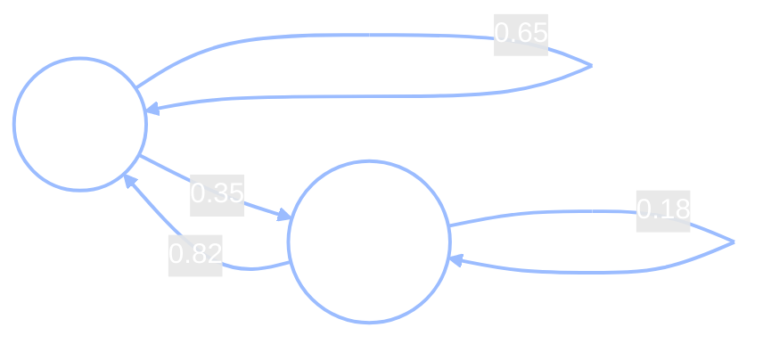
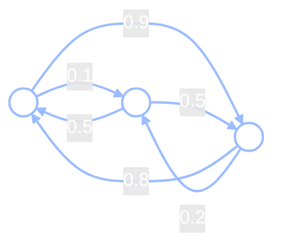

+++
date = "2026-06-03"
title = "Markov Chains: The Future Forgets the Past"
weight = 13
+++

## A Habit That Only Remembers Yesterday

In [Chapter 8](../08_bayes_nets/) we learned to draw what we already know as a **graph**: nodes for variables, arrows for "depends on," and a *Markov factorization* that let us read a joint distribution straight off the picture. That word — *Markov* — is about to come back, but pointed at something new. Until now our graphs were snapshots: a fixed set of variables, all at once. This chapter adds the one ingredient every story eventually needs. **Time.**

Here is a new twist on Chibany's lunches. In the very first chapters, students *brought* Chibany a bento and we tried to infer what was hidden inside. This time the students bring **two** bentos every day — one **tonkatsu**, one **hamburger** — and Chibany *chooses* which to eat. So instead of a hidden contents to guess, we now get to *watch* an actual day-by-day sequence of choices unfold:

> T, T, H, T, T, T, H, T, …

And there is a habit in the choosing. Chibany **loves tonkatsu**, so after a tonkatsu day they usually want it *again* — but every so often they fancy a change. And after a **hamburger** day, they almost always swing right back to tonkatsu.

Chibany's labmate Jamal leans over with a coffee.

> **Jamal:** "If I tell you Chibany ate tonkatsu *yesterday*, can you guess today?"
>
> **Chibany:** "Probably tonkatsu again — I usually repeat it."
>
> **Jamal:** "Okay. Now — does it help you to *also* know what they ate last Tuesday?"
>
> **Chibany:** *(pausing)* "…No. Once you've told me yesterday, last Tuesday doesn't add anything."

Alyssa, another labmate, looks up.

> **Alyssa:** "You just described a very famous assumption, you know."

Chibany's instinct — *to predict today, yesterday is all I need* — is the whole idea of this chapter. Let's name it.

Write $X_t$ for the **state** at time $t$: the thing that is true on day $t$. For Chibany, $X_t$ is one of two values, $X_t \in \{\text{T}, \text{H}\}$ (tonkatsu or hamburger).

---

## Naming It: The Markov Property

Chibany's instinct has a name. A process has the **Markov property** when the future is independent of the past, *given the present*:

$$P(X_{t+1} \mid X_t, X_{t-1}, \dots, X_0) = P(X_{t+1} \mid X_t).$$

Read it left to right: the probability of tomorrow's state, given the *entire* history back to day zero, is **equal to** the probability of tomorrow's state given *only today*. Once you know today ($X_t$), the rest of the history — last Tuesday, last month — tells you nothing more about tomorrow. A sequence of states with this property is called a **Markov chain**.

This is the same independence idea from Chapter 8, just *indexed by time*. There, an arrow $A \to B$ meant "$B$ depends on $A$." Here, the dependence runs along the arrow of time: $X_{t} \to X_{t+1}$, and *only* one step. Tomorrow has exactly one parent — today.

{}
It is not that history *never happened*; it is that history leaves all of its mark on the **present**. Whatever last Tuesday did to Chibany's mood, their habits, their leftovers — it has already been absorbed into what they ate yesterday. The present is a complete summary of the past, *for the purpose of predicting the future*. That is the Markov property in one sentence.
{}

---

## Two Views of the Same Chain

A Markov chain has two faces, and they are the *same object* drawn two ways.

**The picture.** Two states, with labelled arrows for the probability of each move:



The loop on T (0.65) says "after tonkatsu, stay tonkatsu 65% of the time." The arrow T → H (0.35) is the occasional change of pace. From H, the arrow back to T is a strong 0.82 — hamburger almost never repeats.

**The matrix.** Stack those same four numbers into a grid. The **transition matrix** $P$ collects every one-step probability, with the entry in row $i$, column $j$ defined as

$$P_{ij} = P(X_{t+1} = j \mid X_t = i),$$

the probability of moving *to* state $j$ given you are *in* state $i$. For Chibany:

|  | **to T** | **to H** |
|---|:---:|:---:|
| **from T** | $0.65$ | $0.35$ |
| **from H** | $0.82$ | $0.18$ |

Read down a column to see where tomorrow's choice comes from; read across a row to see where today leads. Row 1 says "if T today, then tomorrow is (T, H) with probabilities $(0.65, 0.35)$." Row 2 says "if H today." We'll write this same table as the matrix $P$, with rows indexed *from* and columns *to*, both in the order (T, H):

$$P = \begin{pmatrix} 0.65 & 0.35 \\\\ 0.82 & 0.18 \end{pmatrix}.$$

Notice that **each row sums to 1**: $0.65 + 0.35 = 1$, and $0.82 + 0.18 = 1$. That has to be true — starting from any state, *something* happens tomorrow, so the probabilities of all possible next states must add up to one. A matrix whose every row is a probability distribution (non-negative, sums to 1) is called **row-stochastic**. This little fact does a lot of quiet work later: it is exactly why powers of $P$ stay valid probability tables, and (as we'll see) why $P$ always has a special eigenvalue equal to 1.

The picture and the matrix carry identical information. The picture is easier for humans; the matrix is easier for computers — and, as we are about to see, easier for *sampling*.

---

## The Matrix Is a Sampler

How does the chain actually take a *single step*? You roll a continuous die.

Suppose today is **tonkatsu (T)**, so we read off row 1: $(0.65, 0.35)$. To pick tomorrow:

1. Draw a random number $u$ evenly between 0 and 1 — a `Uniform(0, 1)` draw. Say $u = 0.42$.
2. Is $u < 0.65$? Yes ($0.42 < 0.65$) → **stay at T**. (If $u$ had landed above 0.65 → switch to H.)

That's it. One uniform draw, one comparison, one step. Do it again tomorrow from whatever row you land in, and again the day after — **the matrix plus a stream of random numbers generates the entire sequence**. Hold onto this idea: it is the seed of everything in the next two chapters, and of *Monte Carlo* in Week 7. A transition matrix isn't just a table of probabilities; it is a recipe for *drawing samples*.

---

## Running the Chain

Let's actually run Chibany's chain. Here are five independent runs, each started on tonkatsu (T) and stepped forward 20 days (these come straight out of the code at the end of the chapter):

```
T H H T T H T H H T T T T T T H H T H T T
T H T T T T T H T T T T T H H T T T T H T
T T T H T T T T H T H T H T T H T H T T T
T T T T T H H T T H T T T T T H H T T T H
T T T T T T H T T T H T T T H T H T T H H
```

Two things jump out. First, the chain has a **memory of exactly one step**: tonkatsu tends to persist in little runs, and whenever a hamburger appears it almost always flips right back to T the next day — exactly as the 0.82 arrow promised. Second, despite all that local wobble, a *stable overall mixture* emerges: count the letters and roughly **70% are T, 30% are H**, in every run.

That long-run 70/30 is not an accident, and it is not something we put in by hand. It is a property the chain *settles into*. Making that precise is the heart of the chapter.

---

## The Stationary Distribution

Before Chibany, think about shuffling a deck of cards — also a Markov chain. The **state** is the deck's current ordering; a **transition** is something like "take a random card and move it to the top," done over and over.

> **Jamal:** "When you shuffle before a game, what are you actually *trying* to achieve?"

Not any *particular* ordering — you don't shuffle *toward* a goal arrangement. What you want is for **every ordering to become equally likely**, so no one can predict the deck. And here is the subtle part: once you have reached "every ordering equally likely," shuffling *one more time* leaves you exactly there. You cannot make a well-shuffled deck "more shuffled." That uniform-over-all-orderings distribution is **self-perpetuating**: the process stops changing it.

That self-perpetuating, no-longer-changing distribution has a name. First, the symbol. Run *any* Markov chain for a very long time and ask: **what fraction of the time does it spend in each state?** We call that list of fractions $\pi$ (the Greek letter "pi") — a row vector with one entry per state, summing to 1. For Chibany, $\pi = (\pi_T, \pi_H)$, where $\pi_T$ is the long-run fraction of tonkatsu days and $\pi_H$ the fraction of hamburger days.

That long-run distribution $\pi$ turns out to be exactly the **stationary distribution**: the one distribution that taking a single step leaves *unchanged*. Writing "step the distribution forward" as multiplication by $P$ (which we make precise in the next section), that property is

$$\pi P = \pi.$$

In words: if your belief about today's state is already $\pi$, then after one more step your belief about tomorrow's state is *still* $\pi$ — forever. For Chibany, $\pi$ answers a very concrete question: *over a whole semester, what fraction of Chibany's lunches are tonkatsu?* The sample runs already whispered the answer — about 70%.

{}
For a two-state chain you can solve $\pi P = \pi$ by hand. Write $\pi = (\pi_T, \pi_H)$ with $\pi_T + \pi_H = 1$. The equation for the first coordinate is
$$\pi_T = \pi_T (0.65) + \pi_H (0.82).$$
Substituting $\pi_H = 1 - \pi_T$ and solving gives
$$\pi_T = \frac{0.82}{0.35 + 0.82} = \frac{0.82}{1.17} \approx 0.70.$$
So $\pi \approx (0.70,\ 0.30)$ — Chibany's chain was tuned so its long-run home is the same 70/30 "loves tonkatsu" split you met back in the early chapters. The habit and the long-run frequency agree.
{}

Solving a linear system by hand is fine for two states. For 52! card orderings it is hopeless. We need a method that *scales* — and we already have it. We just *run the chain.*

---

## Finding π: Just Run It (Power Iteration)

Here is the trick. Start from **any** belief about the current state — written as a probability row vector $\mathbf{v} = (v_T, v_H)$ — and step it forward by multiplying by $P$.

Why does multiplying by $P$ "step forward one day"? Just write out the product. The chance of tonkatsu *tomorrow* is the chance you're at T today and stay, plus the chance you're at H today and switch back:

$$(\mathbf{v}P)_T = v_T P_{TT} + v_H P_{HT} = v_T(0.65) + v_H(0.82).$$

That is exactly the law of total probability over *yesterday's* state — the same one-step prediction you'd do by hand. So $\mathbf{v}P$ is your belief one day later, $\mathbf{v}P^2 = (\mathbf{v}P)P$ is two days later, $\mathbf{v}P^3$ three days later, and so on (the exponent just counts days):

$$\mathbf{v},\quad \mathbf{v}P,\quad \mathbf{v}P^2,\quad \mathbf{v}P^3,\quad \dots \longrightarrow \pi.$$

Keep multiplying, and the sequence **converges to the stationary distribution** $\pi$, no matter where you started. (We won't prove the convergence — but you're about to *watch* it happen.) This procedure — repeatedly multiplying by the matrix — is called **power iteration**.

Watch it on Chibany's chain. Run it two ways: starting from absolute certainty in tonkatsu, $\mathbf{v} = (1, 0)$, and from absolute certainty in hamburger, $\mathbf{v} = (0, 1)$.

| step $k$ | from T: $(\pi_T, \pi_H)$ | from H: $(\pi_T, \pi_H)$ |
|---:|---|---|
| 0 | $(1.000,\ 0.000)$ | $(0.000,\ 1.000)$ |
| 1 | $(0.650,\ 0.350)$ | $(0.820,\ 0.180)$ |
| 2 | $(0.709,\ 0.290)$ | $(0.681,\ 0.319)$ |
| 5 | $(0.701,\ 0.299)$ | $(0.701,\ 0.299)$ |
| 20 | $(0.701,\ 0.299)$ | $(0.701,\ 0.299)$ |

At step 0 the two starts could not be more different. After a single step they already disagree less. By step 5 they are *identical* — both at $(0.701, 0.299)$ — and they stay there. **The chain forgot where it started.**

### Why the Start Doesn't Matter: Ergodicity

That "forgetting" is not magic; it has a condition. A chain **mixes** — converges to the same $\pi$ from every starting point — when it is **ergodic**: you can get from any state to any other state (possibly in several steps), and the chain doesn't get trapped bouncing around a fixed cycle. Chibany's chain is ergodic — from T you can reach H and back, with no rigid period — so it mixes, and the stationary distribution is a property of *the chain*, not of where you happened to begin. (A chain that *isn't* ergodic — say two states with no way to travel between them — can sit in different long-run distributions depending on the start; those are the exceptions the condition rules out.)

---

## What π Really Is: The Eigenvector With Eigenvalue 1

Power iteration *converges to* $\pi$. But what *is* $\pi$, exactly, as a mathematical object?

Look again at the defining equation, $\pi P = \pi$. It says: multiplying the row vector $\pi$ by the matrix $P$ gives **the same vector back, unchanged**. There is a name for a vector a matrix leaves pointing the same way: an **eigenvector**. An eigenvector of a matrix is a vector whose *direction* is unchanged when you multiply by the matrix — only its length is scaled, by a number called the **eigenvalue**. Since $\pi P = \pi$ leaves $\pi$ completely unchanged (scaled by exactly 1), $\pi$ is the **eigenvector of $P$ with eigenvalue 1**. (Because we multiply on the *left*, $\pi P = \pi$, it is technically the *left* eigenvector — a detail; the idea is the same.)

Every row-stochastic matrix has such an eigenvector — there is *always* an eigenvalue equal to 1. So there are two equivalent ways to find $\pi$: **run the chain** (power iteration, what we did above) or **solve the eigenvalue equation** directly with a linear-algebra routine. The convergence table you just watched was power iteration sneaking up on that eigenvector: once the numbers stopped changing under $\times P$, you had found it.

{}
This is the "quiet fact" from the row-stochastic remark, and here's the one-line reason. Because every row of $P$ sums to 1, multiplying $P$ by the all-ones *column* vector $\mathbf{1} = (1,1)^{\mathsf T}$ gives each row's sum back — that is, $P\mathbf{1} = \mathbf{1}$. So $\mathbf{1}$ is a (right) eigenvector with eigenvalue 1, which means 1 *is* an eigenvalue of $P$ — and a matrix and its transpose always share the same eigenvalues, so 1 is an eigenvalue of $P^{\mathsf T}$ too, giving a matching *left* eigenvector. That left eigenvector, normalized to sum to 1, is $\pi$. (You can take this on faith; it's the only place the rows-sum-to-1 fact cashes out into linear algebra.)
{}

That is as far into linear algebra as we need to go. The eigenvalue-1 eigenvector *is* the stationary distribution; everything else this chapter does, you can do by just running the chain.

---

## A Harder One: A Three-State Walk

Does any of this depend on there being only two states? Not at all — the method is the same for any number of states. Here is a three-state chain (states 1, 2, 3) with a more tangled transition matrix:

| from ↓ / to → | **1** | **2** | **3** |
|---|:---:|:---:|:---:|
| **1** | $0$ | $0.1$ | $0.9$ |
| **2** | $0.5$ | $0$ | $0.5$ |
| **3** | $0.8$ | $0.2$ | $0$ |

$$A = \begin{pmatrix} 0 & 0.1 & 0.9 \\\\ 0.5 & 0 & 0.5 \\\\ 0.8 & 0.2 & 0 \end{pmatrix}$$



Read a row the same way as before: row 1 says "from state 1, go to state 2 with probability 0.1 or to state 3 with probability 0.9." (The diagonal is all zeros — this chain has no self-loops; it always moves.)

Before computing, *guess*: run this walk a long time — which state gets visited **most**? Trace the arrows. State 1 sends 0.9 of its traffic to state 3; state 2 splits to 1 and 3; state 3 sends 0.8 back to 1. So states 1 and 3 are popular destinations, while state 2 is rarely the target of an arrow (only 0.1 from state 1, 0.2 from state 3). We'd expect **state 2 to be the loneliest**.

Now run power iteration — same procedure, from two different starts — and it converges to

$$\pi \approx (0.42, 0.13, 0.45).$$

Exactly the guess: states 1 and 3 soak up most of the visits ($0.42$ and $0.45$), and state 2 is rarely visited ($0.13$). And just as with Chibany, the answer does **not** depend on where you start — start in state 1 or state 2, run long enough, and you land at the same $\pi$, because this chain is ergodic too.

Two states, three states, or 52! card orderings — **same method, same kind of answer.** Run the chain (or solve for the eigenvalue-1 eigenvector) and read off the long-run home.

---

## GenJAX and JAX Implementation

This chapter splits cleanly into two kinds of computation, and it is worth being honest about which tool fits which.

- Most of the *machinery* — building $P$, power iteration, the eigenvector — is **plain linear algebra**. We multiply a vector by a matrix over and over. `jax.numpy` is exactly the right tool, and reaching for a generative model would only obscure it.
- The genuinely **generative** part — *sampling a sequence of choices*, "the matrix is a sampler" — is where a GenJAX `@gen` model earns its keep, just like the Bayes nets in Chapters 8–10.

We use each where it belongs.

### Power iteration (plain JAX)

First the machinery. Build $P$, then a small `power_iterate` that just multiplies by $P$ repeatedly, and watch two different starts converge to the same 70/30.

```python
import jax.numpy as jnp

# Chibany's transition matrix. Rows = today (T, H); columns = tomorrow (T, H).
P = jnp.array([[0.65, 0.35],
               [0.82, 0.18]])

def power_iterate(v, P, steps):
    """Multiply the distribution v by P, `steps` times, recording every iterate."""
    rows = [v]
    for _ in range(steps):          # steps is a plain Python int — an ordinary loop
        v = v @ P                   # @ is matrix multiply: step the distribution forward one day
        rows.append(v)
    return jnp.stack(rows)

traj_T = power_iterate(jnp.array([1.0, 0.0]), P, 20)   # always start on tonkatsu
traj_H = power_iterate(jnp.array([0.0, 1.0]), P, 20)   # always start on hamburger

for k in [0, 1, 2, 5, 20]:
    print(f"step {k:2d}: from T ({traj_T[k,0]:.3f}, {traj_T[k,1]:.3f})   "
          f"from H ({traj_H[k,0]:.3f}, {traj_H[k,1]:.3f})")
```

**Output:**
```
step  0: from T (1.000, 0.000)   from H (0.000, 1.000)
step  1: from T (0.650, 0.350)   from H (0.820, 0.180)
step  2: from T (0.709, 0.290)   from H (0.681, 0.319)
step  5: from T (0.701, 0.299)   from H (0.701, 0.299)
step 20: from T (0.701, 0.299)   from H (0.701, 0.299)
```

By step 5 the two starts are indistinguishable — the chain has forgotten its beginning and settled at $\pi \approx (0.70, 0.30)$.

### π is the eigenvalue-1 eigenvector (plain NumPy)

Power iteration *sneaks up on* an eigenvector; we can also ask a linear-algebra routine for it directly and confirm the two agree. The left eigenvectors of $P$ are the eigenvectors of its transpose $P^{\mathsf T}$.

```python
import numpy as np

vals, vecs = np.linalg.eig(np.array(P).T)   # left eigenvectors of P = eigvecs of P^T
idx = int(np.argmin(np.abs(vals - 1.0)))    # the eigenvalue closest to 1 (eig returns floats)
pi = np.real(vecs[:, idx])
pi = pi / pi.sum()                          # normalize so it sums to 1

print(f"eigenvalue   = {np.real(vals[idx]):.3f}")
print(f"pi (eigen)   = ({pi[0]:.3f}, {pi[1]:.3f})")
print(f"pi (run it)  = ({traj_T[20,0]:.3f}, {traj_T[20,1]:.3f})")
```

**Output:**
```
eigenvalue   = 1.000
pi (eigen)   = (0.701, 0.299)
pi (run it)  = (0.701, 0.299)
```

The eigenvalue is exactly 1 (as the row-stochastic guarantee promised), and the eigenvector matches what power iteration found. Two routes, one answer.

### The matrix is a sampler (GenJAX)

Now the generative half. A transition matrix isn't only a table — it *draws samples*. We write a GenJAX `@gen` model that takes a step by sampling the next state from the current row of $P$. GenJAX's `categorical` distribution picks a category from **log-probabilities**, so we pass `jnp.log(P)[state]` — the log of the current row.

To sample a whole *sequence*, we build a model with a fixed number of steps, using a little factory function (`make_chain`) that takes the number of days and hands back a generative model for exactly that many steps.

{}
You don't need this to understand Markov chains. The reason `make_chain` captures `n_steps` as a plain Python integer — rather than passing it as a model argument — is a GenJAX/JAX detail: the loop length has to be known when the model is built, so we fix it in ordinary Python. If you passed it as a model argument instead, JAX would complain. Safe to ignore on a first read.
{}

```python
import jax
import jax.random as jr
from genjax import gen, categorical

LOGP = jnp.log(P)   # categorical wants log-probabilities; row `state` = current state

def make_chain(n_steps):
    """Build a generative model that samples `n_steps` transitions of Chibany's chain."""
    @gen
    def chain(start):
        state = start
        states = [state]
        for t in range(n_steps):                  # n_steps is a captured Python int
            state = categorical(LOGP[state]) @ f"x_{t}"
            states.append(state)
        return jnp.array(states)
    return chain

chain20 = make_chain(20)

# Five independent runs, each starting on tonkatsu (state 0). vmap runs them in parallel.
labels = ["T", "H"]   # plain Python list — JAX arrays can't hold strings
keys = jr.split(jr.key(0), 5)
runs = jax.vmap(lambda k: chain20.simulate(k, (0,)).get_retval())(keys)
for r in runs:
    print(" ".join(labels[int(s)] for s in r))
```

**Output:**
```
T H H T T H T H H T T T T T T H H T H T T
T H T T T T T H T T T T T H H T T T T H T
T T T H T T T T H T H T H T T H T H T T T
T T T T T H H T T H T T T T T H H T T T H
T T T T T T H T T T H T T T H T H T T H H
```

These are the very sequences from the "Running the Chain" section — *generated*, not made up. Each is a genuine sample from Chibany's chain.

To check the long-run 70/30 by *sampling* rather than by linear algebra, we run one long chain and count. For a long run of thousands of steps we use `jax.lax.scan`, JAX's efficient way to carry a value through many steps. Read its `step` function as "given the current `state` and a fresh random key, return the next state **twice**": the first copy is the carry passed on to the next step, the second is the value collected into the output array of every state visited.

<!-- validate: tol=0.05 -->
```python
def run_long(key, start, n):
    """Sample n steps by carrying the current state through a scan."""
    def step(state, k):
        nxt = jr.categorical(k, LOGP[state])   # one transition from the current row
        return nxt, nxt
    _, visited = jax.lax.scan(step, start, jr.split(key, n))
    return visited

visited = run_long(jr.key(1), 0, 5000)
frac_tonkatsu = float(jnp.mean((visited == 0).astype(float)))
print(f"long-run fraction tonkatsu (5000 steps) ~ {frac_tonkatsu:.2f}")
```

**Output:**
```
long-run fraction tonkatsu (5000 steps) ~ 0.71
```

Sampling and linear algebra agree: a long run of the chain spends about 70% of its days on tonkatsu — the stationary distribution, found by *running the chain*.

### The three-state chain

Finally, the same `power_iterate` on the three-state matrix $A$, from two different starts, reproducing $\pi \approx (0.42, 0.13, 0.45)$:

```python
A = jnp.array([[0.0, 0.1, 0.9],
               [0.5, 0.0, 0.5],
               [0.8, 0.2, 0.0]])

from_1 = power_iterate(jnp.array([1.0, 0.0, 0.0]), A, 40)
from_2 = power_iterate(jnp.array([0.0, 1.0, 0.0]), A, 40)
print("from state 1:", tuple(round(float(x), 2) for x in from_1[40]))
print("from state 2:", tuple(round(float(x), 2) for x in from_2[40]))
```

**Output:**
```
from state 1: (0.42, 0.13, 0.45)
from state 2: (0.42, 0.13, 0.45)
```

Two starts, one answer — state 2 the loneliest, exactly as the arrows predicted. The machinery scaled from two states to three without changing a line of the method.

{}
You can recognize the **Markov property** (the future depends on the past only through the present), write a chain as both a **state diagram** and a **transition matrix**, and *sample* a sequence from that matrix. You can find a chain's **stationary distribution** $\pi$ two ways — by **power iteration** (just run the chain) or as the **eigenvalue-1 eigenvector** — and you understand why an **ergodic** chain forgets where it started.

Next, [Chapter 14](../14_random_walks_networks/) takes the states and gives them *structure*: it makes them the **nodes of a network**. The transition matrix will come from a graph — and the stationary distribution will turn out to have a beautifully simple form that needs no eigen-solve at all.
{}

---

## Exercises

{}
1. **Solve $\pi P = \pi$ by hand.** Using Chibany's matrix and $\pi_T + \pi_H = 1$, set up the single equation for $\pi_T$ and confirm you get $\pi_T = 0.82 / (0.35 + 0.82) \approx 0.70$. (Why does using just *one* of the two coordinate-equations, plus "sums to 1," suffice?)
2. **Change the habit.** Suppose Chibany becomes less loyal: $P_{TT} = 0.50$ (so $P_{TH} = 0.50$), with the H-row unchanged. Modify `P` in the code and re-run `power_iterate`. Does tonkatsu still dominate the long run? By how much?
3. **The three-state chain, two ways.** For the matrix $A$, confirm $\pi \approx (0.42, 0.13, 0.45)$ *both* by power iteration *and* by `np.linalg.eig(np.array(A).T)` (find the eigenvalue-1 eigenvector and normalize it). Do the two methods agree?
{}

A companion notebook works through all of this interactively:

**📓 [Open in Colab: `13_markov_chains.ipynb`](https://colab.research.google.com/github/josephausterweil/probintro/blob/main/notebooks/13_markov_chains.ipynb)**

---

Special thanks to [JPPCA](https://jpcca.org/) for their generous support of this tutorial series.
