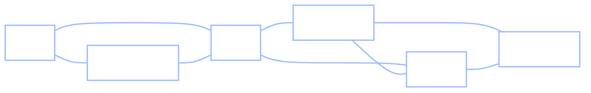
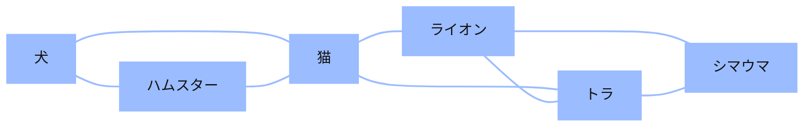

+++
date = "2026-06-16"
title = "ネットワーク上のランダムウォーク"
weight = 14
+++

## 状態がつながっているとき

[第13章](../13_markov_chains/)では、マルコフ連鎖は抽象的なものでした。いくつかの状態と、それらの間を移動する方法を示す遷移行列があるだけでした。Chibany の状態は T と H で、3状態の例では単に「1、2、3」でした。では、状態とその遷移は*どこから*来るのでしょうか？非常に多くの場合、**物事がどのようにつながっているかの図**、つまりネットワークから来ます。

Chibany はまたスケッチをしています。

> **Alyssa:** 「その図は何？ 地下鉄の路線図みたい。」
>
> **Chibany:** 「これは*動物*だよ。関係していると思う2匹の動物の間に線を引いたんだ——犬とハムスター、ライオンとトラ、そんな感じ。猫はほとんど全部とつながることになった。」
>
> **Jamal:** 「じゃあ、ハムスターから始めてランダムにつながった動物をたどり続けたら、どこで一番多くの時間を過ごすことになる？」
>
> **Chibany:** 「うさぎのところだよ、明らかに。」
>
> **Alyssa:** 「Chibany、図にうさぎはいないよ。」
>
> **Chibany:** 「……そうだね。じゃあ、*行きたい*ところにはいられない——*線*が連れていくところにしかいられない。ふーん。これはマルコフ連鎖だよね。動物が状態になるんだ。」

これはまさにマルコフ連鎖です——しかも非常に自然な形のもの。この章では、第13章の機構を使って、状態をネットワークの**ノード**にし、遷移はネットワークの配線から直接取り出します。その成果は驚くほどシンプルな結果であり、Googleを構築したアルゴリズムへの直接の道筋でもあります。

---

## グラフとは何か？

**グラフ**（または**ネットワーク**——両方の言葉を同じ意味で使います）は $G = (V, E)$ と書かれます。**ノード** $V$（**頂点**とも呼ばれる）の集合と、それらを結ぶ**辺** $E$（接続）の集合から成ります。定義はそれだけです。柔軟性はノードと辺が*意味すること*にあります。

- 辺は**無向**（相互リンク、「犬とハムスターは関係している」のような）にも**有向**（一方向、ページAからページBへのウェブリンクのような）にもなりえます。
- 辺は**重みなし**（存在するかどうか）にも**重み付き**（各辺に強度や距離が付く）にもなりえます。

あなたはすでに[第8章](../08_bayes_nets/)でグラフに出会っています。**ベイズネット**は*有向*グラフです——そこでは辺 $A \to B$ は「$B$ は $A$ に依存する」を意味していました。この章のグラフは、辺をより緩い意味で使います。*「関係している／つながっている」*。同じ数学的対象でも、矢印の読み方が異なります。

{}
グラフが一章を割く価値があるのは、*一つの*対象が膨大な範囲のシステムをモデル化できるからです——変わるのはノードと辺の意味だけです：

| ネットワーク | ノード | 辺 |
|---|---|---|
| **意味ネットワーク**（認知） | 概念・単語 | 「関連している」 |
| **ウェブ** | ウェブページ | ハイパーリンク（有向） |
| **ソーシャルネットワーク** | 人々 | 友人関係・フォロー |
| **道路地図** | 交差点 | 道路（距離で重み付け） |
| **脳** | ニューロン | シナプス |

私たちが使い続ける例は小さな**意味ネットワーク**です——概念をノード、連想を辺として——なぜなら次章でそれが人間の記憶の理論につながるからです。
{}

---

## Chibany の動物ネットワーク

これが Chibany のスケッチです。6匹の動物で、「関係していると感じる」2匹の間に辺があります。



これには2つの自然なクラスターがあります——**ペット**の三角形（犬–ハムスター–猫）と**大型動物**の三角形（ライオン–トラ–シマウマ）——両者は**猫**を通じてつながっています。猫は両方の世界を橋渡しする唯一のノードです。猫を覚えておいてください。この章の主役です。

### グラフを行列として表す

グラフで計算するには、行列として書き表します。**隣接行列** $L$ は、ノード $i$ と $j$ が辺を共有するとき $L_{ij} = 1$、そうでなければ $0$ です：

| | **犬** | **ハムスター** | **猫** | **ライオン** | **トラ** | **シマウマ** |
|---|:---:|:---:|:---:|:---:|:---:|:---:|
| **犬** | 0 | 1 | 1 | 0 | 0 | 0 |
| **ハムスター** | 1 | 0 | 1 | 0 | 0 | 0 |
| **猫** | 1 | 1 | 0 | 1 | 1 | 0 |
| **ライオン** | 0 | 0 | 1 | 0 | 1 | 1 |
| **トラ** | 0 | 0 | 1 | 1 | 0 | 1 |
| **シマウマ** | 0 | 0 | 0 | 1 | 1 | 0 |

2つ注目すべき点があります。行列は**対称**（$L_{ij} = L_{ji}$）です。なぜなら辺は無向だから——犬が猫に関係していれば、猫も犬に関係しています。そして**各行の和がそのノードの次数**です——そのノードに接する辺の数です。次数は後で正式に定義しますが、今は行の和を読み取ってください：犬 2、ハムスター 2、**猫 4**、ライオン 3、トラ 3、シマウマ 2。橋渡し役の猫が最も多くの辺に接しています。

---

## グラフから遷移行列へ

これが章全体のかなめです——*静的な図*（グラフ）を*プロセス*（マルコフ連鎖）に変換するステップです。あるノードに立っているウォーカーを想像してください。各ステップで、**隣接するノードの中から一様ランダムに1つを選び、そこに移動します**。これがネットワーク上の**ランダムウォーク**であり、マルコフ連鎖です。次のノードは現在のノードのみに依存します（マルコフ性）——第13章とまったく同じです。

遷移行列を得るには、$L$ の各行を合計が1になるように**正規化**します——各エントリをその行の次数で割ります：

$$P_{ij} = \frac{L_{ij}}{\deg(i)}.$$

犬（次数 2、ハムスターと猫につながっている）の場合、行は $(0, \tfrac12, \tfrac12, 0, 0, 0)$ になります：犬から、ハムスターか猫へそれぞれ確率2分の1で移動します。各行は今や合計が1になります——それぞれの合計（次数）で割ったから——なので $P$ は**行確率的**（行の和が1）であり、これはまさに第13章の条件です。（これはすべてのノードに少なくとも1つの辺があることを静かに仮定しています。孤立したノード（次数0）は0で割ることを意味します——移動先のないウォーカーが立ち往生することになります。）第13章のすべてが今や適用されます：ウォークを実行でき、定常分布を見つけることができます。

{}
今起きたことに注目してください：**構造**（グラフ——どの動物が関係しているか）と超シンプルな**プロセス**（ランダムな隣人へ移動する）が合わさって、マルコフ連鎖を*定義*しました。Chibany の弁当習慣のように手作業で遷移確率を考えたわけではありません——配線から直接導き出されました。この「構造 + プロセス」の分離は、[第15章](../15_memory_search/)でより強力な形で再び登場します。
{}

---

## ウォークをしてみよう

ウォーカーを解き放ちましょう。**ハムスター**から始めてランダムな隣人をたどります。これは*可能な*旅の一つです——橋の横断を示すために全6匹の動物を巡る整然とした旅を選びました。実際のランダムウォーク（以下のコードでサンプリングします）はより不規則にさまよい、しばしば引き返します：

$$\text{ハムスター} \to \text{犬} \to \text{猫} \to \text{ライオン} \to \text{トラ} \to \text{シマウマ}.$$



ウォークはペットの間で始まり、**猫を通じて橋を渡り**、大型動物の世界へとさまよいました。訪問するノードの列*が*マルコフ連鎖です——Chibany の T/H 列と同じ種類のオブジェクトで、ただ状態が2つではなく6つあり、図から生まれた遷移行列を持つだけです。（ウォークが一方のクラスターからもう一方へ移動するには、必ず猫を通過しなければならないことに注目してください：2つの三角形の間のすべての経路は橋を通ります。）

Jamal の質問を考えましょう：ウォークを非常に長い時間実行したとき、**どの動物を最も多く訪れるでしょうか？**

---

## ウォークの定常分布

「どの状態が最も多く訪れられるか」という問いに答える方法は知っています——第13章の定常分布 $\pi$ です。べき乗反復で見つけることができます。しかし、**無向・重みなし**ネットワーク上のランダムウォークでは、計算をほとんど必要としないほど整然としたショートカットがあります。ノードの**次数** $\deg(i)$（そのノードに接する辺の数）を定義します。すると

$$\pi_i \propto \deg(i),$$

ここで記号 $\propto$ は**「比例する」**を意味します——*と歩調を合わせて増加する*。言い換えれば：**ウォークがノードで過ごす長期的な時間の割合はそのノードの次数に比例します。**接続が多いほど、訪問が多い。比例関係を実際の確率に変換するには、各次数をすべてのノードの合計で割ります：

$$\pi_i = \frac{\deg(i)}{\sum_j \deg(j)}.$$

Chibany のネットワークでは次数が $(2, 2, 4, 3, 3, 2)$ で、合計は $16$ なので、

$$\pi = \left(\tfrac{2}{16}, \tfrac{2}{16}, \tfrac{4}{16}, \tfrac{3}{16}, \tfrac{3}{16}, \tfrac{2}{16}\right) = (0.125,\ 0.125,\ 0.25,\ 0.188,\ 0.188,\ 0.125).$$

**猫が 0.25 で最多です——ペットの2倍の割合です。** 固有ベクトルを解く必要も、べき乗反復も不要です。このようなネットワークでは、*次数が答えです*。これは直感的にも理解できます——猫は最も多くの辺に座っているので、ウォークがどこにいても、橋を通じて絶えず猫に戻ってきます。

{}
この公式を*導出する*のではなく、$\pi_i \propto \deg(i)$ を**推測**して、それが $\pi P = \pi$ を満たすことを*確認*します。次のステップでノード $i$ に着地する確率は、$i$ の各隣人 $j$ について「$j$ にいる」（$\pi_j$）と「$j$ から $i$ へ移動する」（$\tfrac{1}{\deg(j)}$、$j$ はその $\deg(j)$ 個の隣人の中から一様に選ぶので）の積の和です。推測 $\pi_j = c \cdot \deg(j)$ を代入すると、次数が打ち消されます：

$$\sum_{j \text{ は } i \text{ の隣人}} \deg(j) \cdot \frac{1}{\deg(j)} = \sum_{j \text{ は } i \text{ の隣人}} 1 = \deg(i).$$

$i$ の $\deg(i)$ 個の隣人それぞれがちょうど $1$ を寄与するので、合計は $\deg(i)$ に比例します——これは $\pi_i$ として推測したものです。推測が確認されました。**この打ち消しには2つの条件が必要です：ウォークが隣人を*一様に*選ぶこと（$\tfrac{1}{\deg(j)}$ を生む）と、辺が*無向*であること（$i$ の隣人がちょうど $i$ に移動*できる*ノードになる）。どちらかを破ると——ウォークを*重み付き*にするか、$j \to i$ が $i \to j$ を意味しない*有向*にするか——合計する隣人が割るべき次数と一致しなくなり、何も打ち消されず、べき乗反復か固有ベクトルで $\pi$ を求めることになります。**
{}

---

## PageRank：ウェブスケールでの同じ $\pi$

$\pi \propto \deg$ のショートカットは*無向*辺の恩恵でした。ウェブは**有向**です——ページAはページBにリンクしますが、Bは必ずしもAにリンクしません——そして長期的な訪問頻度はもはや単に次数ではありません。リンクグラフ上でウォーク（べき乗反復）を実行することで、第13章の方法で $\pi$ を見つける必要があります。

これが*まさに*、Google を立ち上げた**PageRank** アルゴリズムが計算するものです。各ステップで現在のページのリンクから一様ランダムにクリックする「ランダムサーファー」を想像してください。長期的に最も多く訪れるページ——そのウォークの定常分布 $\pi$——が最も重要とみなされます。重要なページが重要なページからリンクされている；ランダムウォークは、その循環しているように聞こえるアイデアを、一つの明確に定義された $\pi$ に変換します。

ウェブが私たちに強いる1つのしわがあり、すでに修正方法があります。有向リンクグラフには行き詰まり（発リンクのないページ）や孤立した島がありえます——そのためウォークは**エルゴード的でなく**、一意な定常分布は保証されません。PageRank はまさに**第13章の ε トリック**でこれを修正します：ある小さな確率で、サーファーはリンクを無視して*一様ランダムなページにテレポート*します。このたった一つの調整ですべてのページが互いにアクセス可能になり、エルゴード性と一意な $\pi$ が回復されます。（Google のオリジナルの「減衰係数」0.85 は、$\varepsilon = 0.15$ のときの $1 - \varepsilon$ に過ぎません。）

{}
ウェブページのランキングに使われるアルゴリズムが、**人間の記憶**もモデル化します。Griffiths、Steyvers、Firl（2007年）が「Google と心」と題した論文で、PageRank を**意味**ネットワーク——単語連想ノルム（ある単語で手がかりを与えられたときに人々が名前を挙げる単語）から構築された有向グラフ——に対して実行し、流暢さタスクを予測するためにその定常分布を使用しました：アルファベットの文字を見せられたとき、その文字で始まる単語を人はまず*どれ*を思い浮かべるか？人々が実際に出した単語は高 $\pi$ のものであり、PageRank は生の単語頻度よりもよく予測しました。同じウォーク、同じ $\pi$、一方は1000億ドルのアイデアで、もう一方は「思い浮かぶもの」への窓。その第二の物語——想起としてのウォーク——が[第15章](../15_memory_search/)です。
{}

---

## ネットワークについての短い補足

2つの用語が役立ちます。どちらもネットワークが*どのくらいつながっているか*についてです：

- **次数分布**はすべてのノードの次数のヒストグラムです——あなたが持っているのはどんな*種類の*ネットワークかを教えてくれます。
- 2つのノード間の**最短経路**は、一方からもう一方へ渡るのに必要な最小の辺の数です；ネットワーク全体の最大の最短経路がその**直径**です（ネットワークの最も広いところで何ホップかかるか）。

実際の意味、社会、ウェブネットワークは際立った形を共有しています：少数のノードが*巨大な*次数（ハブ）を持ち、ほとんどは非常に少ない次数しかありません。これは**スケールフリー**ネットワークと呼ばれ、すべてのノードがほぼ同じ中程度の次数を持つ**ランダム**（エルドシュ–レーニ）ネットワークと対照的です。スケールフリーネットワークのハブはまさに、ランダムウォークが最も多く訪れる高 $\pi$ ノードです——猫が、ウェブで最もリンクされたページや記憶の中で最も連想される概念にまでスケールアップされたものです。

---

## GenJAX と JAX の実装

Chibany のネットワークを隣接行列として構築し、それを行正規化して遷移行列を作り、$\pi$ を次数の公式とべき乗反復の両方で求め（両者が一致することを確認し）、GenJAX の `@gen` モデルでウォークを*サンプリング*し、最後に小さな有向ウェブで PageRank を手作りします。第13章と同様に、線形代数は普通の `jax.numpy` です；真に生成的な部分——ウォークのサンプリング——は GenJAX です。

### ネットワークを構築して π を求める

```python
import jax.numpy as jnp

names = ["Dog", "Hamster", "Cat", "Lion", "Tiger", "Zebra"]

# Adjacency matrix L: L[i,j] = 1 if animals i and j are connected.
L = jnp.array([
    # Dog Hamster Cat Lion Tiger Zebra
    [0, 1, 1, 0, 0, 0],   # Dog
    [1, 0, 1, 0, 0, 0],   # Hamster
    [1, 1, 0, 1, 1, 0],   # Cat   (the bridge)
    [0, 0, 1, 0, 1, 1],   # Lion
    [0, 0, 1, 1, 0, 1],   # Tiger
    [0, 0, 0, 1, 1, 0],   # Zebra
], dtype=jnp.float32)

degree = L.sum(axis=1)                       # row sums = degrees
P = L / degree[:, None]                      # row-normalize -> transition matrix

# Stationary distribution two ways: the degree formula, and power iteration.
pi_degree = degree / degree.sum()

def power_iterate(v, P, steps):
    for _ in range(steps):
        v = v @ P
    return v
pi_power = power_iterate(jnp.ones(6) / 6, P, 200)

for i, name in enumerate(names):
    print(f"{name:8s} degree {int(degree[i])}   "
          f"pi(degree) {pi_degree[i]:.3f}   pi(power) {pi_power[i]:.3f}")
```

**出力：**
```
Dog      degree 2   pi(degree) 0.125   pi(power) 0.125
Hamster  degree 2   pi(degree) 0.125   pi(power) 0.125
Cat      degree 4   pi(degree) 0.250   pi(power) 0.250
Lion     degree 3   pi(degree) 0.188   pi(power) 0.188
Tiger    degree 3   pi(degree) 0.188   pi(power) 0.188
Zebra    degree 2   pi(degree) 0.125   pi(power) 0.125
```

2つの列は完全に一致します：$\pi \propto \deg$、そして猫（次数 4）が 0.25 で最も多く訪れられるノードです。

### ウォークをサンプリングする（GenJAX）

ウォークはマルコフ連鎖なので、Chibany の弁当連鎖をサンプリングしたのとまったく同じ方法でサンプリングします——ファクトリークロージャーモデルで、$P$ の現在の行のログに対して `categorical` を使います。

```python
import jax
import jax.random as jr
from genjax import gen, categorical

LOGP = jnp.log(P)   # categorical takes log-probabilities; row `state` = current node

def make_walk(n_steps):
    @gen
    def walk(start):
        node = start
        visited = [node]
        for t in range(n_steps):
            node = categorical(LOGP[node]) @ f"v_{t}"
            visited.append(node)
        return jnp.array(visited)
    return walk

walk8 = make_walk(8)
seq = walk8.simulate(jr.key(0), (1,)).get_retval()   # start at Hamster (index 1)
print(" -> ".join(names[int(i)] for i in seq))
```

**出力：**
```
Hamster -> Cat -> Hamster -> Cat -> Hamster -> Cat -> Dog -> Cat -> Dog
```

実際にサンプリングされたウォーク——先ほど描いた整然としたツアーよりも乱雑で、**猫**にどれほど頻繁に戻るかに注目してください。（その往復感がまさに重要な点です：ウォークは高次数の橋を通じて絶えず戻ってきます。）代数ではなく*サンプリング*によって次数の法則を確認するために、一つの長いウォークを実行して、どこで時間を過ごすかを集計します：

<!-- validate: tol=0.03 -->
```python
def run_long(key, start, n):
    def step(node, k):
        nxt = jr.categorical(k, LOGP[node])
        return nxt, nxt
    _, visited = jax.lax.scan(step, start, jr.split(key, n))
    return visited

visited = run_long(jr.key(2), 2, 20000)              # start at Cat, 20000 steps
freq = jnp.array([jnp.mean((visited == i).astype(float)) for i in range(6)])
for i, name in enumerate(names):
    print(f"{name:8s} visited {float(freq[i]):.2f}   (degree share {float(pi_degree[i]):.2f})")
```

**出力：**
```
Dog      visited 0.12   (degree share 0.12)
Hamster  visited 0.12   (degree share 0.12)
Cat      visited 0.25   (degree share 0.25)
Lion     visited 0.19   (degree share 0.19)
Tiger    visited 0.19   (degree share 0.19)
Zebra    visited 0.13   (degree share 0.12)
```

訪問頻度は $\pi \propto \deg$ が約束したとおり、次数の割合を追跡します。（シマウマの $0.13$ 対正確な割合の $0.12$ は通常のサンプリングの揺らぎです——2万ステップは多いですが、無限ではありません——エラーではありません；異なるシードで実行すれば、違うノードが百分の一だけずれるでしょう。）

### 手作り PageRank

*有向*グラフでは次数のショートカットは成り立たないので、ウォークをエルゴード的に保つ ε テレポートと共に、べき乗反復で $\pi$ を求めます。これは4ページのおもちゃのウェブです。

```python
# Directed link graph: M[i,j] = 1 if page i links to page j.
pages = ["A", "B", "C", "D"]
M = jnp.array([
    # A  B  C  D
    [0, 1, 1, 0],   # A -> B, C
    [0, 0, 1, 0],   # B -> C
    [1, 0, 0, 0],   # C -> A
    [0, 0, 1, 0],   # D -> C
], dtype=jnp.float32)

n = 4
out_links = M.sum(axis=1, keepdims=True)
P_links = M / out_links                       # row-normalize the link graph

epsilon = 0.15                                # teleport prob (Google's damping = 1 - 0.15)
uniform = jnp.ones((n, n)) / n
P_surfer = (1 - epsilon) * P_links + epsilon * uniform   # the ε-trick from Ch 13

pagerank = power_iterate(jnp.ones(n) / n, P_surfer, 200)
for i, page in enumerate(pages):
    print(f"page {page}: PageRank {float(pagerank[i]):.3f}")
```

**出力：**
```
page A: PageRank 0.373
page B: PageRank 0.196
page C: PageRank 0.394
page D: PageRank 0.038
```

ページ **C** が最高ランクです——4つのページのうち3つがそこにリンクしています——そしてページ **D** は何もリンクしていないにも関わらず、リンクアウトしているにも関わらず最低ランクです。Chibany の 70/30 を見つけたものと同じべき乗反復がウェブをランク付けします；追加されたのは有向グラフと ε テレポートだけです。

{}
ネットワークを**隣接行列**として読み取り、**行正規化**によって遷移行列に変換し、**ランダムウォーク**をノードが状態であるマルコフ連鎖として認識することができます。無向ウォークに対するきれいな法則 $\pi_i \propto \deg(i)$（そしてそれが有向グラフで成り立たない理由）を知り、テレポートするランダムサーファーの定常分布として**PageRank** を計算できます。

次は、[第15章](../15_memory_search/)でこれすべてを認知に生かします：**人間の記憶探索は意味ネットワーク上のランダムウォークである**と論じ、ネットワークの構造と、まさにこのプロセスが、あなたが想起する単語の順序とタイミングを予測することを示します。

*用語集：* [ランダムウォーク](../../glossary/#random-walk-)、[隣接行列と次数](../../glossary/#adjacency-matrix-and-degree-)、[遷移行列](../../glossary/#transition-matrix-)、[定常分布](../../glossary/#stationary-distribution-)、[PageRank](../../glossary/#pagerank-)。
{}

---

## 練習問題

{}
1. **計算する前に予測しよう。** Chibany のネットワークに辺を一つ追加します——たとえば犬–シマウマ。何も実行せずに、各ノードの $\pi$ はどう変わるはずでしょうか？次に `L` のコードに辺を追加して `pi_degree` を再計算してください。予測は正しかったでしょうか？どのノードが増え、どのノードが減りましたか？
2. **次数の法則を破ろう。** `L` の辺の一方向をゼロにすることで、ウォークを*有向*にします（$L_{ij} = 1$ だが $L_{ji} = 0$）。`pi_degree` は `pi_power` と一致しますか？なぜそうでないのですか？（これがPageRankが設計された状況です。）
3. **テレポートの強さ。** PageRank のコードで $\varepsilon = 0.01$ と $\varepsilon = 0.5$ を試してください。サーファーのテレポートが増えるにつれて、ページのランキングはどう変わりますか？$\varepsilon = 1$ は何に対応しますか？
{}

付属のノートブックがこれらすべてをインタラクティブに解説しています：

**📓 [Colab で開く: `14_random_walks_networks.ipynb`](https://colab.research.google.com/github/josephausterweil/probintro/blob/main/notebooks/14_random_walks_networks.ipynb)**

---

## 参考文献

- Erdős, P., & Rényi, A. (1959). On random graphs I. *Publicationes Mathematicae Debrecen, 6*, 290–297.
- Griffiths, T. L., Steyvers, M., & Firl, A. (2007). Google and the mind: Predicting fluency with PageRank. *Psychological Science, 18*(12), 1069–1076. <https://doi.org/10.1111/j.1467-9280.2007.02027.x>

---

Special thanks to [JPPCA](https://jpcca.org/) for their generous support of this tutorial series.
