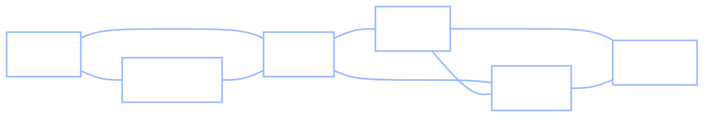
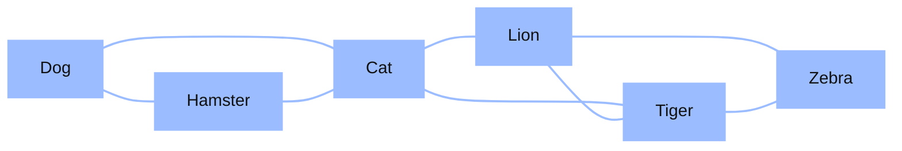

+++
date = "2026-06-03"
title = "Random Walks on Networks"
weight = 14
+++

## When the States Are Connected

In [Chapter 13](../13_markov_chains/) a Markov chain was an abstract thing: a handful of states and a transition matrix saying how to hop between them. Chibany's states were T and H; the three-state example's were just "1, 2, 3." But where do the states and their transitions *come from*? Very often, from a **picture of how things are connected** — a network.

Chibany has been sketching again.

> **Alyssa:** "What's the diagram? Looks like a subway map."
>
> **Chibany:** "It's *animals*. I drew a line between two animals whenever they feel related — dog and hamster, lion and tiger, that sort of thing. Cat ended up connected to almost everything."
>
> **Jamal:** "So if you started at Hamster and kept wandering to a random connected animal, where would you spend most of your time?"
>
> **Chibany:** "At bunny, obviously."
>
> **Alyssa:** "Chibany. There's no bunny on the diagram."
>
> **Chibany:** "...Right. So it can't be wherever I'd *like* to end up — it has to be wherever the *lines* take me. Huh. That's a Markov chain, isn't it. The animals are the states."

It is exactly a Markov chain — and a very natural one. This chapter takes the machinery from Chapter 13 and lets the states be the **nodes of a network**, with the transitions coming straight from the network's wiring. The payoff is a result of startling simplicity, and a direct line to the algorithm that built Google.

---

## What's a Graph?

A **graph** (or **network** — we use the words interchangeably) is written $G = (V, E)$: a set of **nodes** $V$ (also called *vertices*) joined by a set of **edges** $E$ (the connections). That's the whole definition. The flexibility is in what the nodes and edges *mean*:

- Edges can be **undirected** (a mutual link, like "dog and hamster are related") or **directed** (one-way, like a web link from page A to page B).
- Edges can be **unweighted** (present or absent) or **weighted** (a strength or distance attached to each).

You have already met a graph, back in [Chapter 8](../08_bayes_nets/). A **Bayes net** is a *directed* graph — there an edge $A \to B$ meant "$B$ depends on $A$." The graphs in this chapter use edges to mean something looser: *"is related to / connected to."* Same mathematical object, different reading of the arrows.

{}
The reason graphs are worth a chapter is that *one* object models an enormous range of systems — only the meaning of node and edge changes:

| Network | Nodes | Edges |
|---|---|---|
| **Semantic network** (cognition) | concepts / words | "is associated with" |
| **The Web** | web pages | hyperlinks (directed) |
| **Social network** | people | friendships / follows |
| **Road map** | intersections | roads (weighted by distance) |
| **Brain** | neurons | synapses |

Our running example is a tiny **semantic network** — concepts as nodes, associations as edges — because it leads, in the next chapter, to a theory of human memory.
{}

---

## Chibany's Animal Network

Here is Chibany's sketch: six animals, with an edge between any two that "feel related."



It has two natural clusters — a **pets** triangle (Dog–Hamster–Cat) and a **big-animals** triangle (Lion–Tiger–Zebra) — joined through **Cat**, the one node that bridges both worlds. Hold onto Cat; it is the hero of this chapter.

### The graph as a matrix

To compute with a graph, we write it as a matrix. The **adjacency matrix** $L$ has $L_{ij} = 1$ when nodes $i$ and $j$ share an edge, and $0$ otherwise:

| | **Dog** | **Hamster** | **Cat** | **Lion** | **Tiger** | **Zebra** |
|---|:---:|:---:|:---:|:---:|:---:|:---:|
| **Dog** | 0 | 1 | 1 | 0 | 0 | 0 |
| **Hamster** | 1 | 0 | 1 | 0 | 0 | 0 |
| **Cat** | 1 | 1 | 0 | 1 | 1 | 0 |
| **Lion** | 0 | 0 | 1 | 0 | 1 | 1 |
| **Tiger** | 0 | 0 | 1 | 1 | 0 | 1 |
| **Zebra** | 0 | 0 | 0 | 1 | 1 | 0 |

Two things to notice. The matrix is **symmetric** ($L_{ij} = L_{ji}$) because the edges are undirected — if Dog is related to Cat, then Cat is related to Dog. And **each row's sum is that node's degree** — the number of edges touching it. We'll define **degree** properly in a moment; for now just read off the row sums: Dog 2, Hamster 2, **Cat 4**, Lion 3, Tiger 3, Zebra 2. Cat, the bridge, touches the most edges.

---

## From a Graph to a Transition Matrix

Here is the hinge of the whole chapter — the step that turns a *static picture* (the graph) into a *process* (a Markov chain). Imagine a walker standing on some node who, at each step, **picks one of its neighbours uniformly at random and steps there**. That is a **random walk** on the network, and it is a Markov chain: the next node depends only on the current one (the Markov property), exactly like Chapter 13.

To get its transition matrix, **normalize each row of $L$ to sum to 1** — divide every entry by that row's degree:

$$P_{ij} = \frac{L_{ij}}{\deg(i)}.$$

For Dog (degree 2, connected to Hamster and Cat), the row becomes $(0, \tfrac12, \tfrac12, 0, 0, 0)$: from Dog, step to Hamster or Cat with probability one-half each. Each row now sums to 1 — *because* we divided it by its own total (the degree) — so $P$ is **row-stochastic** (rows sum to 1), exactly the condition from Chapter 13. (This quietly assumes every node has at least one edge; an isolated node, degree 0, would mean dividing by zero — a walker stranded with nowhere to step.) Everything from Chapter 13 now applies: we can run the walk, and we can find its stationary distribution.

{}
Notice what just happened: the **structure** (the graph — which animals are related) plus a dead-simple **process** (step to a random neighbour) together *define* a Markov chain. We didn't invent transition probabilities by hand the way we did for Chibany's bento habit — they fell straight out of the wiring. This "structure + process" split returns, with a vengeance, in [Chapter 15](../15_memory_search/).
{}

---

## Take a Walk

Let's release a walker. Start at **Hamster** and follow random neighbours. Here is *one possible* journey — we picked a tidy one that tours all six animals to show the bridge crossing; a real random walk (which we sample in code below) wanders more raggedly, often doubling back:

$$\text{Hamster} \to \text{Dog} \to \text{Cat} \to \text{Lion} \to \text{Tiger} \to \text{Zebra}.$$



The walk started among the pets, **crossed the bridge at Cat**, and wandered into the big animals. The sequence of nodes it visits *is* a Markov chain — the same kind of object as Chibany's T/H sequence, just with six states instead of two and a transition matrix that came from a picture. (Notice the walk *had* to pass through Cat to get from one cluster to the other: every route between the two triangles runs through the bridge.)

Now ask Jamal's question: run the walk for a very long time — **which animal does it visit most often?**

---

## The Stationary Distribution of a Walk

We know how to answer "which state is visited most" — it's the stationary distribution $\pi$ from Chapter 13, and we could find it by power iteration. But for a random walk on an **undirected, unweighted** network there is a shortcut so clean it barely needs computing. Define the **degree** of a node, $\deg(i)$, as the number of edges touching it. Then

$$\pi_i \propto \deg(i),$$

where the symbol $\propto$ means **"is proportional to"** — *grows in step with*. In words: **the long-run fraction of time the walk spends at a node is proportional to that node's degree.** More connections, more visits. To turn the proportionality into actual probabilities, divide each degree by the total over all nodes:

$$\pi_i = \frac{\deg(i)}{\sum_j \deg(j)}.$$

For Chibany's network the degrees are $(2, 2, 4, 3, 3, 2)$, summing to $16$, so

$$\pi = \left(\tfrac{2}{16}, \tfrac{2}{16}, \tfrac{4}{16}, \tfrac{3}{16}, \tfrac{3}{16}, \tfrac{2}{16}\right) = (0.125,\ 0.125,\ 0.25,\ 0.188,\ 0.188,\ 0.125).$$

**Cat wins, at 0.25 — twice any pet's share.** No eigenvector solve, no power iteration: for this kind of network, *the degree is the answer*. And it makes intuitive sense — Cat sits on the most edges, so wherever the walk is, it keeps getting funnelled back through the bridge.

{}
We don't *derive* this formula — we **guess** $\pi_i \propto \deg(i)$ and *check* that it satisfies $\pi P = \pi$. The chance of landing on node $i$ next step is the sum, over each neighbour $j$ of $i$, of "be at $j$" ($\pi_j$) times "step from $j$ to $i$" ($\tfrac{1}{\deg(j)}$, since $j$ picks among its $\deg(j)$ neighbours uniformly). Substitute the guess $\pi_j = c \cdot \deg(j)$ and watch the degrees cancel:

$$\sum_{j \text{ neighbour of } i} \deg(j) \cdot \frac{1}{\deg(j)} = \sum_{j \text{ neighbour of } i} 1 = \deg(i).$$

Each of $i$'s $\deg(i)$ neighbours contributes exactly $1$, so the total is proportional to $\deg(i)$ — which is what we guessed for $\pi_i$. The guess checks out. **The cancellation needs two things: the walk picks neighbours *uniformly* (giving the $\tfrac{1}{\deg(j)}$), and the edges are *undirected* (so $i$'s neighbours are exactly the nodes that can step *to* $i$). Break either — make the walk *weighted*, or *directed* so that $j \to i$ doesn't imply $i \to j$ — and the neighbours you sum over no longer match the degrees you'd divide by, nothing cancels, and you're back to finding $\pi$ by power iteration or the eigenvector.**
{}

---

## PageRank: the Same π, at Web Scale

The $\pi \propto \deg$ shortcut was a gift of *undirected* edges. The Web is **directed** — page A links to page B without B linking back — and there the long-run visit frequency is no longer just the degree; you have to find $\pi$ the Chapter-13 way, by running the walk (power iteration) on the link graph.

That is *exactly* what **PageRank**, the algorithm that launched Google, computes. Picture a "random surfer" who, at each step, clicks a uniformly random link on the current page. The pages they visit most often in the long run — the stationary distribution $\pi$ of that walk — are deemed the most important. A page is important if important pages link to it; the random walk turns that circular-sounding idea into a single well-defined $\pi$.

There is one wrinkle the Web forces on us, and we already have the fix. A directed link graph can have dead ends (pages with no outgoing links) and disconnected islands — so the walk is **not** ergodic, and a unique stationary distribution isn't guaranteed. PageRank repairs this with precisely the **ε-trick from Chapter 13**: with some small probability the surfer ignores the links and *teleports* to a uniformly random page. That single tweak makes every page reachable from every other, restoring ergodicity and a unique $\pi$. (Google's original "damping factor" of $0.85$ is just $1 - \varepsilon$ with $\varepsilon = 0.15$.)

{}
The same algorithm that ranks web pages also models **human memory**. Griffiths, Steyvers and Firl (2007), in a paper titled *Google and the Mind*, ran PageRank over a **semantic** network — a directed graph built from word-association norms (which words people name when cued with another) — and used its stationary distribution to predict a fluency task: shown a letter of the alphabet, *which* word beginning with that letter does a person produce first? The words people actually produced were the high-$\pi$ ones, and PageRank predicted them better than raw word frequency did. Same walk, same $\pi$, a $100-billion idea on one side and a window on what "comes to mind" on the other. That second story — recall as a walk — is [Chapter 15](../15_memory_search/).
{}

---

## A Few Words About Networks

Two terms will be handy, both about *how connected* a network is:

- The **degree distribution** is the histogram of all the nodes' degrees — it tells you what *kind* of network you have.
- A **shortest path** between two nodes is the fewest edges you must cross to get from one to the other; the largest shortest-path in the whole network is its **diameter** (how many hops across the network at its widest).

Real semantic, social, and web networks share a striking shape: a few nodes have *enormous* degree (hubs) while most have very few. This is called a **scale-free** network, in contrast to a **random** (Erdős–Rényi) network where every node has roughly the same, middling degree. The hubs of a scale-free network are precisely the high-$\pi$ nodes a random walk visits most — Cat, scaled up to the most-linked page on the Web or the most-associated concept in memory.

---

## GenJAX and JAX Implementation

We build Chibany's network as an adjacency matrix, row-normalize it into a transition matrix, find $\pi$ both by the degree formula and by power iteration (confirming they agree), *sample* a walk with a GenJAX `@gen` model, and finally hand-roll PageRank on a tiny directed web. As in Chapter 13, the linear algebra is plain `jax.numpy`; the genuinely generative piece — sampling the walk — is GenJAX.

### Build the network and find π

```python
import jax.numpy as jnp

names = ["Dog", "Hamster", "Cat", "Lion", "Tiger", "Zebra"]

# Adjacency matrix L: L[i,j] = 1 if animals i and j are connected.
L = jnp.array([
    # Dog Hamster Cat Lion Tiger Zebra
    [0, 1, 1, 0, 0, 0],   # Dog
    [1, 0, 1, 0, 0, 0],   # Hamster
    [1, 1, 0, 1, 1, 0],   # Cat   (the bridge)
    [0, 0, 1, 0, 1, 1],   # Lion
    [0, 0, 1, 1, 0, 1],   # Tiger
    [0, 0, 0, 1, 1, 0],   # Zebra
], dtype=jnp.float32)

degree = L.sum(axis=1)                       # row sums = degrees
P = L / degree[:, None]                      # row-normalize -> transition matrix

# Stationary distribution two ways: the degree formula, and power iteration.
pi_degree = degree / degree.sum()

def power_iterate(v, P, steps):
    for _ in range(steps):
        v = v @ P
    return v
pi_power = power_iterate(jnp.ones(6) / 6, P, 200)

for i, name in enumerate(names):
    print(f"{name:8s} degree {int(degree[i])}   "
          f"pi(degree) {pi_degree[i]:.3f}   pi(power) {pi_power[i]:.3f}")
```

**Output:**
```
Dog      degree 2   pi(degree) 0.125   pi(power) 0.125
Hamster  degree 2   pi(degree) 0.125   pi(power) 0.125
Cat      degree 4   pi(degree) 0.250   pi(power) 0.250
Lion     degree 3   pi(degree) 0.188   pi(power) 0.188
Tiger    degree 3   pi(degree) 0.188   pi(power) 0.188
Zebra    degree 2   pi(degree) 0.125   pi(power) 0.125
```

The two columns agree exactly: $\pi \propto \deg$, and Cat (degree 4) is the most-visited node at $0.25$.

### Sample a walk (GenJAX)

The walk is a Markov chain, so we sample it exactly as we sampled Chibany's bento chain — `categorical` on the log of the current row of $P$, in a factory-closure model.

```python
import jax
import jax.random as jr
from genjax import gen, categorical

LOGP = jnp.log(P)   # categorical takes log-probabilities; row `state` = current node

def make_walk(n_steps):
    @gen
    def walk(start):
        node = start
        visited = [node]
        for t in range(n_steps):
            node = categorical(LOGP[node]) @ f"v_{t}"
            visited.append(node)
        return jnp.array(visited)
    return walk

walk8 = make_walk(8)
seq = walk8.simulate(jr.key(0), (1,)).get_retval()   # start at Hamster (index 1)
print(" -> ".join(names[int(i)] for i in seq))
```

**Output:**
```
Hamster -> Cat -> Hamster -> Cat -> Hamster -> Cat -> Dog -> Cat -> Dog
```

A real sampled walk — messier than the tidy tour we drew earlier, and notice how often it returns to **Cat**. (That bounciness is the point: the walk keeps getting funnelled back through the high-degree bridge.) To confirm the degree law by *sampling* rather than algebra, take one long walk and tally where it spends its time:

<!-- validate: tol=0.03 -->
```python
def run_long(key, start, n):
    def step(node, k):
        nxt = jr.categorical(k, LOGP[node])
        return nxt, nxt
    _, visited = jax.lax.scan(step, start, jr.split(key, n))
    return visited

visited = run_long(jr.key(2), 2, 20000)              # start at Cat, 20000 steps
freq = jnp.array([jnp.mean((visited == i).astype(float)) for i in range(6)])
for i, name in enumerate(names):
    print(f"{name:8s} visited {float(freq[i]):.2f}   (degree share {float(pi_degree[i]):.2f})")
```

**Output:**
```
Dog      visited 0.12   (degree share 0.12)
Hamster  visited 0.12   (degree share 0.12)
Cat      visited 0.25   (degree share 0.25)
Lion     visited 0.19   (degree share 0.19)
Tiger    visited 0.19   (degree share 0.19)
Zebra    visited 0.13   (degree share 0.12)
```

Visit frequency tracks degree share, just as $\pi \propto \deg$ promised. (Zebra's $0.13$ versus its exact share of $0.12$ is ordinary sampling wobble — 20,000 steps is a lot, but not infinite — not an error; run it with a different seed and a different node will be the one that's off by a hundredth.)

### Hand-rolled PageRank

For a *directed* graph the degree shortcut no longer holds, so we find $\pi$ by power iteration — with the ε-teleport that keeps the walk ergodic. Here is a four-page toy web.

```python
# Directed link graph: M[i,j] = 1 if page i links to page j.
pages = ["A", "B", "C", "D"]
M = jnp.array([
    # A  B  C  D
    [0, 1, 1, 0],   # A -> B, C
    [0, 0, 1, 0],   # B -> C
    [1, 0, 0, 0],   # C -> A
    [0, 0, 1, 0],   # D -> C
], dtype=jnp.float32)

n = 4
out_links = M.sum(axis=1, keepdims=True)
P_links = M / out_links                       # row-normalize the link graph

epsilon = 0.15                                # teleport prob (Google's damping = 1 - 0.15)
uniform = jnp.ones((n, n)) / n
P_surfer = (1 - epsilon) * P_links + epsilon * uniform   # the ε-trick from Ch 13

pagerank = power_iterate(jnp.ones(n) / n, P_surfer, 200)
for i, page in enumerate(pages):
    print(f"page {page}: PageRank {float(pagerank[i]):.3f}")
```

**Output:**
```
page A: PageRank 0.373
page B: PageRank 0.196
page C: PageRank 0.394
page D: PageRank 0.038
```

Page **C** ranks highest — three of the four pages link to it — and page **D**, which nothing links to, ranks lowest despite linking out. The same power iteration that found Chibany's 70/30 ranks the Web; the only additions were a directed graph and the ε-teleport.

{}
You can read a network as an **adjacency matrix**, turn it into a transition matrix by **row-normalizing**, and recognize a **random walk** as a Markov chain whose states are nodes. You know the clean law $\pi_i \propto \deg(i)$ for undirected walks (and why it breaks for directed ones), and you can compute **PageRank** as the stationary distribution of a teleporting random surfer.

Next, [Chapter 15](../15_memory_search/) cashes all of this in for cognition: it argues that **human memory search is a random walk on a semantic network** — and that the structure of the network, plus this very process, predicts the order and timing of the words you recall.

*Glossary:* [random walk](../../glossary/#random-walk-), [adjacency matrix and degree](../../glossary/#adjacency-matrix-and-degree-), [transition matrix](../../glossary/#transition-matrix-), [stationary distribution](../../glossary/#stationary-distribution-), [PageRank](../../glossary/#pagerank-).
{}

---

## Exercises

{}
1. **Predict before you compute.** Add one edge to Chibany's network — say Dog–Zebra. Without running anything, how should each node's $\pi$ change? Now add the edge to `L` in the code and recompute `pi_degree`. Were you right? Which nodes gained, which lost?
2. **Break the degree law.** Make the walk *directed* by zeroing out one direction of an edge in `L` (so $L_{ij} = 1$ but $L_{ji} = 0$). Does `pi_degree` still match `pi_power`? Why not? (This is the situation PageRank is built for.)
3. **Teleport strength.** In the PageRank code, try $\varepsilon = 0.01$ and $\varepsilon = 0.5$. How does the ranking of pages change as the surfer teleports more? What does $\varepsilon = 1$ correspond to?
{}

A companion notebook works through all of this interactively:

**📓 [Open in Colab: `14_random_walks_networks.ipynb`](https://colab.research.google.com/github/josephausterweil/probintro/blob/main/notebooks/14_random_walks_networks.ipynb)**

---

Special thanks to [JPPCA](https://jpcca.org/) for their generous support of this tutorial series.
