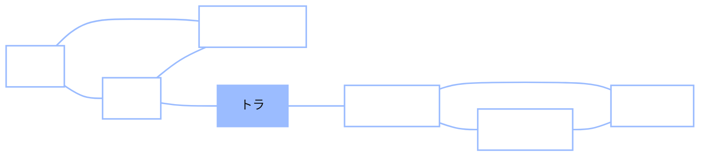

+++
date = "2026-06-14"
title = "記憶探索としてのランダムウォーク"
weight = 15
+++

## 頭の中の歩行

前の2章では一つの機械を構築した——マルコフ連鎖（[第13章](../13_markov_chains/)）、そしてネットワーク上のランダムウォーク（[第14章](../14_random_walks_networks/)）。本章では、この機械はカードデッキやウェブページのモデルであるだけでなく、**あなた自身**のモデルでもあると主張する。具体的には、あなたが自分の記憶をどのように探索するかについてだ。

今すぐ試してみよう。Chibanyのクラスがやったように。**30秒間、できるだけ多くの動物を声に出して挙げてみよう。** どうぞ。

終わった？それらが出てきた*順序*を見てみよう。ほぼ確実に、**バースト（群れ）**で現れたはずだ——ペットのかたまり（*犬、猫、ハムスター*）、次に間があって、大きな動物のかたまり（*ライオン、トラ、シマウマ、キリン*）、そして例えば農場の動物に切り替わる。人はランダムな順序で動物を挙げるのではなく、**カテゴリーごとのランで、その間に間隔を挟んで**出てくる。これが**意味流暢性課題**であり、そのクラスタリングと切り替えのパターンは80年にわたり記録されてきた（Bousfield & Sedgewick, 1944; Troyer, Moscovitch & Winocur, 1997）。

> **Chibany：**「私のリストもまさにそうなった——ペットが3つ続いて、間があって、それから動物園の動物がどっさり。なぜ？」
>
> **Alyssa：**「そして*なぜ*その動物たちが、*その*順序で出てきたの？それが本当の問いよ。」

本章の主張は、Abbott、Austerweil、Griffiths（2012）によるものだ：**あなたの意味記憶はネットワークであり、想起はその上のランダムウォークである。** あなたが作るリストは、ウォークが訪れたノードの系列だ。クラスターとは、関連する概念の密に接続されたコミュニティの中でウォークが漂っている状態であり、切り替えとは、ウォークが別のコミュニティへ橋渡し辺を渡る瞬間だ——第14章で Cat が橋を渡ったのと*まったく同じ*だ。特別な「探索戦略」は不要で、ネットワークの構造と単純なウォークだけで、バースト状の切り替え行動が自然に生じる。

---

## 構造・プロセス・行動

この説明の*形*について少し立ち止まる価値がある。というのも、コース全体を貫く同じ三つの部分からなる形をしているからだ：

- **構造**——意味ネットワーク。どの概念がどれと繋がっているか。重要なのは、これが*別のデータ*（単語連想規範：何千人もの人に「*医者*と聞いて何を思い浮かべますか？」と尋ね、*看護師*、*病院*、*病気*への辺を引く）から推定されており、説明しようとしている流暢性課題にフィットされているのではないということだ。
- **プロセス**——ランダムウォーク。記憶のない、無方向の、一度に一ステップの動き。常に同じマルコフ連鎖だ。
- **行動**——流暢性リスト。どの動物が、どの順序で、どの間隔を挟んで現れるか。

この賭けは、**構造＋プロセス**が**行動**を*共同で予測する*というものだ——そして実際にそうなる、想起専用の機構を付け加えることなく。これは強く反証可能な主張であり、単なる話ではなくこれを意味ある研究にしているものだ。



**ペット**の三角形の中をうろうろするウォーカーはペットのバーストを生み出し、**大型動物**に到達するには橋（*トラ*）を渡らなければならない。すると今度はそちらの方をうろうろする。クラスター、切り替え、クラスター——第14章のウォークが Cat の方に何度も引き寄せられたのと同じように、ネットワークの配線から直接生じる。

---

## 落とし穴：ウォーク≠リスト

問題がある。それに正面から向き合うことが、このモデルを曖昧なものではなく本物にしている。**生のランダムウォークは流暢性リストではない**——二つの理由がある：

1. ウォークはノードを**再訪する**——*犬*に何度も踏み込む。しかし、あなたは「犬」を5回言うのではなく、一度しか言わない。
2. ウォークは**非動物**を通り抜ける——ある動物クラスターから別のものへ移る途中で、*家*、*食べ物*、*毛皮*など、その間に座る概念を通過するかもしれない。しかしそれらもあなたの動物リストには絶対に現れない。

つまり、ウォークが訪れるノードの系列は、あなたが実際に作るリストよりも長くて雑然としている。**潜在ウォーク**を**観察された行動**にマッピングする何かが必要だ。その何かが**センサリング関数**であり、モデルの技術的な核心だ。

---

## センサリング関数

ルールは美しくシンプルだ：**ウォークが初めてその単語に着地したときだけ、そしてそれが動物の場合だけ、その単語を報告する。** それ以外——再訪と、すべての非動物——は*センサリング（打ち切り）*される。（*センサリング*という言葉は統計学から借用されており、センサリングされた観察とは、実際に起きたが記録されなかったものを指す——まさに我々のケースだ：ウォークは本当に*家*に踏み込み、*犬*を再訪するが、それらのステップは話されたリストには決して入ってこない。）

これを計測可能にするために、**初回到達時刻** $\tau(k)$を定義する：ウォークが**第$k$番目の異なる動物**に初めて到達するタイムステップ。論文自体の例を使って追ってみよう。ウォークが次を生成するとする：

$$X_1 = \text{animal},\ X_2 = \text{dog},\ X_3 = \text{house},\ X_4 = \text{dog},\ X_5 = \text{cat}.$$

左から右へ読んでルールを適用すると：*animal*は開始キュー（報告しない）；ステップ2の*dog*は初回の動物——**報告**し、$\tau(1) = 2$；ステップ3の*house*は動物ではない——**センサリング**；ステップ4の*dog*は再訪——**センサリング**；ステップ5の*cat*は初回の動物——**報告**し、$\tau(2) = 5$。報告されたリストは**「dog, cat」**のみ——5ステップのウォークから2語が抽出された。

次にタイミングについて。流暢性実験が実際に記録するデータは**項目間応答時間（IRT）**——ある動物を言ってから次の動物を言うまでの間隔だ。（この「IRT」は*項目間応答時間*であり、テスト設計の*項目反応理論*ではない——同じ頭文字だが、無関係な概念だ。）単語を産出するまでの合計時間は、連続して起きる2つの部分からなるため、**足し算**になる：その単語まで心的に*移動する*時間と、それを物理的に*発する*時間。移動時間はウォークがどれだけさまよわなければならなかったかであり、発話時間は単語の長さとする（長い単語は産出に時間がかかる——Hills et al.の実験では参加者が答えを*タイプ*したが、声に出して言う場合でも大まかには同様だ）。したがって、

$$\text{IRT}(k) = \tau(k) - \tau(k-1) + L\big(X_{\tau(k)}\big),$$

ここで $L(\cdot)$ は単語の長さ。第1項 $\tau(k) - \tau(k-1)$ は、**ウォークが動物 $k-1$ への初回到達から動物 $k$ への初回到達の間にさまよったステップ数**——ウォークが枯渇したクラスターを離れて橋を渡らなければならなかった場合は長く、次の動物がすぐ隣にあった場合は短い。（ここでは単位について意図的に大雑把にしている：ウォークのステップと文字の発話はどちらも1つの抽象的な「時刻の刻み」として数えられるため、2つの項は単純に足し算できる。重要なのは曲線の*形状*であり、実際のミリ秒ではない。）私たちの例では、

$$\text{IRT}(\text{cat}) = \tau(\text{cat}) - \tau(\text{dog}) + L(\text{cat}) = 5 - 2 + 3 = 6.$$

これが隠されたウォークから観測可能なデータへの完全なリンクだ：**初回到達間のさまよい時間、プラス単語の長さ。** 第1項を覚えておこう——そこに有名な結果がある。（演習をするときの安心材料として：差分 $\tau(k) - \tau(k-1)$ だけが登場するので、ウォークのステップを0番から始めるか1番から始めるかは関係ない——起点は打ち消される。）

---

## シグネチャ：減速してから切り替える

これがモデルが説明しなければならない現象だ。これから使う採餌の言葉では、クラスターを**パッチ**（関連する動物のような「パッチ（地域）」——ベリーのパッチのような）と呼ぶ。Hills、Jones、Todd（2012）は、人が産出した各動物をパッチ切り替えに対する**位置**で並べた——位置1は新しいパッチの*最初の*動物（クラスターを切り替えた瞬間）、位置2は2番目、といった具合——そして平均IRTを求めた。その結果（彼らのFigure 1a）は際立って一貫していた：

- **新しいパッチの最初の単語（位置1）**が**最も遅い**——そのIRTは人全体の平均値を*上回っている*。
- **2番目の単語（位置2）**が**最も速い**——新鮮なクラスターの中に入ると、次の項目がすぐに出てくる。

Hills et al.はこれを**最適採餌**の証拠として読み取った：人々は記憶をパッチ状の食物環境のように扱い、枯渇したパッチを離れて新しいものを見つけるために「切り替えコスト」を払うことを意図的に*決定する*というのだ。*いつ*離れるかのルールは、採餌生態学の**限界値定理**（Charnov, 1976）から来ている：採餌者は現在のパッチの収益率が環境全体の*平均*収益率まで下がった瞬間に、そのパッチを見捨てるべきだ。心に当てはめると、関連する単語が全体ペースよりも速く出てこなくなったときにクラスターを離れる。この説明は洗練されているが、**2つの**プロセスが必要だ：パッチ内を探索するものと、切り替えるタイミングを選ぶ別の戦略的決定（限界値定理に支配される）。

{}
最適採餌の説明は*クラスタリング*と*切り替え*を**別個のメカニズム**として仮定し、合理的な決定ルールがいつ切り替えるかを選ぶ。ランダムウォークの説明は**1つの**メカニズム——記憶のないウォーク——を仮定し、「切り替えコスト」は自然に生じると主張する。同じデータ。争いは*心が必要とする動く部品の数*についてだ。これは認知科学で繰り返されるテーマだ：単純なモデルがデータを説明できれば、より少ない仮定をするためそちらが勝つ。
{}

---

## ……そしてランダムウォークがそれを再現する

これが本領だ。**センサリングされたランダムウォーク**を実行する——1つの記憶のないプロセス、コードのどこにも**切り替えルールはない**——そしてパッチ位置ごとのIRT曲線を計算する。それは人間のデータと*同じ形*で出てくる：**位置1が最も遅く（平均以上）、位置2が最も速い。**

なぜ位置1が遅れるのか？IRTの公式を振り返ろう。新しいパッチの最初の動物とは、ウォークが*枯渇したクラスターを離れた直後*に到達したもの——古い三角形から出て、橋を渡り、最初の新しい動物を見つけなければならなかった。それは長い $\tau(k) - \tau(k-1)$、つまり長いIRTだ。パッチの2番目の動物は今すぐ隣に座っている（ウォークは今、新鮮な密なクラスターの中にある）ので、そのさまよい時間は微小だ。**「切り替えコスト」は決定ではない——それは単に橋を渡る時間であり、ネットワークの構造だけから生じる。**

つまり、意図的な2プロセス採餌者と思慮のない1プロセスウォーカーが*同じ*行動シグネチャを生み出す。ランダムウォークは**より単純で統一された説明**を与える：2つではなく1つのプロセス。これが Abbott、Austerweil、Griffiths（2012）の見出しだ。

---

## GenJAXとJAXによる実装

橋で結ばれた2つの動物クラスター（ペットと大型動物）に加え、ウォークが通り抜けることのできる非動物の「ダミー」ノードをいくつか持つ、小さな意味ネットワークを構築する。そして多くのセンサリングされたランダムウォークをサンプリングし、センサリング関数を適用してIRTを計算し、コードに切り替えルールがなくても位置1が最も遅いというシグネチャが現れることを確認する。

### ネットワーク

```python
import jax.numpy as jnp
import numpy as np

# Nodes: 7 animals (two clusters + a bridge) and 3 non-animal distractors,
# plus the starting cue "animal".
names  = ["dog", "cat", "hamster", "tiger", "lion", "zebra", "giraffe",
          "house", "food", "water", "animal"]
is_animal = np.array([1, 1, 1, 1, 1, 1, 1, 0, 0, 0, 0])   # reportable?
word_len  = np.array([3, 3, 7, 5, 4, 5, 7, 5, 4, 5, 6])   # length, for IRT
idx = {n: i for i, n in enumerate(names)}
N = len(names)

# Undirected edges: a dense PETS triangle, a dense BIG-ANIMALS triangle,
# a bridge (tiger) between them, distractors woven in, and the cue node.
edges = [
    ("dog", "cat"), ("dog", "hamster"), ("cat", "hamster"),          # pets
    ("lion", "zebra"), ("lion", "giraffe"), ("zebra", "giraffe"),    # big animals
    ("cat", "tiger"), ("tiger", "lion"),                             # the bridge
    ("dog", "house"), ("house", "food"), ("food", "water"),          # distractors
    ("water", "cat"), ("hamster", "food"),
    ("animal", "dog"), ("animal", "lion"),                           # the cue
]
L = np.zeros((N, N))
for a, b in edges:
    L[idx[a], idx[b]] = 1.0
    L[idx[b], idx[a]] = 1.0
L = jnp.array(L)

degree = L.sum(axis=1)
P = L / degree[:, None]                       # row-normalize -> transition matrix
print("network:", N, "nodes,", int(L.sum() // 2), "edges")
```

**出力：**
```
network: 11 nodes, 15 edges
```

### 多くのウォークをサンプリングする（GenJAXスタイル、バッチ処理）

ウォークは以前と同じマルコフ連鎖だ。`jax.lax.scan` で1つの固定長ウォークをサンプリングし、多くのランダムキーに対して `vmap` を使うことで、すべてのウォークが同時に実行される。

```python
import jax
import jax.random as jr

LOGP = jnp.log(jnp.where(P > 0, P, 1e-30))    # log-probs; -inf for missing edges
STEPS = 400

def one_walk(key):
    def step(node, k):
        nxt = jr.categorical(k, LOGP[node])
        return nxt, nxt
    _, visited = jax.lax.scan(step, idx["animal"], jr.split(key, STEPS))
    return visited

walk_batch = jax.jit(jax.vmap(one_walk))
walks = np.array(walk_batch(jr.split(jr.key(0), 500)))   # 500 walks x 400 steps
print("sampled", walks.shape[0], "walks of", walks.shape[1], "steps each")
```

**出力：**
```
sampled 500 walks of 400 steps each
```

### センサリング、IRTの計算、シグネチャの発見

センサリング関数とパッチ位置の記録は普通のPythonだ——面白い部分は概念的なもので、数値的なものではない。各ウォークについて、各動物の**最初**の訪問を保持し、公式からそのIRTを計算し、そのパッチ内の位置（位置1 = 新しいパッチの最初の動物）でラベル付けする。一つの記録上の選択として述べる価値があること：「切り替え」とは、ペット動物から大型動物へ（またはその逆に）*直接*移動することを意味する。橋の動物である*tiger*は**通過中**として扱われる——新しいパッチを開始したとは見なさない。（これはスケールの調整ではない——橋はどちらのクラスターにも属さず、本当にクラスターの間にあるため、*交差点*であり、目的地ではない。tigerをどちらかの側に割り当てたり、除いたりしても、以下のシグネチャは同様に強い；ラベリングがネットワークの構造に一致するよう明示的に示している。）

<!-- validate: tol=0.25 -->
```python
from collections import defaultdict

# Which cluster each animal is in. The bridge animal (tiger) gets its own
# label 2: it belongs to neither the pets (0) nor the big-animals (1) patch,
# so we treat it as "in transit" — it never counts as starting a new patch.
cluster = {"dog": 0, "cat": 0, "hamster": 0,
           "lion": 1, "zebra": 1, "giraffe": 1, "tiger": 2}

def censored_irts(walk):
    """Keep each animal's FIRST visit; return (reported words, their IRTs)."""
    seen, taus, words = set(), [], []
    for t, node in enumerate(walk):
        if is_animal[node] and node not in seen:
            seen.add(node); taus.append(t); words.append(node)
    irts = [taus[k] - taus[k-1] + int(word_len[words[k]])     # the IRT formula
            for k in range(1, len(words))]
    return words, irts

def patch_positions(words):
    """Label each reported animal (from the 2nd on) by its position in its patch.
    A 'switch' (reset to position 1) is a *direct* pets<->big-animals change;
    the bridge animal (label 2) is in transit, so it neither starts nor ends a
    patch — the `2 not in (...)` guard skips it."""
    cl = [cluster[names[w]] for w in words]
    pos, run = [], 1
    for k in range(1, len(words)):
        is_switch = cl[k] != cl[k-1] and 2 not in (cl[k], cl[k-1])
        run = 1 if is_switch else run + 1
        pos.append(run)
    return pos

by_position = defaultdict(list)
for walk in walks:
    words, irts = censored_irts(walk)
    if len(irts) < 3:
        continue
    for p, irt in zip(patch_positions(words), irts):
        if p <= 3:
            by_position[p].append(irt)

avg = np.mean([x for v in by_position.values() for x in v])
print(f"average IRT over all positions: {avg:.1f}")
for p in [1, 2, 3]:
    ratio = np.mean(by_position[p]) / avg
    print(f"patch position {p}: IRT / average = {ratio:.2f}")
```

**出力：**
```
average IRT over all positions: 11.4
patch position 1: IRT / average = 1.69
patch position 2: IRT / average = 0.78
patch position 3: IRT / average = 0.82
```

これだ。**パッチ位置1は平均をはるかに上回り、位置2と3は平均を下回っている**——Hills et al.（2012）の人間データと同じ形だ：最初の単語が遅く、次は速い、ちょうど彼らのFigure 1aのように。（正確な比率はシードによって揺れる——だからバリデーターが広い許容誤差を設けている——なので結果を*信頼できる不等式*として読もう：位置1は1を大きく超え、位置2〜3は大きく下回る、毎回。2桁の小数は1つのサンプルであり、定数ではない。）そして、これは記憶のないランダムウォークとセンサリング関数によって再現されており、*コードのどこにも切り替えルールはない*。「切り替えを決定する」ことは決して必要ではなかった；最初の単語が遅いのは単にクラスター間の橋を渡るのにかかった時間だ。

{}
**記憶探索のランダムウォークモデル**を述べ、**センサリング関数**（各動物を最初の訪問時のみ報告する）を適用して潜在ウォークを観察可能なリストに変換し、初回到達時刻から**項目間応答時間**を計算し、切り替えルールなしに**新しいパッチの最初の単語が最も遅い**理由を説明できる——「切り替えコスト」は単に橋を渡る時間だ。意図的な2プロセス採餌者の証拠とされていたシグネチャを、1つの記憶のないプロセスが再現する様子を見た：*より単純な*モデルが同じデータを説明する具体的な事例だ。

*用語集：* [センサリング関数](../../glossary/#censoring-function-), [意味ネットワーク](../../glossary/#semantic-network-), [ランダムウォーク](../../glossary/#random-walk-).
{}

---

## ウォークの逆算：行動からネットワークを推定する

ここまでは**前向きに**モデルを走らせてきた：ネットワーク→ウォーク→センサリングされた流暢性リスト。より深い目標は**後ろ向きに**走らせることだ——誰かの流暢性リストが与えられたとき、それを生成した**ネットワーク**（またはその構造）を回復する。これによってモデルが*測定器具*になる：動物として挙げたものだけから人の意味的組織を推定し、人々やグループを比較する。

この逆算を試みる方法は2つあり、その対比は示唆に富む。

### なぜこれが難しいか：センサリングが邪魔をする

自然な最初の考えは：センサリングされたウォークを生成的な `@gen` モデルとして書き、第8〜10章でベイズネットで条件付けしたように、観察されたリストに**条件付ける**というものだ。前向きモデルは簡単で明確だ——まさに我々がサンプリングしてきたウォークだ。しかし条件付けは*簡単ではなく*、その理由はセンサリング関数自体にある。

ベイズネットでは変数に条件付けできる。なぜならその変数はアドレス指定可能なランダムな選択だからだ。流暢性リストは異なる：それは**潜在ウォークの確定的な関数であり、ウォークのパスが周辺化されている**。多くの異なるパス——異なる非動物を通り抜け、異なる順序で再訪する——が*同じ*報告されたリストを生成する。ネットワークが観察されたリストをどれだけ尤もらしくするかをスコアリングするには、*すべての*隠されたパスを足し合わせなければならない。汎用的な条件付け（生の選択に対する重要度サンプリング）ではそれはできない：GenJAXにセンサリングされたリストに直接マッチさせようとすると、サンプリングされたほぼすべてのパスがどこかで一致せず、重みがゼロに崩壊する。確率は本物だが、指数関数的に多くのパスの和の後ろに閉じ込められている。

これがまさに、発表されている推定量である**U-INVITE**（Zemla & Austerweil, 2018）が一行で書けない理由だ。それはセンサリングされたウォークの尤度を*解析的に*計算する。吸収マルコフ連鎖の**基本行列**を使って：すでに報告された動物を**吸収**状態として、残りを**過渡**状態として扱い、期待される初回通過確率を計算し——決定的に——**報告された動物ごとに吸収/過渡の分割を再構築する**（新たに命名された動物が過渡から吸収へと移る）。その記録管理が、隠されたパスを正しく周辺化するものだ。それは強力で正確だが、多くの機構でもある。

### より単純なスケッチ：クラスター構造に対するシミュレーションベースの推論

完全なネットワークではなく、その粗い特徴のみが必要であれば、解析的尤度を完全に回避し、**シミュレーション**に作業をさせることができる。意味記憶が $K$ つの**既知の**クラスター（ここでは $K = 3$）に組織化されており、各クラスターは内部で完全に接続され、*クラスター内*遷移確率が高く*クラスター間*確率が低いと仮定しよう。重要な単一の数値は**コントラスト** $r = p_\text{out} / p_\text{in}$ だ：小さい $r$ は密で分離されたクラスターを意味し、$r$ が1に近ければ実質的なクラスター構造がないことを意味する。

センサリングされた尤度を書き下すことはできないが、シミュレーションは*できる*——したがって**シミュレーションベース（尤度不要）の推論**を使う：候補の $r$ ごとに多くの流暢性リストを生成し、要約統計を測定し、シミュレーションされたリストが観察されたものに*似ている* $r$ の値を保持する。自然な統計は**クラスタリングスコア**だ：連続して報告された動物が同じクラスターに属する割合（ウォークがパッチに留まるとき高く、飛び回るとき低い）。

```python
import jax
import jax.numpy as jnp
import jax.random as jr
import numpy as np

K, PER = 3, 3                       # 3 clusters of 3 animals each (9 animals)
N = K * PER
cluster_of = np.repeat(np.arange(K), PER)   # [0,0,0, 1,1,1, 2,2,2]

def block_transition(p_in, p_out):
    """A K-block network: within-cluster edges weight p_in, between p_out."""
    same_cluster = cluster_of[:, None] == cluster_of[None, :]   # N x N boolean mask
    W = np.where(same_cluster, p_in, p_out)
    np.fill_diagonal(W, 0.0)                                     # no self-loops
    return jnp.array(W / W.sum(axis=1, keepdims=True), dtype=jnp.float32)

def walk(key, start, steps, LOGP):
    def step(s, k):
        nxt = jr.categorical(k, LOGP[s]); return nxt, nxt
    _, vis = jax.lax.scan(step, start, jr.split(key, steps))
    return jnp.concatenate([jnp.array([start]), vis])

def censor(vis):                    # report each animal on its first visit only
    seen, rep = set(), []
    for n in np.array(vis):
        n = int(n)
        if n not in seen:
            seen.add(n); rep.append(n)
    return rep

def clustering_score(rep):          # fraction of consecutive pairs in the same cluster
    if len(rep) < 2:
        return 0.0
    return np.mean([cluster_of[rep[i]] == cluster_of[rep[i+1]]
                    for i in range(len(rep) - 1)])
```

次が推論だ。**強いクラスター**ネットワーク（$r = 0.1$）と**弱いクラスター**ネットワーク（$r = 0.7$）から「観察された」データを生成し、それぞれに対して $r$ に対する単純なABC（近似ベイズ計算）事後分布を実行する——シミュレーションされたクラスタリングスコアが観察されたものに近い候補の $r$ 値に重みをつける。

<!-- validate: tol=0.15 -->
```python
def mean_score(key, r, n_lists=8, steps=80):
    LOGP = jnp.log(block_transition(1.0, r))
    keys = jr.split(key, n_lists)
    walks = jax.vmap(lambda k: walk(k, 0, steps, LOGP))(keys)
    return float(np.mean([clustering_score(censor(w)) for w in np.array(walks)]))

R_GRID = np.array([0.1, 0.2, 0.4, 0.7, 1.0])

def abc_posterior(observed_score, key, bandwidth=0.05):
    weights = []
    for i, r in enumerate(R_GRID):
        sims = np.array([mean_score(jr.fold_in(key, i * 100 + j), float(r))
                         for j in range(6)])
        weights.append(np.exp(-((sims - observed_score) ** 2) / (2 * bandwidth ** 2)).mean())
    w = np.array(weights)
    return w / w.sum()

# Observed data from a STRONG-cluster brain (r = 0.1) and a WEAK one (r = 0.7).
strong_obs = mean_score(jr.key(0), 0.1)
weak_obs   = mean_score(jr.key(0), 0.7)
print(f"strong-cluster data: clustering score {strong_obs:.2f}")
print(f"weak-cluster   data: clustering score {weak_obs:.2f}")

post_strong = abc_posterior(strong_obs, jr.key(1))
post_weak   = abc_posterior(weak_obs,   jr.key(1))
print("posterior over r (grid 0.1, 0.2, 0.4, 0.7, 1.0):")
print("  strong data ->", np.round(post_strong, 2), " MAP r =", R_GRID[post_strong.argmax()])
print("  weak data   ->", np.round(post_weak, 2),   " MAP r =", R_GRID[post_weak.argmax()])
```

**出力：**
```
strong-cluster data: clustering score 0.55
weak-cluster   data: clustering score 0.19
posterior over r (grid 0.1, 0.2, 0.4, 0.7, 1.0):
  strong data -> [0.55 0.43 0.01 0.   0.  ]  MAP r = 0.1
  weak data   -> [0.   0.   0.   0.26 0.74]  MAP r = 1.0
```

推論は**2つのレジームを明確に分離する**：強いクラスターデータは事後分布を小さな $r$ に集中させ（密なクラスター——ここで最も尤もらしい $r$ は真の $0.1$ だ）、弱いクラスターデータはすべての質量を大きな $r$ に押しやる（実質的な構造がない）。センサリングされたリストだけで、それらを生成したネットワークの実際の事実を回復した。

{}
これはクラスターの*コントラスト*——強い構造対弱い構造——を信頼性高く回復し、このきれいなおもちゃでは正しい $r$ まで着地する。しかしこれは**粗い**ツールであり、完全な推定量ではない：流暢性リスト全体を*単一の*要約統計（クラスタリングスコア）に圧縮するため、「どれだけクラスタリングされているか」については語れるが、*どの*動物が*どれに*繋がっているか、クラスターがいくつあるか、橋がどこにあるか、については語れない。また $K$ が**既知**で、ブロックが清潔かつ等サイズであると仮定している。ネットワーク*全体*——すべての辺——を回復することが、このシミュレーションベースのショートカットに対して解析的**U-INVITE**尤度が与えてくれるもので、その代償として上記の基本行列の機構がある。教訓はそのトレードオフ自体だ：生成モデルは*書いてシミュレーションするのは些細なほど簡単*だが、*条件付けるのが難しい*場合があり、センサリングが直接条件付けを妨げるときでも、解くのではなく**シミュレーション**することで粗い構造を学べる。
{}

### 余談：このスケッチの位置付けと、誰かへのプロジェクト

上記のシミュレーションベースのスケッチは意図的におもちゃだが、それが既存の文献とどのように関連するかを正確に述べる価値がある——なぜならそれは発表された推定量がカバーしていないコーナーを占めているからだ。

Zemla & Austerweil（2018）は流暢性リストを意味ネットワークに変換する**7つの**方法をベンチマークしている。5つは*ヒューリスティクス*で「互いに近くで名前を挙げられたものはおそらく繋がっている」と仮定する——First Edge、Naïve Random Walk（およびその閾値付き変形）、Community Network、Pathfinder、相関ベースネットワーク。残り2つ——**U-INVITE**とその階層バージョン——は*プロセスモデル*推定量：本章が基づいているセンサリングされたランダムウォークを逆算し、U-INVITEは*一致性*推定量だ（十分なデータがあれば真のネットワークに収束する）。7つすべてが**完全な辺集合**を推定する——$\binom{N}{2}$の可能なリンクのうちどれが存在するかを。

私たちのスケッチは**それらのいずれの再導出でもない。** U-INVITEの前提——生成プロセスとしてのセンサリングされたランダムウォーク——を共有するが、反対方向で逆算する。U-INVITEはセンサリングされたウォークの尤度を*正確に*（基本行列を使って）書き下し、可能な辺集合の膨大な空間を探索する。私たちのスケッチは尤度を直接条件付けるのが難しいことを認め、代わりにネットワークの*低次元*記述——ここでは単一のブロック構造パラメーター $r$——に対して**尤度不要（シミュレーションベース）の推論**を行う。したがって、異なる、より粗い質問に答える（「この記憶はどれだけモジュール的か？」）のであり、「どの辺が存在するか？」ではない。そしてそれを解くのではなくシミュレーションで答える。

そのコーナー——*センサリングされたウォークからネットワーク構造のサンプリングベース推論*——は正確にZemla & Austerweilが未探索として指摘しているものだ：彼らの探索は確定的な辺トグルのヒルクライムであり、サンプリング（例えばGibbs）で事後分布を近似することは今後の作業として残されていると述べている。真のフォローアッププロジェクトがここにあり、それは扱いやすい：

{}
シミュレーションベースのアイデアをおもちゃから実データへ。具体的に：

1. **実際のネットワークに規模を拡大する。** U-INVITEが検証されているのと同じUSFフリーアソシエーション動物ネットワークを、9つの合成ノードの代わりに使用し、既存の動物分類（例：Abbott et al. 2012が使用したTroyerのサブカテゴリー）のクラスターラベルを使う。
2. **支え棒を外す。** このスケッチは $K$ が*既知*でブロックが清潔かつ等サイズであると仮定している。 $K$ も推論する——コミュニティ数の事前分布を持つ確率的ブロックモデル（[第6章](../06_dpmm/)の無限混合を動かすのと同種の中華料理店スタイルの事前分布）——で、記憶がいくつのクラスターを持つかを方法が発見するようにする。
3. **推定量の質問をする。** ブロックモデルのコントラスト推定値はリストを追加するにつれて*一致性*があり安定しているか、U-INVITEのように——それともヒューリスティックな方法のように劣化するか？同じリストに対してU-INVITEの完全ネットワーク推定値と一致するコミュニティ構造を、計算量の何分の一かで回復するか？

うまくいけば、それはU-INVITEの補完物であり競合相手ではない：グラフ全体についてはU-INVITE、正確だが高コスト；粗いコミュニティ構造については安価なシミュレーションベースブロック推論、「辺はわからない」と言う意思がある。うまくいか*なければ*、その理由は示唆に富む——単一の要約統計はリストの情報を捨てすぎるかもしれない。いずれにせよ、本章の機構で取り組み始めるのに十分な、本物の自己完結した質問だ。
{}

---

## この先へ

このモデルは、どちらも現在進行中の研究である、名前を挙げる価値のある2つの扉を開く：

{}
**臨床的な成果。** 上記の逆算は単なる好奇心ではない。完全なU-INVITE推定量を実際の流暢性リストに対して実行すると、回復されたネットワークが診断になる：Zemla & Austerweil（2019）はアルツハイマー患者と健常対照者の流暢性リストからネットワークを推定し、構造的な差異（概念あたりの関連が少ない、偽りのリンクが多い、組織が乏しい）を見つけた——人々が名前を挙げた単語から直接読み取られる臨床シグネチャだ。

**ツールキット。** これらを最初から実装する必要はない。**SNAFU**——*Semantic Network and Fluency Utility*——は、流暢性分析（クラスターサイズ、切り替え、侵入、保続）を自動化し、U-INVITEと他のネットワーク推定量を並べて実装したオープンソースPythonパッケージだ。GitHubの [`github.com/AusterweilLab/snafu-py`](https://github.com/AusterweilLab/snafu-py) にある（`pip install git+https://github.com/AusterweilLab/snafu-py`）、そして付属論文はZemla、Cao、Mueller & Austerweil（2020）、*SNAFU: The Semantic Network and Fluency Utility*、**Behavior Research Methods** 52(4)、1681–1699（[doi:10.3758/s13428-019-01343-w](https://doi.org/10.3758/s13428-019-01343-w)）だ。

**目的を持ったサンプリング。** これら3章を通じて、チェーンを*実行*してそれが落ち着く場所を観察してきた——マルコフ連鎖を使って分布を*推定*する。それが**モンテカルロ**であり、コースの次のパートの主題だ。[第16章](../16_monte_carlo/)はそこから始まる：*サンプリングと平均化*で期待値——または事後分布全体——を推定する。そして[第18章](../18_markov_chain_monte_carlo/)がチェーンを呼び戻すひねりを提供する：チェーンが渡され定常分布を見つけるのではなく、*サンプリングしたい*分布（ベイズ事後分布）から始めて、**その定常分布がその目標であるチェーンを設計する**——*マルコフ連鎖モンテカルロ*（MCMC）だ。記憶をモデル化するために今使ったウォークは同じツールであり、反対方向を向いている。
{}

---

## 演習

{}
1. **センサリングを手で追う。** ウォークが `animal → lion → grass → lion → zebra → zebra → giraffe` を訪れる。どの単語が報告されるか？ $\tau(1), \tau(2), \tau(3)$ はいくらか？2番目と3番目の報告された動物の $\text{IRT}$ を計算する（単語の長さ：lion 4、zebra 5、giraffe 7を使用）。
2. **橋を取り除く。** コードで、2つの橋の辺（`cat–tiger`、`tiger–lion`）を削除して2つのクラスターを切断する。再実行する。ウォークに何が起きるか——単一のウォークは今、*両方の*クラスターから動物を報告できるか？それは位置1のシグネチャに何をするか、そしてなぜか？
3. **ギャップを広げる。** 2つの動物クラスターの*間*にもっと多くのダミーノードを追加する（より長い橋のパス）。予測してから確認しよう：位置1のIRT比は*上がるか、下がるか*？IRTの公式の $\tau(k) - \tau(k-1)$ 項に対する答えを関連付けよう。
{}

これらすべてをインタラクティブに操作できるコンパニオンノートブックがある：

**📓 [Colabで開く: `15_memory_search.ipynb`](https://colab.research.google.com/github/josephausterweil/probintro/blob/main/notebooks/15_memory_search.ipynb)**

---

このチュートリアルシリーズへの惜しみないご支援に対し、[JPPCA](https://jpcca.org/) に特別な感謝を申し上げる。
