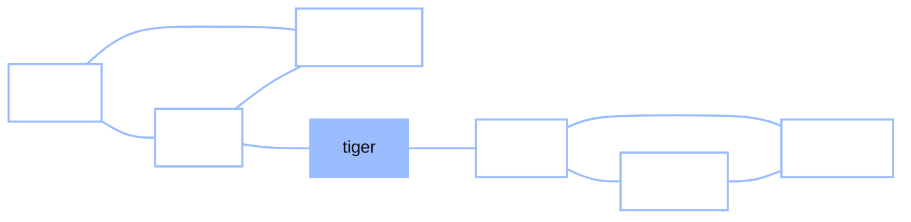

+++
date = "2026-06-03"
title = "Memory Search as a Random Walk"
weight = 15
+++

## The Walk Inside Your Head

The last two chapters built a machine: a Markov chain ([Chapter 13](../13_markov_chains/)), then a random walk on a network ([Chapter 14](../14_random_walks_networks/)). This chapter argues that the machine is not just a model of card decks and web pages — it is a model of **you**. Specifically, of how you search your own memory.

Try it right now, the way Chibany's class did. **Name as many animals as you can, out loud, for thirty seconds.** Go.

Done? Look at the *order* they came out in. Almost certainly they arrived in **bursts**: a clump of pets — *dog, cat, hamster* — then a pause, then a clump of big animals — *lion, tiger, zebra, giraffe* — then a switch to, say, farm animals. People do not produce animals in random order; they come out in **runs by category, with pauses between the runs**. This is the **semantic fluency task**, and the clustering-and-switching pattern in it has been documented for eighty years (Bousfield & Sedgewick, 1944; Troyer, Moscovitch & Winocur, 1997).

> **Chibany:** "My list did that exactly — three pets in a row, a pause, then a pile of zoo animals. Why?"
>
> **Alyssa:** "And why *those* animals, in *that* order? That's the real question."

Here is the claim of this chapter, due to Abbott, Austerweil and Griffiths (2012): **your semantic memory is a network, and recall is a random walk on it.** The list you produce is the sequence of nodes the walk visits. The clusters are the walk lingering inside a densely-connected community of related concepts; the switches are the walk crossing a bridge edge to another community — *exactly* the Cat-the-bridge crossing from Chapter 14. No special "search strategy" required: the structure of the network plus the dead-simple walk produces the bursty, switching behaviour on its own.

---

## Structure, Process, Behaviour

It is worth pausing on the *shape* of this explanation, because it is the same three-part shape that runs through the whole course:

- **Structure** — the semantic network. Which concepts are linked to which. Crucially, this is estimated from *other* data (word-association norms: ask thousands of people "what comes to mind when I say *doctor*?" and draw an edge to *nurse*, *hospital*, *sick*), not fitted to the fluency task we're trying to explain.
- **Process** — the random walk. Memoryless, undirected, one step at a time. The same Markov chain as always.
- **Behaviour** — the fluency list. Which animals, in which order, with which pauses.

The bet is that **structure + process** *jointly predict* the **behaviour** — and they do, with no recall-specific machinery bolted on. That is a strong, falsifiable claim, and it is what makes this more than a story.



A walker rattling around the **pets** triangle produces a burst of pets; to reach the **big animals** it must cross the bridge (*tiger*); then it rattles around over there. Cluster, switch, cluster — straight out of the wiring, just as Chapter 14's walk kept getting funnelled through Cat.

---

## The Catch: the Walk Is Not the List

There is a problem, and facing it squarely is what makes the model real rather than hand-wavy. **A raw random walk is not a fluency list**, for two reasons:

1. A walk **revisits** nodes — it will step onto *dog* again and again. But you don't *say* "dog" five times; you say it once.
2. A walk wanders through **non-animals** — to get from one animal cluster to another it may pass through *house*, *food*, *fur*, whatever concepts sit between them. But those never appear in your animal list either.

So the sequence of nodes the walk visits is longer and messier than the list you actually produce. Something has to map the **latent walk** onto the **observed behaviour**. That something is the **censoring function**, and it is the technical heart of the model.

---

## The Censoring Function

The rule is beautifully simple: **you report a word only the first time the walk lands on it, and only if it is an animal.** Everything else — revisits, and every non-animal — is *censored*. (The word *censoring* is borrowed from statistics, where a censored observation is one that genuinely happened but went unrecorded — exactly our case: the walk really does step onto *house* and revisit *dog*, but those steps never make it into the spoken list.)

To make this measurable, define the **first-hitting time** $\tau(k)$: the timestep at which the walk reaches the **$k$-th distinct animal** for the first time. Walk through the paper's own example. Suppose the walk produces

$$X_1 = \text{animal},\ X_2 = \text{dog},\ X_3 = \text{house},\ X_4 = \text{dog},\ X_5 = \text{cat}.$$

Reading left to right and applying the rule: *animal* is the starting cue (not reported); *dog* at step 2 is a first-time animal — **report it**, and $\tau(1) = 2$; *house* at step 3 is not an animal — **censor**; *dog* again at step 4 is a revisit — **censor**; *cat* at step 5 is a first-time animal — **report it**, and $\tau(2) = 5$. The reported list is just **"dog, cat"** — two words distilled from a five-step walk.

Now the timing. The data a fluency experiment actually records is the **inter-item response time (IRT)** — the gap between producing one animal and the next. (This "IRT" is *inter-item response time*, not the *item response theory* of test design — same initials, unrelated idea.) The total time to produce a word has two parts that happen in sequence, so they **add**: the time to mentally *travel* to the word, plus the time to physically *emit* it. The travel time is how far the walk had to wander; the emit time we take to be the word's length (longer words take longer to produce — in Hills et al.'s experiment people *typed* their answers, but the same holds roughly for saying them aloud). So

$$\text{IRT}(k) = \tau(k) - \tau(k-1) + L\big(X_{\tau(k)}\big),$$

where $L(\cdot)$ is the length of the word. The first term, $\tau(k) - \tau(k-1)$, is **how many steps the walk wandered** between first-hitting animal $k-1$ and first-hitting animal $k$ — long if the walk had to leave a depleted cluster and cross a bridge, short if the next animal was right next door. (We're being deliberately loose about units here: a walk-step and a letter-emission are both counted as one abstract "tick" of time, so the two terms can simply add. The point is the *shape* of the curve, not real milliseconds.) For our example,

$$\text{IRT}(\text{cat}) = \tau(\text{cat}) - \tau(\text{dog}) + L(\text{cat}) = 5 - 2 + 3 = 6.$$

That is the whole link from the hidden walk to the observable data: **wander-time between first-hits, plus word length.** Hold onto the first term — it is where the famous result comes from. (One reassurance for when you do the exercises: only the *difference* $\tau(k) - \tau(k-1)$ ever enters, so it doesn't matter whether you number the walk's steps starting from 0 or from 1 — the origin washes out.)

---

## The Signature: Slow Down, Then Switch

Here is the phenomenon the model has to explain. In the foraging language we're about to meet, a cluster is called a **patch** (a "patch" of related animals, like a patch of berries). Hills, Jones and Todd (2012) lined up each animal a person produced by its **position relative to a patch switch** — position 1 being the *first* animal of a new patch (the moment you've just switched clusters), position 2 the second, and so on — and averaged the IRTs. The result (their Figure 1a) is striking and consistent:

- The **first word of a new patch (position 1)** is the **slowest** of all — its IRT sits *above* the person's overall average.
- The **second word (position 2)** is the **fastest** — once you're inside a fresh cluster, the next item tumbles out.

Hills et al. read this as evidence of **optimal foraging**: people treat memory like a patchy food environment, deliberately *deciding* to leave a depleted patch and pay a "switch cost" to find a new one. The rule for *when* to leave comes from the **marginal value theorem** of foraging ecology (Charnov, 1976): a forager should abandon its current patch the moment the patch's return rate drops to the *average* return rate of the whole environment. Applied to the mind, you leave a cluster when relevant words stop coming faster than your overall pace. That account is elegant, but it needs **two** processes: one to explore within a patch, and a separate strategic decision (governed by the marginal value theorem) to switch.

{}
The optimal-foraging account posits *clustering* and *switching* as **separate mechanisms**, with a rational decision-rule choosing when to switch. The random-walk account posits **one** mechanism — a memoryless walk — and claims the "switch cost" falls out for free. Same data; the contest is about *how many moving parts* a mind needs. This is a recurring theme in cognitive science: the simpler model wins if it explains the data, because it assumes less.
{}

---

## …and the Random Walk Reproduces It

This is the payoff. Run the **censored random walk** — one memoryless process, with **no switch rule anywhere in it** — and compute the IRT-by-patch-position curve. It comes out with the *same shape* as the human data: **position 1 slowest (above average), position 2 fastest.**

Why does position 1 lag? Look back at the IRT formula. The first animal of a new patch is the one the walk reaches *right after leaving a depleted cluster* — it had to wander out of the old triangle, cross the bridge, and find the first new animal. That is a long $\tau(k) - \tau(k-1)$, hence a long IRT. The second animal of the patch is then sitting right next door (the walk is now inside the fresh, dense cluster), so its wander-time is tiny. **The "switch cost" is not a decision — it is just the bridge-crossing time, and it emerges from the network's structure alone.**

So the deliberate, two-process forager and the mindless, one-process walker produce the *same* behavioural signature. The random walk gives the **simpler, unified account**: one process, not two. That is the headline of Abbott, Austerweil and Griffiths (2012).

---

## GenJAX and JAX Implementation

We build a small semantic network with two animal clusters (pets and big animals) joined by a bridge, plus a few non-animal "distractor" nodes the walk can wander through. Then we sample many censored random walks, apply the censoring function, compute IRTs, and check that the position-1-slowest signature emerges — with no switch rule in the code.

### The network

```python
import jax.numpy as jnp
import numpy as np

# Nodes: 7 animals (two clusters + a bridge) and 3 non-animal distractors,
# plus the starting cue "animal".
names  = ["dog", "cat", "hamster", "tiger", "lion", "zebra", "giraffe",
          "house", "food", "water", "animal"]
is_animal = np.array([1, 1, 1, 1, 1, 1, 1, 0, 0, 0, 0])   # reportable?
word_len  = np.array([3, 3, 7, 5, 4, 5, 7, 5, 4, 5, 6])   # length, for IRT
idx = {n: i for i, n in enumerate(names)}
N = len(names)

# Undirected edges: a dense PETS triangle, a dense BIG-ANIMALS triangle,
# a bridge (tiger) between them, distractors woven in, and the cue node.
edges = [
    ("dog", "cat"), ("dog", "hamster"), ("cat", "hamster"),          # pets
    ("lion", "zebra"), ("lion", "giraffe"), ("zebra", "giraffe"),    # big animals
    ("cat", "tiger"), ("tiger", "lion"),                             # the bridge
    ("dog", "house"), ("house", "food"), ("food", "water"),          # distractors
    ("water", "cat"), ("hamster", "food"),
    ("animal", "dog"), ("animal", "lion"),                           # the cue
]
L = np.zeros((N, N))
for a, b in edges:
    L[idx[a], idx[b]] = 1.0
    L[idx[b], idx[a]] = 1.0
L = jnp.array(L)

degree = L.sum(axis=1)
P = L / degree[:, None]                       # row-normalize -> transition matrix
print("network:", N, "nodes,", int(L.sum() // 2), "edges")
```

**Output:**
```
network: 11 nodes, 15 edges
```

### Sample many walks (GenJAX-style, batched)

The walk is the same Markov chain as before. We sample one fixed-length walk with `jax.lax.scan` and `vmap` over many random keys so all the walks run at once.

```python
import jax
import jax.random as jr

LOGP = jnp.log(jnp.where(P > 0, P, 1e-30))    # log-probs; -inf for missing edges
STEPS = 400

def one_walk(key):
    def step(node, k):
        nxt = jr.categorical(k, LOGP[node])
        return nxt, nxt
    _, visited = jax.lax.scan(step, idx["animal"], jr.split(key, STEPS))
    return visited

walk_batch = jax.jit(jax.vmap(one_walk))
walks = np.array(walk_batch(jr.split(jr.key(0), 500)))   # 500 walks x 400 steps
print("sampled", walks.shape[0], "walks of", walks.shape[1], "steps each")
```

**Output:**
```
sampled 500 walks of 400 steps each
```

### Censor, compute IRTs, and find the signature

The censoring function and the patch-position bookkeeping are plain Python — the interesting part is conceptual, not numerical. For each walk we keep each animal's **first** visit, compute its IRT from the formula, and label it by its position within its patch (position 1 = first animal of a new patch). One bookkeeping choice worth stating: a "switch" means moving *directly* from a pets animal to a big-animals one (or vice versa); the bridge animal *tiger* is treated as **in transit** — it doesn't count as starting a new patch. (This isn't a thumb on the scale — the bridge is genuinely between clusters, belonging to neither, so it's the *crossing*, not the destination. The signature below is just as strong if you assign tiger to one side or drop it; we keep it explicit so the labelling matches the network's structure.)

<!-- validate: tol=0.25 -->
```python
from collections import defaultdict

# Which cluster each animal is in. The bridge animal (tiger) gets its own
# label 2: it belongs to neither the pets (0) nor the big-animals (1) patch,
# so we treat it as "in transit" — it never counts as starting a new patch.
cluster = {"dog": 0, "cat": 0, "hamster": 0,
           "lion": 1, "zebra": 1, "giraffe": 1, "tiger": 2}

def censored_irts(walk):
    """Keep each animal's FIRST visit; return (reported words, their IRTs)."""
    seen, taus, words = set(), [], []
    for t, node in enumerate(walk):
        if is_animal[node] and node not in seen:
            seen.add(node); taus.append(t); words.append(node)
    irts = [taus[k] - taus[k-1] + int(word_len[words[k]])     # the IRT formula
            for k in range(1, len(words))]
    return words, irts

def patch_positions(words):
    """Label each reported animal (from the 2nd on) by its position in its patch.
    A 'switch' (reset to position 1) is a *direct* pets<->big-animals change;
    the bridge animal (label 2) is in transit, so it neither starts nor ends a
    patch — the `2 not in (...)` guard skips it."""
    cl = [cluster[names[w]] for w in words]
    pos, run = [], 1
    for k in range(1, len(words)):
        is_switch = cl[k] != cl[k-1] and 2 not in (cl[k], cl[k-1])
        run = 1 if is_switch else run + 1
        pos.append(run)
    return pos

by_position = defaultdict(list)
for walk in walks:
    words, irts = censored_irts(walk)
    if len(irts) < 3:
        continue
    for p, irt in zip(patch_positions(words), irts):
        if p <= 3:
            by_position[p].append(irt)

avg = np.mean([x for v in by_position.values() for x in v])
print(f"average IRT over all positions: {avg:.1f}")
for p in [1, 2, 3]:
    ratio = np.mean(by_position[p]) / avg
    print(f"patch position {p}: IRT / average = {ratio:.2f}")
```

**Output:**
```
average IRT over all positions: 11.4
patch position 1: IRT / average = 1.69
patch position 2: IRT / average = 0.78
patch position 3: IRT / average = 0.82
```

There it is. **Patch position 1 sits well above the average, while positions 2 and 3 stay comfortably below it** — the same shape as the human data from Hills et al. (2012): a slow first word, then fast ones, exactly as in their Figure 1a. (The precise ratios wobble from seed to seed — that's why the validator allows a wide tolerance — so read the result as a *reliable inequality*: position 1 lands well above 1, positions 2–3 well below, every run. The two decimals are one sample, not a constant.) And this is reproduced by a memoryless random walk with a censoring function and *no switch rule anywhere in the code*. The "decision to switch" was never needed; the slow first word is just the time the walk spent crossing the bridge between clusters.

{}
You can state the **random-walk model of memory search**, apply the **censoring function** (report each animal only on its first visit) to turn a latent walk into an observable list, compute **inter-item response times** from first-hitting times, and explain why the **first word of a new patch is slowest** without any switch rule — the "switch cost" is just bridge-crossing time. You've seen one memoryless process reproduce a signature that was taken as evidence for a deliberate, two-process forager: a concrete case of a *simpler* model explaining the same data.
{}

---

## Inverting the Walk: Estimating the Network from Behaviour

So far we have run the model **forward**: network → walk → censored fluency list. The deeper prize is to run it **backward** — given someone's fluency lists, recover the **network** (or its structure) that produced them. That turns the model into a *measurement instrument*: estimate a person's semantic organization from nothing but the animals they named, then compare people or groups.

There are two ways to attempt this inversion, and the contrast between them is instructive.

### Why this is hard: the censoring stands in the way

The natural first thought is: write the censored walk as a generative `@gen` model and just **condition** on the observed list, the way we conditioned Bayes nets in Chapters 8–10. The forward model is easy and clean — it is exactly the walk we have been sampling. But conditioning is *not* easy, and the reason is the censoring function itself.

A Bayes net lets you condition on a variable because that variable is an addressable random choice. The fluency list is different: it is a **deterministic function of the latent walk, with the walk's path marginalized away**. Many different paths — wandering through different non-animals, revisiting in different orders — produce the *same* reported list. To score how likely a network makes the observed list, you must sum over *all* those hidden paths. Generic conditioning (importance sampling on the raw choices) can't do that: ask GenJAX to match the censored list directly and almost every sampled path disagrees somewhere, so the weights collapse to zero. The probability is real, but it is locked behind a sum over exponentially many paths.

This is exactly why the published estimator, **U-INVITE** (Zemla & Austerweil, 2018), is not a one-liner. It computes the censored-walk likelihood *analytically*, using the **fundamental matrix** of an absorbing Markov chain: it treats already-reported animals as **absorbing** states and the rest as **transient**, computes the expected first-passage probabilities, and — crucially — **rebuilds that absorbing/transient split after every reported animal** (each newly named animal moves from transient to absorbing). That bookkeeping is what correctly marginalizes the hidden path. It is powerful and exact, and it is also a lot of machinery.

### A simpler sketch: simulation-based inference on cluster structure

If we don't need the full network — only a coarse feature of it — we can sidestep the analytic likelihood entirely and let **simulation** do the work. Suppose we believe semantic memory is organized into $K$ **known** clusters (here $K = 3$), each fully connected internally, with a high *within*-cluster transition probability and a low *between*-cluster one. The single number that matters is the **contrast** $r = p_\text{out} / p_\text{in}$: small $r$ means tight, well-separated clusters; $r$ near 1 means no real cluster structure at all.

We can't write down the censored likelihood, but we *can* simulate it — so we use **simulation-based (likelihood-free) inference**: for each candidate $r$, generate many fluency lists, measure a summary statistic, and keep the $r$ values whose simulated lists *look like* the observed one. A natural statistic is the **clustering score**: the fraction of consecutive reported animals that fall in the same cluster (high when the walk lingers in patches, low when it hops around).

```python
import jax
import jax.numpy as jnp
import jax.random as jr
import numpy as np

K, PER = 3, 3                       # 3 clusters of 3 animals each (9 animals)
N = K * PER
cluster_of = np.repeat(np.arange(K), PER)   # [0,0,0, 1,1,1, 2,2,2]

def block_transition(p_in, p_out):
    """A K-block network: within-cluster edges weight p_in, between p_out."""
    same_cluster = cluster_of[:, None] == cluster_of[None, :]   # N x N boolean mask
    W = np.where(same_cluster, p_in, p_out)
    np.fill_diagonal(W, 0.0)                                     # no self-loops
    return jnp.array(W / W.sum(axis=1, keepdims=True), dtype=jnp.float32)

def walk(key, start, steps, LOGP):
    def step(s, k):
        nxt = jr.categorical(k, LOGP[s]); return nxt, nxt
    _, vis = jax.lax.scan(step, start, jr.split(key, steps))
    return jnp.concatenate([jnp.array([start]), vis])

def censor(vis):                    # report each animal on its first visit only
    seen, rep = set(), []
    for n in np.array(vis):
        n = int(n)
        if n not in seen:
            seen.add(n); rep.append(n)
    return rep

def clustering_score(rep):          # fraction of consecutive pairs in the same cluster
    if len(rep) < 2:
        return 0.0
    return np.mean([cluster_of[rep[i]] == cluster_of[rep[i+1]]
                    for i in range(len(rep) - 1)])
```

Now the inference. We generate "observed" data from a **strong-cluster** network ($r = 0.1$) and a **weak-cluster** one ($r = 0.7$), then run a simple ABC (approximate Bayesian computation) posterior over $r$ for each — weighting candidate $r$ values by how close their simulated clustering score is to the observed one.

<!-- validate: tol=0.15 -->
```python
def mean_score(key, r, n_lists=8, steps=80):
    LOGP = jnp.log(block_transition(1.0, r))
    keys = jr.split(key, n_lists)
    walks = jax.vmap(lambda k: walk(k, 0, steps, LOGP))(keys)
    return float(np.mean([clustering_score(censor(w)) for w in np.array(walks)]))

R_GRID = np.array([0.1, 0.2, 0.4, 0.7, 1.0])

def abc_posterior(observed_score, key, bandwidth=0.05):
    weights = []
    for i, r in enumerate(R_GRID):
        sims = np.array([mean_score(jr.fold_in(key, i * 100 + j), float(r))
                         for j in range(6)])
        weights.append(np.exp(-((sims - observed_score) ** 2) / (2 * bandwidth ** 2)).mean())
    w = np.array(weights)
    return w / w.sum()

# Observed data from a STRONG-cluster brain (r = 0.1) and a WEAK one (r = 0.7).
strong_obs = mean_score(jr.key(0), 0.1)
weak_obs   = mean_score(jr.key(0), 0.7)
print(f"strong-cluster data: clustering score {strong_obs:.2f}")
print(f"weak-cluster   data: clustering score {weak_obs:.2f}")

post_strong = abc_posterior(strong_obs, jr.key(1))
post_weak   = abc_posterior(weak_obs,   jr.key(1))
print("posterior over r (grid 0.1, 0.2, 0.4, 0.7, 1.0):")
print("  strong data ->", np.round(post_strong, 2), " MAP r =", R_GRID[post_strong.argmax()])
print("  weak data   ->", np.round(post_weak, 2),   " MAP r =", R_GRID[post_weak.argmax()])
```

**Output:**
```
strong-cluster data: clustering score 0.55
weak-cluster   data: clustering score 0.19
posterior over r (grid 0.1, 0.2, 0.4, 0.7, 1.0):
  strong data -> [0.55 0.43 0.01 0.   0.  ]  MAP r = 0.1
  weak data   -> [0.   0.   0.   0.26 0.74]  MAP r = 1.0
```

The inference **cleanly separates the two regimes**: strong-cluster data concentrates the posterior on small $r$ (tight clusters — here the most likely $r$ is the true $0.1$), while weak-cluster data pushes all the mass to large $r$ (no real structure). With nothing but the censored lists, we recovered a real fact about the network that produced them.

{}
Be honest about the limits. This recovers the cluster *contrast* — strong vs. weak structure — reliably, and on this clean toy it even lands the right $r$. But it is a **coarse** tool, not a full estimator: it compresses an entire fluency list down to a *single* summary statistic (the clustering score), so it can speak to "how clustered" but not to *which* animals link to which, or how many clusters there are, or where the bridges sit. It also assumes $K$ is **known** and the blocks are clean and equal-sized. Recovering the *whole* network — every edge — is exactly what the analytic **U-INVITE** likelihood buys you over this simulation-based shortcut, at the cost of the fundamental-matrix machinery above. The lesson is the trade-off itself: a generative model is *trivial to write and simulate* but can be *hard to condition on*, and when censoring blocks direct conditioning you can still learn coarse structure by **simulating** instead of solving.
{}

---

## Where This Goes Next

The model opens two doors worth naming, both active research:

{}
**The clinical payoff.** The inversion above is not just a curiosity. Run the full U-INVITE estimator on real fluency lists and the recovered network becomes a diagnostic: Zemla & Austerweil (2019) estimated networks from Alzheimer's patients versus healthy controls and found structural differences (fewer associations per concept, more spurious links, less organization) — a clinical signature read straight off the words people name.

**Sampling on purpose.** Throughout these three chapters we have *run* a chain and watched where it settles — using a Markov chain to *estimate* a distribution. That is **Monte Carlo**, and it is the subject of the next part of the course. The twist: instead of being handed a chain and finding its stationary distribution, we will start from a distribution we *want* to sample (a Bayesian posterior) and **design a chain whose stationary distribution is that target** — *Markov chain Monte Carlo* (MCMC). The walk you just used to model memory is the same tool, pointed the other way.
{}

---

## Exercises

{}
1. **Trace the censoring by hand.** A walk visits `animal → lion → grass → lion → zebra → zebra → giraffe`. Which words are reported? What are $\tau(1), \tau(2), \tau(3)$? Compute $\text{IRT}$ for the second and third reported animals (use word lengths lion 4, zebra 5, giraffe 7).
2. **Kill the bridge.** In the code, delete the two bridge edges (`cat–tiger`, `tiger–lion`) so the two clusters are disconnected. Re-run. What happens to the walks — can a single walk now report animals from *both* clusters? What does that do to the position-1 signature, and why?
3. **Widen the gap.** Add more distractor nodes *between* the two animal clusters (a longer bridge path). Predict, then check: does the position-1 IRT ratio go *up* or *down*? Relate your answer to the $\tau(k) - \tau(k-1)$ term in the IRT formula.
{}

A companion notebook works through all of this interactively:

**📓 [Open in Colab: `15_memory_search.ipynb`](https://colab.research.google.com/github/josephausterweil/probintro/blob/main/notebooks/15_memory_search.ipynb)**

---

Special thanks to [JPPCA](https://jpcca.org/) for their generous support of this tutorial series.
