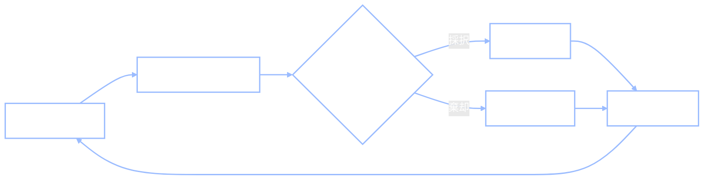

+++
date = "2026-06-14"
title = "マルコフ連鎖モンテカルロ：目標分布に収束する連鎖の設計"
weight = 18
+++

## 第13章を逆に読む

[第13章](../13_markov_chains/)では、遷移行列 $P$（Chibanyのトンカツ/ハンバーガーの習慣）があらかじめ*与えられ*、「定常分布 $\pi$ は何か？」という問いに答えました。べき乗反復（連鎖をそのまま回す）と固有値1に対応する固有ベクトルという2つの方法で同じ70/30という答えが得られました。先に連鎖があり、そこから分布 $\pi$ が導出されたのです。

本章では、この矢印を逆転させます。

> **Jamal：**「先週は連鎖から始めて、それがどこに落ち着くかを調べました。でも推論の場面では逆の問題があります。ほしい分布は*わかっている*——事後分布です——ただそこからサンプリングできないんです。」
>
> **Alyssa：**「つまり映画を逆再生したいわけね。『連鎖が与えられたから $\pi$ を求める』ではなく、『ほしい $\pi$ が与えられたから、それに収束する連鎖を設計してほしい』ということ。」
>
> **Jamal：**「それってできるんですか？オーダーメイドで連鎖を作って、その定常分布が自分で指定した目標になるように？」
>
> **Alyssa：**「できるわ。しかもレシピは思ったより短い。」

これが**マルコフ連鎖モンテカルロ（MCMC）**です。目標分布 $\pi$——典型的には評価できてもサンプリングはできないベイズ事後分布——が与えられたとき、*定常分布がちょうど $\pi$ になるマルコフ連鎖を構築する*のです。その連鎖を回し、最初の部分を捨てると、訪問した状態が $\pi$ からのサンプルになります。第13章で学んだ定常分布の定義的な性質、$\pi P = \pi$（1ステップ適用しても $\pi$ は変わらない）を思い出してください。MCMCは、*自分の* $\pi$ を不動点として持つ $P$ を構築する技術です。レシピは2つあり、両方を学びます。

---

## Metropolis–Hastings法

最初のレシピで必要なのは、目標分布を（定数倍まで）*評価*する能力と、小さな移動を*提案*する能力だけです。これが**Metropolis–Hastings（MH）法**であり、1ステップあたりたった2つの操作しかありません。

連鎖が現在状態 $x$ にあるとします。

1. **提案：** **提案分布** $Q(x' \mid x)$——通常は小さなランダムな摂動、$x' = x + \text{ガウスノイズ}$——から次候補 $x'$ を抽出します。
2. **採択または棄却：** **採択比**
$$A = \min\left(1, \frac{P(x')}{P(x)}\right)$$
を計算し、確率 $A$ で $x'$ に移動します。そうでなければ $x$ に*留まり*（$x$ を再び記録します）。



直感は「探索するが、高い場所を好む」というものです。$x'$ が $x$ より*高確率*であれば（$P(x') > P(x)$）、比は1を超え、$A = 1$ となり、**常に**上り坂の移動をします。$x'$ が*低確率*であれば、確率——高さの比——に応じて*ときどき*だけ移動します。つまり連鎖はあちこちをさまよいますが、$P$ が大きい場所で多くの時間を過ごします。これは $P$ からのサンプルの振る舞いそのものです。ルールが動く3つのスナップショット：


{}
採択比を見てください：$P$ は**比** $P(x')/P(x)$ を通じてのみ現れます。$P$ が正規化定数を除いた事後分布——$P(x) = \tfrac{1}{Z}\tilde P(x)$（$Z$ は計算困難な周辺尤度）——であれば、$Z$ は分子と分母の両方に現れ、**相殺**されます。$Z$ を計算する必要はまったくありません。これは[第16章](../16_monte_carlo/)で自己正規化重点サンプリングを機能させたのと同じ相殺であり、MHがベイズ計算の主力である理由です：計算できない唯一の量が、必要としない唯一の量なのです。次のセクションでこれを明示します。
{}

ここでは意図的に難しい目標として**二峰性**密度（$-2$ と $+2$ に2つのよく分離した山を持つ）でMHを適用します。適切な提案幅があれば、連鎖は両方のモードの間を飛び回れます。収束前の恣意的な開始点の影響を除くため、最初の2000ステップを**バーンイン**として捨てます。

<!-- validate: tol=0.12 -->
```python
import jax
import jax.numpy as jnp
import jax.random as jr

def log_target(x):
    # unnormalized: a 50/50 mixture of two Gaussians, peaks at -2 and +2
    return jnp.log(0.5*jnp.exp(-0.5*((x+2)/0.7)**2) + 0.5*jnp.exp(-0.5*((x-2)/0.7)**2))

def mh(key, n_steps, step_sd, x0=0.0):
    def body(carry, k):
        x, n_acc = carry
        kp, ka = jr.split(k)
        x_prop = x + step_sd * jr.normal(kp)               # symmetric Gaussian proposal
        log_ratio = log_target(x_prop) - log_target(x)     # log P(x') - log P(x); normalizer cancels
        accept = jnp.log(jr.uniform(ka)) < log_ratio       # accept with probability min(1, ratio)
        x_new = jnp.where(accept, x_prop, x)
        return (x_new, n_acc + accept), x_new
    (_, n_acc), xs = jax.lax.scan(body, (x0, 0), jr.split(key, n_steps))
    return xs, float(n_acc) / n_steps

xs, acc = mh(jr.key(0), 20000, step_sd=1.5)
xs = xs[2000:]                                              # discard burn-in
print(f"acceptance rate: {acc:.2f}")
print(f"sample mean: {float(jnp.mean(xs)):.2f}  (target is symmetric about 0)")
print(f"fraction in the left mode: {float(jnp.mean(xs < 0)):.2f}  (~0.50 if well mixed)")
```

**出力：**
```
acceptance rate: 0.53
sample mean: -0.04  (target is symmetric about 0)
fraction in the left mode: 0.51  (~0.50 if well mixed)
```

連鎖は両方の山を均等に訪れ、サンプルの半分が各側に落ち、平均は対称中心の0に位置します。目標を正規化する必要はなかったのです；採択比では常に $\log P(x') - \log P(x)$ だけが使われています。サンプルをヒストグラムに積み上げると、目標分布を正確にトレースします：


### 正規化定数が相殺される理由

これが単なる「もっともらしい」ではなく*正しい*理由を、一度きれいに述べる価値があります。Metropolis–Hastingsの連鎖は**詳細釣り合い**と呼ばれる条件を満たすように構築されています：状態 $x$ が目標分布から抽出されるとき、$x$ から $x'$ へのステップの確率と $x'$ から $x$ へのステップの確率が等しい、というものです。$P$ に関して詳細釣り合いを満たす連鎖は $P$ を定常分布として持ちます——これが全体の仕組みを機能させる定理です。（証明はせず、名前付きの事実として受け入れます。）採択ルール $A = \min(1, P(x')/P(x))$ は、まさに詳細釣り合いを*強制する*ルールであり、比だけを使うため正規化定数は消えます。

一つの単純化を取り上げる価値があります。提案が**対称**な場合——$Q(x' \mid x) = Q(x \mid x')$、ガウスの摂動では成立——提案の項も相殺されて、採択比は単に $P(x')/P(x)$ になります。この特殊ケースが元の**Metropolis**アルゴリズムです；一般的な**Hastings**版は*非対称*な提案に対する提案比の補正を追加で持ちます。本章のすべての連鎖は対称提案を使うので、きれいな $P(x')/P(x)$ の形式で十分です。

---

## ギブスサンプリング

Metropolis–Hastings法は*任意の*目標に機能しますが、いくつかの提案を捨てます。2番目のレシピである**ギブスサンプリング**は棄却をしません——ただしモデルにより多くを要求します。

アイデアは：結合的な移動を提案して採択または棄却するのではなく、**1つの座標を一度に更新**し、それぞれを他のすべての座標を所与とした*厳密な*条件付き分布から抽出するというものです。「他のすべて」を表す表記が必要です：$x_{-i}$ で*座標 $i$ 以外のすべての座標*（$-i$ は「$i$ を除く」と読みます）を表します。座標 $i$ のギブス更新は

$$x_i^{\text{new}} \sim P(x_i \mid x_{-i}),$$

すなわち他のすべての座標の現在値を所与とした、座標 $i$ の条件付き分布からサンプリングします。座標を順番に回し、それぞれを順番に再サンプリングすると、連鎖は結合目標に収束します。

ギブスが**常に採択する**——棄却ステップが全くない——のはなぜでしょうか？それは、真の条件付き分布から座標をサンプリングすることが、結合分布に関する詳細釣り合いを自動的に満たすからです。条件付き分布はすでにその軸に沿った目標を「知っている」ので、補正する必要はありません：採択確率はちょうど1になります。（これも定理ですが、直感としては、ちょうど正しい分布から提案したので提案を捨てる必要がないということです。）代償は、各条件付き分布から*サンプリングできる*ことが必要だということです——これはモデルが共役な構成要素から作られている場合は簡単であり、[第19章](../19_sampling_the_mind/)で見ます。

次に、**相関した** 2次元ガウス分布（相関 $0.8$）でギブスを適用します。この分布の2つの完全条件付き分布はそれ自体が単純なガウス分布です：

<!-- validate: tol=0.08 -->
```python
import numpy as np

rho = 0.8
def gibbs(key, n_steps):
    def body(carry, k):
        x, y = carry
        kx, ky = jr.split(k)
        # full conditionals of a bivariate normal: x | y ~ N(rho*y, 1 - rho^2), and vice versa
        x = rho*y + jnp.sqrt(1 - rho**2) * jr.normal(kx)
        y = rho*x + jnp.sqrt(1 - rho**2) * jr.normal(ky)
        return (x, y), jnp.array([x, y])
    _, samples = jax.lax.scan(body, (0.0, 0.0), jr.split(key, n_steps))
    return samples

S = gibbs(jr.key(1), 20000)[1000:]                         # discard burn-in
cov = np.cov(np.array(S).T)
print(f"sample means: ({float(jnp.mean(S[:,0])):.2f}, {float(jnp.mean(S[:,1])):.2f})   (target 0, 0)")
print(f"sample correlation: {cov[0,1]/np.sqrt(cov[0,0]*cov[1,1]):.2f}        (target 0.8)")
```

**出力：**
```
sample means: (0.02, 0.02)   (target 0, 0)
sample correlation: 0.80        (target 0.8)
```

提案幅の調整も棄却もなし——ギブスは平均と0.8の相関を正確に復元します。移動は**軸に沿った**ものです：各更新は一つの座標に沿ってスライドし、もう一方は固定されます。そのため連鎖のパスは目標の尾根に沿って登るL字形のステップの階段になります：


これが、強く相関した目標がギブスを対角線に沿ってゆっくりシャッフルさせる理由です——すべての移動が軸に平行なので、尾根に沿った進行には多くの小さなステップが必要になります。

---

## MH対ギブス：2つの観点

2つのレシピはきれいにトレードオフします：

| | **Metropolis–Hastings** | **ギブス** |
|---|---|---|
| 必要なもの | $P$ を定数倍まで評価できること | 各完全条件付き分布 $P(x_i \mid x_{-i})$ からサンプリングできること |
| 提案 | 任意；幅を自分で選ぶ | 厳密な条件付き分布 |
| 棄却 | あり——良い採択率のために幅を調整 | なし、決して |
| 調整 | 提案幅が非常に重要 | 調整するものなし |
| 弱点 | 棄却は無駄；混合が遅い場合あり | 条件付き分布が必要；軸方向の移動 |

実際にはこれら2つを**組み合わせる**ことがよくあります——条件付き分布が簡単な（共役な）座標にはギブス、そうでない座標にはMetropolis。そのハイブリッドが[第19章](../19_sampling_the_mind/)で実際の階層モデルのために構築するサンプラーです。

---

## 混合、バーンイン、多峰性の罠

すべてのMCMCの実行には微妙な問題が潜んでおり、それが正しいサンプラーと自信を持って間違ったサンプラーとの違いになります。2つのアイデアがそれを明確にします。

**トレース対ヒストグラム。** 連鎖を $N$ ステップ回すと、$N$ 個の独立したサンプルが得られる*わけではありません*。各状態は前の状態から少し動いたものなので、連続する状態は*相関*しています。出力を見る方法は2つあり、それぞれ異なる問いに答えます：

- **トレース**は反復回数に対してプロットした値——時系列です。連鎖の*旅*を示します：まだドリフトしている（未収束）か、安定した領域をしっかりさまよっている（収束済み）か？
- **事後ヒストグラム**はバーンイン後のすべての状態をまとめ、順序を無視します。*これ*が目標分布への近似です。

初期の**バーンイン**を捨てるのは、それらのステップが目標ではなく恣意的な出発点を反映しているからです。そして「10,000ステップ」はステップが相関しているため、10,000個の独立したサンプルより価値が低いことを覚えておきます。

**混合。** 連鎖が**混合した**とは、出発点を忘れてターゲット全体を探索している状態です——[第13章](../13_markov_chains/)で**エルゴード性**と呼んだ「出発点を忘れる」性質と同じです。よく混合した連鎖は、異なる出発点から2回走らせても同じ答えを返します。*混合が悪い*連鎖はそうなりません——そしてここで多峰性のターゲットが問題になります。

罠を見てみましょう。同じ2つの山を持つ目標を使い、**小さな**提案ステップを使い、左のモードから始めた場合と右のモードから始めた場合を別々に走らせます：

<!-- validate: tol=0.2 -->
```python
xs_from_left,  _ = mh(jr.key(2), 20000, step_sd=0.3, x0=-2.0)   # start in the LEFT mode
xs_from_right, _ = mh(jr.key(3), 20000, step_sd=0.3, x0=+2.0)   # start in the RIGHT mode

frac_L = float(jnp.mean(xs_from_left[2000:]  < 0))
frac_R = float(jnp.mean(xs_from_right[2000:] < 0))
print(f"small step, started LEFT:  fraction in left mode = {frac_L:.2f}")
print(f"small step, started RIGHT: fraction in left mode = {frac_R:.2f}")
print("the two disagree -> the chain has NOT mixed (each is trapped near its start)")
```

**出力：**
```
small step, started LEFT:  fraction in left mode = 0.54
small step, started RIGHT: fraction in left mode = 0.19
the two disagree -> the chain has NOT mixed (each is trapped near its start)
```

2つの実行は全く異なる結果を示します——一方は目標が主に左にあると思い、もう一方は主に別の場所にあると思います——小さなステップが山の間の低確率の谷を越えられないからです。各連鎖は出発したモードに閉じ込められています。*トレース*を見ると診断が即座にわかります（ここではさらに小さいステップ $\sigma = 0.15$ で描画しており、罠が完全な状態です）：


重要なのは、*ローカル*な採択率は完全に健全に見えることです；連鎖は喜んで移動を採択していますが、それは谷を渡るような移動ではありません。**局所的な採択が良くても、大域的な混合が良いとは限りません。** これが多峰性の事後分布が難しい理由であり、混合を診断すること——異なる出発点から複数の連鎖を走らせて一致するか確認すること——が重要な理由です。

### インタラクティブ：連鎖の混合（または罠にはまる様子）を見る

このセクションのすべてを今*見る*ことができます。以下の可視化は、**多峰性の2次元ガウス混合**（4つのよく分離したブロブ）に対してMetropolis–Hastingsまたはギブスをライブで実行します。左パネルは目標密度、連鎖の軌跡、そしてMHの場合は各提案が**緑（採択）**または**赤（棄却）**に色付けされた提案円を示します。右上パネルは**トレース**（反復回数に対するx座標：平ら＝スタック、レベル間を跳び回る＝混合）；右下は真の周辺分布に対する累積**ヒストグラム**です。コーナーの読み取り値はライブの**採択比**と**訪問モード数**カウンタを示します——「実際に探索したか？」という正直な数値です。

<iframe src="../../widgets/mcmc-gmm.html"
        width="100%" height="620"
        frameborder="0"
        style="background:#111111; border-radius:6px; margin:1rem 0;"
        title="Interactive MCMC demo: Metropolis-Hastings and Gibbs on a multimodal 2-D Gaussian mixture">
</iframe>

{}
デフォルトの**4ブロブ（分離）**の目標を維持し、各実験の前に**リセット**を押してください。

1. **ギブスのベースライン。** サンプラー＝ギブス、実行。軸に沿ったL字形の移動（採択は適用されません——ギブスは常に採択します）と、**4/4**に登る訪問モード数カウンタを観察してください。
2. **極小ステップ。** サンプラー＝MH、提案σ ≈ **0.05**、実行。採択率は**0.94**付近に——でも連鎖は**1つのモードにスタック**して、遅いランダムウォークで動いています。*高い採択率 ≠ 良い混合。*
3. **極大ステップ。** σ ≈ **4.0**、実行。今度はほぼすべての提案が低確率の空間に落ち、棄却されます（採択率 ≈ **0.05**）；連鎖はほとんど動きません。大きすぎるステップも同じくらい悪いです。
4. **ちょうど良いステップ。** σ ≈ **0.4–0.6**、実行。採択率約**0.5**で活発な探索——*モード内での*探索ですが。
5. **罠（結論）。** その良いσを維持して走らせ続けてください。採択率は健全に見えます——でも**訪問モード数が1/4のまま**でヒストグラムが1つの山だけを埋めていくのを見てください。ギブス（実験1）は4つ全てに到達したのに。採択数は完璧に見えているのに、連鎖はほとんど何も探索していません：**局所的な採択が良くても、大域的な混合が良いとは限りません。**
{}

（同じウィジェットが講義でライブ使用されます；これは1つのオフラインHTMLファイルなので、より広い画面で操作するために[フルスクリーンで開く](../../widgets/mcmc-gmm.html)こともできます。）

---

## GenJAX での実装

このバージョンのGenJAXにはブラックボックスの `mh()` はありません——これは教育的に完璧です。MHを必要な1つのプリミティブから*組み立てる*ことができるからです：提案された状態をモデルの下で**スコア付け**する方法。そのプリミティブが `assess` です。完全な選択セットを受け取り、それらのモデルの対数確率——採択比に入力する $\log P$ そのもの——を返します。

以下のモデルは講義の小さな推論問題です：事前分布 $\mu \sim \mathcal{N}(0, 1)$、尤度 $y \sim \mathcal{N}(\mu, 0.5)$、そして1つの観測値 $y = 1.5$。事後分布は閉形式で既知、$\mathcal{N}(1.2, 0.45^2)$、なのでサンプラーを確認できます。`assess` を使って観測値を固定して各提案 $\mu$ をスコア付けし、比を形成して採択または棄却します。

<!-- validate: tol=0.12 -->
```python
from genjax import gen, normal as gnormal, ChoiceMap

@gen
def model():
    mu = gnormal(0.0, 1.0) @ "mu"      # prior
    y  = gnormal(mu, 0.5) @ "y"        # likelihood
    return mu

def log_joint(mu, y_obs=1.5):
    logp, _ = model.assess(ChoiceMap.d({"mu": mu, "y": y_obs}), ())  # score the full trace
    return logp

def genjax_mh(key, n_steps, step_sd=0.5):
    def body(carry, k):
        mu, n_acc = carry
        kp, ka = jr.split(k)
        mu_prop = mu + step_sd * jr.normal(kp)
        log_ratio = log_joint(mu_prop) - log_joint(mu)   # y is fixed, so this is the posterior ratio
        accept = jnp.log(jr.uniform(ka)) < log_ratio
        mu_new = jnp.where(accept, mu_prop, mu)
        return (mu_new, n_acc + accept), mu_new
    (_, n_acc), mus = jax.lax.scan(body, (0.0, 0), jr.split(key, n_steps))
    return mus[2000:], float(n_acc) / n_steps

mus, acc = genjax_mh(jr.key(4), 20000)
print(f"acceptance rate: {acc:.2f}")
print(f"posterior mean of mu: {float(jnp.mean(mus)):.2f}   (closed form 1.20)")
print(f"posterior sd of mu:   {float(jnp.std(mus)):.2f}   (closed form 0.45)")
```

**出力：**
```
acceptance rate: 0.67
posterior mean of mu: 1.20   (closed form 1.20)
posterior sd of mu:   0.44   (closed form 0.45)
```

1つのスコアリングの呼び出しと提案から正しい事後分布サンプラーを構築しました——正規化定数も、閉形式の事後分布の仮定も不要です。この「自分で組み立てる」パターンが、次の章で多くのパラメータを持つ階層モデルにスケールアップされます。

{}
[第13章](../13_markov_chains/)を逆に実行できます：**目標**分布が与えられたとき、**その目標を定常分布として持つマルコフ連鎖を設計**できます。**Metropolis–Hastings**を構築できます——提案し、確率 $\min(1, P(x')/P(x))$ で採択——そして*正規化定数が相殺される理由*（比だけが現れる）と**詳細釣り合い**がそれを正しくする理由がわかります。**ギブスサンプリング**を構築できます——完全条件付き分布 $P(x_i \mid x_{-i})$ から座標を再サンプリングし、常に採択——そしてなぜ棄却しないのかが言えます。**トレース**対**ヒストグラム**を読み、**バーンイン**を捨て、局所的な採択が良くても多峰性ターゲットでの大域的な**混合**を保証しないことを認識できます。

次の[第19章](../19_sampling_the_mind/)では、[第12章](../12_hierarchical_bayes/)の種類の階層の実際の事後分布に両方のツールを向け、*人間自身もマルコフ連鎖として実行できる*ことを示します。

*用語集：* [マルコフ連鎖モンテカルロ](../../glossary/#markov-chain-monte-carlo-mcmc-), [Metropolis–Hastings](../../glossary/#metropolishastings-), [採択比](../../glossary/#acceptance-ratio-), [提案分布](../../glossary/#proposal-distribution-), [ギブスサンプリング](../../glossary/#gibbs-sampling-), [バーンイン](../../glossary/#burn-in-), [混合](../../glossary/#mixing-).
{}

---

## 演習

{}
1. **ステップを調整する。** `step_sd` ＝ 0.1、1.5、8.0 で二峰性MHサンプラーを実行してください。それぞれについて、採択率と各モードのサンプル割合を出力してください。どの幅が最もよく混合しますか？2つの極端ではどんな問題が起きますか——そしてそれらは*同じ*理由で失敗しますか、それとも異なる理由ですか？
2. **連鎖が抜け出すのを見る。** 罠にはまった小ステップ（`step_sd=0.3`）のサンプラーを使い、左のモードから始めた連鎖が確実に*両方*を訪れるまでステップを大きくしてください。谷を越えるのにどれくらい大きなステップが必要ですか？これを「局所的な採択の良さ ≠ 大域的な混合の良さ」に関連付けてください。
3. **ギブスと相関。** 2次元ギブスサンプラーで `rho` を0.98に上げてください。最初の座標のトレースを（プロットするか要約統計量を出力して）調べてください。正しい相関は依然として復元されますか？それには*より長い*時間がかかりますか？軸方向の移動の観点から、ほぼ対角の目標について説明してください。
{}

コンパニオンノートブックでこれらすべてをインタラクティブに実行できます：

**📓 [Colab で開く: `18_markov_chain_monte_carlo.ipynb`](https://colab.research.google.com/github/josephausterweil/probintro/blob/main/notebooks/18_markov_chain_monte_carlo.ipynb)**

---

[JPPCAの](https://jpcca.org/)このチュートリアルシリーズへの寛大な支援に感謝します。
