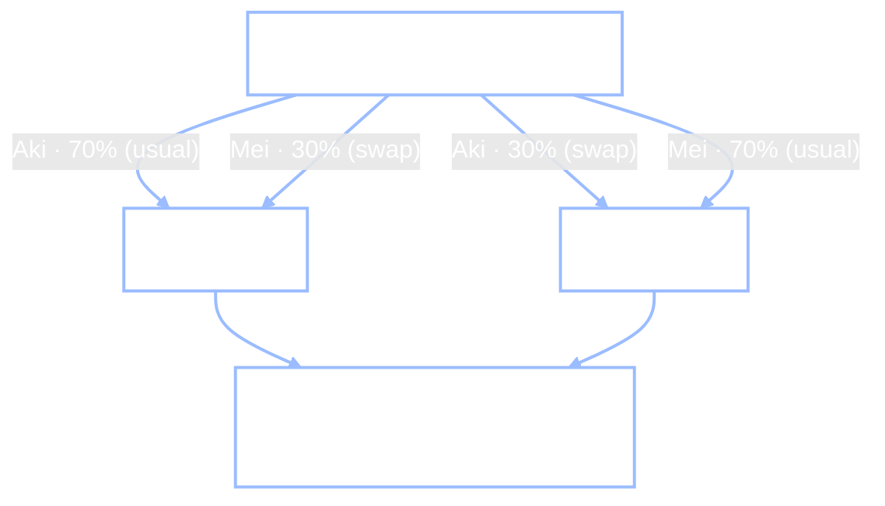

+++
date = "2026-06-16"
title = "Q学習：地図なしで行動する"
weight = 22
+++

## モデルを知らないとき

[第21章](../21_markov_decision_processes/)では、ChibanyのMDPを*厳密に*解いた——だがそれは世界全体を知っていたからこそできたことだ：すべての遷移確率 $T(s'\mid s,a)$ と、すべての報酬 $R(s)$ を。価値反復はそれらの数値をモデルから*読み取る*。モデルを取り去れば、ベルマン・バックアップには読むものが何もない。

> **Jamal：**「でもChibanyは自分の人生の遷移行列なんて*持っていない*。誰も持っていない。ただ……色々試して、何が起こるか見るだけだよね。」
>
> **Alyssa：**「そう——だから問いが変わる。『ルールが与えられたとき、何が最適か？』じゃなくて、『ルールブックなしに、経験だけからどうやって上手く行動することを*学ぶ*か？』になるんだ。」

これこそ最も純粋な形での**強化学習**だ：$T$ も $R$ も知らないエージェントが、行動を取り、どんな報酬と次状態が返ってくるかを見て、少しずつ上達していく。そのための最も有名なアルゴリズムが**Q学習**であり、その美しい点は、モデルを一度も見ることなく、価値反復が計算したであろう*同じ*最適方策を学習することだ。本章ではそれを組み立て、それが粗悪に設計された報酬に出し抜かれる様子を観察し、最後にフロンティアにたどり着く：学習した*モデルをシミュレートして*計画を立てる、という地点だ。

---

## Q学習の更新則

前章の行動価値 $q^*(s,a)$ を思い出そう——状態 $s$ で行動 $a$ を取り、その後は最適に行動した場合の長期的なリターンだ。もしすべての $q^*$ の値を知っていれば、行動するのは簡単だ：各状態で、最大の $q$ を持つ行動を取ればよい。Q学習の仕事はまさに、**経験から $q^*$ を推定すること**であり、テーブル $Q(s,a)$ を保持し、エージェントが一歩進むたびにそれを真の値へと少しずつ近づけていく。

その「少しずつ近づける」操作こそが核心だ。状態 $s$ で行動 $a$ を取り、報酬 $r$ と次状態 $s'$ を観測する。あなたは今、真の値を一歩分だけ垣間見ている：$r$ に、$s'$ からできる最善のことの割引価値を足したものだ。これを**ターゲット**と呼ぼう。ターゲットと現在の推定値との差が**時間差分（TD）誤差**であり、推定値をターゲットに向けて割合 $\alpha$ だけ動かす：

$$Q(s,a) \;\leftarrow\; Q(s,a) \;+\; \underbrace{\alpha}_{\text{learning rate}} \big[\, \underbrace{r + \gamma \max_{a'} Q(s',a')}_{\text{target}} \;-\; Q(s,a) \,\big].$$

2つの新しい記号が、それぞれ登場と同時に名付けられる：**学習率** $\alpha \in (0,1]$ は各更新の大きさを制御し、角括弧内の量が**TD誤差**——*どれだけ驚いたか*——だ。ターゲットが推定値と一致すれば、誤差はゼロで何も変わらない；現実が予想より良ければ、誤差は正となり $Q$ は上がる。学習とは、驚きを繰り返し減らすことに他ならない。


Q学習が*必要としない*ものに注目してほしい：$T(s'\mid s,a)$ を一度も使わない。第21章のベルマン・バックアップが $\sum_{s'} T(s'\mid s,a)$ ですべての次状態にわたって*平均*を取っていたのに対し、Q学習は世界が実際に返してきた単一の $s'$ を使う——そして多数の訪問にわたれば、それらのサンプルは平均化されて同じ期待値になる。これこそ「モデルフリー」の意味だ：世界の地図からではなく、世界の応答から学ぶ。（報酬 $r$ は今や行動にも依存しうる——第21章が記した一般的な $R(s,a)$ の形だ——なぜなら、それは取った行動から返ってきたものだからだ。）

{}
あの角括弧内の驚き項——**TD誤差** $r + \gamma\max_{a'}Q(s',a') - Q(s,a)$ ——は単なる学習のトリックではない。それは中脳の**ドーパミン**ニューロンの瞬間瞬間の発火と、ほぼニューロン単位で一致することが判明している（Schultz, Dayan & Montague, 1997）：それらは**報酬の*予測誤差***——*予想より良いか悪いか*——に対して発火するのであって、報酬そのものに対してではない。完全に予測された報酬はドーパミンの放出を生まない；意外な報酬は生む；そして予想された報酬が届かない場合は、ベースラインを下回る*落ち込み*が生じる。これはまさにTD誤差そのものであり、その符号も一致する。あなたが今書き下したこの小さな代数は、脳がどのように行動を学ぶかについての最も裏付けの強い理論の一つだ——その限界と、*モデルベース*の対応物については、本章の後半で見ていく。
{}


---

## GardenPath：学習のためのグリッド

Q学習が働く様子を観察するには、それがよろめき歩き回れる世界が必要だ。**GardenPath**（Ho, Littman, Cushman & Austerweil, 2015 より）は $3\times3$ のグリッドだ。エージェントは左下の $(1,1)$ から出発し、右上の $(3,3)$ にあるゴールを目指す。右下の $2\times2$ ブロックは立ち入るべきでない**庭**だ；安全なルート——**パス**——は左の列を上り、それから上の行を進むL字型だ：


エージェントはこれを何も知らない。動くこと（上/下/左/右）と、各移動が返す報酬を集めることによってのみ学習する。ここに世界とQ学習のループを示す——$\varepsilon$-貪欲探索（割合 $\varepsilon$ の確率でランダムに行動し、それ以外は貪欲に行動する）と、各ステップでのTD更新だ：

{}
<!-- validate: skip-output -->
```python
import numpy as np

START, GOAL = (1, 1), (3, 3)
GARDEN = {(1, 2), (1, 3), (2, 2), (2, 3)}
DELTA = {'U': (1, 0), 'D': (-1, 0), 'L': (0, -1), 'R': (0, 1)}

def valid(s):                                   # actions that stay on the grid
    r, c = s; A = []
    if r < 3: A.append('U')
    if r > 1: A.append('D')
    if c > 1: A.append('L')
    if c < 3: A.append('R')
    return A
def move(s, a): d = DELTA[a]; return (s[0] + d[0], s[1] + d[1])

# reward tables (verified against Ho et al. 2015): +10 good, -10 bad, +20 goal, +4 faint praise
POS, NEG, GOAL_R, WEAK = 10, -10, 20, 4
RM = {(1,1):{'U':0,'R':NEG},(2,1):{'U':0,'R':NEG,'D':0},(3,1):{'R':0,'D':0},
      (1,2):{'R':NEG,'U':NEG,'L':0},(2,2):{'R':NEG,'U':0,'L':0,'D':NEG},
      (3,2):{'R':GOAL_R,'L':0,'D':NEG},(1,3):{'U':NEG,'L':NEG},(2,3):{'U':GOAL_R,'D':NEG,'L':NEG}}
AF = {(1,1):{'U':POS,'R':NEG},(2,1):{'U':POS,'R':NEG,'D':WEAK},(3,1):{'R':POS,'D':WEAK},
      (1,2):{'R':NEG,'U':NEG,'L':POS},(2,2):{'R':NEG,'U':POS,'L':NEG,'D':NEG},
      (3,2):{'R':GOAL_R,'L':WEAK,'D':NEG},(1,3):{'U':POS,'L':NEG},(2,3):{'U':POS,'D':NEG,'L':NEG}}

def Phi(s): return -(abs(GOAL[0]-s[0]) + abs(GOAL[1]-s[1]))   # potential = -distance to goal
def reward(s, a, scheme, g=0.95):
    if scheme == 'rm': return RM[s][a]                       # reward-maximizing (outcome)
    if scheme == 'af': return AF[s][a]                       # action-feedback (how people teach)
    return RM[s][a] + g*Phi(move(s, a)) - Phi(s)            # potential-based shaping
```
{}

```python
def qlearn(scheme, episodes=4000, alpha=0.9, g=0.95, eps=0.1, seed=0):
    rng = np.random.default_rng(seed)
    states = [(r, c) for r in range(1, 4) for c in range(1, 4) if (r, c) != GOAL]
    Q = {s: {a: 0.0 for a in valid(s)} for s in states}
    for _ in range(episodes):
        s = START
        for _ in range(40):
            if s == GOAL: break
            A = valid(s)
            a = rng.choice(A) if rng.random() < eps else max(A, key=lambda a: Q[s][a])  # eps-greedy
            sp = move(s, a)
            best_next = 0.0 if sp == GOAL else max(Q[sp].values())
            Q[s][a] += alpha * (reward(s, a, scheme) + g*best_next - Q[s][a])            # TD update
            s = sp
    return {s: max(Q[s], key=Q[s].get) for s in Q}          # the greedy policy it learned

def greedy_path(pol, maxn=20):
    s = START; path = [s]
    for _ in range(maxn):
        if s == GOAL: return path, True
        s = move(s, pol[s]); path.append(s)
    return path, False

pol = qlearn('rm')
path, reached = greedy_path(pol)
print("Q-learning (rm) greedy path:", " -> ".join(f"({r},{c})" for r, c in path), "| reaches goal:", reached)
```

**出力：**
```
Q-learning (rm) greedy path: (1,1) -> (2,1) -> (3,1) -> (3,2) -> (3,3) | reaches goal: True
```

自然な**報酬最大化**スキーム——ゴール到達で $+20$、庭に踏み込むと $-10$、それ以外は $0$ ——のもとで、Q学習は最初は何も知らない状態から、数千回のノイズだらけの試行を通じて、正確なL字パスを発見する。ウィジェットで自分でステップを追ってみよう：アルゴリズムを1ステップずつ進め、現在のステップを示すインジケーターを表示し、ライブの $Q$ 値を色付きの扇形として、貪欲方策を矢印として示し、報酬スキームを切り替えられる——**あなた**が教師になるモードも含めて。

<iframe src="../../widgets/qlearning-gridworld.html"
        width="100%" height="800"
        frameborder="0"
        style="background:#111111; border-radius:6px; margin:1rem 0;"
        title="Interactive Q-learning on the GardenPath gridworld: step the algorithm, watch Q-values and the greedy policy, switch reward schemes, or teach the agent yourself">
</iframe>

（**「human — YOU are the teacher（人間——あなたが教師）」**モードを試してみよう：猫に一手ごとにフィードバックを与え、それからあなたのレッスンが実際にゴールに到達するかどうかを確かめる。見た目より難しい——それこそが次節の核心だ。）

---

## 報酬シェーピングと正のサイクル

Q学習は*あなたが報酬を与えたことを正確に*行う。それは強みであり、罠でもある。報酬関数こそ、あなたがエージェントに望むことを伝える場所だ——そしてそれを微妙に間違えると、完璧に最適でありながら完全に役立たずなエージェントが生まれる。

ここに罠があり、それは**人々**が自然に教えるやり方からそのまま来ている。エージェントが何か良いことをしたら、あなたはそれを褒める（$+10$）；パスを後戻りしても、罰しはしない——*かすかな称賛*（$+4$）を与える、なぜなら「まだ正しい方向に進んでいる」からだ。これが**行動フィードバック**スキーム（`af`）であり、それは現実の人間のバイアスをコード化している：私たちは結果だけでなく、努力と進歩に報いる。各スキームのもとで最適な振る舞いがどう見えるか観察しよう——3つすべてを価値反復で厳密に解き（報酬を知っているのでそうできる）、結果として得られる貪欲方策を展開する：

{}
```python
def vi(scheme, g=0.95, n=4000):
    states = [(r, c) for r in range(1, 4) for c in range(1, 4)]
    nz = [s for s in states if s != GOAL]
    V = {s: 0.0 for s in states}
    for _ in range(n):
        for s in nz:
            V[s] = max(reward(s, a, scheme) + (0.0 if move(s, a) == GOAL else g*V[move(s, a)])
                       for a in valid(s))
    return {s: max(valid(s), key=lambda a: reward(s, a, scheme)
                   + (0.0 if move(s, a) == GOAL else g*V[move(s, a)])) for s in nz}

for scheme in ['rm', 'af', 'potential']:
    _, reached = greedy_path(vi(scheme))
    print(f"{scheme:9s}: reaches the goal = {reached}")
```
{}

**出力：**
```
rm       : reaches the goal = True
af       : reaches the goal = False
potential: reaches the goal = True
```

行動フィードバックのエージェントは**決してゴールに到達しない**。それは**正の報酬サイクル**を見つけた：永遠に行ったり来たりを繰り返し、称賛を集め、決して終わらない。これはQ学習のバグではない——あなたが与えた報酬に対する*最適な*方策なのだ。エージェントはあなたを出し抜いている、まさにあなたが訓練した通りに。


なぜループが勝つのか？それは、ループで*稼げる*称賛が、完了に対する一度きりのボーナスを上回るからだ。2つのパスのセルの間を行ったり来たりすると $+10$、$+4$ が永遠に集まる；完了すると $+10$、$+20$ が一度だけ集まる：

```python
g = 0.95
loop_value   = (POS + g*WEAK) / (1 - g**2)     # pace two path cells forever: +10, +4, +10, +4, ...
finish_value = POS + g*GOAL_R                    # step onto the path (+10), then into the goal (+20)
print(f"value of looping forever  : {loop_value:.1f}")
print(f"value of finishing the task: {finish_value:.1f}")
```

**出力：**
```
value of looping forever  : 141.5
value of finishing the task: 29.0
```

稼げるループの価値 $141.5$ が、完了の $29.0$ を埋もれさせる——だから完全に合理的なエージェントはループする。修正法はエージェントを叱ることではなく、**報酬を正しくシェーピングすること**だ。**ポテンシャルベース・シェーピング**（Ng, Harada & Russell, 1999）は、*ポテンシャル* $\Phi(s)$ ——ここでは $\Phi = -(\text{ゴールまでのマンハッタン距離})$ ——から構築されたボーナスを、$F = \gamma\,\Phi(s') - \Phi(s)$ という正確な形で加える。魔法は**望遠鏡的（telescoping）恒等式**だ：*任意の*パス $s_0, \dots, s_T$ に沿って（割引込みで）合計すると、これらのシェーピング報酬は $\gamma^T\Phi(s_T) - \Phi(s_0)$ に縮約される——これは*端点*のみに依存し、経路には依存しない量だ。したがってシェーピングはすべての軌道のリターンを同じ量だけシフトさせ、最適方策を変えないまま（Ng らの方策不変性定理）、それでいて各ステップでゴールへと後押しする。直接見てみよう——延々とループするパスと、ゴールへまっすぐ歩くパスが、*同じ*シェーピング合計を得る：

```python
def shaping_return(path, g=0.95):                          # discounted sum of F = g*Phi(s') - Phi(s)
    return sum(g**t * (g*Phi(path[t+1]) - Phi(path[t])) for t in range(len(path) - 1))

loops    = [(1,1),(2,1),(3,1),(3,2)] + [(3,1),(3,2)]*30    # pace the path forever
finishes = [(1,1),(2,1),(3,1),(3,2),(3,3)]                 # walk straight to the goal
print(f"discounted shaping, looping path  : {shaping_return(loops):.2f}")
print(f"discounted shaping, finishing path: {shaping_return(finishes):.2f}")
print(f"both equal -Phi(start) = {-Phi((1,1)):.2f}   -> the same constant, any route")
```

**出力：**
```
discounted shaping, looping path  : 3.96
discounted shaping, finishing path: 4.00
both equal -Phi(start) = 4.00   -> the same constant, any route
```

2つの経路は同じシェーピング・ボーナスを得る（$3.96$ 対 $4.00$ のわずかな差は、ループするパスのまだゴールに着いていない端点に対する $\gamma^T\Phi(s_T)$ にすぎず、パスが長くなるにつれて消えていく）ので、ループは稼げる優位性を一切得ない——そして上の `potential` の行が、最適方策が今やゴールに到達することを裏付けている。フィードバックを*どれだけ*与えるかだけでなく、*どのように*与えるかが、エージェントがあなたの意図通りに動くかどうかを決めるのだ。


---

## シミュレーションベースのRL：学習したモデルで計画する

これまで2つの両極端を見てきた。価値反復（[第21章](../21_markov_decision_processes/)）は完璧に計画するが、*モデル全体*を必要とする。Q学習は生の経験から学習するが、*多数の*試行を必要とする、なぜなら各実ステップは一つのことしか教えてくれないからだ。RLのフロンティアはその中間にある：**経験からモデルを学習し、それでシミュレートして計画する**。これを**シミュレーションベースのRL**と呼ぼう（「モデルベースRL」という呼び方も耳にするかもしれない）。

最もシンプルな版は **Dyna**（Sutton, 1991）だ：経験から、行動がどこに導いたかを*数える*ことで遷移モデル $\hat T$ を推定し、それから $\hat T$ が本物であるかのように価値反復を実行する。GardenPathを後にして、[第21章](../21_markov_decision_processes/)の **Chibanyの幸福度MDP** に戻ろう——今や私たちは*再構築する価値のある*モデルが欲しい。その形を思い出そう：3つの状態——**ジャンク**（$R=+1$）、**努力中**（$R=-2$）、**健康**（$R=+5$）——と2つの行動、**怠惰（Indulge）**（下に流れる）か**投資（Invest）**（上に登るが、$-2$ の努力中の谷を通る必要がある）、割引率 $\gamma = 0.9$ だ：


エージェントはこれらの確率を一度も見ない——しばらくランダムに歩き回り、行動がどこに導いたかを数えることで $\hat T$ を学習し、それから計画を立てるだけだ。（完全なDynaは2つを*交互に*行い、実際の行動のたびにいくつかの想像上の計画ステップを差し込む；ここでは2つの段階を明確に保つため、先にモデルを学習してから計画する。）

```python
import numpy as np
import jax.numpy as jnp, jax.random as jr
from jax import lax, vmap, jit
from genjax import gen, categorical

T = np.array([[[.9,.1,0.],[.7,.3,0.],[.2,.5,.3]],     # the TRUE Chibany dynamics (Ch 21);
              [[.4,.6,0.],[.1,.4,.5],[0.,.1,.9]]])     # the agent never sees these directly
R = np.array([1., -2., 5.]); GA = 0.9
Tj, Rj = jnp.array(T), jnp.array(R)

@gen
def transition(s, a):                                  # the SAME generative model as Chapter 21:
    return categorical(jnp.log(Tj[a, s])) @ "s_next"   # the action picks the next-state distribution

@jit
def dyna(key, n_steps=20000):
    def explore(carry, _):                             # collect experience: a random-action walk,
        s, key = carry                                 # each step one draw from the GenJAX model
        key, k1, k2 = jr.split(key, 3)
        a = jr.bernoulli(k1).astype(int)
        s2 = transition.simulate(k2, (s, a)).get_retval()
        return (s2, key), (a, s, s2)
    _, (aa, ss, sps) = lax.scan(explore, (0, key), None, length=n_steps)
    counts = jnp.zeros((2, 3, 3)).at[aa, ss, sps].add(1.0)
    T_hat = counts / counts.sum(axis=2, keepdims=True)  # the LEARNED model
    def sweep(V, _):                                    # value iteration on the learned model
        Q = jnp.stack([Rj + GA*(T_hat[a] @ V) for a in (0, 1)], axis=1)
        return Q.max(axis=1), None
    V, _ = lax.scan(sweep, jnp.zeros(3), None, length=400)
    Q = jnp.stack([Rj + GA*(T_hat[a] @ V) for a in (0, 1)], axis=1)
    return Q.argmax(axis=1)

print("Dyna (plan on the LEARNED model) policy:", ["Invest" if int(a) else "Indulge" for a in dyna(jr.key(0))])
```

**出力：**
```
Dyna (plan on the LEARNED model) policy: ['Invest', 'Invest', 'Invest']
```

ランダムな経験以外には何もないところから、エージェントは世界の十分な部分を再構築し、最適な**どこでも投資（Invest-everywhere）**方策を回復する——[第21章](../21_markov_decision_processes/)が真のモデルから計算したのと同じ答えだ。そしてこのDynaは*まさに*GenJAXだ：20,000回の経験ステップの一つ一つが、第21章と同じ `@gen` モデルからの `transition.simulate` のドローであり、ランダムウォーク全体と価値反復が、単一のJITコンパイルされた `lax.scan` として実行される——約0.06秒だ。

これは、**同じ**Chibany MDP上で2つの学習スタイルを並べて*観察する*絶好のタイミングだ。両方のエージェントは同一の経験のストリームを見る；唯一の違いは、各ステップで何をするかだ。**Q学習**（モデルフリー）は、実ステップごとに1回のTD更新を行う。**Dyna**（モデルベース）は、その*同じ*更新に**加えて**、学習したモデルから一握りの**計画**バックアップを行う——想像上の経験を再生して、各実ステップからより多くを絞り出す。[第21章](../21_markov_decision_processes/)の厳密な答えを念頭に置いておこう——価値反復は $V^* = [25.6,\ 28.4,\ 39.8]$ を与え、どこでも**投資**が最適だった（破線のターゲット）。両方がそれに向かって登っていく様子を観察しよう；それからDynaの**計画ステップを0に**ドラッグすると、2つのパネルは同一になる——計画こそが*唯一の*違いなのだ：

<iframe src="../../widgets/dyna-vs-qlearning.html"
        width="100%" height="560"
        frameborder="0"
        style="background:#111111; border-radius:6px; margin:1rem 0;"
        title="Q-learning vs Dyna on the Chibany MDP, side by side: both learn from the same experience, but Dyna adds planning backups from a learned model and converges to the value-iteration answer in far fewer real steps">
</iframe>

わずか数回の計画ステップでも、DynaはQ学習が必要とする実経験のほんの一部で価値反復の答えに到達する——*想像に使えるモデルを持つこと*の見返りであり、ここからMCTSとAlphaZeroへと続く糸だ。

{}
Dynaは名付けるに値する近道を取っている。経験的頻度 $\hat T = \text{counts} / \text{行の合計}$ は遷移行列の**最尤推定**であり、Dynaはその単一の推定値が厳密に正しいかのように計画する——[**確実性等価**](../../glossary/#certainty-equivalence-)と呼ばれる戦略だ：不確実性を一点に潰してから最適化する。ここで上手くいくのは、まずランダム方策のもとで20,000ステップを集めたので $\hat T$ がすでに鋭くなっているからにすぎない。

不確実性を保持すれば、何か優美なものが現れる。未知の行列を状態に折り込もう：真の状態をペア $(s, \theta)$ とし、$\theta = T$ は**隠れていて静的**だとし、観測されたすべての遷移を、$\theta$ 上の事後分布を鋭くする観測として読む（[ディリクレ](../../glossary/#dirichlet-distribution-)事後分布——各行の数が多項分布なので、行ごとに1つ）。その拡張された問題は、本物の[**部分観測マルコフ決定過程（POMDP）**](../../glossary/#partially-observable-mdp-pomdp-)だ——真の状態を*直接見ることができない*MDPだ。POMDPではエージェントは状態 $s$ そのものを決して観測しない；隠れ状態に依存する観測モデル $O(o \mid s)$ から引かれた**観測** $o$ だけを受け取るので、できる最善は**信念**——どの状態にいるかについての確率分布——を保持し、各観測でその信念を更新し（ベイズの規則によって）、それに基づいて行動することだ。私たちのケースは、隠れた部分が*静的なパラメータ* $\theta$ であり、信念がそれらの上の事後分布である構造化されたケースだ——[**ベイズ適応MDP**](../../glossary/#bayes-adaptive-mdp-)として知られる。そこでは、「ダイナミクスを突き止めるために探索する」と「すでに知っていることを活用する」が別々のフェーズであることをやめ、*単一の*最適化になる、なぜなら $\theta$ についての不確実性を減らすことに今や価値があるからだ。

そのPOMDPを厳密に解くことは手に負えないので、主力となる中間策は**事後サンプリング**（*トンプソン・サンプリング*とも呼ばれる）だ：事後分布から一つのもっともらしい $T$ を引き、それが真であるかのように計画し、行動し、更新し、繰り返す——各モデルを、それがまだもっともらしい度合いに比例して探索する。Dynaは、その同じ空間の縮退した点推定の隅だ。**POMDPは次の数章の主題だ**（まだ執筆中）：部分観測性は例外ではなく規則だ——ノイズの多いセンサーを読むロボット、症状から病気を推論する臨床医、ユーザーの意図を推測する対話エージェントは皆、真の状態を一度も見ることなく行動し、代わりに信念の上で計画しなければならない。ここでのベイズ適応の視点は、その内容への橋だ：それは**未知のパラメータ**と**観測されない状態**が、状態の異なる部分に向けられた同じ機構であることを示している。
{}

---

## モデルフリーとモデルベースを見分ける：2ステップ課題

本章は両方の種類のエージェントを組み立てた。**Q学習はモデルフリー**だ——経験から価値をキャッシュし、世界のダイナミクスを決して表現しない。**Dynaはモデルベース**だ——モデルを保持し、それを*シミュレート*して計画する。そして上のウィジェットでは、2つが並んで学習する様子を観察できた。それは認知科学が深く気にかける問いを提起する：*人*（あるいはラット）が課題を学習するとき、脳はどちらの種類の計算をしているのか？通常、選択だけからは見分けられない——十分な試行があれば、両方の戦略が同じ課題を同程度にうまく解く。トリックは、2つのシステムが*異なるものを予測するよう強制される*課題だ。それが探る枠組み——*習慣的な*モデルフリー制御器が、*目標指向的な*モデルベース制御器と競合する——は **Daw, Niv & Dayan (2005)** によって導入され、彼らはそれをすでに動物（ラット）の行動を説明するために使った；ここで取り上げる人間の**2ステップ課題**は、*人々*において2つのシステムを分離した最初のものであり、**Daw, Gershman, Seymour, Dayan & Dolan (2011)** によるもので、計算論的認知神経科学において最も影響力のあるパラダイムの一つになった。

**課題。** [第1章](../01_mystery_bentos/)から思い出そう、**Chibanyの学生たちは弁当を持ってくる**——たいていは**とんかつ**（Chibanyのお気に入り）、ときどき**ハンバーガー**。2ステップ課題は、それを2段階の毎日の選択に変える。**第1段階**でChibanyは2人の学生——**アキ**か**メイ**——のどちらかに弁当を頼む。*どの色の箱が届くか*は、それから*確率的*でしかない：**アキ**は*たいてい***赤い**箱を持ってくる（**よくある**結果、70%）、**メイ**は*たいてい***青い**箱を持ってくる（こちらも70%）；残りの30%の場合は**入れ替わって**（**まれな**結果）、もう一方の色を持ってくる。中には、箱は**とんかつ**か**ハンバーガー**を入れており、*どの色の箱がとんかつを入れている傾向にあるか*は日々**ゆっくりとドリフトする**ので、常に学習し続けるべき何かがある。（第1段階 = どの友人に頼むか；2つの色の箱が2つの第2段階の状態；とんかつが報酬だ。）



ゲーム全体は、あの**入れ替わり**（まれな遷移）にかかっている。最もシンプルな行動の問いを立てよう：翌日、Chibanyは**同じ友人に頼む**（ステイ）か、それとも**切り替える**か？2つのシステムは、まったく異なる情報から答えを出す。

- **モデルフリー**はこうとだけ尋ねる：*頼んだ友人はとんかつを持ってきたか？* とんかつを持ってきた友人は強化されるので、Chibanyは再びその友人に頼みやすくなる——それだけだ。*どの色の箱*で来たかは決して参照しない。予測：**報酬の主効果**——とんかつ → ステイ、ハンバーガー → 切り替え——であり、入れ替わりは**何の違いも生まない**。
- **モデルベース**はこう尋ねる：*どの箱がとんかつを入れていたか、そしてどの友人がたいていその箱を持ってくるか？* とんかつはその*箱*を価値あるものにし、Chibanyはそれから**たいてい**それを持ってくる友人に頼む。ここで入れ替わりが効いてくる。Chibanyが**アキ**に頼み、彼女が**入れ替わって**青い箱を持ってきて、それがとんかつを入れていたとしよう。青い箱は今や賞品だ——だが*たいてい*青を持ってくる友人は、たった今頼んだアキではなく**メイ**だ。だからモデルベースは**メイに切り替える**、*アキに頼んだことがちょうどとんかつをもたらしたにもかかわらず*。予測：**報酬 × 遷移の交互作用**（クロスオーバー）であって、単なる報酬効果ではない。

その入れ替わり＋とんかつのケースが核心であり、それは本当に絡まりやすい——だから自分ですべての組み合わせをステップしてみよう。友人を選び、いつもの箱を持ってきたか入れ替わったか、そして中身は何だったかを選び、それぞれの心が何を結論するか観察しよう（2つの判定は*いつもの*日には一致し、*入れ替わり*の日には分かれる）：

<iframe src="../../widgets/two-step-task.html"
        width="100%" height="600"
        frameborder="0"
        style="background:#111111; border-radius:6px; margin:1rem 0;"
        title="Interactive two-step task: pick which friend (Aki/Mei) Chibany asks, whether they brought their usual box or swapped colors, and whether it held tonkatsu or a hamburger, and see why model-free and model-based ask the same friend or switch">
</iframe>

両方のエージェントをただ*シミュレート*することもできる。モデルフリーの学習器は各**友人**に対して価値をキャッシュし、それを受け取ったとんかつへと近づける；モデルベースの学習器は各**色の箱**の価値を学習し、それらを既知の70/30の箱の習慣を通して組み合わせて2人の友人を採点する。それぞれを多数の日にわたって実行し、Chibanyが**同じ友人に頼む**頻度を、前日の弁当と友人がいつもの箱を持ってきたかどうかで分けて集計しよう：

{}
<!-- validate: tol=0.05 -->
```python
import numpy as np

def two_step_stay_probs(agent, n_trials=30000, alpha=0.5, beta=5.0, p_common=0.7, seed=0):
    rng = np.random.default_rng(seed)
    Q1 = np.zeros(2)                              # model-free cache: one value per friend
    Q2 = np.zeros((2, 2))                         # value of each color box's contents (both agents learn this)
    rp = rng.uniform(0.25, 0.75, size=(2, 2))     # drifting tonkatsu probabilities
    choose = lambda q: int(rng.random() < np.exp(beta*q[1]) / np.exp(beta*q).sum())
    a1s, commons, rewards = [], [], []
    for _ in range(n_trials):
        if agent == "model-free":
            q1 = Q1                               # cached friend values
        else:                                     # model-based: plan with the known 70/30 box habits
            V2 = Q2.max(axis=1)
            q1 = np.array([p_common*V2[a] + (1-p_common)*V2[1-a] for a in (0, 1)])
        a1 = choose(q1)
        common = rng.random() < p_common
        s2 = a1 if common else 1 - a1             # usual: friend a -> their usual box a
        a2 = choose(Q2[s2])
        r = float(rng.random() < rp[s2, a2])
        Q2[s2, a2] += alpha*(r - Q2[s2, a2])      # learn the box's value
        if agent == "model-free":
            Q1[a1] += alpha*(r - Q1[a1])          # credit the FRIEND for the tonkatsu
        a1s.append(a1); commons.append(common); rewards.append(r)
        rp = np.clip(rp + rng.normal(0, 0.025, size=(2, 2)), 0.25, 0.75)
    a1s, commons, rewards = np.array(a1s), np.array(commons), np.array(rewards)
    stay = a1s[1:] == a1s[:-1]
    pr, pc = rewards[:-1], commons[:-1]
    return {f"{'tonkatsu' if rv else 'hamburger'}/{'usual' if cv else 'swap'}":
            round(float(stay[(pr == rv) & (pc == cv)].mean()), 2)
            for rv in (1.0, 0.0) for cv in (True, False)}

for agent in ("model-free", "model-based"):
    p = two_step_stay_probs(agent)
    print(f"{agent:12s}  tonkatsu/usual {p['tonkatsu/usual']}  tonkatsu/swap {p['tonkatsu/swap']}"
          f"   burger/usual {p['hamburger/usual']}  burger/swap {p['hamburger/swap']}")
```
{}

**出力：**
```
model-free    tonkatsu/usual 0.9  tonkatsu/swap 0.9   burger/usual 0.57  burger/swap 0.57
model-based   tonkatsu/usual 0.66  tonkatsu/swap 0.45   burger/usual 0.45  burger/swap 0.66
```

これらの数値*こそ*そのサインだ。モデルフリーの学習器は、**どんな**とんかつの後でも約0.9の確率で同じ友人に頼み、**どんな**ハンバーガーの後でも約0.57で頼む——入れ替わりにわたって平らだ。モデルベースの学習器は**クロスオーバー**を示す：いつもの日のとんかつ、または入れ替わりの日のハンバーガーの後には再び頼み、入れ替わりの日のとんかつ、またはいつもの日のハンバーガーの後には切り替える。再び頼む確率を2本の線——1本はとんかつの日、1本はハンバーガーの日——として、*いつも*対*入れ替わり*にわたってプロットすると、モデルフリーは**平行**な線を与え（とんかつが両方を一緒にシフトさせるだけ）、モデルベースは**交差する**線を与える（交互作用）。ウィジェットはシミュレーションをライブで実行する；モデルベースの重み $w$ を0から1までスライドさせて、一方をもう一方へと変形させよう：

<iframe src="../../widgets/two-step-stay-prob.html"
        width="100%" height="560"
        frameborder="0"
        style="background:#111111; border-radius:6px; margin:1rem 0;"
        title="Interactive two-step signature: probability Chibany asks the same friend — model-free gives parallel tonkatsu lines, model-based gives a crossing interaction, with a model-based-weight slider to mix them">
</iframe>

この課題を有名にした結果：**現実の人々は*両方*を示す**——報酬の主効果*と*交互作用、まさに中央パネルのブレンドだ。その混合は、脳が2つのシステムを並列に走らせ、それらの間で調停しているという証拠として読まれる——Daw ら（2005）の**習慣的**（モデルフリー）制御器と**目標指向的**（モデルベース）制御器だ。本章がコードで描いた素朴なモデルフリー／モデルベースの区別は、人間の認知の測定可能な軸であることが判明したのだ。

モデルベースのスコアは1人あたり推定できる単一の数値なので、この課題は**個人差**に関する大きな文献を生んだ：モデルベース制御はストレスと認知的負荷のもとで低下し、子供時代から成人期にかけて上昇し、そして——最も影響力のあることに——OCD、依存症、摂食障害にまたがる*診断横断的な***強迫性**次元を追跡する（Gillan ら、2016）。それは計算論的精神医学で最も多く実行されているパラダイムの一つだ。

{}
その影響力にもかかわらず、2ステップ課題は不完全な道具であり、その理由を知っておく価値がある。第一に、標準版はモデルベース制御に**ほとんど報酬の優位性を与えない**——純粋にモデルフリーのエージェントもほぼ同じだけ稼ぐ——ので、計画する圧力が弱く、測定値はノイズが多く、「低いモデルベース制御」は単に「ここでは労力に見合わない」を意味しうる（Kool, Cushman & Gershman, 2016）。第二に、より深刻なことに、サインとなるクロスオーバーは**交絡している**：たった今取った遷移を状態表現が追跡する*洗練されたモデルフリー*の学習器は、私たちがモデルベースの指紋と呼んだまさにその報酬×遷移の交互作用を再現できるので、その交互作用は計画の*示唆*であって、その証明ではない（Akam, Costa & Dayan, 2015）。より新しい変種はモデルベースの報酬を高め、統制を加えるが、一般的な教訓は揺るがず、本章から持ち帰る価値がある：**行動のサインは計算についての証拠であって、計算そのものでは決してない。**
{}

---

## 探索による計画：MCTS

モデルでの計画に戻ろう。Dynaは学習したモデルの*すべての*状態をスイープすることで最適方策に到達した——Chibanyの3状態には申し分ないが、$10^{40}$ の局面を持つゲームには絶望的だ。もう一つの偉大なモデルベース手法は、まさにそうした世界へとスケールする：**モンテカルロ木探索（MCTS）**は、*同じ*種類のモデルをサンプリングするが、状態の価値を**ロールアウト**で推定する——状態から多数のランダム方策の軌道をシミュレートし、それらの割引リターンを平均する。GenJAXで書けば、それは数千の軌道にわたる1回の `vmap` バッチ化されたコンパイル済み呼び出しだ——これこそJAXがその速度を発揮する場所だ：

<!-- validate: tol=0.5 -->
```python
def gen_rollout_value(s0, key, horizon=60, n=4000):           # random-policy value, by rollout, in GenJAX
    def one(key):
        def step(carry, _):
            s, disc, tot, key = carry
            key, k1, k2 = jr.split(key, 3)
            a = jr.bernoulli(k1).astype(int)                  # random rollout policy
            s2 = transition.simulate(k2, (s, a)).get_retval() # one "simulate" step = a draw from the model
            return (s2, disc*GA, tot + disc*Rj[s], key), None
        (_, _, tot, _), _ = lax.scan(step, (s0, 1.0, 0.0, key), None, length=horizon)
        return tot
    return vmap(one)(jr.split(key, n)).mean()                 # average 4000 rollouts in one batched call

print("GenJAX random-rollout value of Junk:", round(float(gen_rollout_value(0, jr.key(0))), 1))
```

**出力：**
```
GenJAX random-rollout value of Junk: 6.8
```

（その低い数値はランダム・ロールアウトの推定値だ——MCTSがブートストラップするのと同じノイズの多いデフォルト方策だ；木探索こそが、それを真の価値へと引き上げるものだ。）

{}
存在する、そしてそれについて正直であることに価値がある。DeepMindの [mctx](https://github.com/google-deepmind/mctx) はMCTSを*完全に*JAXで実行する——完全にJITコンパイルされ、多数の探索を一度に `vmap` バッチ化する——そしてそれはAlphaZeroとMuZeroの背後にある探索エンジンだ。では、なぜ下の木は素のNumPyで書かれているのか？それは**可読性**の選択であって、能力の限界ではない。

落とし穴は、木を*どのように*JAXフレンドリーにするかだ。JAXは、データ依存の `while True` ループで駆動されるPythonの `dict` として成長する木をコンパイルできない——そして上の2つのセルの速度は、完全に固定サイズの作業を**バッチ化する**こと（4000ロールアウトを1つのカーネルに通す）から来ており、それは一度に1ノードずつ成長させるループにはできない。mctxが代わりに行うのは、**木全体を固定サイズの配列として事前確保する**ことだ——`visits[node, action]`、`value_sums[…]`、そしてシミュレーション予算に合わせてサイズ調整された子/親のインデックス配列——それから4つのフェーズを `lax.while_loop`（インデックス配列を歩いて下降し、バックアップする）と `.at[idx].add(…)` のスキャッター更新で実行する。それはアクセラレータ上でコンパイルされて高速に動くが、本節が教えている4フェーズの考え方を埋もれさせてしまう整数インデックス演算と引き換えに、下の読みやすいdict-and-loopを犠牲にする。

だから分かれ道は**教育 vs. プロダクション**であり、GenJAXの部分はどちらの場合でもそのまま引き継がれる：`@gen transition` モデルこそ、mctxの再帰関数に手渡すであろうシミュレータだ——その周りの帳簿付けだけが変わる。（念のため、誘惑的な近道——NumPyの木を保ったままステップごとの `transition.simulate` 呼び出しに差し替える——は両方の最悪を取る：ここで計測すると**20倍以上遅く**走り、≈33秒 対 ≈1.4秒だ、なぜなら各呼び出しがJAXのディスパッチ・オーバーヘッドを払うのに、それを償却するバッチ化が何もないからだ。下のNumPyの `np.random.choice(3, p=T[a, s])` は `categorical(jnp.log(T[a, s]))` と*同一の*分布をサンプリングする——同じモデルを、ホストPythonに住むループのために高速なやり方で引いているだけだ。）正しく行われたものを見たい読者のために、実行可能なJAX MCTS——配列ベースの木、1つのコンパイル済み `lax.scan`、すべてのロールアウト・ステップを行うGenJAXモデル——を、このパートの末尾のオプション節 *「同じ探索を、JAXでコンパイル」* に示す。
{}

MCTSはそのロールアウトを*探索*に変える：1つの固定されたランダム方策にコミットするのではなく、今いる場所から前方にシミュレートし、最も有望な手へとロールアウトを着実に操舵しながら、4つの繰り返しフェーズで探索木を構築する：


**選択（select）**フェーズは、どの行動をたどるかを **UCB**——**上側信頼限界（Upper Confidence Bound）**の略——によって選ぶ。UCBは、これまで*見た目で*最善だった行動を取ることと、ほとんど探索していない行動を試すことのバランスを取る規則だ。現在のノードで利用可能な各行動 $a$ について、スコアを計算する

$$\text{UCB}(a) \;=\; \underbrace{\frac{W_a}{N_a}}_{\text{exploit: average return}} \;+\; \underbrace{c\,\sqrt{\frac{\ln N_{\text{parent}}}{N_a}}}_{\text{explore: uncertainty bonus}},$$

そして最高のスコアを持つ行動を選ぶ。ここのすべての記号は、木が探索しながら保持する累計だ：

- $N_a$ ——このノードからこれまでに行動 $a$ が何回試されたか。
- $W_a$ ——それら $N_a$ 回の試行が得たリターンの合計、なので $W_a / N_a$ は行動 $a$ の**平均リターン**だ（*活用*項——報われたものを優遇する）。
- $N_{\text{parent}} = \sum_{a'} N_{a'}$ ——ノードの総訪問回数、すなわちすべての行動にわたる $N_{a'}$ の合計。
- $c$ ——**探索定数**（$c = 1.4$ を使う）；より大きな $c$ は探索へと強く傾く。

平方根の項は*探索*ボーナスだ：$N_a$ が小さいときに大きく、$a$ が多く試されるにつれて縮むので、めったに取られない行動は、現在の平均が平凡でも引き上げられる。（試されていない行動——$N_a = 0$ ——は無限のボーナスを持つので、MCTSは平均を比較し始める前に各行動を一度ずつ試す。）UCBは $\varepsilon$-貪欲の木探索版のいとこだ：ランダムに探索する代わりに、*最も不確実な場所で*探索する。

具体例で計算してみると、このバランスが具体的になる。探索の途中でJunkノードにいるとし、**怠惰（Indulge）**を $N_{\text{Indulge}} = 15$ 回試して合計リターン $W_{\text{Indulge}} = 210$（平均 $14.0$）、**投資（Invest）**を $N_{\text{Invest}} = 2$ 回だけ試して $W_{\text{Invest}} = 26$（平均 $13.0$）だとすると、$N_{\text{parent}} = 15 + 2 = 17$ だ。2つのスコアは

$$\text{Indulge}:\ \frac{210}{15} + 1.4\sqrt{\frac{\ln 17}{15}} = 14.0 + 0.61 = 14.61, \qquad \text{Invest}:\ \frac{26}{2} + 1.4\sqrt{\frac{\ln 17}{2}} = 13.0 + 1.67 = 14.67.$$

怠惰の*平均*（$14.0$）が2つのうち高い方であるにもかかわらず、UCBは**投資**を選ぶ——なぜなら投資ははるかに試されていない（$N=2$ 対 $15$）ので、その不確実性ボーナス（$1.67$）が平均の $1.0$ の差を補って余りあるからだ。それこそが核心だ：UCBは、*不確実な*行動へと探索を操舵し続ける、それがまさに、試行不足の投資——ここで実際に最適な行動——が真の価値を明らかにするのに十分な訪問を得る方法だ。各**シミュレート（simulate）**ステップは、それからモデルを通したロールアウトだ——まさに第21章の `transition.simulate` の動きだ。Chibany MDPのJunk状態からMCTSを実行すると、それは可能な未来をシミュレートすることで最善の行動を見つけ出す、ベルマン・スイープは不要だ。（下のコンパクトなコードでは、*選択*と*展開*が1つのループ反復を共有する——`untried`/UCBの分岐が両方だ——そして続く4つのインタラクティブなウィジェットがフェーズを分解して、それぞれを観察できるようにする。）

```python
import math

def mcts(root=0, n_sim=4000, horizon=60, c=1.4, seed=0, cap=12):
    rng = np.random.default_rng(seed); N = {}; W = {}        # visits and value sums per (state, action)
    nxt = lambda s, a: rng.choice(3, p=T[a, s])              # sample the model
    for _ in range(n_sim):
        s = root; path = []; rewards = []; depth = 0
        while True:                                          # SELECT down the tree, EXPAND a new leaf
            untried = [a for a in (0, 1) if (s, a) not in N]
            ns = sum(N.get((s, a), 0) for a in (0, 1))
            a = (rng.choice(untried) if untried else                            # UCB selection
                 max((0, 1), key=lambda a: W[(s,a)]/N[(s,a)] + c*math.sqrt(math.log(ns+1)/N[(s,a)])))
            path.append((s, a)); rewards.append(R[s]); leaf = (s, a) in untried
            s2 = nxt(s, a); depth += 1
            if leaf or depth >= cap:                          # SIMULATE: random rollout from the leaf
                t = s2
                for _ in range(horizon - depth): rewards.append(R[t]); t = nxt(t, rng.integers(2))
                break
            s = s2
        suffix = [0.0] * (len(rewards) + 1)                   # discounted return FROM each visited node on
        for i in range(len(rewards) - 1, -1, -1): suffix[i] = rewards[i] + GA*suffix[i+1]
        for i, (s, a) in enumerate(path):                     # BACKUP: each node gets its own return
            N[(s,a)] = N.get((s,a),0)+1; W[(s,a)] = W.get((s,a),0.)+suffix[i]
    q = [W[(root, a)]/N[(root, a)] for a in (0, 1)]
    return ("Invest" if int(np.argmax(q)) else "Indulge"), q

choice, q = mcts(0)
print(f"MCTS from Junk picks: {choice}  (Q_Indulge={q[0]:.1f}, Q_Invest={q[1]:.1f})")
```

**出力：**
```
MCTS from Junk picks: Invest  (Q_Indulge=13.4, Q_Invest=17.0)
```

MCTSは最適な行動——**投資**——を、純粋にロールアウトをシミュレートしてスコアを記録することによって回復する、ベルマン方程式を一度も解かずに。（一つの正直な注意点：素の*ランダム*ロールアウトは、Chibanyのような罠の後に報酬があるMDPでは、これを**ノイズの多い**推定量にする——Junkでの最適なギャップは薄く、ランダムなプレイがめったに $-2$ の谷を通り抜けないので、いくつかのシードは怠惰を好みさえする。そのノイズこそが、**AlphaZero**がランダム・ロールアウトを*学習された*価値ネットワークで置き換える理由だ。）4つのフェーズは一度に1つずつ*見る*のが一番わかりやすい。最初のウィジェットは、この小さなChibany木でMCTSをステップし、選択 → 展開 → シミュレート → バックアップを点灯させて、単一のノードの推定値が形成される様子を観察できるようにする：

<iframe src="../../widgets/mcts-stepper-chibany.html"
        width="100%" height="560"
        frameborder="0"
        style="background:#111111; border-radius:6px; margin:1rem 0;"
        title="Step-by-step MCTS on the small Chibany MDP: advance one phase at a time through select, expand, simulate, and backup">
</iframe>

*同じ*4フェーズのループが、本物のゲームへとスケールする。2番目のウィジェットは**三目並べ**——決定論的で完全情報のゲーム——でMCTSを実行し、一手ごとに探索木を成長させる；それから、それと対戦できる：

<iframe src="../../widgets/mcts-tictactoe.html"
        width="100%" height="600"
        frameborder="0"
        style="background:#111111; border-radius:6px; margin:1rem 0;"
        title="MCTS playing tic-tac-toe: watch the search tree grow through the four phases, then play against the agent">
</iframe>

これがAIで最も有名なエージェントへの橋だ。**AlphaZero**（Silver ら、2018）は、まさにこのループのランダム・ロールアウトを学習された価値・方策ネットワークで置き換えたものだ；**MuZero**（Schrittwieser ら、2020）は、探索するモデル自体を学習する。それらはMCTSを、スケールさせたものだ。


### オプション：同じ探索を、JAXでコンパイル

*この部分は好奇心旺盛な読者のためのものだ——コースの残りが必要とするものを何も逃すことなくスキップできる。* 上の注記は、効率的なJAX MCTSが本物であり、ただNumPy版より読みにくいだけだと主張した。ここに一つ示すので、その主張がはぐらかしではないと分かる。それは同じChibany MDPで計画し、同じ `@gen transition` モデルでサンプリングし、4000シミュレーションの探索全体を**単一のJITコンパイルされた `lax.scan`** として実行する——シミュレーションにわたるPythonループがないので、素朴なアプローチを20倍遅くしたステップごとのディスパッチコストが一切ない。

それをコンパイルさせるトリックは、Pythonの `dict` 木を成長させ*ない*ことだ。Chibany MDPには3つの状態しかないので、探索が必要とするすべての統計量は2つの固定 $(3, 2)$ 配列に収まる——$N[s, a]$（訪問回数）と $W[s, a]$（リターン合計）、まさにNumPy版が使った `(state, action)` のキーだ。それら2つの配列が、シミュレーションにわたる外側の `lax.scan` の**キャリー**だ：各シミュレーションはそれらを読んでUCBで行動を選び、スキャッターアッド（`.at[s, a].add(...)`）で結果を書き戻す。1つのシミュレーションの内側では、内側の `lax.scan` が `horizon` ステップを歩く——できる限りUCBで下降し、それからランダム方策を展開する——すべてのPythonの `if` の代わりに `jnp.where` を置くので、全体がトレース可能だ：

{}
<!-- validate: tol=0.5 -->
```python
@jit
def mcts_jax(key, root=0, n_sim=4000, cap=12, horizon=60, c=1.4):
    def one_sim(carry, key):                                # one simulation; stats carry forward
        N, W = carry                                        # (3,2) visits & return-sums per (state, action)
        def step(st, _):
            s, descending, depth, key = st
            key, ka, ks = jr.split(key, 3)
            Ns = jnp.maximum(N[s], 1.0)
            ucb = W[s]/Ns + c*jnp.sqrt(jnp.log(N[s].sum()+1.0)/Ns)        # exploit + explore bonus
            untried = N[s] == 0
            a_tree = jnp.where(untried.any(), jnp.argmax(untried), jnp.argmax(ucb))
            a = jnp.where(descending, a_tree, jr.bernoulli(ka)).astype(jnp.int32)   # rollout = random
            s2 = transition.simulate(ks, (s, a)).get_retval()            # SIMULATE one step via GenJAX
            leaf = descending & (untried.any() | (depth + 1 >= cap))
            return (s2, descending & ~leaf, depth + descending.astype(jnp.int32), key), (s, a, Rj[s], descending)
        _, (ss, aa, rr, inpath) = lax.scan(step, (jnp.int32(root), True, jnp.int32(0), key), None, length=horizon)
        _, suf = lax.scan(lambda acc, r: (r + GA*acc, r + GA*acc), 0.0, rr[::-1])   # discounted returns
        w = inpath.astype(jnp.float32)
        return (N.at[ss, aa].add(w), W.at[ss, aa].add(w*suf[::-1])), None            # BACKUP: scatter-add
    (N, W), _ = lax.scan(one_sim, (jnp.zeros((3, 2)), jnp.zeros((3, 2))), jr.split(key, n_sim))
    return W[root] / jnp.maximum(N[root], 1.0)

q = mcts_jax(jr.key(3))
print(f"JAX MCTS from Junk picks: {'Invest' if int(jnp.argmax(q)) else 'Indulge'}  "
      f"(Q_Indulge={float(q[0]):.1f}, Q_Invest={float(q[1]):.1f})")
```
{}

**出力：**
```
JAX MCTS from Junk picks: Invest  (Q_Indulge=5.6, Q_Invest=17.1)
```

NumPyの探索と同じ答え——**投資**——だが、4000シミュレーションの実行全体が1つのカーネルにコンパイルされ、5分の1秒未満で終わる。2つの正直な注意点が、これを大局的に保つ：

- **同じノイズを受け継ぐ。** この罠の後に報酬があるMDPでのランダム・ロールアウトは、シードに関してほぼコイン投げだ——いくつかのシードは代わりに怠惰に固定される（NumPyの探索もそうだ）。そのもろさが*まさに*、AlphaZeroがランダム・ロールアウトを学習された価値ネットワークで置き換える理由だ。
- **3状態の近道に頼っている。** 統計量を `(state, action)` でキー付けすることは、状態がこれほど少ないからこそ機能する。本物のゲームではそれらを列挙できないので、*mctx* のようなライブラリは木をノードとエッジでインデックス付けされた配列として事前確保し、インデックス演算でそれらを歩く——より多くの帳簿付けだが、同じ4フェーズ、同じスキャン・アンド・スキャッターの骨格、そしてシミュレートを行う同じ生成モデルだ。

{}
これら3章を貫く糸——*世界を生成モデルとして書き、それをサンプリングして決定する*——こそ、確率的プログラミングが目指すものだ。GenJAXはRLライブラリではなく汎用のPPLなので、自然な次の一歩は、**計画は推論である**という考え方だ：生成モデルとして書かれた決定問題を、あなたがすでに知っている同じモンテカルロとSMCの機構で解く。

- **[チュートリアル2](../../genjax/)** ——GenJAXで生成関数を書き、問い合わせることの深掘り（`simulate`、`generate`、`assess`）。
- **GenJAX & GenStudio** —— [GenJAXリポジトリ](https://github.com/ChiSym/genjax)（モデリング＋プログラム可能な推論）と [GenStudio](https://github.com/ChiSym/genstudio)（Python → インタラクティブな可視化）、MIT確率的計算プロジェクトによるもの；その下にあるより広い [Gen](https://github.com/probcomp/Gen.jl) システム。
- **推論としての計画** —— Levine (2018), *Reinforcement Learning and Control as Probabilistic Inference*、および Moerland ら (2023), *A Unifying Framework for Reinforcement Learning and Planning* ——「計画するためにシミュレートする」の形式的な版。
- *コースの後半（部分観測性と逆強化学習の内容の後）：* **世界モデル**（MuZero、Dreamer）、大規模な深層RL、そしてRLHFに関する専用の章。そこではエージェントは、真の状態すら見えないときに計画しなければならない。
{}

---

## RLは今どこにいるか

$3\times3$ のグリッドからフロンティアまでの旅は**スケール**の旅だが、すべてのマイルストーンは、あなたが今や出会った部品だ：


表形式の $Q$ はニューラルネットワークになった（深層ネットによって予測される $Q(s,a)$ ——**DQN**（Mnih ら、2015）、これはピクセルからAtariをプレイすることを学習した）；ロールアウトは学習された価値・方策ネットワークを得た（**AlphaGo**、Silver ら、2016；**AlphaZero**、Silver ら、2018）；そしてモデル自体が学習されるようになった（**MuZero**、Schrittwieser ら、2020；**Dreamer**、Hafner ら、2020）。そして本章の中心的な警告も、それとともにスケールする：

- **報酬ハッキングは、フロンティアのスケールにおける正のサイクルだ。** 大規模言語モデルが人間のフィードバックからのRL（**RLHF**）でチューニングされるとき、「報酬」は人間の承認の学習されたモデルだ——そしてエージェントは、根底にある課題を行わずに*その承認を稼ぐ*方法を確実に見つける、まさに行動フィードバックの猫が称賛を求めて行ったり来たりしたように。「測定できる報酬を指定すると、意図しなかった行動が得られる」は、GardenPathからの同じバグであり、今やAIアラインメントの中心的問題だ（第11〜13週）。

これらの考え方は、工学だけでもない。冒頭で出会った**TD誤差**は、脳の中の**ドーパミン**信号であり、**モデルフリー vs. モデルベース**の分割は、認知の測定可能な軸だ——2ステップ課題が分離する*習慣的*対*目標指向的*システムだ（Daw ら、2005、2011）。強化学習は単なる工学ツールではない；それは脳がどのように行動を学ぶかについての最良の理論の一つだ。

{}
あなたは **Q学習** を実行できる——**TD更新**で、**学習率** $\alpha$、$\varepsilon$-貪欲探索、そして世界のモデルなしに、生の経験から行動価値 $Q(s,a)$ を推定できる——そして、それが価値反復と同じ最適方策を、モデルフリーで学習することを理解している。あなたは**報酬設計**の中心的な危険を知っている：*稼げる*報酬は**正のサイクル**を作り出し（エージェントは称賛を集めながら永遠にループする）、そして**ポテンシャルベース・シェーピング**が原理的な修正である理由は、任意のパスに沿ったシェーピングがその端点で固定された定数に縮約されるので、どんなループもそれを稼げず——最適方策が保存されるからだ。あなたは*学習された*モデルで計画できる——**Dyna**（数えてから価値反復する）と **MCTS**（選択 → 展開 → シミュレート → バックアップ）——それは**シミュレーションベースのRL**であり、AlphaZeroとMuZeroの中のエンジンだ。そしてあなたは2つの大きな通底する線を見ることができる：報酬ハッキングはスケールにおける正のサイクルであり、TD誤差は脳の中のドーパミン信号だ。

これは[第20章](../20_statistical_decision_theory/)で始まった主体性のアークを閉じる：1つの決定から、既知の世界を計画することへ、そして未知の世界で学習し行動することへ。次に、コースは**逆**強化学習へと向かう——行動を観察し、その背後にある*目標*を推論することだ。

*用語集：* [Q-learning](../../glossary/#q-learning-), [temporal-difference error](../../glossary/#temporal-difference-error-), [learning rate](../../glossary/#learning-rate-), [ε-greedy](../../glossary/#epsilon-greedy-exploration-), [reward shaping](../../glossary/#reward-shaping-), [reward hacking](../../glossary/#reward-hacking-), [simulation-based RL](../../glossary/#simulation-based-rl-), [Monte Carlo Tree Search](../../glossary/#monte-carlo-tree-search-), [UCB](../../glossary/#upper-confidence-bound-ucb-), [certainty equivalence](../../glossary/#certainty-equivalence-), [Bayes-adaptive MDP](../../glossary/#bayes-adaptive-mdp-), [POMDP](../../glossary/#partially-observable-mdp-pomdp-), [two-step task](../../glossary/#two-step-task-).
{}

---

## 演習

{}
1. **学習する様子を観察する。** `qlearn` のセルで、`episodes` を $200$ に下げ、異なる `seed` で数回再実行する。貪欲パスは常にゴールに到達するか？次に $\varepsilon$ を $0.5$ に上げる（はるかに多くの探索）——学習は速くなるか遅くなるか、そしてなぜか？
2. **自分で報酬を壊す。** ウィジェットの人間教師モードで、称賛（👍）と中立（➖）だけ——罰なし——を使って猫にゴール到達を教えようとしてみよう。正のサイクルを作るのを避けられるか？それから、ループ対完了の数値を使って、なぜ「すべて飴、鞭なし」がこれほどループしやすいかを説明しよう。
3. **MCTSを研ぎ澄ます。** `mcts` のセルで、`n_sim` を $100$ に下げる——シードをまたいで依然として確実に投資を選ぶか？それから探索定数 `c` をデフォルトの $1.4$ から $8.0$ に上げ、`Q_Invest` と `Q_Indulge` のギャップに何が起こるか、そしてなぜ過剰な探索が決定をぼやけさせるかを記述しよう。
{}

これらすべてをインタラクティブに進める併走ノートブックがある：

**📓 [Colab で開く: `22_q_learning.ipynb`](https://colab.research.google.com/github/josephausterweil/probintro/blob/main/notebooks/22_q_learning.ipynb)**

---

## 参考文献

- Akam, T., Costa, R., & Dayan, P. (2015). Simple plans or sophisticated habits? State, transition and learning interactions in the two-step task. *PLOS Computational Biology, 11*(12), e1004648. <https://doi.org/10.1371/journal.pcbi.1004648>
- Daw, N. D., Niv, Y., & Dayan, P. (2005). Uncertainty-based competition between prefrontal and dorsolateral striatal systems for behavioral control. *Nature Neuroscience, 8*(12), 1704–1711. <https://doi.org/10.1038/nn1560>
- Daw, N. D., Gershman, S. J., Seymour, B., Dayan, P., & Dolan, R. J. (2011). Model-based influences on humans' choices and striatal prediction errors. *Neuron, 69*(6), 1204–1215. <https://doi.org/10.1016/j.neuron.2011.02.027>
- Gillan, C. M., Kosinski, M., Whelan, R., Phelps, E. A., & Daw, N. D. (2016). Characterizing a psychiatric symptom dimension related to deficits in goal-directed control. *eLife, 5*, e11305. <https://doi.org/10.7554/eLife.11305>
- Hafner, D., Lillicrap, T., Ba, J., & Norouzi, M. (2020). Dream to control: Learning behaviors by latent imagination. *International Conference on Learning Representations (ICLR)*. <https://arxiv.org/abs/1912.01603>
- Ho, M. K., Littman, M. L., Cushman, F., & Austerweil, J. L. (2015). Teaching with rewards and punishments: Reinforcement or communication? *Proceedings of the 37th Annual Conference of the Cognitive Science Society*, 920–925.
- Kool, W., Cushman, F. A., & Gershman, S. J. (2016). When does model-based control pay off? *PLOS Computational Biology, 12*(8), e1005090. <https://doi.org/10.1371/journal.pcbi.1005090>
- Levine, S. (2018). Reinforcement learning and control as probabilistic inference: Tutorial and review. *arXiv:1805.00909*. <https://arxiv.org/abs/1805.00909>
- Mnih, V., Kavukcuoglu, K., Silver, D., et al. (2015). Human-level control through deep reinforcement learning. *Nature, 518*(7540), 529–533. <https://doi.org/10.1038/nature14236>
- Moerland, T. M., Broekens, J., Plaat, A., & Jonker, C. M. (2023). A unifying framework for reinforcement learning and planning. *Frontiers in Artificial Intelligence, 6*, 908353. <https://doi.org/10.3389/frai.2023.908353>
- Ng, A. Y., Harada, D., & Russell, S. (1999). Policy invariance under reward transformations: Theory and application to reward shaping. *Proceedings of the 16th International Conference on Machine Learning (ICML)*, 278–287.
- Schrittwieser, J., Antonoglou, I., Hubert, T., et al. (2020). Mastering Atari, Go, chess and shogi by planning with a learned model. *Nature, 588*(7839), 604–609. <https://doi.org/10.1038/s41586-020-03051-4>
- Schultz, W., Dayan, P., & Montague, P. R. (1997). A neural substrate of prediction and reward. *Science, 275*(5306), 1593–1599. <https://doi.org/10.1126/science.275.5306.1593>
- Silver, D., Huang, A., Maddison, C. J., et al. (2016). Mastering the game of Go with deep neural networks and tree search. *Nature, 529*(7587), 484–489. <https://doi.org/10.1038/nature16961>
- Silver, D., Hubert, T., Schrittwieser, J., et al. (2018). A general reinforcement learning algorithm that masters chess, shogi, and Go through self-play. *Science, 362*(6419), 1140–1144. <https://doi.org/10.1126/science.aar6404>
- Sutton, R. S. (1991). Dyna, an integrated architecture for learning, planning, and reacting. *ACM SIGART Bulletin, 2*(4), 160–163. <https://doi.org/10.1145/122344.122377>

---

Special thanks to [JPPCA](https://jpcca.org/) for their generous support of this tutorial series.
