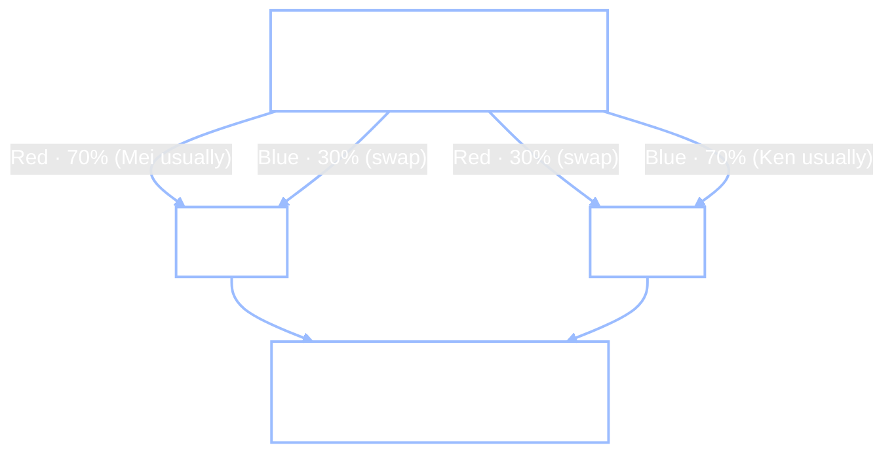

+++
date = "2026-06-15"
title = "Q-Learning: Acting Without a Map"
weight = 22
+++

## When You Don't Know the Model

[Chapter 21](../21_markov_decision_processes/) solved the Chibany MDP *exactly* — but only because we knew the whole world: every transition probability $T(s'\mid s,a)$ and every reward $R(s)$. Value iteration *reads* those numbers off the model. Take the model away and the Bellman backup has nothing to read.

> **Jamal:** "But Chibany doesn't *have* the transition matrix of his own life. Nobody does. You just… try things and see what happens."
>
> **Alyssa:** "Right — so the question changes. Not 'given the rules, what's optimal?' but 'with no rulebook, how do you *learn* to act well from experience alone?'"

That is **reinforcement learning** in its purest form: an agent that doesn't know $T$ or $R$, takes actions, sees what rewards and next-states come back, and slowly gets better. The most famous algorithm for it is **Q-learning**, and the beautiful thing is that it learns the *same* optimal policy value iteration would have computed — without ever seeing the model. This chapter builds it, watches it get gamed by badly-designed rewards, and ends where the frontier is: planning by *simulating* a model you learned.

---

## The Q-Learning Update

Recall the action value $q^*(s,a)$ from the last chapter — the long-run return of taking action $a$ in state $s$, then acting optimally. If we knew all the $q^*$ values, acting would be trivial: in each state, take the action with the largest $q$. Q-learning's whole job is to **estimate $q^*$ from experience**, storing a table $Q(s,a)$ and nudging it toward the truth every time the agent takes a step.

The nudge is the heart of it. Take action $a$ in state $s$; observe reward $r$ and next state $s'$. You now have a one-step glimpse of the truth: $r$ plus the discounted value of the best thing you can do from $s'$. Call that the **target**. The gap between the target and your current estimate is the **temporal-difference (TD) error**, and you move your estimate a fraction $\alpha$ of the way toward the target:

$$Q(s,a) \;\leftarrow\; Q(s,a) \;+\; \underbrace{\alpha}_{\text{learning rate}} \big[\, \underbrace{r + \gamma \max_{a'} Q(s',a')}_{\text{target}} \;-\; Q(s,a) \,\big].$$

Two new symbols, each named as it lands: the **learning rate** $\alpha \in (0,1]$ controls how big each nudge is, and the bracketed quantity is the **TD error** — *how surprised you were*. If the target matches your estimate, the error is zero and nothing changes; if reality was better than expected, the error is positive and $Q$ rises. Learning is just repeatedly reducing surprise.


Notice what Q-learning *doesn't* need: it never uses $T(s'\mid s,a)$. Where Chapter 21's Bellman backup *averaged* over every next state with $\sum_{s'} T(s'\mid s,a)$, Q-learning uses the single $s'$ the world actually handed back — and over many visits those samples average out to the same expectation. That is what "model-free" means: you learn from the world's responses, not from a map of the world. (The reward $r$ may now depend on the action too — the general $R(s,a)$ form Chapter 21 noted — since it's whatever came back from the move you took.)

---

## GardenPath: a Grid to Learn

To watch Q-learning work, we need a world it can stumble around in. **GardenPath** (from Ho, Littman, Cushman & Austerweil, 2015) is a $3\times3$ grid. The agent starts bottom-left at $(1,1)$ and wants the top-right goal at $(3,3)$. The bottom-right $2\times2$ block is a **garden** to stay out of; the safe route — the **path** — is the left column then the top row, an L-shape:


The agent doesn't know any of this. It only learns by moving (up/down/left/right) and collecting whatever reward each move returns. Here is the world and the Q-learning loop — $\varepsilon$-greedy exploration (act randomly a fraction $\varepsilon$ of the time, greedily otherwise), and the TD update on every step:

<!-- validate: skip-output -->
```python
import numpy as np

START, GOAL = (1, 1), (3, 3)
GARDEN = {(1, 2), (1, 3), (2, 2), (2, 3)}
DELTA = {'U': (1, 0), 'D': (-1, 0), 'L': (0, -1), 'R': (0, 1)}

def valid(s):                                   # actions that stay on the grid
    r, c = s; A = []
    if r < 3: A.append('U')
    if r > 1: A.append('D')
    if c > 1: A.append('L')
    if c < 3: A.append('R')
    return A
def move(s, a): d = DELTA[a]; return (s[0] + d[0], s[1] + d[1])

# reward tables (verified against Ho et al. 2015): +10 good, -10 bad, +20 goal, +4 faint praise
POS, NEG, GOAL_R, WEAK = 10, -10, 20, 4
RM = {(1,1):{'U':0,'R':NEG},(2,1):{'U':0,'R':NEG,'D':0},(3,1):{'R':0,'D':0},
      (1,2):{'R':NEG,'U':NEG,'L':0},(2,2):{'R':NEG,'U':0,'L':0,'D':NEG},
      (3,2):{'R':GOAL_R,'L':0,'D':NEG},(1,3):{'U':NEG,'L':NEG},(2,3):{'U':GOAL_R,'D':NEG,'L':NEG}}
AF = {(1,1):{'U':POS,'R':NEG},(2,1):{'U':POS,'R':NEG,'D':WEAK},(3,1):{'R':POS,'D':WEAK},
      (1,2):{'R':NEG,'U':NEG,'L':POS},(2,2):{'R':NEG,'U':POS,'L':NEG,'D':NEG},
      (3,2):{'R':GOAL_R,'L':WEAK,'D':NEG},(1,3):{'U':POS,'L':NEG},(2,3):{'U':POS,'D':NEG,'L':NEG}}

def Phi(s): return -(abs(GOAL[0]-s[0]) + abs(GOAL[1]-s[1]))   # potential = -distance to goal
def reward(s, a, scheme, g=0.95):
    if scheme == 'rm': return RM[s][a]                       # reward-maximizing (outcome)
    if scheme == 'af': return AF[s][a]                       # action-feedback (how people teach)
    return RM[s][a] + g*Phi(move(s, a)) - Phi(s)            # potential-based shaping
```

```python
def qlearn(scheme, episodes=4000, alpha=0.9, g=0.95, eps=0.1, seed=0):
    rng = np.random.default_rng(seed)
    states = [(r, c) for r in range(1, 4) for c in range(1, 4) if (r, c) != GOAL]
    Q = {s: {a: 0.0 for a in valid(s)} for s in states}
    for _ in range(episodes):
        s = START
        for _ in range(40):
            if s == GOAL: break
            A = valid(s)
            a = rng.choice(A) if rng.random() < eps else max(A, key=lambda a: Q[s][a])  # eps-greedy
            sp = move(s, a)
            best_next = 0.0 if sp == GOAL else max(Q[sp].values())
            Q[s][a] += alpha * (reward(s, a, scheme) + g*best_next - Q[s][a])            # TD update
            s = sp
    return {s: max(Q[s], key=Q[s].get) for s in Q}          # the greedy policy it learned

def greedy_path(pol, maxn=20):
    s = START; path = [s]
    for _ in range(maxn):
        if s == GOAL: return path, True
        s = move(s, pol[s]); path.append(s)
    return path, False

pol = qlearn('rm')
path, reached = greedy_path(pol)
print("Q-learning (rm) greedy path:", " -> ".join(f"({r},{c})" for r, c in path), "| reaches goal:", reached)
```

**Output:**
```
Q-learning (rm) greedy path: (1,1) -> (2,1) -> (3,1) -> (3,2) -> (3,3) | reaches goal: True
```

With the natural **reward-maximizing** scheme — $+20$ for reaching the goal, $-10$ for stepping into the garden, $0$ otherwise — Q-learning, knowing nothing at the start, discovers the exact L-path from thousands of noisy trials. Step through it yourself in the widget: it single-steps the algorithm with a current-step indicator, shows the live $Q$-values as colored wedges and the greedy policy as arrows, and lets you switch the reward scheme — including a mode where **you** are the teacher.

<iframe src="../../widgets/qlearning-gridworld.html"
        width="100%" height="800"
        frameborder="0"
        style="background:#111111; border-radius:6px; margin:1rem 0;"
        title="Interactive Q-learning on the GardenPath gridworld: step the algorithm, watch Q-values and the greedy policy, switch reward schemes, or teach the agent yourself">
</iframe>

(Try the **"human — YOU are the teacher"** mode: give the cat feedback move by move, then reveal whether your lessons actually reach the goal. It is harder than it looks — which is the whole point of the next section.)

---

## Reward Shaping and Positive Cycles

Q-learning does *exactly what you reward it for*. That is its strength and its trap. The reward function is where you tell the agent what you want — and getting it subtly wrong produces an agent that's perfectly optimal and completely useless.

Here is the trap, and it comes straight from how **people** naturally teach. When the agent does something good, you praise it ($+10$); when it backtracks along the path, you don't punish it — you give *faint praise* ($+4$), because it's still "on the right track." That is the **action-feedback** scheme (`af`), and it encodes a real human bias: we reward effort and progress, not just outcomes. Watch what optimal behavior looks like under each scheme — solve all three exactly with value iteration (we know the rewards, so we can), and roll out the resulting greedy policy:

```python
def vi(scheme, g=0.95, n=4000):
    states = [(r, c) for r in range(1, 4) for c in range(1, 4)]
    nz = [s for s in states if s != GOAL]
    V = {s: 0.0 for s in states}
    for _ in range(n):
        for s in nz:
            V[s] = max(reward(s, a, scheme) + (0.0 if move(s, a) == GOAL else g*V[move(s, a)])
                       for a in valid(s))
    return {s: max(valid(s), key=lambda a: reward(s, a, scheme)
                   + (0.0 if move(s, a) == GOAL else g*V[move(s, a)])) for s in nz}

for scheme in ['rm', 'af', 'potential']:
    _, reached = greedy_path(vi(scheme))
    print(f"{scheme:9s}: reaches the goal = {reached}")
```

**Output:**
```
rm       : reaches the goal = True
af       : reaches the goal = False
potential: reaches the goal = True
```

The action-feedback agent **never reaches the goal**. It found a **positive reward cycle**: it paces back and forth forever, collecting praise, and never finishes. This is not a bug in Q-learning — it's the *optimal* policy for the reward you gave. The agent is gaming you, exactly as you trained it to.


Why does looping win? Because the praise you can *farm* in a loop outweighs the one-time bonus for finishing. Pacing between two path cells collects $+10$ then $+4$, forever; finishing collects $+10$ then $+20$, once:

```python
g = 0.95
loop_value   = (POS + g*WEAK) / (1 - g**2)     # pace two path cells forever: +10, +4, +10, +4, ...
finish_value = POS + g*GOAL_R                    # step onto the path (+10), then into the goal (+20)
print(f"value of looping forever  : {loop_value:.1f}")
print(f"value of finishing the task: {finish_value:.1f}")
```

**Output:**
```
value of looping forever  : 141.5
value of finishing the task: 29.0
```

A farmable loop worth $141.5$ buries the $29.0$ for finishing — so a perfectly rational agent loops. The fix is not to scold the agent but to **shape the reward correctly**. **Potential-based shaping** (Ng, Harada & Russell, 1999) adds a bonus built from a *potential* $\Phi(s)$ — here $\Phi = -(\text{Manhattan distance to goal})$ — in the precise form $F = \gamma\,\Phi(s') - \Phi(s)$. The magic is a **telescoping identity**: summed (with discounting) along *any* path $s_0, \dots, s_T$, these shaping rewards collapse to $\gamma^T\Phi(s_T) - \Phi(s_0)$ — a quantity that depends only on the *endpoints*, not the route. So shaping shifts every trajectory's return by the same amount, leaving the optimal policy unchanged (Ng et al.'s policy-invariance theorem), while still nudging toward the goal on every step. See it directly — a path that loops for ages and a path that walks straight to the goal earn the *same* shaping total:

```python
def shaping_return(path, g=0.95):                          # discounted sum of F = g*Phi(s') - Phi(s)
    return sum(g**t * (g*Phi(path[t+1]) - Phi(path[t])) for t in range(len(path) - 1))

loops    = [(1,1),(2,1),(3,1),(3,2)] + [(3,1),(3,2)]*30    # pace the path forever
finishes = [(1,1),(2,1),(3,1),(3,2),(3,3)]                 # walk straight to the goal
print(f"discounted shaping, looping path  : {shaping_return(loops):.2f}")
print(f"discounted shaping, finishing path: {shaping_return(finishes):.2f}")
print(f"both equal -Phi(start) = {-Phi((1,1)):.2f}   -> the same constant, any route")
```

**Output:**
```
discounted shaping, looping path  : 3.96
discounted shaping, finishing path: 4.00
both equal -Phi(start) = 4.00   -> the same constant, any route
```

The two routes earn the same shaping bonus (the tiny $3.96$-vs-$4.00$ gap is just $\gamma^T\Phi(s_T)$ for the looping path's not-yet-at-goal endpoint, vanishing as the path lengthens), so the loop gains no farmable edge — and the `potential` row above confirms the optimal policy now reaches the goal. *How* you give feedback, not just how much, decides whether the agent does what you meant.


---

## Simulation-Based RL: Planning with a Learned Model

We have seen two extremes. Value iteration ([Chapter 21](../21_markov_decision_processes/)) plans perfectly but needs the *whole model*. Q-learning learns from raw experience but needs *many* trials, because each real step teaches it only one thing. The frontier of RL lives in between: **learn a model from experience, then plan by simulating with it**. We'll call this **simulation-based RL** (you may also hear "model-based RL").

The simplest version is **Dyna** (Sutton, 1991): from experience, estimate a transition model $\hat T$ by *counting* where actions led, then run value iteration on $\hat T$ as if it were real. We leave GardenPath behind and return to the **Chibany wellbeing MDP** from [Chapter 21](../21_markov_decision_processes/) — we now want a model worth *reconstructing*. Recall its shape: three states — **Junk** ($R=+1$), **Trying** ($R=-2$), and **Healthy** ($R=+5$) — and two actions, **Indulge** (drift down) or **Invest** (climb up, but only by passing through the $-2$ Trying trough), at discount $\gamma = 0.9$:


The agent never sees these probabilities — it just wanders randomly for a while, learns $\hat T$ by counting where its actions led, then plans on it. (Full Dyna *interleaves* the two, slipping a few imagined planning steps in after every real action; here we learn the model first and then plan, to keep the two stages clear.)

```python
import numpy as np
import jax.numpy as jnp, jax.random as jr
from jax import lax, vmap, jit
from genjax import gen, categorical

T = np.array([[[.9,.1,0.],[.7,.3,0.],[.2,.5,.3]],     # the TRUE Chibany dynamics (Ch 21);
              [[.4,.6,0.],[.1,.4,.5],[0.,.1,.9]]])     # the agent never sees these directly
R = np.array([1., -2., 5.]); GA = 0.9
Tj, Rj = jnp.array(T), jnp.array(R)

@gen
def transition(s, a):                                  # the SAME generative model as Chapter 21:
    return categorical(jnp.log(Tj[a, s])) @ "s_next"   # the action picks the next-state distribution

@jit
def dyna(key, n_steps=20000):
    def explore(carry, _):                             # collect experience: a random-action walk,
        s, key = carry                                 # each step one draw from the GenJAX model
        key, k1, k2 = jr.split(key, 3)
        a = jr.bernoulli(k1).astype(int)
        s2 = transition.simulate(k2, (s, a)).get_retval()
        return (s2, key), (a, s, s2)
    _, (aa, ss, sps) = lax.scan(explore, (0, key), None, length=n_steps)
    counts = jnp.zeros((2, 3, 3)).at[aa, ss, sps].add(1.0)
    T_hat = counts / counts.sum(axis=2, keepdims=True)  # the LEARNED model
    def sweep(V, _):                                    # value iteration on the learned model
        Q = jnp.stack([Rj + GA*(T_hat[a] @ V) for a in (0, 1)], axis=1)
        return Q.max(axis=1), None
    V, _ = lax.scan(sweep, jnp.zeros(3), None, length=400)
    Q = jnp.stack([Rj + GA*(T_hat[a] @ V) for a in (0, 1)], axis=1)
    return Q.argmax(axis=1)

print("Dyna (plan on the LEARNED model) policy:", ["Invest" if int(a) else "Indulge" for a in dyna(jr.key(0))])
```

**Output:**
```
Dyna (plan on the LEARNED model) policy: ['Invest', 'Invest', 'Invest']
```

From nothing but random experience, the agent reconstructs enough of the world to recover the optimal **Invest-everywhere** policy — the same answer [Chapter 21](../21_markov_decision_processes/) computed from the true model. And this Dyna *is* GenJAX: every one of the 20 000 experience steps is a `transition.simulate` draw from the same `@gen` model as Chapter 21, and the whole random walk plus value iteration runs as a single JIT-compiled `lax.scan` — about 0.06 s.

This is a good moment to *watch* the two styles of learning side by side on the **same** Chibany MDP. Both agents see the identical stream of experience; the only difference is what they do with each step. **Q-learning** (model-free) makes one TD update per real step. **Dyna** (model-based) makes that *same* update **plus** a handful of **planning** backups from its learned model — replaying imagined experience to wring more out of every real step. Keep the exact answer from [Chapter 21](../21_markov_decision_processes/) in mind — value iteration gave $V^* = [25.6,\ 28.4,\ 39.8]$ with **Invest** optimal everywhere (the dashed targets). Watch both climb toward it; then drag Dyna's **planning steps to 0** and the two panels become identical — planning is the *only* difference:

<iframe src="../../widgets/dyna-vs-qlearning.html"
        width="100%" height="560"
        frameborder="0"
        style="background:#111111; border-radius:6px; margin:1rem 0;"
        title="Q-learning vs Dyna on the Chibany MDP, side by side: both learn from the same experience, but Dyna adds planning backups from a learned model and converges to the value-iteration answer in far fewer real steps">
</iframe>

With even a few planning steps, Dyna reaches the value-iteration answer in a fraction of the real experience Q-learning needs — the payoff of *having a model to imagine with*, the thread that runs from here to MCTS and AlphaZero.

{}
Dyna takes a shortcut worth naming. The empirical frequencies $\hat T = \text{counts} / \text{row totals}$ are the **maximum-likelihood estimate** of the transition matrix, and Dyna then plans as if that single estimate were exactly correct — a strategy called [**certainty equivalence**](../../glossary/#certainty-equivalence-): collapse the uncertainty to a point, then optimize. It works cleanly here only because we first gathered 20 000 steps under a random policy, so $\hat T$ is already sharp.

Keep the uncertainty instead and something elegant appears. Fold the unknown matrix into the state: let the true state be the pair $(s, \theta)$ where $\theta = T$ is **hidden and static**, and read every observed transition as an observation that sharpens a posterior over $\theta$ (a [Dirichlet](../../glossary/#dirichlet-distribution-) posterior — one per row, since each row's counts are multinomial). That augmented problem is a genuine [**partially observable Markov decision process (POMDP)**](../../glossary/#partially-observable-mdp-pomdp-) — an MDP whose true state you *cannot see directly*. In a POMDP the agent never observes the state $s$ itself; it receives only **observations** $o$ drawn from an observation model $O(o \mid s)$ that depend on the hidden state, so the best it can do is carry a **belief** — a probability distribution over which state it might be in — update that belief with each observation (by Bayes' rule), and act on it. Our case is the structured one where the hidden part is the *static parameters* $\theta$ and the belief is the posterior over them — known as a [**Bayes-adaptive MDP**](../../glossary/#bayes-adaptive-mdp-). In it, "explore to pin down the dynamics" and "exploit what you already know" stop being separate phases and become a *single* optimization, because reducing uncertainty about $\theta$ now has value.

Solving that POMDP exactly is intractable, so the workhorse middle ground is **posterior sampling** (also called *Thompson sampling*): draw one plausible $T$ from the posterior, plan as if it were true, act, update, repeat — exploring each model in proportion to how plausible it still is. Dyna is the degenerate point-estimate corner of that same space. **POMDPs are the subject of the next few chapters** (still being written): partial observability is the rule, not the exception — a robot reading noisy sensors, a clinician inferring a disease from symptoms, a dialogue agent guessing a user's intent all act without ever seeing the true state, and must plan over beliefs instead. The Bayes-adaptive view here is the bridge into that material: it shows that **unknown parameters** and **unobserved state** are the same machinery aimed at different parts of the state.
{}

The next tool — **Monte Carlo Tree Search (MCTS)** — samples the *same* model, but to estimate a state's value by **rollout**: simulate many random-policy trajectories from a state and average their discounted returns. Written in GenJAX, that is one `vmap`-batched, compiled call over thousands of trajectories — which is where JAX earns its speed:

<!-- validate: tol=0.5 -->
```python
def gen_rollout_value(s0, key, horizon=60, n=4000):           # random-policy value, by rollout, in GenJAX
    def one(key):
        def step(carry, _):
            s, disc, tot, key = carry
            key, k1, k2 = jr.split(key, 3)
            a = jr.bernoulli(k1).astype(int)                  # random rollout policy
            s2 = transition.simulate(k2, (s, a)).get_retval() # one "simulate" step = a draw from the model
            return (s2, disc*GA, tot + disc*Rj[s], key), None
        (_, _, tot, _), _ = lax.scan(step, (s0, 1.0, 0.0, key), None, length=horizon)
        return tot
    return vmap(one)(jr.split(key, n)).mean()                 # average 4000 rollouts in one batched call

print("GenJAX random-rollout value of Junk:", round(float(gen_rollout_value(0, jr.key(0))), 1))
```

**Output:**
```
GenJAX random-rollout value of Junk: 6.8
```

(That low number is the random-rollout estimate — the same noisy default policy MCTS bootstraps from; the tree search is what lifts it toward the true value.)

{}
There is, and it is worth being honest about. DeepMind's [mctx](https://github.com/google-deepmind/mctx) runs MCTS *entirely* in JAX — fully JIT-compiled and `vmap`-batched across many searches at once — and it is the search engine behind AlphaZero and MuZero. So why is the tree below written in plain NumPy? It is a **readability** choice, not a capability limit.

The catch is *how* you make a tree JAX-friendly. JAX cannot compile a tree that grows as Python `dict`s driven by a data-dependent `while True` loop — and the speed of the two cells above came entirely from **batching** fixed-size work (4000 rollouts through one kernel), which a grow-one-node-at-a-time loop can't do. What mctx does instead is **pre-allocate the whole tree as fixed-size arrays** — `visits[node, action]`, `value_sums[…]`, and child/parent index arrays sized to the simulation budget — then run the four phases with `lax.while_loop` (descend and back up by walking the index arrays) and `.at[idx].add(…)` scatter updates. That compiles and runs fast on an accelerator, but it trades the readable dict-and-loop below for integer index-arithmetic that would bury the four-phase idea this section is teaching.

So the split is **pedagogy vs. production**, and the GenJAX piece carries over unchanged either way: the `@gen transition` model *is* the simulator you would hand to mctx's recurrent function — only the bookkeeping around it changes. (For the record, the tempting shortcut — keeping the NumPy tree but swapping in a per-step `transition.simulate` call — is the worst of both worlds: measured here it runs **over 20× slower**, ≈33 s vs ≈1.4 s, because each call pays JAX dispatch overhead with nothing batched to amortize it. The NumPy `np.random.choice(3, p=T[a, s])` below samples the *identical* distribution as `categorical(jnp.log(T[a, s]))` — same model, drawn the fast way for a loop that lives in host Python.) For readers who want to see it done properly, a runnable JAX MCTS — array-based tree, one compiled `lax.scan`, the GenJAX model doing every rollout step — is given in the optional *"The Same Search, Compiled in JAX"* section at the end of this part.
{}

### Planning by Search: MCTS

Dyna plans by sweeping *every* state. But when there are too many states to sweep — a game with $10^{40}$ positions — you can't. MCTS plans instead by *simulating forward only from where you are*, building a search tree with four repeated phases:


The **select** phase chooses which action to follow by **UCB** — short for **Upper Confidence Bound** — a rule that balances taking the action that has *looked* best so far against trying one we have barely explored. For each action $a$ available at the current node it computes a score

$$\text{UCB}(a) \;=\; \underbrace{\frac{W_a}{N_a}}_{\text{exploit: average return}} \;+\; \underbrace{c\,\sqrt{\frac{\ln N_{\text{parent}}}{N_a}}}_{\text{explore: uncertainty bonus}},$$

and picks the action with the highest score. Every symbol here is a running tally the tree keeps as it searches:

- $N_a$ — how many times action $a$ has been tried from this node so far.
- $W_a$ — the sum of the returns those $N_a$ tries earned, so $W_a / N_a$ is action $a$'s **average return** (the *exploit* term — favor what has paid off).
- $N_{\text{parent}} = \sum_{a'} N_{a'}$ — the node's total visits, i.e. the sum of $N_{a'}$ over all of its actions.
- $c$ — the **exploration constant** (we use $c = 1.4$); a larger $c$ leans harder toward exploring.

The square-root term is the *explore* bonus: it is large when $N_a$ is small and shrinks as $a$ is tried more, so a rarely-taken action gets pulled up even when its current average is mediocre. (An untried action — $N_a = 0$ — has an infinite bonus, so MCTS tries each action once before it starts comparing averages.) UCB is the tree-search cousin of $\varepsilon$-greedy: instead of exploring at random, it explores *where it is most uncertain*.

A worked step makes the balance concrete. Suppose, partway through the search at the Junk node, we have tried **Indulge** $N_{\text{Indulge}} = 15$ times for a total return $W_{\text{Indulge}} = 210$ (average $14.0$), and **Invest** only $N_{\text{Invest}} = 2$ times for $W_{\text{Invest}} = 26$ (average $13.0$), so $N_{\text{parent}} = 15 + 2 = 17$. The two scores are

$$\text{Indulge}:\ \frac{210}{15} + 1.4\sqrt{\frac{\ln 17}{15}} = 14.0 + 0.61 = 14.61, \qquad \text{Invest}:\ \frac{26}{2} + 1.4\sqrt{\frac{\ln 17}{2}} = 13.0 + 1.67 = 14.67.$$

Even though Indulge's *average* ($14.0$) is the higher of the two, UCB selects **Invest** — because Invest has been tried so much less ($N=2$ vs $15$) that its uncertainty bonus ($1.67$) more than covers the $1.0$ gap in averages. That is the whole point: UCB keeps steering search toward actions it is *unsure* about, which is exactly how the under-tried Invest — the action that is actually optimal here — earns enough visits to reveal its true value. Each **simulate** step is then a rollout through the model — exactly the `transition.simulate` move from Chapter 21. Run MCTS from the Junk state of the Chibany MDP and it figures out the best action by simulating possible futures, no Bellman sweep required. (In the compact code below, *select* and *expand* share one loop iteration — the `untried`/UCB branch is both — and the four interactive widgets that follow pull the phases apart so you can watch each one.)

```python
import math

def mcts(root=0, n_sim=4000, horizon=60, c=1.4, seed=0, cap=12):
    rng = np.random.default_rng(seed); N = {}; W = {}        # visits and value sums per (state, action)
    nxt = lambda s, a: rng.choice(3, p=T[a, s])              # sample the model
    for _ in range(n_sim):
        s = root; path = []; rewards = []; depth = 0
        while True:                                          # SELECT down the tree, EXPAND a new leaf
            untried = [a for a in (0, 1) if (s, a) not in N]
            ns = sum(N.get((s, a), 0) for a in (0, 1))
            a = (rng.choice(untried) if untried else                            # UCB selection
                 max((0, 1), key=lambda a: W[(s,a)]/N[(s,a)] + c*math.sqrt(math.log(ns+1)/N[(s,a)])))
            path.append((s, a)); rewards.append(R[s]); leaf = (s, a) in untried
            s2 = nxt(s, a); depth += 1
            if leaf or depth >= cap:                          # SIMULATE: random rollout from the leaf
                t = s2
                for _ in range(horizon - depth): rewards.append(R[t]); t = nxt(t, rng.integers(2))
                break
            s = s2
        suffix = [0.0] * (len(rewards) + 1)                   # discounted return FROM each visited node on
        for i in range(len(rewards) - 1, -1, -1): suffix[i] = rewards[i] + GA*suffix[i+1]
        for i, (s, a) in enumerate(path):                     # BACKUP: each node gets its own return
            N[(s,a)] = N.get((s,a),0)+1; W[(s,a)] = W.get((s,a),0.)+suffix[i]
    q = [W[(root, a)]/N[(root, a)] for a in (0, 1)]
    return ("Invest" if int(np.argmax(q)) else "Indulge"), q

choice, q = mcts(0)
print(f"MCTS from Junk picks: {choice}  (Q_Indulge={q[0]:.1f}, Q_Invest={q[1]:.1f})")
```

**Output:**
```
MCTS from Junk picks: Invest  (Q_Indulge=13.4, Q_Invest=17.0)
```

MCTS recovers the optimal action — **Invest** — purely by simulating rollouts and keeping score, never once solving the Bellman equation. (One honest caveat: plain *random* rollouts make this a **noisy** estimator on a trap-then-reward MDP like Chibany's — the optimal gap at Junk is thin, and random play rarely threads the $-2$ trough, so some seeds even prefer Indulge. That noise is exactly why **AlphaZero** replaces the random rollout with a *learned* value network.) The four phases are easiest to *see* one at a time. The first widget steps MCTS on this tiny Chibany tree, lighting up Select → Expand → Simulate → Backup so you can watch a single node's estimate form:

<iframe src="../../widgets/mcts-stepper-chibany.html"
        width="100%" height="560"
        frameborder="0"
        style="background:#111111; border-radius:6px; margin:1rem 0;"
        title="Step-by-step MCTS on the small Chibany MDP: advance one phase at a time through select, expand, simulate, and backup">
</iframe>

The *same* four-phase loop scales to a real game. The second widget runs MCTS on **tic-tac-toe** — a deterministic, perfect-information game — growing a search tree move by move; then you can play against it:

<iframe src="../../widgets/mcts-tictactoe.html"
        width="100%" height="600"
        frameborder="0"
        style="background:#111111; border-radius:6px; margin:1rem 0;"
        title="MCTS playing tic-tac-toe: watch the search tree grow through the four phases, then play against the agent">
</iframe>

This is the bridge to the most famous agents in AI. **AlphaZero** (Silver et al., 2018) is exactly this loop with the random rollout replaced by a learned value-and-policy network; **MuZero** (Schrittwieser et al., 2020) learns the model it searches in. They are MCTS, scaled.


### Optional: The Same Search, Compiled in JAX

*This part is for the curious — you can skip it without missing anything the rest of the course needs.* The note above claimed an efficient JAX MCTS is real, just less readable than the NumPy one. Here is one, so the claim isn't hand-waving. It plans on the same Chibany MDP, samples with the same `@gen transition` model, and runs the entire 4000-simulation search as a **single JIT-compiled `lax.scan`** — no Python loop over simulations, so none of the per-step dispatch cost that made the naive approach 20× slower.

The trick that makes it compile is to *not* grow a Python `dict` tree. Because the Chibany MDP has only three states, every statistic the search needs fits in two fixed $(3, 2)$ arrays — $N[s, a]$ (visit counts) and $W[s, a]$ (return sums), exactly the `(state, action)` keys the NumPy version used. Those two arrays are the **carry** of an outer `lax.scan` over simulations: each simulation reads them to choose actions by UCB and writes its results back with a scatter-add (`.at[s, a].add(...)`). Inside one simulation, an inner `lax.scan` walks `horizon` steps — descending by UCB while it can, then rolling out a random policy — with `jnp.where` standing in for every Python `if` so the whole thing is traceable:

<!-- validate: tol=0.5 -->
```python
@jit
def mcts_jax(key, root=0, n_sim=4000, cap=12, horizon=60, c=1.4):
    def one_sim(carry, key):                                # one simulation; stats carry forward
        N, W = carry                                        # (3,2) visits & return-sums per (state, action)
        def step(st, _):
            s, descending, depth, key = st
            key, ka, ks = jr.split(key, 3)
            Ns = jnp.maximum(N[s], 1.0)
            ucb = W[s]/Ns + c*jnp.sqrt(jnp.log(N[s].sum()+1.0)/Ns)        # exploit + explore bonus
            untried = N[s] == 0
            a_tree = jnp.where(untried.any(), jnp.argmax(untried), jnp.argmax(ucb))
            a = jnp.where(descending, a_tree, jr.bernoulli(ka)).astype(jnp.int32)   # rollout = random
            s2 = transition.simulate(ks, (s, a)).get_retval()            # SIMULATE one step via GenJAX
            leaf = descending & (untried.any() | (depth + 1 >= cap))
            return (s2, descending & ~leaf, depth + descending.astype(jnp.int32), key), (s, a, Rj[s], descending)
        _, (ss, aa, rr, inpath) = lax.scan(step, (jnp.int32(root), True, jnp.int32(0), key), None, length=horizon)
        _, suf = lax.scan(lambda acc, r: (r + GA*acc, r + GA*acc), 0.0, rr[::-1])   # discounted returns
        w = inpath.astype(jnp.float32)
        return (N.at[ss, aa].add(w), W.at[ss, aa].add(w*suf[::-1])), None            # BACKUP: scatter-add
    (N, W), _ = lax.scan(one_sim, (jnp.zeros((3, 2)), jnp.zeros((3, 2))), jr.split(key, n_sim))
    return W[root] / jnp.maximum(N[root], 1.0)

q = mcts_jax(jr.key(3))
print(f"JAX MCTS from Junk picks: {'Invest' if int(jnp.argmax(q)) else 'Indulge'}  "
      f"(Q_Indulge={float(q[0]):.1f}, Q_Invest={float(q[1]):.1f})")
```

**Output:**
```
JAX MCTS from Junk picks: Invest  (Q_Indulge=5.6, Q_Invest=17.1)
```

Same answer as the NumPy search — **Invest** — but the whole 4000-simulation run compiles to one kernel and finishes in under a fifth of a second. Two honest caveats keep it in perspective:

- **It inherits the same noise.** Random rollouts on this trap-then-reward MDP are nearly a coin-flip on the seed — some seeds lock onto Indulge instead (the NumPy search does too). That fragility is *exactly* why AlphaZero replaces the random rollout with a learned value network.
- **It leans on the three-state shortcut.** Keying statistics by `(state, action)` only works because there are so few states. In a real game you can't enumerate them, so a library like *mctx* pre-allocates the tree as node- and edge-indexed arrays and walks them with index arithmetic — more bookkeeping, but the same four phases, the same scan-and-scatter skeleton, and the same generative model doing the simulating.

{}
The thread running through these three chapters — *write the world as a generative model, then sample it to decide* — is exactly what probabilistic programming is for. GenJAX is a general PPL, not an RL library, so the natural next step is the idea that **planning is inference**: a decision problem written as a generative model, solved with the same Monte-Carlo and SMC machinery you already know.

- **[Tutorial 2](../../genjax/)** — the deep dive on writing and querying generative functions in GenJAX (`simulate`, `generate`, `assess`).
- **GenJAX & GenStudio** — the [GenJAX repo](https://github.com/ChiSym/genjax) (modeling + programmable inference) and [GenStudio](https://github.com/ChiSym/genstudio) (Python → interactive visualizations), from the MIT Probabilistic Computing Project; the broader [Gen](https://github.com/probcomp/Gen.jl) system underneath it.
- **Planning as inference** — Levine (2018), *Reinforcement Learning and Control as Probabilistic Inference*, and Moerland et al. (2023), *A Unifying Framework for Reinforcement Learning and Planning* — the formal version of "simulate to plan."
- *Coming later in the course (after the partial-observability and inverse-RL material):* a dedicated chapter on **world models** (MuZero, Dreamer), deep RL at scale, and RLHF, where the agent must plan when it cannot even see the true state.
{}

---

## Telling Model-Free from Model-Based: The Two-Step Task

This chapter built both kinds of agent. **Q-learning is model-free** — it caches values from experience and never represents the world's dynamics. **Dyna and MCTS are model-based** — they hold a model and *simulate* it to plan. That raises a question cognitive science cares about deeply: when a *person* (or a rat) learns a task, which kind of computation is the brain doing? You usually can't tell from choices alone — given enough trials, both strategies solve the same task equally well. The trick is a task whose two systems are *forced to predict different things*. The framework it probes — a *habitual* model-free controller competing with a *goal-directed* model-based one — was introduced by **Daw, Niv & Dayan (2005)**, who already used it to account for animal (rat) behavior; the human **two-step task** we walk through here, the first to dissociate the two systems in *people*, is **Daw, Gershman, Seymour, Dayan & Dolan (2011)**, and it became one of the most influential paradigms in computational cognitive neuroscience.

**The task.** Picture **Chibany** running a lunchtime errand each day, in two stages. At **stage 1** he packs a bento in one of two colors — a **Red** box or a **Blue** box. The box is then taken by one of two classmates — **Mei** or **Ken** — but only *probabilistically*: **Mei** *usually* grabs the **Red** box (the **common** outcome, 70%) and **Ken** *usually* grabs the **Blue** box (70% too); the other 30% of the time a **swap** (the **rare** outcome) happens and the other student takes it. Whoever ends up with the box sometimes shares **tonkatsu** back — the treat Chibany is after — and sometimes doesn't, and who is feeling generous **drifts slowly** day to day, so there is always something to keep learning. (Stage 1 = which color to pack; the two students are the two stage-2 states; the tonkatsu is the reward.)



The whole game lives in that **swap** (the rare transition). Ask the simplest behavioral question: the next day, does Chibany **pack the same color** (stay) or **switch**? The two systems answer from completely different information.

- **Model-free** asks only: *did the box I packed earn tonkatsu?* A bento color that was followed by tonkatsu gets reinforced, so it is more likely to be packed again — full stop. It never consults *which student* grabbed it or *how*. Prediction: a **main effect of reward** — tonkatsu → stay, none → switch — with the swap making **no difference**.
- **Model-based** asks: *which student has the tonkatsu, and which color do they usually grab?* Tonkatsu makes that *student* valuable, and it then packs the color that student **usually** takes. Here the swap bites. Say Chibany packed the **Red** box, it was **swapped** to **Ken**, and **Ken shared tonkatsu**. Ken is now the student to reach — but the box Ken *usually* grabs is the **Blue** one, not the Red Chibany just packed. So model-based **switches to Blue**, *even though packing Red just earned tonkatsu*. Prediction: a **reward × transition interaction** (a crossover), not a plain reward effect.

That swap-with-tonkatsu case is the crux, and it is genuinely easy to tangle — so step through every combination yourself. Set the color, who grabbed it, and the outcome, and watch what each mind concludes (the two verdicts agree on *usual* days and split on *swap* days):

<iframe src="../../widgets/two-step-task.html"
        width="100%" height="600"
        frameborder="0"
        style="background:#111111; border-radius:6px; margin:1rem 0;"
        title="Interactive two-step task: set the bento color Chibany packs, which student grabbed it (usual/swap), and whether they shared tonkatsu, and see why model-free and model-based stay or switch">
</iframe>

We can also just *simulate* both agents. A model-free learner caches a value for each **bento color** and nudges it toward the tonkatsu received; a model-based learner learns each **student's** value and combines them through the known 70/30 grab-rates to score the two colors. Run each for many days and tally how often Chibany **repeats the color**, split by the previous day's tonkatsu and whether the usual student grabbed it:

<!-- validate: tol=0.05 -->
```python
import numpy as np

def two_step_stay_probs(agent, n_trials=30000, alpha=0.5, beta=5.0, p_common=0.7, seed=0):
    rng = np.random.default_rng(seed)
    Q1 = np.zeros(2)                              # model-free cache: one value per bento color
    Q2 = np.zeros((2, 2))                         # value of each student's treats (both agents learn this)
    rp = rng.uniform(0.25, 0.75, size=(2, 2))     # drifting tonkatsu probabilities
    choose = lambda q: int(rng.random() < np.exp(beta*q[1]) / np.exp(beta*q).sum())
    a1s, commons, rewards = [], [], []
    for _ in range(n_trials):
        if agent == "model-free":
            q1 = Q1                               # cached first-stage values
        else:                                     # model-based: plan with the known 70/30 grab-rates
            V2 = Q2.max(axis=1)
            q1 = np.array([p_common*V2[a] + (1-p_common)*V2[1-a] for a in (0, 1)])
        a1 = choose(q1)
        common = rng.random() < p_common
        s2 = a1 if common else 1 - a1             # usual: color a -> its usual student a
        a2 = choose(Q2[s2])
        r = float(rng.random() < rp[s2, a2])
        Q2[s2, a2] += alpha*(r - Q2[s2, a2])      # learn the student's value
        if agent == "model-free":
            Q1[a1] += alpha*(r - Q1[a1])          # credit the bento COLOR for the tonkatsu
        a1s.append(a1); commons.append(common); rewards.append(r)
        rp = np.clip(rp + rng.normal(0, 0.025, size=(2, 2)), 0.25, 0.75)
    a1s, commons, rewards = np.array(a1s), np.array(commons), np.array(rewards)
    stay = a1s[1:] == a1s[:-1]
    pr, pc = rewards[:-1], commons[:-1]
    return {f"{'rewarded' if rv else 'unrewarded'}/{'common' if cv else 'rare'}":
            round(float(stay[(pr == rv) & (pc == cv)].mean()), 2)
            for rv in (1.0, 0.0) for cv in (True, False)}

for agent in ("model-free", "model-based"):
    p = two_step_stay_probs(agent)
    print(f"{agent:12s}  rew/common {p['rewarded/common']}  rew/rare {p['rewarded/rare']}"
          f"   unrew/common {p['unrewarded/common']}  unrew/rare {p['unrewarded/rare']}")
```

**Output:**
```
model-free    rew/common 0.9  rew/rare 0.9   unrew/common 0.57  unrew/rare 0.57
model-based   rew/common 0.66  rew/rare 0.45   unrew/common 0.45  unrew/rare 0.66
```

Those numbers *are* the signature. The model-free learner repeats the color ~0.9 of the time after **any** tonkatsu and ~0.57 after **any** empty-handed day — flat across the swap. The model-based learner shows the **crossover**: repeat after a usual-day tonkatsu or a swap-day miss, switch after a swap-day tonkatsu or a usual-day miss. Plot the repeat-probability as two lines — one for tonkatsu days, one for empty days — across *usual* vs. *swap*, and model-free gives **parallel** lines (tonkatsu just shifts them together) while model-based gives **crossing** lines (the interaction). The widget runs the simulation live; slide the model-based weight $w$ from 0 to 1 to morph one into the other:

<iframe src="../../widgets/two-step-stay-prob.html"
        width="100%" height="560"
        frameborder="0"
        style="background:#111111; border-radius:6px; margin:1rem 0;"
        title="Interactive two-step signature: probability Chibany repeats the bento color — model-free gives parallel tonkatsu lines, model-based gives a crossing interaction, with a model-based-weight slider to mix them">
</iframe>

The result that made the task famous: **real people show *both*** — a reward main effect *and* an interaction, exactly the middle panel's blend. That mixture is read as evidence that the brain runs the two systems in parallel and arbitrates between them — the **habitual** (model-free) and **goal-directed** (model-based) controllers of Daw et al. (2005). The plain model-free/model-based distinction this chapter drew in code turns out to be a measurable axis of human cognition.

Because the model-based score is a single number you can estimate per person, the task launched a large literature on **individual differences**: model-based control drops under stress and cognitive load, rises through childhood into adulthood, and — most influentially — tracks a *transdiagnostic* **compulsivity** dimension spanning OCD, addiction, and eating disorders (Gillan et al., 2016). It is one of the most-run paradigms in computational psychiatry.

{}
For all its influence, the two-step task is an imperfect instrument, and it is worth knowing why. First, the standard version gives model-based control **almost no reward advantage** — a purely model-free agent earns nearly as much — so there is weak pressure to plan, the measure is noisy, and "low model-based control" can just mean "not worth the effort here" (Kool, Cushman & Gershman, 2016). Second, and more serious, the signature crossover is **confounded**: a *sophisticated model-free* learner whose state representation tracks the transition it just took can reproduce the very reward×transition interaction we called the model-based fingerprint, so the interaction is *suggestive* of planning, not proof of it (Akam, Costa & Dayan, 2015). Newer variants raise the model-based payoff and add controls, but the general lesson stands and is worth carrying out of this chapter: **a behavioral signature is evidence about a computation, never the computation itself.**
{}

---

## Where RL Is Now

The journey from a $3\times3$ grid to the frontier is one of **scale**, but every milestone is a piece you've now met:


Tabular $Q$ became a neural network ($Q(s,a)$ predicted by a deep net — **DQN** (Mnih et al., 2015), which learned to play Atari from pixels); rollouts gained learned value and policy networks (**AlphaGo**, Silver et al., 2016; **AlphaZero**, Silver et al., 2018); and the model itself became learned (**MuZero**, Schrittwieser et al., 2020; **Dreamer**, Hafner et al., 2020). Two themes from this chapter scale all the way up:

- **Reward hacking is the positive cycle, at frontier scale.** When a large language model is tuned with RL from human feedback (**RLHF**), the "reward" is a learned model of human approval — and agents reliably find ways to *farm that approval* without doing the underlying task, exactly as the action-feedback cat paced for praise. "Specify the reward you can measure, get the behavior you didn't mean" is the same bug from the GardenPath, now a central problem in AI alignment (Weeks 11–13).
- **The TD error is a signal in your brain.** The bracketed surprise term $r + \gamma\max_{a'}Q(s',a') - Q(s,a)$ turns out to match the firing of midbrain **dopamine** neurons (Schultz, Dayan & Montague, 1997) — they signal *reward prediction error*, not reward. And the **model-free vs. model-based** split is exactly the *habitual*-vs.-*goal-directed* axis the two-step task above dissociates (Daw et al., 2005, 2011). Reinforcement learning is not just an engineering tool; it is one of our best theories of how brains learn to act.


{}
You can run **Q-learning** — estimate action values $Q(s,a)$ from raw experience with the **TD update**, using a **learning rate** $\alpha$, $\varepsilon$-greedy exploration, and no model of the world — and you understand it learns the same optimal policy value iteration would, model-free. You know the central danger of **reward design**: a reward you can *farm* creates a **positive cycle** (the agent loops forever collecting praise), and that **potential-based shaping** is the principled fix because the shaping along any path collapses to a constant fixed by its endpoints, so no loop can farm it — the optimal policy is preserved. You can plan with a *learned* model — **Dyna** (count, then value-iterate) and **MCTS** (select → expand → simulate → backup) — which is **simulation-based RL**, the engine inside AlphaZero and MuZero. And you can see the two big through-lines: reward hacking is the positive cycle at scale, and the TD error is a dopamine signal in the brain.

This closes the agency arc that began in [Chapter 20](../20_statistical_decision_theory/): from one decision, to planning a known world, to learning and acting in an unknown one. Next, the course turns to **inverse** RL — watching behavior and inferring the *goals* behind it.

*Glossary:* [Q-learning](../../glossary/#q-learning-), [temporal-difference error](../../glossary/#temporal-difference-error-), [learning rate](../../glossary/#learning-rate-), [ε-greedy](../../glossary/#epsilon-greedy-exploration-), [reward shaping](../../glossary/#reward-shaping-), [reward hacking](../../glossary/#reward-hacking-), [simulation-based RL](../../glossary/#simulation-based-rl-), [Monte Carlo Tree Search](../../glossary/#monte-carlo-tree-search-), [UCB](../../glossary/#upper-confidence-bound-ucb-), [certainty equivalence](../../glossary/#certainty-equivalence-), [Bayes-adaptive MDP](../../glossary/#bayes-adaptive-mdp-), [POMDP](../../glossary/#partially-observable-mdp-pomdp-), [two-step task](../../glossary/#two-step-task-).
{}

---

## Exercises

{}
1. **Watch it learn.** In the `qlearn` cell, lower `episodes` to $200$ and rerun a few times with different `seed`s. Does the greedy path always reach the goal? Now raise $\varepsilon$ to $0.5$ (much more exploration) — does it learn faster or slower, and why?
2. **Break the reward yourself.** In the human-teacher mode of the widget, try to teach the cat to reach the goal using only praise (👍) and neutral (➖) — no punishment. Can you avoid creating a positive cycle? Then explain, using the loop-vs-finish numbers, why "all carrots, no sticks" is so prone to looping.
3. **Sharpen MCTS.** In the `mcts` cell, drop `n_sim` to $100$ — does it still pick Invest reliably across seeds? Then raise the exploration constant `c` from its default of $1.4$ to $8.0$ and describe what happens to the gap between `Q_Invest` and `Q_Indulge`, and why over-exploring blurs the decision.
{}

A companion notebook works through all of this interactively:

**📓 [Open in Colab: `22_q_learning.ipynb`](https://colab.research.google.com/github/josephausterweil/probintro/blob/main/notebooks/22_q_learning.ipynb)**

---

## References

- Akam, T., Costa, R., & Dayan, P. (2015). Simple plans or sophisticated habits? State, transition and learning interactions in the two-step task. *PLOS Computational Biology, 11*(12), e1004648. <https://doi.org/10.1371/journal.pcbi.1004648>
- Daw, N. D., Niv, Y., & Dayan, P. (2005). Uncertainty-based competition between prefrontal and dorsolateral striatal systems for behavioral control. *Nature Neuroscience, 8*(12), 1704–1711. <https://doi.org/10.1038/nn1560>
- Daw, N. D., Gershman, S. J., Seymour, B., Dayan, P., & Dolan, R. J. (2011). Model-based influences on humans' choices and striatal prediction errors. *Neuron, 69*(6), 1204–1215. <https://doi.org/10.1016/j.neuron.2011.02.027>
- Gillan, C. M., Kosinski, M., Whelan, R., Phelps, E. A., & Daw, N. D. (2016). Characterizing a psychiatric symptom dimension related to deficits in goal-directed control. *eLife, 5*, e11305. <https://doi.org/10.7554/eLife.11305>
- Hafner, D., Lillicrap, T., Ba, J., & Norouzi, M. (2020). Dream to control: Learning behaviors by latent imagination. *International Conference on Learning Representations (ICLR)*. <https://arxiv.org/abs/1912.01603>
- Ho, M. K., Littman, M. L., Cushman, F., & Austerweil, J. L. (2015). Teaching with rewards and punishments: Reinforcement or communication? *Proceedings of the 37th Annual Conference of the Cognitive Science Society*, 920–925.
- Kool, W., Cushman, F. A., & Gershman, S. J. (2016). When does model-based control pay off? *PLOS Computational Biology, 12*(8), e1005090. <https://doi.org/10.1371/journal.pcbi.1005090>
- Levine, S. (2018). Reinforcement learning and control as probabilistic inference: Tutorial and review. *arXiv:1805.00909*. <https://arxiv.org/abs/1805.00909>
- Mnih, V., Kavukcuoglu, K., Silver, D., et al. (2015). Human-level control through deep reinforcement learning. *Nature, 518*(7540), 529–533. <https://doi.org/10.1038/nature14236>
- Moerland, T. M., Broekens, J., Plaat, A., & Jonker, C. M. (2023). A unifying framework for reinforcement learning and planning. *Frontiers in Artificial Intelligence, 6*, 908353. <https://doi.org/10.3389/frai.2023.908353>
- Ng, A. Y., Harada, D., & Russell, S. (1999). Policy invariance under reward transformations: Theory and application to reward shaping. *Proceedings of the 16th International Conference on Machine Learning (ICML)*, 278–287.
- Schrittwieser, J., Antonoglou, I., Hubert, T., et al. (2020). Mastering Atari, Go, chess and shogi by planning with a learned model. *Nature, 588*(7839), 604–609. <https://doi.org/10.1038/s41586-020-03051-4>
- Schultz, W., Dayan, P., & Montague, P. R. (1997). A neural substrate of prediction and reward. *Science, 275*(5306), 1593–1599. <https://doi.org/10.1126/science.275.5306.1593>
- Silver, D., Huang, A., Maddison, C. J., et al. (2016). Mastering the game of Go with deep neural networks and tree search. *Nature, 529*(7587), 484–489. <https://doi.org/10.1038/nature16961>
- Silver, D., Hubert, T., Schrittwieser, J., et al. (2018). A general reinforcement learning algorithm that masters chess, shogi, and Go through self-play. *Science, 362*(6419), 1140–1144. <https://doi.org/10.1126/science.aar6404>
- Sutton, R. S. (1991). Dyna, an integrated architecture for learning, planning, and reacting. *ACM SIGART Bulletin, 2*(4), 160–163. <https://doi.org/10.1145/122344.122377>

---

Special thanks to [JPPCA](https://jpcca.org/) for their generous support of this tutorial series.
