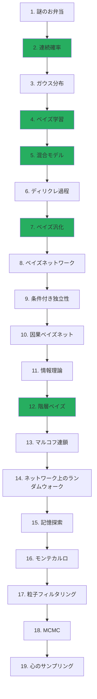

+++
date = "2026-06-14"
title = "連続確率とベイズ学習"
# NOTE: Ch7 (Bayesian Generalization) is a page bundle: content/intro2/07_generalization/ with
#   _index.md (overview) + 4 part pages. The mermaid node below is a diagram label, not a link.
weight = 3
toc = true
+++

## 離散から連続へ、GenJAXで学ぶ

最初の2つのチュートリアルでは、以下を学びました：
1. **チュートリアル1**：離散的な結果空間（集合と数え上げ）を用いた確率論
2. **チュートリアル2**：GenJAXを使ってコードで確率を表現する方法

今度は、**連続確率分布**を扱い、実数値データに対して**ベイズ学習**を行う方法を、すでに学んだGenJAXツールを使って学習します！

## 新たな課題

チュートリアル1では、Chibanyのランチの選択は**離散的**でした：とんかつかハンバーガーか。しかし、次のような**連続的な測定値**をモデル化したい場合はどうすればよいでしょうか：

- お弁当箱の**重量**
- オフィスの**温度**
- 学生が到着するまでの**時間**

これらは離散的な選択ではありません。数直線上のどこにでも落ちうる**連続値**です！

## 学習パス

連続確率とベイズ学習への道のりを示します：

**基礎章**（緑色）：連続確率の中核概念——確率密度関数、ベイズ更新、混合モデル。

**前提条件**：こちらを始める前に、チュートリアル1（確率論）とチュートリアル2（GenJAX）を完了してください。

## 学習内容

このチュートリアルはGenJAX（チュートリアル2）を直接活用し、以下を探究します：

### 第1章：Chibanyの謎のお弁当（期待値）
- 混合物における平均のパラドックス
- 期待値とバランス点
- 平均が誤解を招く理由
- **GenJAX**：混合分布のシミュレーション

### 第2章：連続確率変数
- 確率密度関数（PDF）
- 累積分布関数（CDF）
- 一様分布
- **GenJAX**：連続分布からのサンプリングと条件付け

### 第3章：ガウス分布
- ベル曲線とその性質
- 平均と分散のパラメータ
- 68-95-99.7ルール
- **GenJAX**：正規分布を扱う

### 第4章：ガウス分布によるベイズ学習
- パラメータに対する事前分布
- データによる信念の更新（共役事前分布）
- 事後分布と予測分布
- **GenJAX**：ガウス-ガウスモデルの実装
- **📓 インタラクティブ課題**：パラメータ効果のハンズオン探究

### 第5章：ガウス混合モデル
- 複数の分布の結合
- 混合によるクラスタリング
- 完全なお弁当モデル
- **GenJAX**：混合モデルの構築と推論

### 第6章：ディリクレ過程混合モデル
- 無限混合モデル
- ディリクレ過程事前分布
- 自動モデル選択
- **GenJAX**：クラスタリングのためのDPMMの実装

### 第7章：ベイズ汎化
- 仮説としての概念：仮説は*集合*
- 事後分布による重み付き投票；弱サンプリングと強サンプリング、サイズ原理
- Shepardの汎化法則、仮定されるのではなく*モデルから導出される*
- ノーフリーランチ：学習者が事前分布を必要とする理由
- **GenJAX**：仮説空間の列挙と汎化勾配の計算

### 第8章：ベイズネットワーク
- 第5章の混合モデルをグラフとして再解釈：ノード、矢印、親ノード
- マルコフ因子分解——DAGから直接同時分布を読み取る
- 複数親ネットワークと条件付き確率表；パラメータ計数の論拠
- **GenJAX**：生成関数としてのベイズネット構築、祖先サンプリング、原因から結果への推論

### 第9章：条件付き独立性とd分離
- 3つの基本構造：連鎖、フォーク、コライダー——それぞれがどの方向に情報を伝えるか
- コライダーに条件付けることでパスが*開く*理由（モンティ・ホールの驚き）
- d分離アルゴリズムとマルコフブランケット
- **説明消去**、数値で追った解説；**GenJAX**：雨/スプリンクラーのコライダー

### 第10章：因果ベイズネットとdoオペレータ
- 矢印が*原因*を意味するとき：1つの相関の背後にある3つの因果的物語
- グラフ手術としての介入；doオペレータ $do(X = x)$
- $P(Y \mid X)$ と $P(Y \mid do(X))$ の違い——観察することと実行すること、数値例付き
- Pearlの因果のはしご；ブリケット検出器；**GenJAX**：観察モデルと介入モデル

### 第11章：情報理論——驚き、不確実性、コライダー
- $-\log P(x)$ としての驚き；期待値としてのエントロピー；ビット
- 相互情報量——一方の変数が他方についてどれだけのビットを担うか
- 情報量単位で再述される独立性とd分離
- 無から相互情報量を生み出すコライダー（ビットで表した説明消去）；KLダイバージェンスの前方ポインタ；**GenJAX**：モンテカルロによるエントロピーと相互情報量

### 第12章：階層ベイズ
- 失敗する2つの極端：プーリングなし vs. 完全プーリング
- ベータ分布とベータ-二項共役性
- 部分プーリングと収縮：グループ間での強度の借用
- 事前分布そのものの学習——1つ上のレベルの推論（ノーフリーランチへの回答）
- **GenJAX**：階層的生成モデル＋ハイパーパラメータの重点サンプリング

### 第13章：マルコフ連鎖——未来は過去を忘れる
- マルコフ性：未来は現在のみを通じて過去に依存する
- 遷移行列（行確率論的）と2つの見方——状態図 vs. 行列
- 反復乗算またはエigenvalue-1固有ベクトルとして求まる定常分布 $\pi$
- **GenJAX**：行列からの系列サンプリング；シミュレーションによる長期頻度

### 第14章：ネットワーク上のランダムウォーク
- グラフ $G = (V, E)$；隣接行列を行正規化して遷移行列に変換する
- ノードを状態とするマルコフ連鎖としてのランダムウォーク；無向ウォークの法則 $\pi_i \propto \deg(i)$
- テレポートするランダムサーファーの定常分布としてのPageRank（および*Google and the Mind*）
- **GenJAX**：Chibanyの動物ネットワーク上のウォークのサンプリング；小さな有向ウェブ上の手作りPageRank

### 第15章：ランダムウォークとしての記憶探索
- 意味流暢性：人はカテゴリー別のバーストで想起する——想起は意味ネットワーク上のランダムウォーク（Abbott, Austerweil & Griffiths 2012）
- 検閲関数：各動物を初回訪問時のみ報告する；初到達時間 $\tau(k)$ とアイテム間反応時間
- 切り替えルールなしの1つのメモリレスプロセスが「切り替えコスト」シグネチャを再現する——最適採餌よりも単純な説明
- **GenJAX**：位置1-最遅IRTカーブを再現する検閲ランダムウォーク；MCMCへの前方ポインタ

### 第16章：モンテカルロ——サンプリングによる推定
- サンプリングと平均化による期待値（および指示関数の平均としての任意の確率）の推定；$1/\sqrt{n}$ 誤差率
- 棄却サンプリングと逆CDF；重点サンプリング——簡単な提案分布 $q$ から抽出し、$w = p/q$ で再重み付け
- 正規化されていない事後分布の自己正規化重点サンプリング；尤度重み付け；有効サンプルサイズ
- **GenJAX**：`model.importance` → (trace, log_weight) による重点サンプリング

### 第17章：粒子フィルタリング
- ストリーミング推論：*昨日の事後分布が今日の事前分布*；状態空間モデル（運動＋観測）
- 粒子フィルタのループ——重み付け、リサンプリング、伝播——と重み縮退がリサンプリングを必要とする理由
- 1次元追跡の数値例；人間の推論のプロセスモデルとしての粒子フィルタ（限定記憶、順序効果）
- **GenJAX**：フィルタループ内の `@gen` 運動モデルとしての伝播ステップ

### 第18章：マルコフ連鎖モンテカルロ
- 第13章を逆に走らせる：定常分布が選んだターゲットになるようなマルコフ連鎖を*設計する*
- Metropolis–Hastings（正規化定数がキャンセルされる理由；詳細つり合い条件）とギブスサンプリング（完全条件分布の再サンプリング、常に受け入れ）
- バーンイン、混合、多峰分布の罠——局所的な受理が良好でも大域的な混合が良好とは限らない
- **GenJAX**：`assess` スコアリングプリミティブからMHステップを組み立てる

### 第19章：心のサンプリング
- MCMC with People——選択肢を選ぶ人間の行動*がまさに*Metropolis受理ステップであり、連鎖がその事前分布を明らかにする
- 階層ベータ-二項のハイブリッドギブス-メトロポリスサンプラー：ユニットごとの率をギブスし、それらを周辺化し、母集団をメトロポリス
- 平均/集中度の再パラメータ化 $(\varphi, \kappa)$；学習された母集団からの予測の読み取り
- **GenJAX**：共役 `beta` 抽出としてのギブスステップ；ベータ-二項周辺尤度をスコアリングするメトロポリスステップ

## 前提条件

**必須：**
- ✅「確率論へのナラティブ入門」（チュートリアル1）の修了
- ✅「GenJAXによる確率的プログラミング」（チュートリアル2）の修了
- ✅ GenJAX生成関数の記述と実行に慣れていること
- ✅ GenJAXにおけるトレース、条件付け、推論の理解

**不要：**
- ❌ 微積分（直観的理解を提供し、計算にはGenJAXを使用します）
- ❌ 高度な統計学
- ❌ 数学的証明

## 学習の哲学

**あなたはすでに**確率論的に考える方法（チュートリアル1）と、GenJAXコードで確率を表現する方法（チュートリアル2）を知っています。このチュートリアルでは、それらの同じアイデアが連続的な場合にどう拡張されるかを示します！

**重要な洞察：** 離散から連続への移行は、まったく新しい概念を学ぶことではありません。知っていることを適応させることです：
- **確率**が**確率密度**になる
- **和**が**積分**になる（ただしGenJAXがこれを処理してくれます！）
- **数え上げ**が**曲線下の面積の測定**になる

## このチュートリアルが異なる点

伝統的な確率論の講義とは異なり、このチュートリアルでは：

1. **GenJAXを全体を通じて使用**：すべての概念を実行可能なコードで説明
2. **シミュレーションを活用**：数学が複雑になったらサンプルで近似
3. **まず直観を構築**：数学的詳細の前に視覚的理解
4. **チュートリアル1との接続**：すべての概念が離散確率に結びつく
5. **インタラクティブノートブック**：パラメータを調整して結果がリアルタイムで更新されるのを確認

## 連続確率が重要な理由

多くの現実世界の現象は本質的に連続的です：

- **科学的測定値**：温度、重量、時間、距離
- **金融データ**：株価、リターン、ボラティリティ
- **機械学習**：ほとんどの入力特徴は連続的
- **自然現象**：身長、速度、濃度

連続確率を理解することで、現実世界をより正確にモデル化できます！

## チュートリアルの構成

各章には以下が含まれます：
- 📖 離散確率と結びつけた**概念説明**
- 💻 実行可能なコードによる**GenJAX実装**
- 🎮 パラメータを探究するための**インタラクティブColabノートブック**
- 📊 PDF、事後分布、予測を示す**可視化**
- ✅ 解答付きの**演習問題**

---

## 📓 インタラクティブノートブックと課題

このチュートリアルには、ハンズオン学習のための**3つの包括的なJupyterノートブック**が含まれています：

### 1. インタラクティブ探究ノートブック

**ファイル**：[📓 Open in Colab: `gaussian_bayesian_interactive_exploration.ipynb`](https://colab.research.google.com/github/josephausterweil/probintro/blob/main/notebooks/gaussian_bayesian_interactive_exploration.ipynb)

**内容**：リアルタイムで概念を探究するインタラクティブウィジェットを提供
- **パート1**：ガウス-ガウスベイズ更新
  - 尤度の分散を調整して事後分布の変化を観察
  - 観測を順次追加して学習が起きる様子を確認
  - 事後分布 vs. 予測分布の比較
- **パート2**：ガウス混合によるカテゴリ化
  - 事前分布が決定境界に与える影響を探究
  - 分散比がカテゴリ化に与える効果を確認
  - 周辺（混合）分布の可視化

**使用タイミング**：
- 第4章を読みながら（直観を構築するため）
- 課題に取り組む前（視覚的に概念を確認するため）
- 復習時（理解を再確認するため）

### 2. 課題解答ノートブック

#### 問題1：ガウスベイズ更新
**ファイル**：[📓 Open in Colab: `solution_1_gaussian_bayesian_update.ipynb`](https://colab.research.google.com/github/josephausterweil/probintro/blob/main/notebooks/solution_1_gaussian_bayesian_update.ipynb)

**リンク元**：第4章「探究演習」セクション

**カバーされるトピック**：
- 尤度の分散（σ²_x）が学習に与える影響
- 観測数（N）が事後分布の集中に与える影響
- 精度加重平均の実際の動作
- 事後分布 vs. 予測分布
- 解析的公式のGenJAX検証

#### 問題2：ガウスクラスター
**ファイル**：[📓 Open in Colab: `solution_2_gaussian_clusters.ipynb`](https://colab.research.google.com/github/josephausterweil/probintro/blob/main/notebooks/solution_2_gaussian_clusters.ipynb)

**リンク元**：第4章（プレビューセクション）および第5章（前提条件セクション）

**カバーされるトピック**：
- ベイズの定理を使った P(カテゴリ|観測) の導出
- 事前分布が決定境界に与える影響
- 分散比がカテゴリ化に与える影響
- 周辺分布の計算
- 二峰性 vs. 単峰性混合の理解
- 混合モデルのGenJAXシミュレーション

### ノートブックの使い方

{}
1. **第4章を「逐次学習」セクションまで読む**
2. **インタラクティブ探究ノートブックを開いて**パラメータを試す
3. **課題1に取り組む**（ガウスベイズ更新）
4. **第4章を最後まで読み続ける**
5. **課題2に取り組む**（第5章の準備としてのガウスクラスター）
6. **第5章を**カテゴリ化への理解に自信を持って**読む**！
{}

**ヒント**：
- まずすべてのセルを順番に実行してから、パラメータを変更して戻る
- 自分の直観を出力される解釈と比較する
- 極端なパラメータ値を試してエッジケースを確認する
- GenJAX実装を自分のモデルのテンプレートとして活用する

---

## 始める準備はできましたか？

Chibanyの謎から始めましょう：なぜお弁当の平均重量がありえない値になるのでしょうか？

[次へ：第1章 - Chibanyの謎のお弁当 →](./01_mystery_bentos.md)

---

## 数学について

このチュートリアルには数学的記法（PDF、積分など）が含まれていますが、**数学の専門家である必要はありません！**

**積分（∫）を見たとき**：「曲線下の面積」と考えましょう（GenJAXが計算します）
**微分を見たとき**：「変化の割合」と考えましょう（ほとんど不要で、GenJAXが処理します）
**Σ vs. ∫を見たとき**：「和 vs. 連続的な和」と考えましょう（同じアイデア、異なる記法）

**注目すること：**
- コードが何をするか（実行して確認！）
- グラフが何を示しているか（視覚的直観）
- 離散確率とどのように結びつくか（あなたが知っている概念）

数学は正確な定義を与えてくれますが、GenJAXを使えば**導出せずに計算**できます！

---

{}
**まず視覚から、次にコード、そして数学。** 新しい概念を見たとき：

1. まずグラフを見る（どんな見た目か？）
2. GenJAXのコードを実行する（何が起きるか？）
3. 数学を読む（なぜ動くのか？）

理解は暗記に勝ります。数学はいつでも後で参照できます！
{}

---

Special thanks to [JPPCA](https://jpcca.org/) for their generous support of this tutorial series.
