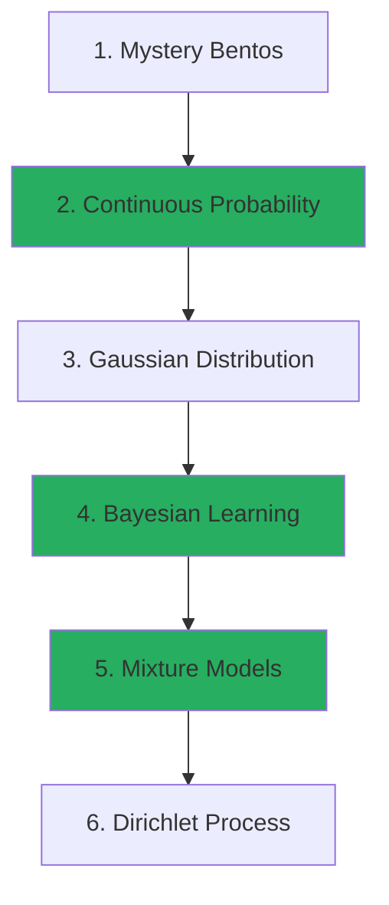

+++
date = "2025-12-05"
title = "Continuous Probability and Bayesian Learning"
weight = 3
toc = true
+++

## From Discrete to Continuous with GenJAX

In the first two tutorials, you learned:
1. **Tutorial 1**: Probability theory using discrete outcomes (sets and counting)
2. **Tutorial 2**: How to express probability in code using GenJAX

Now you'll learn to work with **continuous probability distributions** and perform **Bayesian learning** on real-valued data, all using the GenJAX tools you've already learned!

## The New Challenge

In Tutorial 1, Chibany's lunch choices were **discrete**: tonkatsu OR hamburger. But what if we want to model **continuous measurements** like:

- The **weight** of their bento box
- The **temperature** of their office
- The **time** it takes students to arrive

These aren't discrete choices. They're **continuous values** that can fall anywhere on a number line!

## Learning Path

Here's your journey into continuous probability and Bayesian learning:

**Foundational Chapters** (green): Core continuous probability concepts—PDFs, Bayesian updating, and mixture models.

**Prerequisites**: Complete Tutorial 1 (Probability) and Tutorial 2 (GenJAX) before starting here.

## What You'll Learn

This tutorial builds directly on GenJAX (Tutorial 2) to explore:

### Chapter 1: Chibany's Mystery Bentos (Expected Value)
- The paradox of averages in mixtures
- Expected value and balance points
- Why averages can be misleading
- **GenJAX**: Simulating mixture distributions

### Chapter 2: Continuous Random Variables
- Probability density functions (PDFs)
- Cumulative distribution functions (CDFs)
- The uniform distribution
- **GenJAX**: Sampling from and conditioning on continuous distributions

### Chapter 3: The Gaussian Distribution
- The bell curve and its properties
- Mean and variance parameters
- The 68-95-99.7 rule
- **GenJAX**: Working with Normal distributions

### Chapter 4: Bayesian Learning with Gaussians
- Prior beliefs about parameters
- Updating beliefs with data (conjugate priors)
- Posterior and predictive distributions
- **GenJAX**: Implementing Gaussian-Gaussian models
- **📓 Interactive Assignments**: Hands-on exploration of parameter effects

### Chapter 5: Gaussian Mixture Models
- Combining multiple distributions
- Clustering with mixtures
- The complete bento model
- **GenJAX**: Building and inferring mixture models

### Chapter 6: Dirichlet Process Mixture Models
- Infinite mixture models
- The Dirichlet Process prior
- Automatic model selection
- **GenJAX**: Implementing DPMM for clustering

## Prerequisites

**Required:**
- ✅ Completed "A Narrative Introduction to Probability" (Tutorial 1)
- ✅ Completed "Probabilistic Programming with GenJAX" (Tutorial 2)
- ✅ Comfortable writing and running GenJAX generative functions
- ✅ Understand traces, conditioning, and inference in GenJAX

**Not Required:**
- ❌ Calculus (we provide intuition and use GenJAX for computation)
- ❌ Advanced statistics
- ❌ Mathematical proofs

## Learning Philosophy

**You already know** how to think probabilistically (Tutorial 1) and how to express probability in GenJAX code (Tutorial 2). This tutorial shows you how those same ideas extend to the continuous case!

**Key insight:** Moving from discrete to continuous isn't about learning entirely new concepts. It's about adapting what you know:
- **Probabilities** become **probability densities**
- **Sums** become **integrals** (but GenJAX handles this for you!)
- **Counting** becomes **measuring area under curves**

## What Makes This Tutorial Different

Unlike traditional probability courses, we:

1. **Use GenJAX throughout**: Every concept is illustrated with runnable code
2. **Leverage simulation**: When math gets complex, we approximate with samples
3. **Build intuition first**: Visual understanding before mathematical details
4. **Connect to Tutorial 1**: Every concept links back to discrete probability
5. **Interactive notebooks**: Adjust parameters and see results update live

## Why Continuous Probability Matters

Many real-world phenomena are naturally continuous:

- **Scientific measurements**: Temperature, weight, time, distance
- **Financial data**: Stock prices, returns, volatility
- **Machine learning**: Most input features are continuous
- **Natural phenomena**: Heights, speeds, concentrations

Understanding continuous probability lets you model the real world more accurately!

## Tutorial Structure

Each chapter includes:
- 📖 **Concept explanation** connecting to discrete probability
- 💻 **GenJAX implementation** with runnable code
- 🎮 **Interactive Colab notebooks** to explore parameters
- 📊 **Visualizations** showing PDFs, posteriors, and predictions
- ✅ **Exercises** with solutions

---

## 📓 Interactive Notebooks & Assignments

This tutorial includes **three comprehensive Jupyter notebooks** for hands-on learning:

### 1. Interactive Exploration Notebook

**File**: [📓 Open in Colab: `gaussian_bayesian_interactive_exploration.ipynb`](https://colab.research.google.com/github/josephausterweil/probintro/blob/main/notebooks/gaussian_bayesian_interactive_exploration.ipynb)

**What it does**: Provides interactive widgets to explore concepts in real-time
- **Part 1**: Gaussian-Gaussian Bayesian updates
  - Adjust likelihood variance and see posterior change
  - Add observations sequentially and watch learning happen
  - Compare posterior vs. predictive distributions
- **Part 2**: Gaussian mixture categorization
  - Explore how priors affect decision boundaries
  - See effect of variance ratios on categorization
  - Visualize marginal (mixture) distributions

**When to use**:
- While reading Chapter 4 (to build intuition)
- Before attempting the assignments (to see concepts visually)
- When reviewing (to refresh understanding)

### 2. Assignment Solution Notebooks

#### Problem 1: Gaussian Bayesian Update
**File**: [📓 Open in Colab: `solution_1_gaussian_bayesian_update.ipynb`](https://colab.research.google.com/github/josephausterweil/probintro/blob/main/notebooks/solution_1_gaussian_bayesian_update.ipynb)

**Linked from**: Chapter 4, Section "Exploration Exercise"

**Topics covered**:
- Effect of likelihood variance (σ²_x) on learning
- Effect of number of observations (N) on posterior concentration
- Precision-weighted averaging in action
- Posterior vs. predictive distributions
- GenJAX verification of analytical formulas

#### Problem 2: Gaussian Clusters
**File**: [📓 Open in Colab: `solution_2_gaussian_clusters.ipynb`](https://colab.research.google.com/github/josephausterweil/probintro/blob/main/notebooks/solution_2_gaussian_clusters.ipynb)

**Linked from**: Chapter 4 (Preview section) and Chapter 5 (Prerequisite section)

**Topics covered**:
- Deriving P(category|observation) using Bayes' rule
- Effect of priors on decision boundaries
- Effect of variance ratios on categorization
- Computing marginal distributions
- Understanding bimodal vs. unimodal mixtures
- GenJAX simulation of mixture models

### How to Use the Notebooks

{}
1. **Read Chapter 4** up to "Sequential Learning" section
2. **Open the interactive exploration notebook** and experiment with parameters
3. **Work through Assignment 1** (Gaussian Bayesian Update)
4. **Continue reading Chapter 4** through the end
5. **Work through Assignment 2** (Gaussian Clusters) as preparation for Chapter 5
6. **Read Chapter 5** with confidence in your understanding of categorization!
{}

**Tips**:
- Run all cells in order first, then go back and modify parameters
- Compare your intuition with the printed interpretations
- Try extreme parameter values to see edge cases
- Use the GenJAX implementations as templates for your own models

---

## Ready to Begin?

Let's start with Chibany's mystery: why does the average weight of their bentos seem impossible?

[Next: Chapter 1 - Chibany's Mystery Bentos →](./01_mystery_bentos.md)

---

## A Note on Mathematics

This tutorial includes some mathematical notation (PDFs, integrals, etc.), but **you don't need to be a math expert!**

**When you see an integral** (∫): Think "area under the curve" (GenJAX computes it for you)
**When you see a derivative**: Think "rate of change" (rarely needed, GenJAX handles it)
**When you see Σ vs ∫**: Think "sum vs continuous sum" (same idea, different notation)

**Focus on:**
- What the code does (run it and see!)
- What the plots show (visual intuition)
- How it connects to discrete probability (concepts you know)

Mathematics provides precise definitions, but GenJAX lets you **compute without deriving**!

---

{}
**Start with visuals, then code, then math.** When you see a new concept:

1. Look at the plots first (what does it look like?)
2. Run the GenJAX code (what happens?)
3. Read the math (why does it work?)

Understanding beats memorization. You can always reference the math later!
{}

---

Special thanks to [JPPCA](https://jpcca.org/) for their generous support of this tutorial series.
